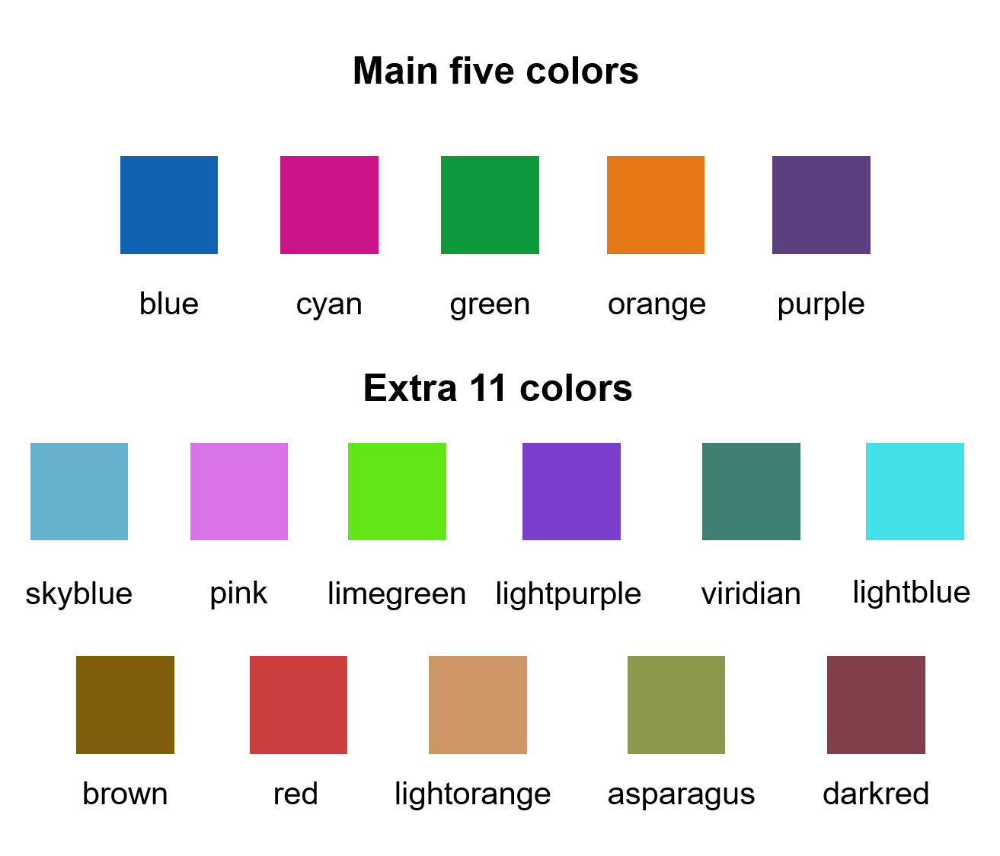

# Manual and Examples of smplot

This chapter is a manual for **smplot**; it includes numerous examples. It also includes tutorials about `sm_bar()`, `sm_bland_altman()` and `sm_raincloud()`, all of which are not mentioned in the preceding chapters. However, this chapter does not describe `sm_effsize()`, `sm_power()` and `sm_common_axis()`; these functions are described in Chapter 5.

- If you are not sure about any of the functions, please type `?` before the function names, ex. `?sm_bar`. 


```{r setup, include=FALSE}
knitr::opts_chunk$set(echo = TRUE, message = FALSE)
```

## Installation of the Package 

- The **smplot** package is NOT available on CRAN yet. So, you will need to download it directly from my github for now.
- To install it, please type in the R console:

```{r, eval = F}
install.packages('devtools')
devtools::install_github('smin95/smplot')
```

- To use the package, load it:

```{r}
library(smplot)
```

### What is `smplot`? {-}

- **smplot** is a package that provides functions that visually improve graphs produced from **ggplot2**.
  - So it does not work with plots made from base R.
- It was first developed in May 2021.
- It is **free** and **open source** (https://github.com/smin95/smplot).

## smplot's Color Palette and Graph Themes

### smplot's color palette {-}

- Its color palette can be accessed via two functions: `sm_color()` and `sm_palette()`.
- `sm_color()` accepts the **character string** of the color name.
- `sm_palette()` accepts the **number of colors** (up to **16**) and returns the hex codes accordingly.

```{r, echo=FALSE, fig.align = 'center',fig.cap="smplot's color palette", out.width = '55%'}

```

- For example, if you want `blue` and `red`, just type the input like this:
```{r}
sm_color('blue','red')
```

- But, do not form a single vector that contains two characters. If so, `sm_color()` will only return the first color.

```{r}
sm_color(c('blue','red'))
```

- If you need 5 colors, you can use `sm_palette()`.

```{r}
sm_palette(5)
```

### smplot's graph themes {-}

- There are several its graph themes. The text positions and the font are all similar.
- `sm_corr_theme()` and `sm_hvgrid()` are **equivalent**. They have major horizontal and vertical grids.
  - This theme is useful for correlation, so I created a duplicate function `sm_corr_theme()`.
- `sm_bar_theme()` and `sm_hgrid()` are **equivalent**. They have major horizontal grids.
  - This theme is useful for a bar graph, so I created a duplicate function `sm_bar_theme()`.
- `sm_minimal` has no major grid. This is useful when a graph has a lot of annotation, such as texts and arrows. 
- `sm_slope_theme()` is a theme for a slope chart. It removes everything except the y-axis.
- All of these functions, except for `sm_slope_theme()`, have two arguments: `borders` and `legends`.
  - For some of these functions, the defaults are set to `borders = TRUE` and `legends = TRUE`.
  - You can check the defaults by typing `?` in front of the function. Ex: `?sm_corr_theme`
  - There is no option for `borders` in `sm_slope_theme()`.

- `p1` has the default theme of **ggplot2**.

```{r,fig.width = 5.3, fig.height=3.7}
library(tidyverse)
p1 <- ggplot(data = mpg, mapping = aes(x = displ, y = hwy, color = class)) + 
  geom_point(size = 2)
p1
```

- Now we can change the theme using `sm_corr_theme()`.

```{r,fig.width = 5.3, fig.height=3.7}
p1 + sm_corr_theme()
```

- We can also remove `borders` and `legends` by setting them as `FALSE`.

```{r,fig.width = 3.7, fig.height=3.7}
p2 <- p1 + sm_corr_theme(borders = FALSE, legends = FALSE)
p2
```

- You can also apply smplot's colors by using `scale_color_manual()`.

```{r,fig.width = 3.7, fig.height=3.7}
p2 + scale_color_manual(values = sm_palette(7))
```

## Correlation Plot 

- `sm_corr_theme()` and `sm_statCorr()` can be used as a pair when plotting a correlation.

- This is the plot using the default theme of **ggplot2**. 

```{r,fig.width = 3.7, fig.height=3.7}
p1 <- ggplot(data = mtcars, mapping = aes(x = drat, y = mpg)) +
  geom_point(shape = 21, fill = sm_color('green'), color = 'white', size = 3) 
p1
```

- The next plot uses `sm_corr_theme()` to apply the smplot's theme and `sm_statCorr()` to print linear regression slope and statistical results from a paired correlation test (Pearson's).
- **Important:** `sm_statCorr()` recognizes the data for the y- and x-axes from the `mapping = aes()` in `ggplot()` function.
  - There is no `mapping` argument in `sm_statCorr()`.

```{r,fig.width = 3.7, fig.height=3.7}
p1 + sm_corr_theme() + 
  sm_statCorr(color = sm_color('green'))
```

- You can also change the `line_type` to `'solid'` in `sm_statCorr()`, and change the location of the printed texts by using `label_x` and `label_y` arguments. 
- You can also change the font size of the printed texts by setting `text_size` to a larger numerical value.

```{r,fig.width = 3.7, fig.height=3.7}
p1 + sm_corr_theme() + 
  sm_statCorr(color = sm_color('green'),
               line_type = 'solid',
               label_x = 3.5,
               label_y = 30,
               text_size = 5)
```

### Data frame for a correlation plot
- Column 1 has to be the data for x-axis.
- Column 2 has to be the data for y-axis. 
- This structure of the data frame is slightly different from that is typically used in ggplot2 and smplot functions (ex. `sm_boxplot()`, `sm_bar()`, `sm_violin()` and `sm_raincloud()`).

- Correlation plot and a bar plot requires a different data frame structure. 

```{r}
# Example
set.seed(11) # generate random data
method1 = c(rnorm(19,0,1),2.5)
method2 = c(rnorm(19,0,1),2.5)
Subject <- rep(paste0('S',seq(1:20)), 2)
Data <- data.frame(Value = matrix(c(method1,method2),ncol=1))
Method <- rep(c('Method 1', 'Method 2'), each = length(method1))
df_general <- cbind(Subject, Data, Method) # used for sm_bar(), sm_boxplot(), sm_violin(), etc

df_corr <- data.frame(first = method1, second = method2) # used for correlation
```

- We have created two data frames: `df_general` and `df_corr`. Let's take a look at their structures. 

```{r}
head(df_general)
```

- Notice that `df_general` has three columns. The first column is subject, second column is data (i.e., `Value`) and third column is measurement group. 

```{r}
head(df_corr)
```

- Notice that `df_corr` has two columns, each of which represents a measurement group. 

```{r, fig.width = 3.7, fig.height=3.7}

# correlation plot using data frame 'df_corr' 
ggplot(data = df_corr, mapping = aes(x = first, y = second)) + 
  geom_point(shape = 21, fill = sm_color('cyan'), color = 'white',
             size = 3) + sm_corr_theme(borders = FALSE) +
  scale_y_continuous(limits = c(-2.5,2.5)) +
  scale_x_continuous(limits = c(-2.5,2.5)) +
  sm_statCorr(color = sm_color('cyan'), corr_method = 'pearson',
              label_x = -2.2, label_y = 2.3) +
  ggtitle('Correlation plot') + 
  xlab('Method 1') + ylab('Method 2') 

```

```{r, fig.width = 3.7, fig.height=3.7}
# bar graph using data frame 'df_general'
ggplot(data = df_general, mapping = aes(x = Method, y = Value, fill = Method)) +
  sm_bar(shape = 21, color = 'white', bar_fill_color = 'gray80') +
  scale_fill_manual(values = sm_color('cyan','green'))
```

### Correlation plot with both regression and reference lines

- You can also add a reference line (slope = 1) in a correlation plot.
- This can be done with `geom_abline()`. In this example, the reference line's slope is set to 1 and it has a dashed line style.

```{r, fig.width = 3.7, fig.height=3.7}

# correlation plot using data frame 'df_corr' 
ggplot(data = df_corr, mapping = aes(x = first, y = second)) + 
  geom_point(shape = 21, fill = sm_color('cyan'), color = 'white',
             size = 3) + sm_corr_theme(borders = FALSE) +
  geom_abline(slope = 1, linetype = 'dashed') +
  scale_y_continuous(limits = c(-2.8,2.8),  expand = c(0,0)) +
  scale_x_continuous(limits = c(-2.8,2.8), expand = c(0,0)) +
  sm_statCorr(color = sm_color('cyan'), corr_method = 'pearson',
              label_x = -2.2, label_y = 2.3) +
  ggtitle('Correlation plot') + 
  xlab('Method 1') + ylab('Method 2') 

```

## Boxplot - `sm_boxplot()`

- `sm_boxplot()` generates a boxplot and individual points at the same time. 
- It automatically uses `sm_hgrid()` as its default theme. 
- First, let's generate some random data. 

```{r}
set.seed(1) # generate random data
day1 = rnorm(16,0,1)
day2 = rnorm(16,5,1)
Subject <- rep(paste0('S',seq(1:16)), 2)
Data <- data.frame(Value = matrix(c(day1,day2),ncol=1))
Day <- rep(c('Day 1', 'Day 2'), each = length(day1))
df <- cbind(Subject, Data, Day)
```

- Now, let's make a boxplot using `sm_boxplot()`. 

```{r,fig.width = 3.7, fig.height=3.7,warning = F}
# a boxplot with the random data, all black points
ggplot(data = df, mapping = aes(x = Day, y = Value)) +
  sm_boxplot(fill = 'black')
```

- Now let's apply different color for each Day.

```{r, fig.width = 3.7, fig.height=3.7,warning = F}
# a boxplot with different colored points
ggplot(data = df, mapping = aes(x = Day, y = Value, fill = Day)) +
  sm_boxplot(shape = 21, color = 'white') +
  scale_fill_manual(values = sm_color('blue','orange'))
```

- You can change the shape of the boxplot by setting `notch = TRUE`. You can also change the size of the individual points using `point_size` argument.
- A notched boxplot shows the confidence interval around the median (+/- 1.58 * interquartile range / sqrt(n)).
  - The notches are used for group comparison.
  - If the notch of each box does not overlap, there is a strong likelihood that the medians are significantly different between groups.

```{r, fig.width = 3.7, fig.height=3.7,warning = F}
ggplot(data = df, mapping = aes(x = Day, y = Value, fill = Day)) +
  sm_boxplot(shape = 21, point_size = 4, notch = 'TRUE', alpha = 0.5) +
  scale_fill_manual(values = sm_color('blue','orange'))
```

### Plotting individual points with unique colors

- One can also use `sm_boxplot()` to plot individual points with unique colors. 
- But `sm_boxplot()` cannot print distinct box colors across distinct x levels (i.e., in this example, all boxes are grey). This is because the author thinks it is not a good practice to print different colors of boxes as they tend to distract the reader. 

```{r, fig.width = 3.7, fig.height=3.7,warning = F}
ggplot(data = df, mapping = aes(x = Day, y = Value, fill = Subject)) +
  sm_boxplot(shape = 21, color = 'white') +
  scale_fill_manual(values = sm_palette(16))
```


## Violin Plot - `sm_violin()` 

- `sm_violin()` plots a violin plot, individual points and lines that indiciate means and +/- 1 standard deviation at the same time.
- It is very similar to `sm_boxplot()` except there is no option for `notch = TRUE` in `sm_violin()`.
- Also `sm_violin()` uses both `color` (for the lines of mean and SD) and `fill` (for the colors of the points) arguments. 
- The default border color of the points is `white`.
- `sm_violin()` automatically uses `sm_hgrid()` as its default theme.

```{r,fig.width = 3.7, fig.height=3.7,warning = F}
# a violin plot with the random data, all black points and lines
ggplot(data = df, mapping = aes(x = Day, y = Value)) +
  sm_violin(fill = 'black') 
```

```{r, fig.width = 3.7, fig.height=3.7,warning = F}
# a violin plot with different colored points and lines
ggplot(data = df, mapping = aes(x = Day, y = Value, color = Day)) +
  sm_violin() + 
  scale_color_manual(values = sm_color('blue','orange'))
```

### Plotting individual points with unique colors

- One can also use `sm_violin()` to plot individual points with unique colors. 
- The x-level has to be grouped in the aesthetics (ex. `group = Day`).
- But `sm_violin()` cannot print distinct violin colors across distinct x levels (i.e., in this example, all boxes are grey). This is because the author thinks it is not a good practice to print different colors of boxes as they tend to distract the reader. 

```{r, fig.width = 3.7, fig.height=3.7,warning = F}

ggplot(data = df, mapping = aes(x = Day, y = Value, fill = Subject,
                                group = Day)) +
  sm_violin(shape = 21, color = 'white', point_alpha = 0.6) + 
  scale_fill_manual(values = sm_palette(16)) 

```


```{r, fig.width = 3.7, fig.height=3.7,warning = F}

ggplot(data = df, mapping = aes(x = Day, y = Value, fill = Subject,
                                group = Day, color = Day)) +
  sm_violin(shape = 21, color = 'white', point_alpha = 0.6) + 
  scale_fill_manual(values = sm_palette(16)) +
  scale_color_manual(values = sm_color('blue', 'orange'))

```

## Bar Plot - `sm_bar()` 

- It automatically uses `sm_bar_theme()` / `sm_hgrid()`.
- Let's use data (`df`) we generated before.

```{r,fig.width = 3.7, fig.height=3.7,warning = F}
ggplot(data = df, mapping = aes(x = Day, y = Value, fill = Day)) +
  sm_bar(shape = 21, color = 'white', bar_fill_color = 'gray80') +
  scale_fill_manual(values = sm_color('blue','orange'))
```

- In this case, the error bar represents **standard error**. If you prefer to show **standard deviation**, then you should set `errorbar_type  = 'sd'` in `sm_bar()`.
  
  
```{r,fig.width = 3.7, fig.height=3.7,warning = F}
ggplot(data = df, mapping = aes(x = Day, y = Value, fill = Day)) +
  sm_bar(shape = 21, color = 'white', bar_fill_color = 'gray80', errorbar_type = 'sd') +
  scale_fill_manual(values = sm_color('blue','orange'))
```

- 95% confidence interval also be displayed with `errorbar_type  = 'ci'`. 

```{r,fig.width = 3.7, fig.height=3.7,warning = F}
ggplot(data = df, mapping = aes(x = Day, y = Value, fill = Day)) +
  sm_bar(shape = 21, color = 'white', bar_fill_color = 'gray80', errorbar_type = 'ci') +
  scale_fill_manual(values = sm_color('blue','orange'))
```

### Plotting individual points with unique colors

- One can also use `sm_bar()` to plot individual points with unique colors. 


```{r,fig.width = 3.7, fig.height=3.7,warning = F}
ggplot(data = df, mapping = aes(x = Day, y = Value, color = Subject)) +
  sm_bar(bar_fill_color = 'gray80') +
  scale_color_manual(values = sm_palette(16)) 
```

- `sm_bar()` can also print distinct box colors across distinct x levels.

```{r,fig.width = 3.7, fig.height=3.7,warning = F}
ggplot(data = df, mapping = aes(x = Day, y = Value, color = Subject,
                                fill = Day)) +
  sm_bar() +
  scale_color_manual(values = sm_palette(16)) +
  scale_fill_manual(values = sm_color('lightorange','skyblue'))
```

## Slope Chart - `sm_slope()` 

- This function plots a slope chart. 
- A slope chart is useful to describe changes between two different timepoints for each measurement (ex. a participant).
- It automatically uses `sm_slope_theme()`.
- Let's use `df` that we generated before.
- **Important:** To make this function work, the `mapping` within `ggplot()` has to have a certain structure.
  - x- and y-axes have to be defined.
  - A slope chart groups each observation (ex. `Subject`) across x-axis. This has to be specified in `mapping` as `group = `.
- The x-axis cannot be **continuous**. It has to be **discrete**. So, it should take the form of `character` or `factor` (ex. 'One', 'Two', 'Three'). If x-axis only has number (i.e., `double` form, such as 1.02, 1.05, 1.5), then `sm_slope()` will produce an error.
- `labels` argument is required to use `sm_slope()`. This refers to the labels of the ticks in the x-axis. Ex. `labels = c('Day 1', 'Day 2')`.

```{r,fig.width = 3.7, fig.height=3.7,warning = F}
ggplot(data = df, mapping = aes(x = Day, y = Value, group = Subject)) +
  sm_slope(labels = c('Day 1', 'Day 2'))
```

- Let's set the shape to 21.
- Let's make the border color to `white`.
- Let's apply the same color to each **Day**.

```{r,fig.width = 3.7, fig.height=3.7,warning = F}
ggplot(data = df, mapping = aes(x = Day, y = Value, group = Subject)) +
  sm_slope(labels = c('Day 1','Day 2'), shape = 21, color = 'white', fill = sm_color('blue'))
```

- You could also apply different color for each `Day` using `scale_fill_manual()`.


```{r,fig.width = 3.7, fig.height=3.7,warning = F}
ggplot(data = df, mapping = aes(x = Day, y = Value, group = Subject, fill = Day)) +
  sm_slope(labels = c('Day 1','Day 2'), shape = 21, color = 'white') +
  scale_fill_manual(values = sm_color('blue','orange'))
```

- You can also change the line color and other aesthetics. For more information, please type `?sm_slope`. 

```{r,fig.width = 3.7, fig.height=3.7,warning = F}
ggplot(data = df, mapping = aes(x = Day, y = Value, group = Subject, fill = Day)) +
  sm_slope(labels = c('Day 1','Day 2'), shape = 21, color = 'white',
           fill = sm_color('blue'), line_color = '#ADD8E6',
           line_size = 0.6)
```

## A Bland Altman Plot - `sm_bland_altman()`

- `sm_bland_altman()` and `sm_statBlandAlt()` functions can be used to create a Bland-Altman plot.
- The plot is used to measure agreement between two different measurements.
- It is also used to measure test-retest variability of a method.
- Let's generate random data.

```{r}
set.seed(1)
first <- rnorm(20)
second <- rnorm(20)
df3 <- as_tibble(cbind(first,second)) # requires library(tidyverse)
```

- Now let's draw a Bland Altman plot using `sm_bland_altman()`, which requires two arguments: first dataset, second dataset. They have to be numerical vectors of equal length.
  - This function automatically uses `sm_classic()` theme.

```{r, fig.width = 3.7, fig.height = 3.7, warning = F}
sm_bland_altman(df3$first, df3$second, color = sm_color('green')) + 
  scale_y_continuous(limits = c(-4,4))
```

- The upper dashed line represents the upper limit of the difference between two measurements (mean difference + 1.96 * standard deviation of the difference). 
- The upper dashed line represents the upper limit of the difference between two measurements (mean difference - 1.96 * standard deviation of the difference). 
- The middle dashed line represents the mean difference.
- The shaded region is the 95% confidence interval of the difference between the two measuremnts from one-sample t-test (difference vs 0).
  - If the shaded region includes 0 in the y-axis, then there is no significant difference (p > 0.05) between 0 and the difference.
  - If it does not include 0, then there is a significant difference. This indicates that the two measurement results are considerably different.
- I usually label them with `annotate()`, which is a function
from **ggplot2**. This process can be tedious.
- Also, `sm_statBlandAlt()` calculates the statistical values that are 
necessary to draw a Bland-Altman plot, such as the mean difference, upper and lower limits. This function is used to annotate the values in the plot.
  - The arguments for this function are first and second datasets, just like in `sm_bland_altman()`.

```{r, fig.width = 3.7, fig.height = 3.7, warning = F}
res <- sm_statBlandAlt(df3$first,df3$second) # store the results in res variable 

sm_bland_altman(df3$first, df3$second, color = sm_color('green')) + 
  scale_y_continuous(limits = c(-4,4)) +
  annotate('text', label = 'Mean', x = -1, y = res$mean_diff + 0.4) +
  annotate('text', label = signif(res$mean_diff,3), x = -1, y = res$mean_diff - 0.4) +
  annotate('text', label = 'Upper limit', x = 1.2, y = res$upper_limit + 0.4) +
  annotate('text', label = signif(res$upper_limit,3), x = 1.2, y = res$upper_limit - 0.4) +
  annotate('text', label = 'Lower limit', x = 1.2, y = res$lower_limit + 0.4) +
  annotate('text', label = signif(res$lower_limit,3), x = 1.2, y = res$lower_limit-0.4)
```

- Let's change the border color of the circles to white. To do so, we will have to change their shape to 21.

```{r, fig.width = 3.7, fig.height = 3.7, warning = F}

sm_bland_altman(df3$first, df3$second, shape = 21, fill = sm_color('green'), color = 'white') + 
  scale_y_continuous(limits = c(-4,4)) +
  annotate('text', label = 'Mean', x = -1, y = res$mean_diff + 0.4) +
  annotate('text', label = signif(res$mean_diff,3), x = -1, y = res$mean_diff - 0.4) +
  annotate('text', label = 'Upper limit', x = 1.2, y = res$upper_limit + 0.4) +
  annotate('text', label = signif(res$upper_limit,3), x = 1.2, y = res$upper_limit - 0.4) +
  annotate('text', label = 'Lower limit', x = 1.2, y = res$lower_limit + 0.4) +
  annotate('text', label = signif(res$lower_limit,3), x = 1.2, y = res$lower_limit-0.4)
```

## Raincloud plot - `sm_raincloud()`

- A raincloud plot is a combination of jittered points, a boxplot and a violin plot. 
- However, this plot can be visually crowded. Some people like to use raincloud plots, some do not. So, the choice to use it is entirely yours. 
- Let's generate some random data.

```{r}
set.seed(2) # generate random data
day1 = rnorm(20,0,1)
day2 = rnorm(20,5,1)
day3 = rnorm(20,6,1.5)
day4 = rnorm(20,7,2)
Subject <- rep(paste0('S',seq(1:20)), 4)
Data <- data.frame(Value = matrix(c(day1,day2,day3,day4),ncol=1))
Day <- rep(c('Day 1', 'Day 2', 'Day 3', 'Day 4'), each = length(day1))
df2 <- cbind(Subject, Data, Day)
```

- The x-axis variable column has to have the right level. If not, you
should convert the column as factor and establish the levels correctly.
- Now let's draw a raincloud plot using `sm_raincloud()`.

```{r, fig.width = 5.7, fig.height = 3.7, warning = F}
sm_raincloud(data = df2, x = Day, y = Value) 
```

- Let's change the x-axis labels.

```{r, fig.width = 5.7, fig.height = 3.7, warning = F}
sm_raincloud(data = df2, x = Day, y = Value) +
  scale_x_continuous(limits = c(0.25,4.75), labels = c('1', '2', '3', '4'), breaks = c(1,2,3,4)) +
  xlab('Day') 
```

- The filling colors of the violin plots and boxplots can be modified by using `scale_fill_manual()`.
- The border color of the violin plot can be changed by using `scale_color_manual()`. 
  - I will set it `transparent` to remove the border of the violin plots. 
- The color of the points can be used by either of the 2 functions depending on the shape, which can be set within `sm_raincloud()`.

```{r, fig.width = 5.7, fig.height = 3.7, warning = F}
sm_raincloud(data = df2, x = Day, y = Value, boxplot_alpha = 0.5, 
              color = 'white', shape = 21, sep_level = 2) +
  scale_x_continuous(limits = c(0.25,4.75), labels = c('1', '2', '3', '4'), breaks = c(1,2,3,4)) +
  xlab('Day') +
  scale_color_manual(values = rep('transparent',4)) + 
  scale_fill_manual(values = sm_palette(4))
```

- `sep_level` is an argument to specify the degree of separation among points, boxplots and violin plots. When `sep_level = 0`, they will all be crowded. When `sep_level = 4`, they will all be separated from each other. 
  - I personally prefer when the boxplot and violin plots are together, but not the points. So I set the default to `sep_level = 2`.
  - Shown below is an example when `sep_level = 4` with a horizontal grid theme `sm_hgrid()`.

```{r, fig.width = 5.7, fig.height = 3.7, warning = F}
sm_raincloud(data = df2, x = Day, y = Value, boxplot_alpha = 0.5, 
              color = 'white', shape = 21, sep_level = 4) +
  scale_x_continuous(limits = c(0.25,4.75), labels = c('1', '2', '3', '4'), breaks = c(1,2,3,4)) +
  xlab('Day') +
  scale_color_manual(values = rep('transparent',4)) + 
  scale_fill_manual(values = sm_palette(4)) +
  sm_hgrid()
```

- You can also flip the raincloud plot by setting `which_side` to `left`.

```{r, fig.width = 5.7, fig.height = 3.7, warning = F}
sm_raincloud(data = df2, x = Day, y = Value, boxplot_alpha = 0.5, 
              color = 'white', shape = 21, sep_level = 2, which_side = 'left') +
  scale_x_continuous(limits = c(0.25,4.75), labels = c('1', '2', '3', '4'), breaks = c(1,2,3,4)) +
  xlab('Day') +
  scale_color_manual(values = rep('transparent',4)) + 
  scale_fill_manual(values = sm_palette(4))
```

- So far the distribution plots (violin plots) have been vertical. We can change their configuration by setting `vertical = FALSE`. 

```{r, fig.width = 3.7, fig.height = 5.7, warning = F}
sm_raincloud(data = df2, x = Day, y = Value, boxplot_alpha = 0.5, 
              color = 'white', shape = 21, sep_level = 2, which_side = 'left', vertical = FALSE) +
  scale_x_continuous(limits = c(0.25,4.75), labels = c('1', '2', '3', '4'), breaks = c(1,2,3,4)) +
  xlab('Day') +
  scale_color_manual(values = rep('transparent',4)) + 
  scale_fill_manual(values = sm_palette(4))
```

- The orientation is not correct, so let's change it by setting `which_side = 'right'`. 

```{r, fig.width = 3.7, fig.height = 5.7, warning = F}
sm_raincloud(data = df2, x = Day, y = Value, boxplot_alpha = 0.5, 
              color = 'white', shape = 21, sep_level = 2, which_side = 'right', vertical = FALSE) +
  scale_x_continuous(limits = c(0.25,4.75), labels = c('1', '2', '3', '4'), breaks = c(1,2,3,4)) +
  xlab('Day') +
  scale_color_manual(values = rep('transparent',4)) + 
  scale_fill_manual(values = sm_palette(4))
```


## Overriding Defaults of smplot's Themes 

- You can override all the defaults by adding `theme()` object to your **ggplot2** graph. 

- Here is a bar graph. 

```{r,fig.width = 3.7, fig.height=3.7,warning = F}
ggplot(data = df, mapping = aes(x = Day, y = Value, fill = Day)) +
  sm_bar(shape = 21, color = 'white', bar_fill_color = 'gray80') +
  scale_fill_manual(values = sm_color('blue','orange'))
```

- Now let's remove the x-axis title **Day**.

```{r,fig.width = 3.7, fig.height=3.7,warning = F}
ggplot(data = df, mapping = aes(x = Day, y = Value, fill = Day)) +
  sm_bar(shape = 21, color = 'white', bar_fill_color = 'gray80') +
  scale_fill_manual(values = sm_color('blue','orange')) +
  theme(axis.title.x = element_blank())
```

- Let's customise the graph more by changing the y-axis title and adding a main title.

```{r,fig.width = 3.7, fig.height=3.7,warning = F}
ggplot(data = df, mapping = aes(x = Day, y = Value, fill = Day)) +
  sm_bar(shape = 21, color = 'white', bar_fill_color = 'gray80') +
  scale_fill_manual(values = sm_color('blue','orange')) +
  theme(axis.title.x = element_blank()) +
  ylab('Value') +
  ggtitle('Reading performance in children')
```

## Overriding Defaults of smplot Colors

- `sm_color('blue)` prints a hex code for the corresponding. Likewise, `sm_color('blue','orange')` prints out two hex codes. 

- Therefore, instead of using `sm_color()` function to call forth the colors, you can directly write the hex codes.

```{r,fig.width = 3.7, fig.height=3.7,warning = F}

my_colors <- c('#ff1493', '#483d8B') # pink and lavender

ggplot(data = df, mapping = aes(x = Day, y = Value, fill = Day)) +
  sm_bar(shape = 21, color = 'white', bar_fill_color = 'gray80') +
  scale_fill_manual(values = my_colors)
```