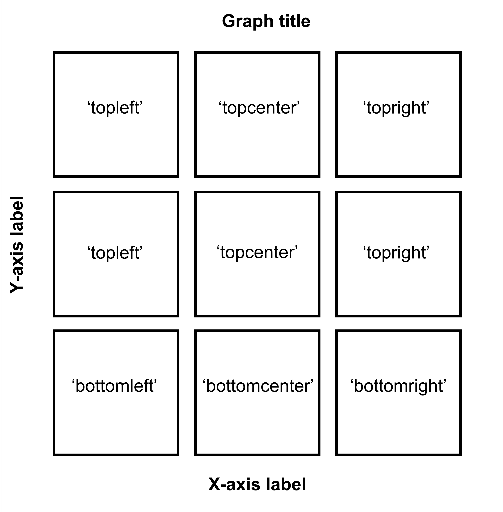
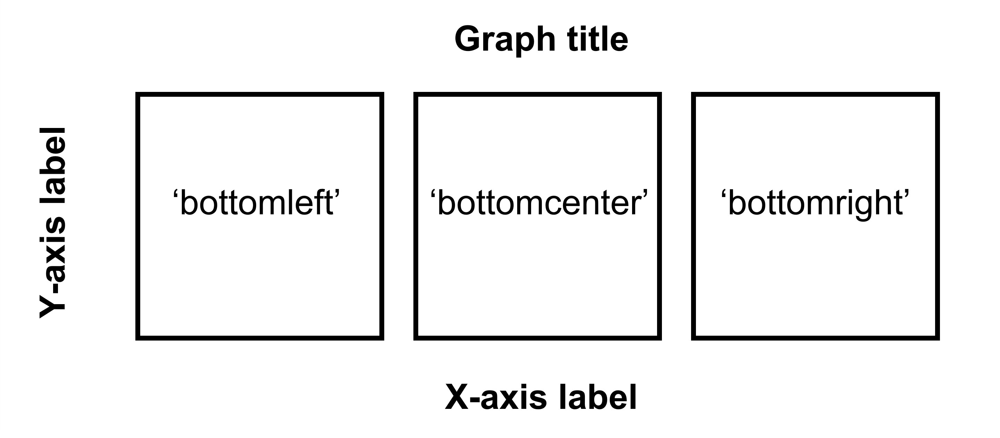
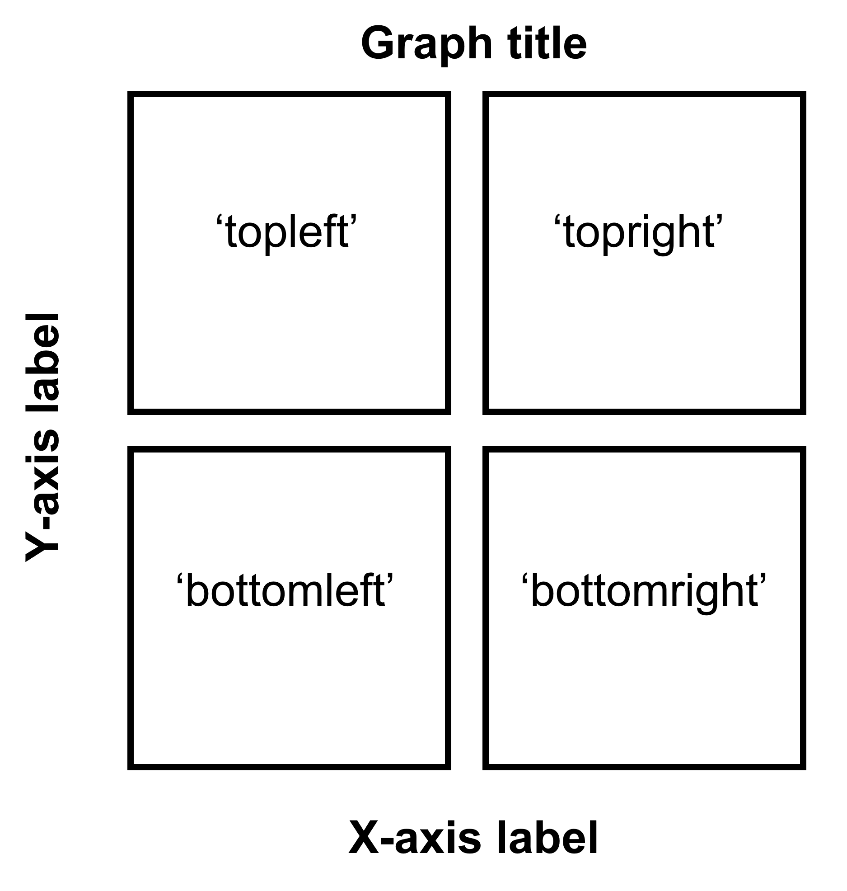

# Data Analysis 

First, you need to load data (.csv file). When you are loading your own .csv file for your data analysis, make sure you place the .csv file of your interest in the folder that has been set to the **working directory**. 

In this example, we will be using data from this paper:

**Seung Hyun Min, Alex S. Baldwin and Robert F. Hess. Ocular dominance plasticity: A binocular combination task finds no cumulative effect with repeated patching (2019). Vision Research, 161, 36-42.**

We will be creating similar figures to those in the paper (ex. **Figure 3A** and **Figure A2**) using **smplot**. For the PDF copy, please visit https://www.smin95.com/pubs/min2019.pdf. 

```{r}
library(tidyverse)
```


```{r}
df <- read_csv('https://raw.githubusercontent.com/smin95/dataviz/master/min2019.csv')
df$Day <- factor(df$Day)
head(df)
```

There are 4 columns in this data frame:

- First, `Subject` refers to each participant. There are 10 participants total. 

- Next, `Day` refers to the day of testing. The participants were tested on Day 1, 2, 3, 4 and 5. We will only use Day from 1 and 5.

- `Time` refers to the number of minutes after an experimental manipulation (ex. monocular deprivation). These are 0, 3, 6, 12, 24 and 48 minutes, but in the data frame, it says 0, 1, 2, 3, 4 and 5; we will change the labels manually. 

- The `Cbratio` column refers to the actual data that will be plotted here.  

In the example below, the plots will have different colors based on Day (1 or 5). Therefore, the values in `Day` column have to be discrete, not continuous. To make them discrete, one needs to convert the `Day` column from **double** (continuous variable) to **factor** (discrete variable).

## `filter()`, `select()` and `summarise()`

### `filter()` for rows

To plot data of each subject separately, we need the data frame to show data only from one subject. This can be achieved as using `filter()`:

```{r}
filter(df, Subject == 'S1')
```

- The first argument of `filter()`, `select()`, `summarise()` and `mutate()` is a data frame.
- The subsequent argument specifies how the data frame should be treated.
- The new printed result is a new data frame. 

`filter()` is used to filter for rows that meet the requirement of your interest. 

Here is another example. 

```{r}
filter(df, Day == 1)
```

The above code can be read as: **filter** for all rows of the data frame **df** that have `1` in the `Day` column.

Notice that S1 is a **character** because it has an alphabet. Therefore, it needs to be written as `'S1'`. However, `1` of `Day` is **double**, which is essentially just a number digit. Therefore, it can be written as `1` with no quotation mark. 

Let's try another example.

```{r}
day1 <- filter(df, Day == 1) # save the new data frame into a new variable
filter(df, Subject == 'S1') # this new data frame contains Day 1 and Subject 1 data only.
```

The above code can be read as: **filter** for all rows of the data frame **df** that have `1` in the `Day` column. Save this new data frame as `day1`. Then,  **filter** for all rows of the data frame `day1` that have `S1` in the `Subject` column. 

The above can also be written like the one below:

```{r}
filter(df, Day == 1 & Subject == 'S1')
```

The above can be read as: **filter** for all rows of the data frame **df** that have `1` in the `Day` column **AND** have `S1` in the `Subject` column.

```{r}
filter(df, Day == 1 & Subject == 'S1')
```

The above can be read as: **filter** for all rows of the data frame **df** that have `1` in the `Day` column **OR** have `S1` in the `Subject` column.

### `select()` for columns

If you wish to see the `Cbratio` column only (i.e., data only) for rows of **df** that have `Day ==  1` and `Time == 0`, you can write it like this:

```{r}
day1_time0 <- filter(df, Day == 1 & Time == 0) # save the new data frame in the day1_time0 variable 
select(day1_time0, Cbratio)
```

There are 10 rows (i.e., 10 subjects) in this filtered data frame and 1 column, which is `Cbratio`. The above can be read as: **filter** for all rows of the data frame **df** that have `1` in the `Day` column **AND** have `0` in the `Time` column. Then, store the new data frame in `day1_time0`. Then, select for `Cbratio` column from `day1_time0`.

`select()` is used to filter for columns that meet the requirement of your interest. 

### `summarise()` for grouped summaries

**df** contains individual data for all subjects on Days 1 and 5 across all time points. However, it does not contain average data either for each **Day** or **Time**.

`summarise()` can help us enable us to collapse multiple rows of observations into values such as the mean.

```{r}
summarise(df, average = mean(Cbratio))
```

However, in this case, we got an example of `Cbratio` across `Subject`, `Day` and `Time`. This average value itself is not so meaningful. If we wish to obtain the average for each `Day` and `Time`, we can use the function `group_by()` to group data for each day and time. 

- As it was the case before, the first argument of `group_by()` is a data frame. 

- The second argument of `group_by()` is the name of the column through which you would like to group the data. 


```{r}
by_day_time <- group_by(df, Day, Time)
print(by_day_time)
```

The output of `group_by()` is a new data frame (it might appear exactly the same as before, ex. **df**). However, it will respond differently to `summarise()` because the rows of the data frame are now grouped based on day and time, as we have specified.

```{r}
summarise(by_day_time, Average_Cbratio = mean(Cbratio))
```

This new data frame yields average for each Day and Time. We have now created a new column `Average_Cbratio` which stores all the average data of `Cbratio`. 

Therefore, `group_by()` and `summarise()` are very useful together. They provide grouped summaries, such as the average. However, `summarise()` alone may not be so useful. 

Besides the **average**, one might also be interested in obtaining either **standard deviation** or **standard error**.

However, our **df** does not contain any data about the **standard deviation** or **standard error** per Day or Time, etc. Standard error can be computed with `sm_stdErr()`. 

We could achieve obtain standard error with the help of the `summarise()` function for each `Day` and `Time`.

```{r}
summarise(df, standard_error = sm_stdErr(Cbratio))
```

As we have seen before, we see that `standard_error` has been calculated across all subjects, day and time. This is not so useful. We should use `summarise()` with `group_by()` so that each standard error could be for each `Day` and `Time`. 

```{r}
by_day_time <- group_by(df, Day, Time)
summarise(by_day_time, standard_error = sm_stdErr(Cbratio))
```

This standard error is for each `Day` and `Time` across all subjects. 

Now let's obtain the **mean** and **standard error**  of `Cbratio` for each `Day` and `Time` across all subjects using the data frame that has been grouped by `Day` and `Time` via `group_by()`.

```{r}
by_day_time1 <- summarise(by_day_time, Average = mean(Cbratio),
          StdError = sm_stdErr(Cbratio))
print(by_day_time1)
```

Now you see that the original **df**, which contains data for each subject, has now been transformed to a new data frame that contains grouped summaries, such as group averages and standard errors.

If you are interested in learning more about this topic (data transformation), please check out Chapter 5 of R for Data Science by Hadley Wickham (https://r4ds.had.co.nz/transform.html).

## Plotting average data with errorbars

We will plot a similar graph to **Figure 3A** in the Vision Research paper (Min et al., 2019) in this section.

- Usually, a data frame that has grouped summary information, such as average and standard error across subject, is required to plot a graph that depicts average values. 
- `geom_errorbar()` is required to plot the error bar.
- Legend title has been removed with the `theme()` function.
- Greek letter $\Delta is printed with `\u0394`. 
- X-tick labels are originally 0, 1, 2, 3, 4, 5 (as specified in the **df** data frame). However, they can be manually changed using `labels = ` argument in the `scale_x_continuous()` function. 
- Legend label can also be changed in `labels = ` from the `scale_color_manual()` function because each `Day` has been defined by each `color`; this is the case because `color = Day` in `aes(..., ..., color = Day)`. 

```{r, fig.width = 3.65, fig.height = 3.65, warning = F}
ggplot(data = by_day_time1, aes(x = Time, y = Average, color = Day)) +
  geom_point(size = 4.5) +
  geom_errorbar(aes(ymin = Average - StdError, ymax = Average + StdError), size = .5, width = .05) +
  geom_smooth(method = 'lm', se = F, size = 0.9) + 
  # lm = linear regression method 
  scale_x_continuous(breaks = unique(df$Time), 
                     labels = c("0", "3", "6", "12", "24", "48")) +
  sm_hgrid(legends = TRUE) +
  scale_color_manual(values = sm_color('blue','orange'),
                     labels = c("Day 1", "Day 5")) +
  ggtitle("Recovery of the patching effect") +
  xlab("Time after monocular deprivation (min)") +
  ylab("\u0394 Contrast balance ratio (dB)") +
  theme(legend.justification = c(1,0), 
        legend.position = c(0.96, 0.67), 
        legend.title = element_blank()) 
```


## Plotting Individual Data

In this section, we will plot a similar graph to **Figure A2** in the Vision Research paper (Min et al., 2019).

First, you will need several packages for this section. 

- If you do not have the **gridExtra** and **grid** packages in your RStudio, please install them using the codes below. It might take less than a minute. 

```{r, eval = F}
install.packages('gridExtra')
install.packages('grid')
```

- Then load all these packages below. 

```{r}
library(tidyverse)
library(cowplot)
library(smplot)
library(gridExtra)
library(grid)
```

Now let's plot data for each subject (S1-S9) except S10. Each panel shows the data of each subject for both Days 1 and 5. 

```{r, fig.width = 3.65, fig.height = 3.65}
df_s1 <- df %>% filter(Subject == 'S1') 
# rows of df that only contain S1 in the Subject column

# use df_s1 to plot the data of S1

plot_s1 <- ggplot(data = df_s1, aes(x = Time, y = Cbratio, color = Day)) + 
  geom_point(size = 4.5) +
  geom_smooth(method = 'lm', se = F, size = 0.9) + 
  # lm = linear regression method 
  scale_x_continuous(breaks = unique(df$Time), 
                     labels = c("0", "3", "6", "12", "24", "48")) +
  sm_hgrid() +
  scale_color_manual(values = sm_color('blue','orange')) +
  scale_y_continuous(limits = c(-3, 5.5)) +
  theme(axis.text = element_text(size = rel(1.5), color = "black")) 
# axis text size is 1.5x the original font size. 

print(plot_s1)
```

Then make each one for the other subjects (S2-S9). 

```{r, fig.width = 3.65, fig.height = 3.65}
df_s2 <- df %>% filter(Subject == 'S2') 

plot_s2 <- ggplot(data = df_s2, aes(x = Time, y = Cbratio, color = Day)) + 
  geom_point(size = 4.5) +
  geom_smooth(method = 'lm', se = F, size = 0.9) + 
  # lm = linear regression method 
  scale_x_continuous(breaks = unique(df$Time), 
                     labels = c("0", "3", "6", "12", "24", "48")) +
  sm_hgrid() +
  scale_color_manual(values = sm_color('blue','orange')) +
  scale_y_continuous(limits = c(-3, 5.5)) +
  theme(axis.text = element_text(size = rel(1.5), color = "black")) 
# axis text size is 1.5x the original font size. 

print(plot_s2)
```

```{r, fig.width = 3.65, fig.height = 3.65}
df_s3 <- df %>% filter(Subject == 'S3')

plot_s3 <- ggplot(data = df_s3, aes(x = Time, y = Cbratio, color = Day)) + 
  geom_point(size = 4.5) +
  geom_smooth(method = 'lm', se = F, size = 0.9) + 
  # lm = linear regression method 
  scale_x_continuous(breaks = unique(df$Time), 
                     labels = c("0", "3", "6", "12", "24", "48")) +
  sm_hgrid() +
  scale_color_manual(values = sm_color('blue','orange')) +
  scale_y_continuous(limits = c(-3, 5.5)) +
  theme(axis.text = element_text(size = rel(1.5), color = "black")) 
# axis text size is 1.5x the original font size. 

print(plot_s3)
```

```{r, fig.width = 3.65, fig.height = 3.65}
df_s4 <- df %>% filter(Subject == 'S4')

plot_s4 <- ggplot(data = df_s4, aes(x = Time, y = Cbratio, color = Day)) + 
  geom_point(size = 4.5) +
  geom_smooth(method = 'lm', se = F, size = 0.9) + 
  # lm = linear regression method 
  scale_x_continuous(breaks = unique(df$Time), 
                     labels = c("0", "3", "6", "12", "24", "48")) +
  sm_hgrid() +
  scale_color_manual(values = sm_color('blue','orange')) +
  scale_y_continuous(limits = c(-3, 5.5)) +
  theme(axis.text = element_text(size = rel(1.5), color = "black")) 
# axis text size is 1.5x the original font size. 

print(plot_s4)
```

```{r, fig.width = 3.65, fig.height = 3.65}
# Subject 5
df_s5 <- df %>% filter(Subject == 'S5') 
# rows of df that only contain S5 in the Subject column

plot_s5 <- ggplot(data = df_s5, aes(x = Time, y = Cbratio, color = Day)) + 
  geom_point(size = 4.5) +
  geom_smooth(method = 'lm', se = F, size = 0.9) + 
  # lm = linear regression method 
  scale_x_continuous(breaks = unique(df$Time), 
                     labels = c("0", "3", "6", "12", "24", "48")) +
  sm_hgrid(legends = TRUE) + # show legends for the color
  scale_color_manual(values = sm_color('blue','orange')) +
  scale_y_continuous(limits = c(-3, 5.5)) +
  theme(axis.text = element_text(size = rel(1.5), color = "black")) + # axis text size is 1.5x the original font size. 
  theme(legend.justification = c(1,0), 
        legend.position = c(0.96, 0.65)) 
# location of legend (color label)

print(plot_s5)
```

```{r, fig.width = 3.65, fig.height = 3.65}
# Subject 6
df_s6 <- df %>% filter(Subject == 'S6') 
# rows of df that only contain S6 in the Subject column

plot_s6 <- ggplot(data = df_s5, aes(x = Time, y = Cbratio, color = Day)) + 
  geom_point(size = 4.5) +
  geom_smooth(method = 'lm', se = F, size = 0.9) + 
  # lm = linear regression method 
  scale_x_continuous(breaks = unique(df$Time), 
                     labels = c("0", "3", "6", "12", "24", "48")) +
  sm_hgrid() +
  scale_color_manual(values = sm_color('blue','orange')) +
  scale_y_continuous(limits = c(-3, 5.5))  +
  theme(axis.text = element_text(size = rel(1.5), color = "black")) 
# axis text size is 1.5x the original font size. 

print(plot_s6)
```

```{r, fig.width = 3.65, fig.height = 3.65}
df_s7 <- df %>% filter(Subject == 'S7')

plot_s7 <- ggplot(data = df_s7, aes(x = Time, y = Cbratio, color = Day)) + 
  geom_point(size = 4.5) +
  geom_smooth(method = 'lm', se = F, size = 0.9) + 
  # lm = linear regression method 
  scale_x_continuous(breaks = unique(df$Time), 
                     labels = c("0", "3", "6", "12", "24", "48")) +
  sm_hgrid() +
  scale_color_manual(values = sm_color('blue','orange')) +
  scale_y_continuous(limits = c(-3, 5.5)) +
  theme(axis.text = element_text(size = rel(1.5), color = "black")) 
# axis text size is 1.5x the original font size. 

print(plot_s7)
```

```{r, fig.width = 3.65, fig.height = 3.65}
df_s8 <- df %>% filter(Subject == 'S8')

plot_s8 <- ggplot(data = df_s8, aes(x = Time, y = Cbratio, color = Day)) + 
  geom_point(size = 4.5) +
  geom_smooth(method = 'lm', se = F, size = 0.9) + 
  # lm = linear regression method 
  scale_x_continuous(breaks = unique(df$Time), 
                     labels = c("0", "3", "6", "12", "24", "48")) +
  sm_hgrid() +
  scale_color_manual(values = sm_color('blue','orange')) +
  scale_y_continuous(limits = c(-3, 5.5)) +
  theme(axis.text = element_text(size = rel(1.5), color = "black")) 
# axis text size is 1.5x the original font size. 

print(plot_s8)
```

```{r, fig.width = 3.65, fig.height = 3.65}
# Subject 9

df_s9 <- df %>% filter(Subject == 'S9') 

plot_s9 <- ggplot(data = df_s9, aes(x = Time, y = Cbratio, color = Day)) + 
  geom_point(size = 4.5) +
  geom_smooth(method = 'lm', se = F, size = 0.9) + 
  # lm = linear regression method 
  scale_x_continuous(breaks = unique(df$Time), 
                     labels = c("0", "3", "6", "12", "24", "48")) +
  sm_hgrid() +
  scale_color_manual(values = sm_color('blue','orange')) +
  scale_y_continuous(limits = c(-3, 5.5)) +
  theme(axis.text = element_text(size = rel(1.5), color = "black"))
# axis text size is 1.5x the original font size. 

print(plot_s9)
```

Now let's put them together in a 3x3 figure (3 rows, 3 columns) using the function `plot_grid` from the **cowplot** package. Here is the illustration of what we are going to do. 

```{r, echo=FALSE, fig.align = 'center',fig.cap="3x3 figure. It has 3 columns and 3 rows", out.width = '75%'}
knitr::include_graphics("img/rc33.png")
```

When you are saving the graph as an image file, `nrow` and `ncol` in `save_plot()` have to match the values in `plot_grid()` as shown below. 

`plot_grid()` is a function that puts different graphs together (ex. 3x3 structure).

`save_plot()` is a function that saves a selected graph into an image or PDF file (or eps, etc).  

```{r, fig.width = 11.4, fig.height = 11.6}

together1 <- plot_grid(plot_s1, plot_s2, plot_s3,
                       plot_s4, plot_s5, plot_s6, 
                       plot_s7, plot_s8, plot_s9, 
          ncol = 3, # 3 columns in the final figure
          nrow = 3, # 3 rows in the final figure 
          align = 'hv',# set to the same horizontal and vertical                             # lengths of each panel. 
          labels = c('S1','S2', 'S3', 'S4','S5','S6',
                     'S7','S8','S9'), # each panel label
          label_x = 0.14,# horizontal position of the panel's 
          # label relative to each panel. 0 is the very 
          # left of the plot.
          label_y = 0.97)  # vertical position of the panel's 
          # label relative to each panel. 1 is the very 
          # top of the plot. 

print(together1)

save_plot('together1.png',together1,nrow=3,ncol=3,base_asp=0.95) 
# save as an image. ncol and nrow in save_plot() 
# nrow and ncol in save_plot() have to match the values in plot_grid() as shown above. 
```

Open `together1.png` in your directory folder. Notice that the **png** file may look different from the one printed in your RStudio screen or on the browser as shown in this guide. As long as your **png** file looks good, it should be okay. 

Note that are some repeating x and y-axes labels. We can remove them. For instance, the top left panel's x-axis labels can be removed because the bottom left panel also has the x-axis labels. 

Another instance is that the y-axis labels of the top right panel can be removed because the top left panel has the same label. 

Also, it seems that there are some empty space between amongst panel. Let's remove them by reducing the margin of each panel. For more information about the function `plot_grid`, please type `?plot_grid` in the console.

- We will use the function `sm_common_axis()` to resolve these issues.

- `sm_common_axis()` has an argument called `location`. This refers to the location of each panel in the combined figure that you will make. 

- The picture here illustrates what you will need to write for `location` in the function `sm_common_axis()`. 

- Example: `sm_common_axis(location = 'topleft')` for the very top left panel of the 3x3 combined figure.

```{r, echo=FALSE, fig.align = 'center',fig.cap="Arguments for location in sm_common_axis for 3x3 figure.", out.width = '75%'}

```


```{r, fig.width = 11.1, fig.height = 11.3}

plot_s1_b <- plot_s1 + sm_common_axis(location = 'topleft')

plot_s2_b <- plot_s2 + sm_common_axis(location = 'topcenter')

plot_s3_b <- plot_s1 + sm_common_axis(location = 'topright')

plot_s4_b <- plot_s4 + sm_common_axis(location = 'topleft')

plot_s5_b <- plot_s5 + sm_common_axis(location = 'topcenter')

plot_s6_b <- plot_s6 + sm_common_axis(location = 'topright')

plot_s7_b <- plot_s7 + sm_common_axis(location = 'bottomleft')

plot_s8_b <- plot_s1 + sm_common_axis(location = 'bottomcenter')

plot_s9_b <- plot_s9 + sm_common_axis(location = 'bottomright')

together2 <- plot_grid(plot_s1_b, plot_s2_b, plot_s3_b,
                       plot_s4_b, plot_s5_b, plot_s6_b, 
                       plot_s7_b, plot_s8_b, plot_s9_b, 
          ncol = 3, # 3 columns in the final figure
          nrow = 3, # 3 rows in the final figure 
          align = 'hv',# set to the same horizontal and vertical 
          # lengths of each panel. 
          labels = c('S1','S2', 'S3', 'S4','S5','S6',
                     'S7','S8','S9'), # each panel label
          label_x = 0.07) # horizontal position of the panel's 
                          # label relative to each panel. 
                          # 0 is the very left of the plot. 

print(together2)

save_plot('together2.png',together2,nrow=3,ncol=3,base_asp=0.95)
# save as an image. ncol and nrow in save_plot() 
# nrow and ncol in save_plot() have to match the 
# values in plot_grid() as shown above. 
```

Open `together2.png` in your directory folder. I think it looks a lot cleaner!

If you are planning to make a 1x3 figure (1 row, 3 columns), here is the illustration.

```{r, echo=FALSE, fig.align = 'center',fig.cap="Arguments for location in sm_common_axis for 1x3 figure.", out.width = '75%'}

```

If you are planning to make a 2x2 figure (2 rows, 2 columns), here is the illustration.

```{r, echo=FALSE, fig.align = 'center',fig.cap="Arguments for location in sm_common_axis for 2x2 figure.", out.width = '55%'}

```

We are almost done now. You need to add the y-axis label (`'Contrast balance ratio'`), x-axis label (`'Minutes after monocular deprivation'`) and the title (`'Recovery of the patching effect'`) as shown in the original paper (Vision Research 2019).

You can do this in **Adobe Illustrator** or directly in **R**. Here, I present a solution with **R**.

You don't have to understand the codes below to use the codes.

```{r, fig.width = 11.5, fig.height = 12.5}

title <- ggdraw() + 
  draw_label('Recovery of the patching effect',
                               size = 17, hjust = 0.45, vjust = 1.2) # title of the 3x3 figure. 
# vjust controls the vertical position of the title. 
# hjust controls the horizontal position of the title.

plot_with_title <- plot_grid(title, together2, ncol = 1, 
                             rel_heights = c(0.1 ,1)) 
# add the title and the 3x3 figure together 

combined_plot <- add_sub(plot_with_title, 
                         "Minutes after monocular deprivation", 
                         y = 0, vjust = -.3, size = 17) 
# add x-axis title to the 3x3 figure

# add y-axis title to the 3x3 figure
combined_plot <- grid.arrange(combined_plot, 
                              left = textGrob("\u0394 Contrast Balance Ratio (dB)",
                                              gp = gpar(fontsize = 17), 
                                              rot = 90))

save_plot("combined_plot.png", combined_plot, ncol = 3, nrow = 3,
          base_aspect_ratio = .9, limitsize = F)
```

Open `combined_plot.png` file in your directory folder. Does it look similar to the one in the web browser? On my computer, they look very different, and I much prefer the **png** file. 

To be honest, for adding the titles of the axes and the graph, using **Adobe Illustrator** might be much easier. I just included the codes here to demonstrate that everything, however, can be done in R.

If you do not understand some of these functions, you can type in your console `?add_sub`, `?grid.arrange` to learn about these functions.

An astute reader will realize that the codes are quite repetitive. Could the codes be shortened? The answer is yes! However, this method is quite complex and beyond the scope of this book.


## Basic Statistics

We will use the **df** dataset for this example to demonstrate t-test, effect size and power analysis.

```{r}
head(df)
```

### T-test

In this example, we will compare changes in sensory eye dominance after short-term monocular deprivation in Day 1 vs Day 5. These values are shown in the `Cbratio` column.

Let's filter only for data that are `Time == 0` for Day 1 and Day 5, which refers to 0 minutes after short-term monocular deprivation for 120 minutes. 

```{r}
# 0 minutes after short-term monocular deprivation 
df_0min <- df %>% filter(Time == 0)
```

Now, let's plot a bar graph to display contrast balance ratio (`Cbratio`) from Days 1 and 5 at 0 minutes after short-term monocular deprivation using `sm_bar()`.

```{r, fig.width = 3.7, fig.height=3.7, warning = F}
ggplot(data = df_0min, mapping = aes(x = Day, y = Cbratio, fill = Day)) +
  sm_bar(shape = 21, color = 'white', bar_fill_color = 'gray80') +
  scale_fill_manual(values = sm_color('blue','orange')) +
  ggtitle('Cbratio at 0min')
```

There seems to be a very small difference in the contrast balance ratio (`Cbratio`) between Days 1 and 5. The errorbars (in this case, standard error) are overlapping; this indicates that there is no significant difference (p < 0.05) between the two datasets. Let's take a look if my prediction is correct by using a **t-test** using the function `t.test`.

```{r}
df_0min
```

`t.test` allows us to compare whether data between two different groups are significantly different. Since we will only compare values in the `Cbratio` column, let's select for the `Cbratio` column and use these values in our `t.test`. 

```{r}
df_0min_day1 <- df_0min %>% filter(Day == 1) %>% select(Cbratio)
print(df_0min_day1)
print(df_0min_day1$Cbratio)

df_0min_day5 <- df_0min %>% filter(Day == 5) %>% select(Cbratio)
print(df_0min_day5)

```

Notice that when `df_0min_day1` has a column entitled `Cbratio` with 10 rows of data. However, `df_0min_day1$Cbratio` prints ONLY the values within the `Cbratio` column. This is because `$` is used to **extract** a specific column within a data frame. You could type `df_0min$` ,  press the **Tab** button from the keyboard, and see what happens. 

```{r}
t.test(df_0min_day1$Cbratio, df_0min_day5$Cbratio, paired = TRUE)
```

In this case, the subjects are **paired** because the 10 subjects performed on both Days 1 and 5. If your data are not paired (ex. patients vs controls) and you want to perform a t-test, you can set `paired = FALSE`. 

If we are reporting the results, we should report it as such, t(9) = -0.35, p = 0.736. The difference between Days 1 and 5 is not significant.

### Effect Size

However, even if p-value is larger than 0.05, this does not mean that there is no significant difference between the two groups. In fact, even a strong drug effect in a study that compares placebo vs. drug can result in p > 0.05 if the sample size is too small. 

On the other hand, if a study is conducted a very large sample size (1000 patients per group) to examine the effect of a very weak drug, the data between weak drug and control can give us a p < 0.05, which indicates a statistically significant difference. 

In short, **p-value is not everything because it depends on the sample size.**

If the sample size is small, p-value can be larger than 0.05. But as the sample gets larger, p-value will decrease even if the mean difference between the two groups remains the same. 

In this example, the sample size is not large (n=10). Therefore, one might ask whether our conclusion that there is no significant difference between Days 1 and 5 is truly valid. One might also believe that if our sample size was larger (ex. n=50), we would have found a significant difference between Days 1 and 5.

To respond to this concern, we might need to calculate the **effect size**. If the effect size is large, there is a large difference between the sample groups. **Unlike the p-value, the effect size does not depend on the sample size.** 

One measure to capture the effect size is **Cohen's d**. We can use `sm_effsize()` to calculate Cohen's d as a measure for the effect size. 

- **Small** effect size: Cohen's d around **0.2** 
- **Medium** effect size: Cohen's d around **0.5** 
- **Large** effect size: Cohen's d > **0.8**.

The inputs for `sm_effsize()` are the data of two sample groups, just as they were in `t.test()`. 


```{r}
sm_effsize(df_0min_day1$Cbratio, df_0min_day5$Cbratio)
```

Cohen's d equals **0.185**, which is a very small effect size. This indicates that there is a very small difference in data between Days 1 and 5. 

Also, it is recommended that **both p-value and effect size are reported** in scientific papers. In this example, I would report the results as: **t(9) = -0.35, p = 0.74, Cohen's d = 0.19**.

### Power Analysis

We got p > 0.05 with our small sample size (n = 10). As we previously mentioned, we know that p-value gets smaller with an increasing sample size. **Therefore, given the mean difference between two sample groups (i.e., same effect size), the p-value can change depending on the sample size**. So, it is important to report both the p-value and the effect size.

So, one might be concerned with what would be the minimal sample size to detect a statistically significant difference between the two groups (Days 1 and 5). This can be achieved using **power analysis**. Note that p can always be less than 0.05 as long as the sample size meets the requirement (i.e., very large). 

If the effect size was large but the data yielded p > 0.05, then we could predict that the minimal sample size from power analysis would be not large. If the effect size was small and the data yielded p > 0.05, as it was for my data, the minimal sample size to yield p < 0.05 would need to be very large.

If the minimal sample size from power analysis was not large (hence, large effect size), then one could conclude that I did not collect enough data and incorrectly concluded that there was no significant difference between the two groups. This would be so because if the sample size was larger, I would have gotten p < 0.05. 

 **Power analysis**  can be performed using `sm_power()`. The inputs for `sm_power()` are data of two sample groups, just as they were in `t.test()`.

```{r}
sm_power(df_0min_day1$Cbratio, df_0min_day5$Cbratio, 
         paired = TRUE)
```

We would need **232 subjects** per group (`n = 231.1206`) for the p-value to reach below 0.05 and, therefore, for us to detect a statistically significant difference in contrast balance ratio between Days 1 and 5. In other words, the difference between Days 1 and 5 is very small. Also, the conclusion that there was no difference between the days seems to be valid even though the sample size is small.

To learn more about performing statistical tests in R, please check out the book entitled **YaRrr! The Pirate's Guide to R** by Nathaniel Phillips (https://bookdown.org/ndphillips/YaRrr/).

