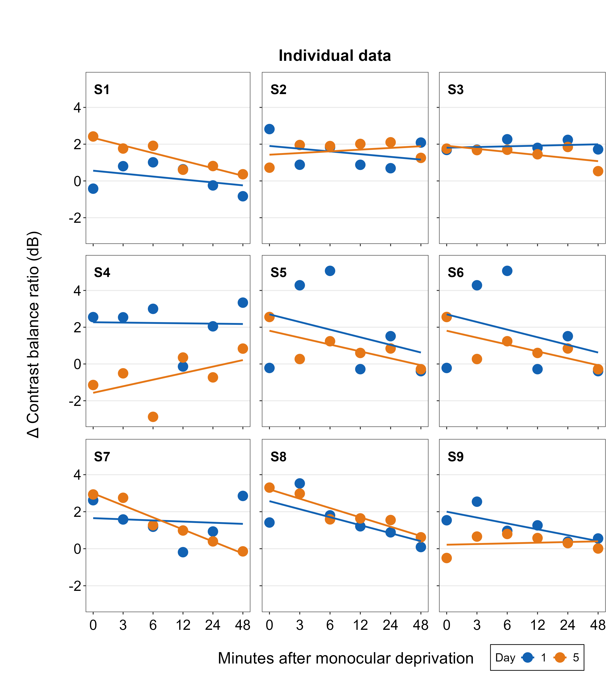
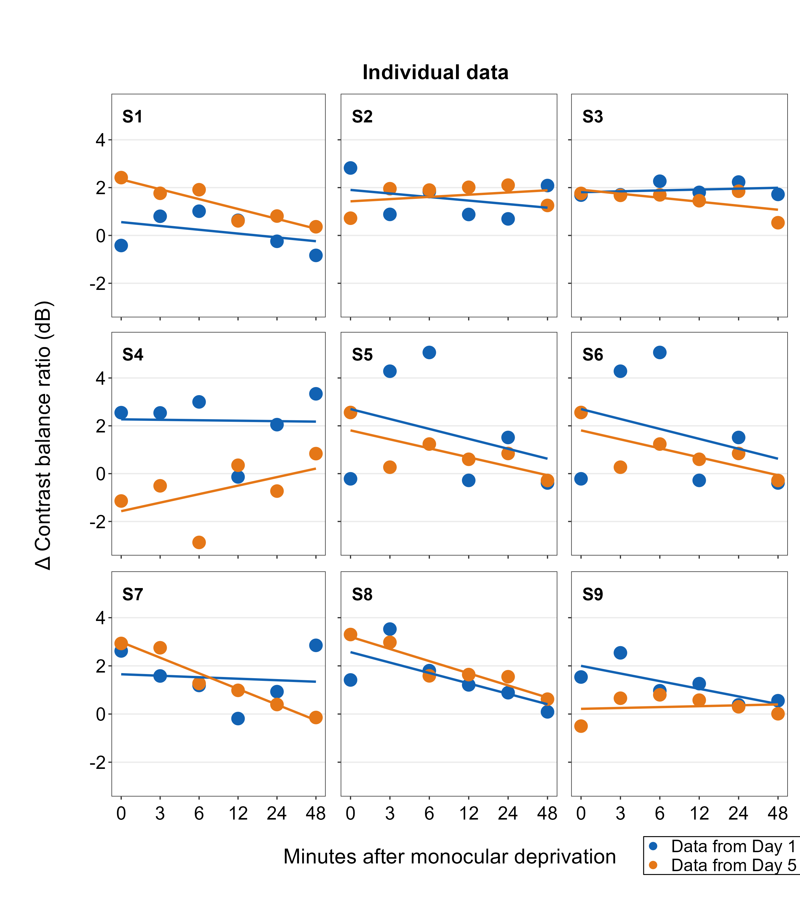
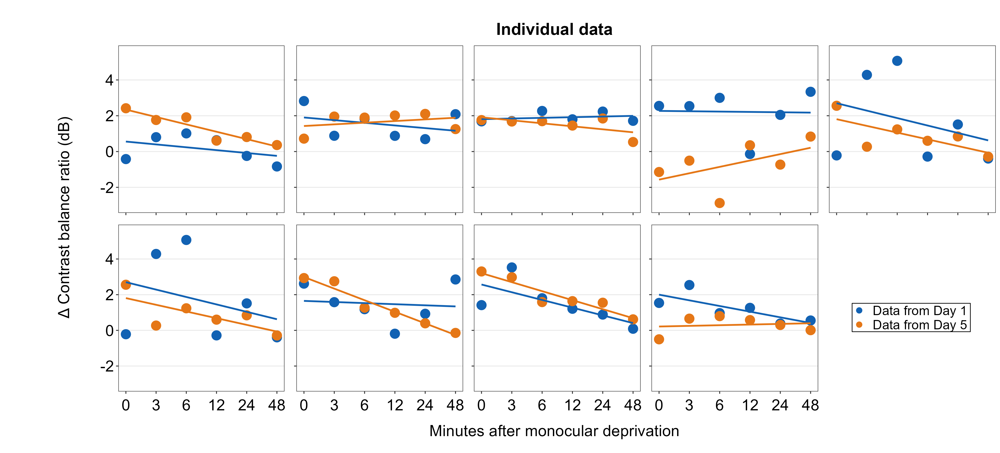
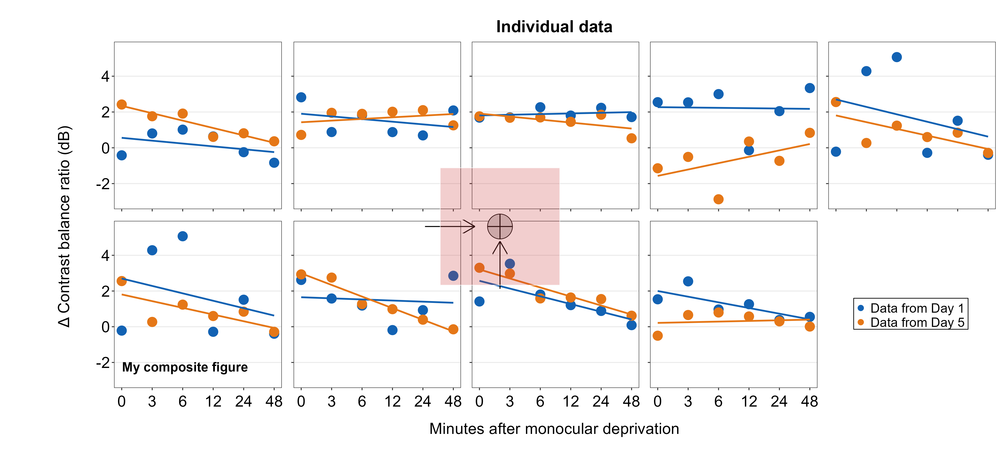

# (PART) Data Analysis with smplot2 {-}

#  Creating a Composite Figure by Subplotting

In this section, we will plot a composite figure. This refers to a type of plot that has many panels with common information, such as the same x- and y-axes. Subplotting is referred to when we allocate subsets of data to particular panels but not others in the composite figure. We will make each panel (i.e., subplot) one-by-one, combine them into a composite figure, add a common legend, and then annotate it with texts and shapes using the functions from *smplot2* package.

First, you need to load data (.csv file). When you are loading your own .csv file for your data analysis, make sure you place the .csv file of your interest in the folder that has been set to the **working directory**. 

In this example, we will be using data from this paper:

**Seung Hyun Min, Alex S. Baldwin and Robert F. Hess. Ocular dominance plasticity: A binocular combination task finds no cumulative effect with repeated patching (2019). Vision Research, 161, 36-42.**

We will be creating similar figures to those in the paper (ex. **Figure 3A** and **Figure A2**) using **smplot**. For the PDF copy, please visit [this link](https://www.smin95.com/pubs/min2019.pdf).

```{r}
library(tidyverse)
library(smplot2)
library(cowplot)
```


```{r, eval  = F, warning=F ,message=F}
df <- read_csv('https://www.smin95.com/min2019.csv')
```

```{r, echo  = F, warning=F, message=F}
df <- read_csv('min2019.csv')
```

```{r}
df$Day <- factor(df$Day)
head(df)
```

There are four columns in this data frame:

- First, `Subject` refers to each participant. There are 10 participants total. 
- Next, `Day` refers to the day of testing. The participants were tested on Day 1, 2, 3, 4 and 5. We will only use Day from 1 and 5.

- `Time` refers to the number of minutes after an experimental manipulation (ex. monocular deprivation). These are 0, 3, 6, 12, 24 and 48 minutes, but in the data frame, it says 0, 1, 2, 3, 4 and 5; we will change the labels manually. 

- The `Cbratio` column refers to the actual data that will be plotted here.  

In the example below, the plots will have different colors based on Day (1 or 5). Therefore, the values in `Day` column have to be discrete, not continuous. To make them discrete, one needs to convert the `Day` column from **double** (continuous variable) to **factor** (discrete variable).

## `filter()`, `select()` and `summarise()`

### `filter()` for rows

To plot data of each subject separately, we need the data frame to show data only from one subject. This can be achieved as using `filter()`:

```{r}
filter(df, Subject == 'S1')
```

- The first argument of `filter()`, `select()`, `summarise()` and `mutate()` is a data frame.
- The subsequent argument specifies how the data frame should be treated.
- The new printed result is a new data frame. 

`filter()` is used to filter for rows that meet the requirement of your interest. 

Here is another example. 

```{r}
filter(df, Day == 1)
```

The above code can be read as: **filter** for all rows of the data frame **df** that have `1` in the `Day` column.

Notice that S1 is a **character** because it has an alphabet. Therefore, it needs to be written as `'S1'`. However, `1` of `Day` is **double**, which is essentially just a number digit. Therefore, it can be written as `1` with no quotation mark. 

Let's try another example.

```{r}
day1 <- filter(df, Day == 1) # save the new data frame into a new variable
filter(day1, Subject == 'S1') # this new data frame contains Day 1 and Subject 1 data only.
```

The above code can be read as: **filter** for all rows of the data frame **df** that have `1` in the `Day` column. Save this new data frame as `day1`. Then,  **filter** for all rows of the data frame `day1` that have `S1` in the `Subject` column. 

The above can also be written like the one below:

```{r}
filter(df, Day == 1 & Subject == 'S1')
```

The above can be read as: **filter** for all rows of the data frame **df** that have `1` in the `Day` column **AND** have `S1` in the `Subject` column.

```{r}
filter(df, Day == 1 | Subject == 'S1')
```

The above can be read as: **filter** for all rows of the data frame **df** that have `1` in the `Day` column **OR** have `S1` in the `Subject` column. `|` represents **OR**, `&` represents **AND**.

### `select()` for columns

If you wish to see the `Cbratio` column only (i.e., data only) for rows of **df** that have `Day ==  1` and `Time == 0`, you can write it like this:

```{r}
day1_time0 <- filter(df, Day == 1 & Time == 0) # save the new data frame in the day1_time0 variable 
select(day1_time0, Cbratio)
```

There are 10 rows (i.e., 10 subjects) in this filtered data frame and 1 column, which is `Cbratio`. The above can be read as: **filter** for all rows of the data frame **df** that have `1` in the `Day` column **AND** have `0` in the `Time` column. Then, store the new data frame in `day1_time0`. Then, select for `Cbratio` column from `day1_time0`.

`select()` is used to filter for columns that meet the requirement of your interest. 

### `summarise()` for grouped summaries

**df** contains individual data for all subjects on Days 1 and 5 across all time points. However, it does not contain average data either for each **Day** or **Time**.

`summarise()` can collapse multiple rows of observations into values such as the mean.

```{r}
summarise(df, average = mean(Cbratio))
```

However, in this case, we get an example of `Cbratio` across `Subject`, `Day` and `Time`. This average value itself is not so meaningful. If we wish to obtain the average for each `Day` and `Time`, we can use the function `group_by()` to group data for each day and time. 

- As it was the case before, the first argument of `group_by()` is a data frame. 

- The second argument of `group_by()` is the name of the column through which you would like to group the data. 


```{r}
by_day_time <- group_by(df, Day, Time)
print(by_day_time)
```

The output of `group_by()` is a new data frame (it might appear exactly the same as before, ex. **df**). However, it will respond differently to `summarise()` because the rows of the data frame are now grouped based on day and time, as we have specified.

```{r}
summarise(by_day_time, Average_Cbratio = mean(Cbratio))
```

This new data frame yields average for each Day and Time. We have now created a new column `Average_Cbratio` which stores all the average data of `Cbratio`. 

Therefore, `group_by()` and `summarise()` are very useful together. They provide grouped summaries, such as the average. However, `summarise()` alone may not be so useful. `group_by()` alone is also rarely used. 

Besides the **average**, one might also be interested in obtaining either **standard deviation** or **standard error**.

However, our **df** does not contain any data about the **standard deviation** or **standard error** per Day or Time, etc. Standard deviation can be calculated via `sd()` and standard error can be computed with `sm_stdErr()`. 

Below, we obtain standard error with the help of the `summarise()` function for each `Day` and `Time`.

```{r}
summarise(df, standard_error = sm_stdErr(Cbratio))
```

As we have seen before, we see that `standard_error` has been calculated across all subjects, day and time. This is not so useful. We should use `summarise()` with `group_by()` so that each standard error could be for each `Day` and `Time`. 

```{r}
by_day_time <- group_by(df, Day, Time)
summarise(by_day_time, standard_error = sm_stdErr(Cbratio))
```

This standard error is for each `Day` and `Time` across all subjects. 

Now let's obtain the **mean** and **standard error**  of `Cbratio` for each `Day` and `Time` across all subjects using the data frame that has been grouped by `Day` and `Time` via `group_by()`.

```{r}
by_day_time1 <- summarise(by_day_time, Average = mean(Cbratio),
          StdError = sm_stdErr(Cbratio))
print(by_day_time1)
```

The original **df**, which contains data for each subject, has now been transformed to a new data frame that contains grouped summaries, such as group averages and standard errors.

If you are interested in learning more about this topic (data transformation), please check out Chapter 5 of R for Data Science by Hadley Wickham (https://r4ds.had.co.nz/transform.html).

## Plotting the averaged data with error bars

Plotting the averaged data can be done with a data frame that contains individual observation (ex. each subject, condition, etc). This data frame can be modified to only contain summary values, such as mean and standard error, using `group_by()` and `summarise()` together as shown above.

We will plot a similar graph to **Figure 3A** in the Vision Research paper (Min et al., 2019) in this section.

- A data frame that has grouped summary information (`group_by()` and `summarise()`), such as average and standard error across subject, is needed to plot a graph that shows the average data with error bars. 
- `geom_errorbar()` is required to plot the error bar of the sample.
- Legend title has been removed with the `theme()` function.
- Greek letter **Delta** is printed with `\u0394`. 
- X-tick labels are originally 0, 1, 2, 3, 4, 5 (as specified in the **df** data frame). However, they can be manually changed using `labels = ` argument in the `scale_x_continuous()` function. 
- Legend label can also be changed in `labels = ` from the `scale_color_manual()` function because each `Day` has been defined by each `color`; this is the case because `color = Day` in `aes(..., ..., color = Day)`. 

```{r, fig.width = 3.5, fig.height = 3.5, warning = F}
ggplot(data = by_day_time1, aes(x = Time, y = Average, color = Day)) +
  geom_point(size = 4.5) +
  geom_errorbar(aes(ymin = Average - StdError, ymax = Average + StdError), size = .5, width = .05) +
  geom_smooth(method = 'lm', se = F, size = 0.9) + 
  # lm = linear regression method 
  scale_x_continuous(breaks = unique(df$Time), 
                     labels = c("0", "3", "6", "12", "24", "48")) +
  sm_hgrid(legends = TRUE) +
  scale_color_manual(values = sm_color('blue','orange'),
                     labels = c("Day 1", "Day 5")) +
  ggtitle("Recovery of the patching effect") +
  xlab("Time after monocular deprivation (min)") +
  ylab("\u0394 Contrast balance ratio (dB)") +
  theme(legend.justification = c(1,0), 
        legend.position = c(0.96, 0.67), 
        legend.title = element_blank()) 
```


## Plotting individual data

In this section, we will plot a similar graph to **Figure A2** in the Vision Research paper (Min et al., 2019).

First, you will need several packages for this section. 

- If you do not have the **gridExtra** and **grid** packages in your RStudio, please install them using the codes below. It might take less than a minute. 

```{r, eval = F}
install.packages('gridExtra')
install.packages('grid')
```

- Then load all these packages below. 

```{r, message = FALSE, warning = FALSE}
library(tidyverse)
library(cowplot)
library(smplot2)
library(gridExtra)
library(grid)
```

Now let's plot data for each subject (S1-S9) except S10. Each panel shows the data of each subject for both Days 1 and 5. 

```{r, fig.width = 3.5, fig.height = 3.5}
df_s1 <- filter(df, Subject == 'S1') 
# rows of df that only contain S1 in the Subject column

# use df_s1 to plot the data of S1

plot_s1 <- ggplot(data = df_s1, aes(x = Time, y = Cbratio, color = Day)) + 
  geom_point(size = 4.5) +
  geom_smooth(method = 'lm', se = F, size = 0.9) + 
  # lm = linear regression method 
  scale_x_continuous(breaks = unique(df$Time), 
                     labels = c("0", "3", "6", "12", "24", "48")) +
  sm_hgrid() +
  scale_color_manual(values = sm_color('blue','orange')) +
  scale_y_continuous(limits = c(-3, 5.5)) 
# axis text size is 1.5x the original font size. 

print(plot_s1)
```

Then make each one for the other subjects (S2-S9). 

```{r, fig.width = 3.5, fig.height = 3.5}
df_s2 <- filter(df, Subject == 'S2') 

plot_s2 <- ggplot(data = df_s2, aes(x = Time, y = Cbratio, color = Day)) + 
  geom_point(size = 4.5) +
  geom_smooth(method = 'lm', se = F, size = 0.9) + 
  # lm = linear regression method 
  scale_x_continuous(breaks = unique(df$Time), 
                     labels = c("0", "3", "6", "12", "24", "48")) +
  sm_hgrid() +
  scale_color_manual(values = sm_color('blue','orange')) +
  scale_y_continuous(limits = c(-3, 5.5)) 
# axis text size is 1.5x the original font size. 

print(plot_s2)
```

```{r, fig.width = 3.5, fig.height = 3.5}
df_s3 <- filter(df, Subject == 'S3')

plot_s3 <- ggplot(data = df_s3, aes(x = Time, y = Cbratio, color = Day)) + 
  geom_point(size = 4.5) +
  geom_smooth(method = 'lm', se = F, size = 0.9) + 
  # lm = linear regression method 
  scale_x_continuous(breaks = unique(df$Time), 
                     labels = c("0", "3", "6", "12", "24", "48")) +
  sm_hgrid() +
  scale_color_manual(values = sm_color('blue','orange')) +
  scale_y_continuous(limits = c(-3, 5.5)) 
# axis text size is 1.5x the original font size. 

print(plot_s3)
```

```{r, fig.width = 3.5, fig.height = 3.5}
df_s4 <- filter(df, Subject == 'S4')

plot_s4 <- ggplot(data = df_s4, aes(x = Time, y = Cbratio, color = Day)) + 
  geom_point(size = 4.5) +
  geom_smooth(method = 'lm', se = F, size = 0.9) + 
  # lm = linear regression method 
  scale_x_continuous(breaks = unique(df$Time), 
                     labels = c("0", "3", "6", "12", "24", "48")) +
  sm_hgrid() +
  scale_color_manual(values = sm_color('blue','orange')) +
  scale_y_continuous(limits = c(-3, 5.5)) 
# axis text size is 1.5x the original font size. 

print(plot_s4)
```

```{r, fig.width = 3.5, fig.height = 3.5}
# Subject 5
df_s5 <- filter(df, Subject == 'S5') 
# rows of df that only contain S5 in the Subject column

plot_s5 <- ggplot(data = df_s5, aes(x = Time, y = Cbratio, color = Day)) + 
  geom_point(size = 4.5) +
  geom_smooth(method = 'lm', se = F, size = 0.9) + 
  # lm = linear regression method 
  scale_x_continuous(breaks = unique(df$Time), 
                     labels = c("0", "3", "6", "12", "24", "48")) +
  sm_hgrid(legends = FALSE) + 
  scale_color_manual(values = sm_color('blue','orange')) +
  scale_y_continuous(limits = c(-3, 5.5)) 

print(plot_s5)
```

```{r, fig.width = 3.5, fig.height = 3.5}
# Subject 6
df_s6 <- filter(df, Subject == 'S6') 
# rows of df that only contain S6 in the Subject column

plot_s6 <- ggplot(data = df_s5, aes(x = Time, y = Cbratio, color = Day)) + 
  geom_point(size = 4.5) +
  geom_smooth(method = 'lm', se = F, size = 0.9) + 
  # lm = linear regression method 
  scale_x_continuous(breaks = unique(df$Time), 
                     labels = c("0", "3", "6", "12", "24", "48")) +
  sm_hgrid() +
  scale_color_manual(values = sm_color('blue','orange')) +
  scale_y_continuous(limits = c(-3, 5.5))  
# axis text size is 1.5x the original font size. 

print(plot_s6)
```

```{r, fig.width = 3.5, fig.height = 3.5}
df_s7 <- filter(df, Subject == 'S7')

plot_s7 <- ggplot(data = df_s7, aes(x = Time, y = Cbratio, color = Day)) + 
  geom_point(size = 4.5) +
  geom_smooth(method = 'lm', se = F, size = 0.9) + 
  # lm = linear regression method 
  scale_x_continuous(breaks = unique(df$Time), 
                     labels = c("0", "3", "6", "12", "24", "48")) +
  sm_hgrid() +
  scale_color_manual(values = sm_color('blue','orange')) +
  scale_y_continuous(limits = c(-3, 5.5)) 
# axis text size is 1.5x the original font size. 

print(plot_s7)
```

```{r, fig.width = 3.5, fig.height = 3.5}
df_s8 <- filter(df, Subject == 'S8')

plot_s8 <- ggplot(data = df_s8, aes(x = Time, y = Cbratio, color = Day)) + 
  geom_point(size = 4.5) +
  geom_smooth(method = 'lm', se = F, size = 0.9) + 
  # lm = linear regression method 
  scale_x_continuous(breaks = unique(df$Time), 
                     labels = c("0", "3", "6", "12", "24", "48")) +
  sm_hgrid() +
  scale_color_manual(values = sm_color('blue','orange')) +
  scale_y_continuous(limits = c(-3, 5.5)) 
# axis text size is 1.5x the original font size. 

print(plot_s8)
```

```{r, fig.width = 3.5, fig.height = 3.5}
# Subject 9

df_s9 <- filter(df, Subject == 'S9') 

plot_s9 <- ggplot(data = df_s9, aes(x = Time, y = Cbratio, color = Day)) + 
  geom_point(size = 4.5) +
  geom_smooth(method = 'lm', se = F, size = 0.9) + 
  # lm = linear regression method 
  scale_x_continuous(breaks = unique(df$Time), 
                     labels = c("0", "3", "6", "12", "24", "48")) +
  sm_hgrid() +
  scale_color_manual(values = sm_color('blue','orange')) +
  scale_y_continuous(limits = c(-3, 5.5)) 
# axis text size is 1.5x the original font size. 

print(plot_s9)
```

## Putting multiple plots together (a composite figure)

Each panel output has to be stored in a `list` using the function `list()`. X-axis label can be specified using `sm_common_xlabel()`, which has `x` and `y` arguments for setting the location of the label. Y-axis label is specified using `sm_common_ylabel()` with the same `x` and `y` arguments. The title can be set using `sm_common_title()`. 

```{r}
all_plots <- list(plot_s1, plot_s2, plot_s3, 
                  plot_s4, plot_s5, plot_s6,
                  plot_s7, plot_s8, plot_s9)

xlabel <- sm_common_xlabel('Minutes after monocular deprivation', x= 0.52, y = 0.6)
ylabel <- sm_common_ylabel('\u0394 Contrast balance ratio (dB)')
title <- sm_common_title('Individual data', y = 0.2)

plots_tgd <- sm_put_together(all_plots, title, xlabel,ylabel, 
                             ncol=3,nrow=3, hmargin=-5, wmargin=-5)

```

Now let's put them together in a 3x3 figure (3 rows, 3 columns) using the function `sm_put_together()`. So, `ncol` and `nrow` are set to 3 in `sm_put_together()`. The function automatically removes tick labels in both x- and y-axes in inner panels, and keeps them on the outer panels, so that combined plot looks clean. Also, the `hmargin` argument can be set to adjust the blank space of height between panels; the `wmargin` argument can be set to adjust the blank space of width between panels. Their values can be both negative (less blank space) and positive (more blank space). I suggest you use values from *-5 to 5* for `hmargin` and `wmargin`. `wRatio` is an argument for `sm_put_together()` that controls the relative width of the left-most column to that of other columns; the default value is set to 1.1 because left-most panels have y-axis ticks. Conversely, `hRatio` is an argument for `sm_put_together()` that controls the relative height of the bottom row to that of higher rows. It is set to 1.1 as default because bottom row panels have x-ticks. I encourage users to modify these values because different computer systems can show slightly different figure outputs. 
                  

```{r, echo=FALSE, fig.align = 'center',fig.cap="3x3 figure. It has 3 columns and 3 rows", out.width = '75%'}
knitr::include_graphics("img/rc33.png")
```

```{r}
save_plot('together1.png',plots_tgd,ncol=3,nrow=3,
          base_height=3.4,base_width=3)
```

```{r, echo=FALSE, fig.align = 'center', out.width = '75%'}
knitr::include_graphics("together1.png")
```

When you are saving the graph as an image file, `nrow` and `ncol` in `save_plot()` have to match the values in `sm_put_together()` as shown above. `save_plot()`, which is a function from the *cowplot* package, is a function that saves a selected graph into an image or PDF file (or eps, etc).

Open `together1.png` in your directory folder. The figure is clean but it lacks a few things: 1) label for each panel, 2) legend. With examples below, we will add them.

```{r}
all_plots2 <- sm_panel_label(all_plots, x = 0.1, y = 0.9, panel_tag ='1', panel_pretag = 'S', text_size = 5, 
                             text_color = 'black', fontface='bold')
```


Here, we include a label for each panel, which represents the data of each subject, using `sm_panel_label()`.

The function `sm_panel_label()` has a few arguments. `x` and `y` determine the location of the panel label; 0.5 represents its origin in the middle of the panel. `panel_tag` determines the character string that will be used for enumeration. In this example, `panel_tag = "1"` is chosen so there will be a sequence of numbers. Other options include: 1) `panel_tag = "A"` for uppercase letters, 2) `panel_tag = "a"` for small case letters, 3) `panel_tag = "I"` for upper roman numerals, and 4) `panel_tag = "i"` for lower roman numerals. There are also tag labels that can set to be *consistent* across panels: these are `panel_pretag` and `panel_posttag`. `panel_pretag` comes before `panel_tag` (as shown in this example, in the form of `S`, ex. `S1`), and `panel_posttag` comes after `panel_tag`. 

```{r}
plots_tgd2 <- sm_put_together(all_plots2, title, xlabel,ylabel, 
                             ncol=3,nrow=3, hmargin=-5, wmargin=-5)

plots_tgd3 <- sm_add_legend(plots_tgd2, x = .88, y= 0.05, sampleplot = all_plots2[[1]], 
                            direction = 'horizontal', border = FALSE)
```


As before, we then combine the list of plots with panel label (`all_plots2`) and the labels for the common x- and y-axes, as well as the title of the combined figure using `sm_put_together()`. The arguments of `sm_put_together()` have to be written in this order unless they are specified (ex. `sm_put_together(all_plots=all_plots, xlabel=xlabel, title=title)`). We reduce the margin of width and height blank space between panels by setting `hmargin=-5` and `vmargin=-5`.

Next, we add legend using `sm_add_legend()`. It has a number of arguments. First, the combined figure (output from `sm_put_together()`) must be provided. Next, `x` and `y` are the location of the legend in the coordinates of the combined figure (0 to 1), where `x=0.5` and `y=0.5` represents the center of the combined figure. `sampleplot` has to be provided, which in this case one of the plots in the `plots_tgd2` list, so that the function `sm_add_legend()` can derive a legend for the whole combined plot. The `direction` (or orientation) of the legend can also be set as `horizontal` or `vertical`; in this case, we set it to `direction = horizontal`. 

```{r, echo=FALSE}
save_plot('together2a.png', plots_tgd3, ncol=3, nrow=3,
          base_height=3.4, base_width=3)
```

```{r, echo=FALSE, fig.align = 'center',out.width = '75%'}

```

The border of the legend can also be included by setting `border = TRUE`. We can also increase the amount of spacing within the legend using `legend_spacing` argument from `sm_add_legend`. This change is subtle but you will definitely notice it. 

```{r}
plots_tgd3b <- sm_add_legend(plots_tgd2, x = .88, y= 0.05, sampleplot = all_plots2[[1]], 
                             direction = 'horizontal', border = TRUE, legend_spacing = 1)
```

```{r, echo=FALSE}
save_plot('together2b.png', plots_tgd3b, ncol=3, nrow=3,
          base_height=3.4, base_width=3)
```

```{r, echo=FALSE, fig.align = 'center',out.width = '75%'}

```


You can even make a separate legend on your own with full customization using `sm_common_legend()`, then add the legend to the combined plot using `sm_add_legend()`. We will do this by first making a combined figure with two rows and five columns (`nrow=2` and `ncol=5`). The legend can be on the 10th panel because its empty.

```{r}
legend <- ggplot(data = df_s9, aes(x = Time, y = Cbratio, color = Day)) + 
  geom_point(size = 2.5) +
  scale_color_manual(values = sm_color('blue','orange'),
                     labels = c('Data from Day 1 ', 'Data from Day 5 ')) +
  scale_shape_manual(values = c(21,22),
                     labels = c('Data from Day 1 ', 'Data from Day 5 ')) +
  sm_common_legend(x = 0.5, y = 0.1 , title=FALSE, legend_spacing = 1)
```


```{r, echo=F, fig.width=3, fig.height=3}
legend
```


Here, in `sm_common_legend()`, `x` and `y` control the location of the legend. Basically, `legend` is a new plot with no points; however, you still need to draw the same points and include other features from other sub-panels to make sure that they are included in the legend. Notice that legend labels have been customized as well by adjusting the `labels` within `scale_color_manual()` and `scale_shape_manual()`. The title has been removed by setting `title = FALSE`.

Let's see what happens if you change the location (`x` and `y`) of the legend.

```{r}
legend_a <- ggplot(data = df_s9, aes(x = Time, y = Cbratio, color = Day)) + 
  geom_point(size = 2.5) +
  scale_color_manual(values = sm_color('blue','orange'),
                     labels = c('Data from Day 1 ', 'Data from Day 5 ')) +
  scale_shape_manual(values = c(21,22),
                     labels = c('Data from Day 1 ', 'Data from Day 5 ')) +
  sm_common_legend(x = 0.5, y = 0.5 , title=FALSE, legend_spacing = 1)
```

```{r, echo=F, fig.width=3, fig.height=3}
legend
```

Notice that the relative orientation of the legend has shifted. The `legend` can then be added to the combined plot using `sm_add_legend()`. If you provide a separate legend, then other arguments of the function will be ignored, such as `direction` and `border` from `sm_add_legend()` because these arguments are used to derive a legend based on `sampleplot`. 

```{r}
plots_tgd3c <- sm_add_legend(plots_tgd2, x = .91, y= 0.05, legend=legend_a)
```


```{r, echo=FALSE}
save_plot('together2c.png', plots_tgd3c, ncol=3, nrow=3,
          base_height=3.4, base_width=3)
```

```{r, echo=FALSE, fig.align = 'center',out.width = '75%'}

```


Also, besides `sm_add_legend()`, `sm_put_together()` can also legend onto the combined plot. The `legend` however has to be separately made using `sm_common_legend()` first, ex. `sm_put_together(legend = legend)`, where `legend` is a separate legend created as shown above. If the `legend` is provided in `sm_put_together()`, the function will automatically add legend onto the last panel of the combined plot, so make sure that the last empty panel is empty.

To demonstrate this function, we will make a combined figure with 2 rows and 5 columns.

```{r}
xlabel <- sm_common_xlabel('Minutes after monocular deprivation', x=0.51, y = 0.6)
ylabel <- sm_common_ylabel('\u0394 Contrast balance ratio (dB)', x=0.7)
title <- sm_common_title('Individual data', y = 0.3, x = 0.51, size=18)

plots_tgd4 <- sm_put_together(all_plots, title=title, xlabel=xlabel,
                              ylabel=ylabel, legend=legend_a,
                             ncol=5,nrow=2, hmargin=-5, wmargin=-5)

```


```{r}
save_plot('together4.png', plots_tgd4, ncol=5, nrow=2,
          base_height=3.4, base_width=3)

```

The legend is set using the function `sm_common_legend()`, whose `x` and `y` control the location of the legend. Basically, `legend` is a new plot with no points; however, you still need to draw the same points and include other features from other sub-panels to make sure that they are included in the legend. THe output `legend` then gets handled by `sm_put_together()`.

The arguments of `sm_put_together()` have to be written in this order unless they are specified (ex. `sm_put_together(all_plots=all_plots, xlabel=xlabel, title=title)`).

If the `legend` is included in `sm_put_together`, the function will automatically add legend onto the last panel of the combined plot, so make sure that the last empty panel is empty. To move the legend's location, you need to adjust `x` and `y` of `sm_common_legend()`, which you have used to make a separate, customisable legend. 


```{r, echo=FALSE, fig.align = 'center'}

```

## Adding annotations to the composite figure

*smplot2* offers multiple options for users to add annotations on the final, combined figure with a full flexibility. Here are some examples. These functions all have the form of `sm_add_*()`.


### Text annotations

Text annotations can be added to the composite figure using `sm_add_text()`. The `label` argument can be used to specify the text label. `x` and `y` are the coordinate values of the text in the composite figure, and they have to be between 0 and 1;  0.5 represents the origin (center) of the composite figure. `size` determines the text size and the `fontface` can be either `bold`, `plain`, `italic` or `italic.bold`.

```{r}
plots_tgd4b <- sm_add_text(plots_tgd4, label = 'My composite figure',
                           x = 0.185, y = 0.19, size = 14, fontface='bold')
```


```{r, echo=FALSE, fig.align = 'center'}
save_plot('together4b.png', plots_tgd4b, ncol=5, nrow=2,
          base_height=3.4, base_width=3)

knitr::include_graphics("together4b.png")
```

### Point annotations

Point annotations can be added to the composite figure using `sm_add_point()`. `x` and `y` are the coordinate values of the point in the composite figure, and they have to be between 0 and 1;  0.5 represents the origin (center) of the composite figure. `size` determines the point size and the `shape` number input should be the same as the ones in *ggplot2* (ex. 21 is circle with border). `fill` should be provided for shapes with border. If the shape has no border, then `color` is sufficient to set the color that fills the point.

```{r}
plots_tgd4c <- sm_add_point(plots_tgd4b,x = 0.50, y = 0.50, size = 35, 
                            shape = 21, fill = 'gray80', color = 'black')
```

```{r, echo=FALSE, fig.align = 'center'}
save_plot('together4c.png', plots_tgd4c, ncol=5, nrow=2,
          base_height=3.4, base_width=3)

knitr::include_graphics("together4c.png")
```

### Line annotations

Line annotations can be added to the composite figure using `sm_add_line()`. `x` and `y` are the starting coordinate values of the line in the composite figure. `xend` and `yend` are the ending coordinate values of the line. These coordinate values have to be between 0 and 1;  0.5 represents the origin (center) of the composite figure. `linewidth` determines the width of the line and the `color` should adjust the color of the line. There is no `fill` argument. These have same arguments as `annotate()`, which is a *ggplot2* function.

We will draw a crosshair on the gray circle point to demonstrate that the relative coordinate system is uniform across different `sm_add_*()` functions. The center of the points and lines is at (0.5, 0.5).

```{r}
plots_tgd4d <- sm_add_line(plots_tgd4c,x = 0.5, y = 0.475, xend = 0.5, 
                           yend = 0.525, color = 'black')

plots_tgd4e <- sm_add_line(plots_tgd4d,x = 0.49, y = 0.5, xend = 0.51, 
                           yend = 0.5, color = 'black')
```

```{r, echo=FALSE, fig.align = 'center'}
save_plot('together4e.png', plots_tgd4e, ncol=5, nrow=2,
          base_height=3.4, base_width=3)


```

The cross hair is perfectly aligned.

### Arrow annotations

Next, we will add arrow annotations using `sm_add_arrow()`. The arguments are identical to those in `sm_add_line()` except there is additional argument of `arrowlength`, which determines the size of the arrow's tip. 

Since the unit of `arrowlength` is relative to the size of the composite figure, and because there are two rows and five columns, the horizontal arrow has a smaller `arrowlength` by a factor of 2/5 than that of the vertical arrow. So `arrowlength` is set to `5/2` in the horizontal arrow to match the size of the arrow's head of the vertical arrow. Otherwise, the coordinate system seems to be more or less uniform because 0.5 instructs them to be at the center of the composite figure.

```{r}
plots_tgd4f <- sm_add_arrow(plots_tgd4e, x  = 0.5, y = 0.37, xend = 0.5, 
                           yend = 0.46, color = 'black')
plots_tgd4g <- sm_add_arrow(plots_tgd4f, x = 0.44, y = 0.5, xend = 0.46, 
                           yend = 0.5, color = 'black', arrowlength = 5/2)
```

```{r, echo=FALSE, fig.align = 'center'}
save_plot('together4g.png', plots_tgd4g, ncol=5, nrow=2,
          base_height=3.4, base_width=3)


```

### Rectangle annotations

Here, we will add rectangle annotations using `sm_add_rect()`. The four coordinate arguments are `xmin`, `xmax`, `ymin` and `yend`. These arguments are exactly the same as `annotate('rect', ...)`. `fill` determines the filling color, and `color` determines the border color. The border's width is set with the argument `linewidth`, which is set to 0.5 as default.

We draw a transparent rectangle over the crosshair to see if the coordinate system is uniform to those of the previously used annotation functions.

```{r}
plots_tgd4h <- sm_add_rect(plots_tgd4g, xmin= 0.44, ymin = 0.37, xmax = 0.56, 
                           ymax = 0.63, alpha = 0.25, fill = sm_color('red'), color='white')
```

We see that the center of the coordinate is uniform but not at the end. Currently, there is no way to match both the ends and center because as far as I know there is no way to get common coordinates for different visual components at the level of composite figure. So, for now, users will have to just understand that the center of the annotations are aligned if same coordinates are used but not at necessarily at the ends. 

```{r, echo=FALSE, fig.align = 'center'}
save_plot('together4h.png', plots_tgd4h, ncol=5, nrow=2,
          base_height=3.4, base_width=3)


```

### Polygon annotations

We will annotate a polygon onto the combined figure using `sm_add_polygon()`. Here, we will create a triangle. All coordinates should provided in `x` and `y` arguments. Triangles have three points, so `x` and `y` have three elements. The values should be from 0 to 1.

```{r}
plots_tgd4i <- sm_add_polygon(plots_tgd4h, x = c(.2,.8,.8), y = c(.2,.8,.2), 
                              alpha = 0.25, fill = sm_color('blue'), color='white')
```

```{r, echo=FALSE, fig.align = 'center'}
save_plot('together4i.png', plots_tgd4i, ncol=5, nrow=2,
          base_height=3.4, base_width=3)


```

We will finish the annotations with this one.

```{r}
plots_tgd4j <- sm_add_text(plots_tgd4i, x=.5, y=.5,  label = 'Annotations!!', angle=42, size = 25, fontface='bold')
```

```{r, echo=FALSE, fig.align = 'center'}
save_plot('together4j.png', plots_tgd4j, ncol=5, nrow=2,
          base_height=3.4, base_width=3)

knitr::include_graphics("together4j.png")
```
