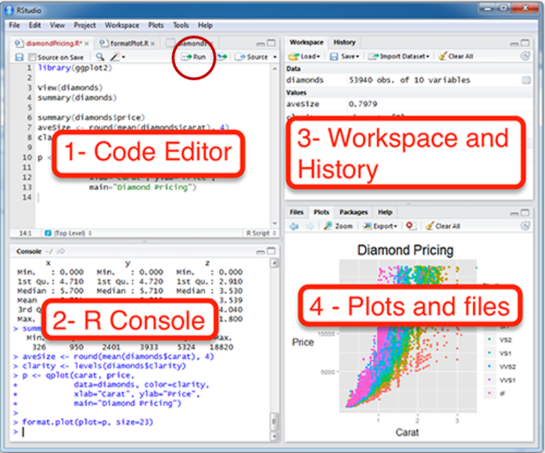
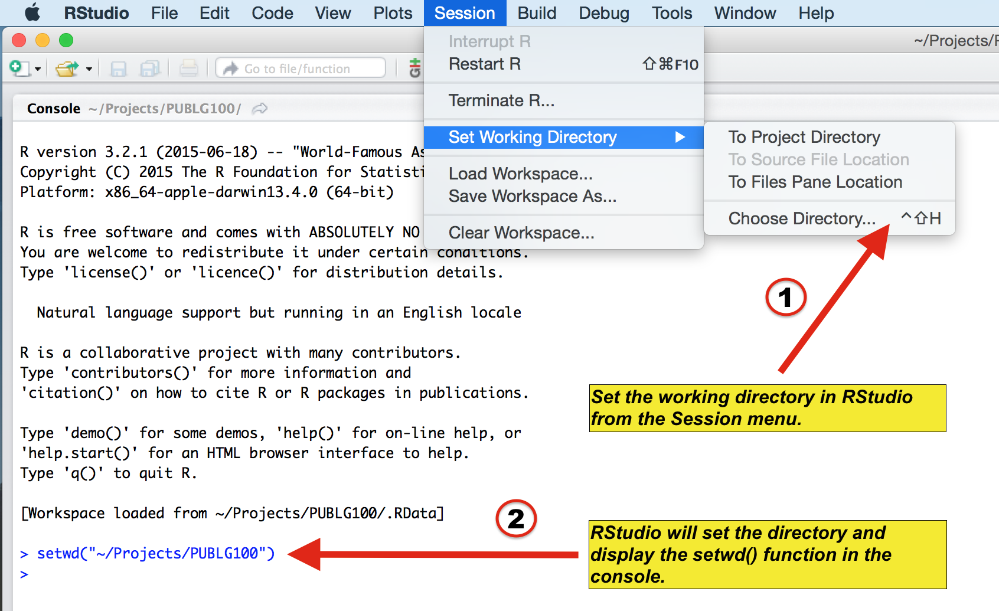

# Download RStudio & Basics of R

## Setting up RStudio

### Why use R for data visualization? {-}

- R is free.
- Often, less codes are needed in R to plot an elegant graph.
- for/while loops (basic concepts in programming) are not necessary in R to make a production-quality graph.
- R is the best software for statistical analysis.

### Other available resources for R {-}

- Stack Overflow: https://www.stackoverflow.com
- R for Data Science (a bible for learning R): https://r4ds.had.co.nz/
- R documentation: https://www.rdocumentation.org
- Learn Statistics with R: https://learningstatisticswithr.com/
- ggplot2 (a reference for plotting data in R): https://ggplot2-book.org/

### Download requirements for RStudio {-}

- Download R: http://cran.r-project.org/
- For Mac users: Mac: XQuartz https://www.xquartz.org/
- RStudio: http://www.rstudio.org/

### Open RStudio {-}

```{r pressure, echo=FALSE, fig.align = 'center',fig.cap="Rstudio layout, image from http://www.sthda.com/english/wiki/running-rstudio-and-setting-up-your-working-directory-easy-r-programming", out.width = '65%'}

```


- **Rstudio** is where people do R programming.
- You can type codes (**commands**) into the **console** (bottom-left panel).
  - `>` means that the console is ready to receive more code.
  - `+` means your code is not complete.
- You can also write (longer) codes in the **script** within the code editor (top-left panel). 
  - The code editor will run the script into the console.
  - A **new script** can be opened by clicking: **File -> New -> R Script**.
- You can run a script by clicking **'Run"** with the green arrow or by typing **ctrl + enter**. It is labeled with the red circle.
  - Or you can just type your codes directly into the console.

### Let's make a folder and set it as working directory {-}

```{r, echo=FALSE, fig.align = 'center',fig.cap="Setting your working directory, image from https://www.ucl.ac.uk/~uctqiax/PUBLG100/2015/faq/setwd.html", out.width = '80%'}

```

- Create a folder named **LearnR** in Desktop.
- Set the folder as your working directory by clicking: **Session -> Set Working Directory -> Choose Directory**. Then find your **LearnR** folder.
- More information about setting up a directory is here:
http://www.sthda.com/english/wiki/running-rstudio-and-setting-up-your-working-directory-easy-r-programming
- You will need set the directory **every time** you start RStudio.


### How to run your code

- You can run code in 2 ways.

- First, you can type it in the script and run it after highlighting the codes you would like to run. 

```{r, echo=FALSE, fig.align = 'center',fig.cap="How to run your code - script", out.width = '100%'}
knitr::include_graphics("img/run_code.png")
```

- Second, you can type your code directly in the console. 

```{r, echo=FALSE, fig.align = 'center',fig.cap="How to run your code - console", out.width = '100%'}
knitr::include_graphics("img/run_code_console.png")
```


## Basics of R 

### Let's type some codes {-}

- Capitalization, punctuations and brackets are all important.
-  `' ' ` and `" "` mean the same. 
  - However, `' "` are not paired. So they will not work.
- `=` and `<-` mean equivalent.
  - I often use `<-`.
- Type `?` when you are not sure about the code (ex. `?t.test`)
- A code becomes comment when it is preceded by `#`.
  - Try typing `# g = 3` and see if the number gets stored in g by typing **g** in the console.

```{r}
x = 3 # x equals to 3
a <- 4 # a equals to 4 
d <- 'Group' # gr is equal to a character 'Group', which is not a number.
e <- "Group"
d == e # 'Group' and "Group" are equal
# g = 3 # its a comment
```


- Notice that I used `==` to test if **d** and **e** are equal. Therefore, `==` and `=` mean different. `==` **tests** if two things are equal. `=` **sets** two things to be equal.
  - `d == e` returns `TRUE` because they are both `'Group'`. `TRUE` is equivalent to 1 numerically.

- Now let's check if **x** and **a** are equal.

```{r}
x == a
```

- It returns `FALSE` because **x** and **a** are not equal. This is correct because 3 and 4 are not equal. `FALSE` equals to 0 numerically.

- Below are more examples showing that `TRUE` = 1 and `FALSE` = 0.

```{r}
TRUE + FALSE # 1 + 0
TRUE + TRUE # 1 + 1
FALSE + FALSE # 0 + 0
TRUE*2 # 1 * 2
TRUE*FALSE # 1 * 0
```


### How can I learn most effectively with the notes? {-}

- Don't just read it. 
- Don't just copy and paste the codes and run them in RStudio (ctrl + c & ctrl + p). **Make sure you type each code.**
- You can also change your code and see if it still works.
- If you are not sure of your code, you can type `?` before the function.
- If you are still not sure after reading the notes, check out Chapter 3 of **R for Data Science**: https://r4ds.had.co.nz/

### More installation {-}
- R is an old programming language. 
- So, people, such as statisticians and programmers, have created more functions in R in the form of the package to update the language. They are free but they have to be downloaded separately.
  - A **package** can contain several **functions**.
  - In this tutorial, you will mainly be using **ggplot2** package, which is elegant and flexible for visualizing data.
  - Also, you will be using **smplot2** package. It improves ggplot2 graphs visually.
- So, you will need to install some packages, such as ggplot2 and smplot2. Please type the codes below.

```{r, eval = FALSE}
install.packages('devtools')
devtools::install_github('smin95/smplot2', force = TRUE) # requires VPN if you are in China
```

- You only need to install them once, but you will need to reload them whenever you start a new session in RStudio using the function `library()`.

```{r, eval = F}
install.packages('tidyverse') # only need to install once
install.packages('cowplot')
```

```{r}
# packages must be loaded every time by using library() when you run your script

library(tidyverse) # it has ggplot2 package
library(cowplot) # it allows you to save figures in .png file
library(smplot2)
```

- Now let's make some graphs in the subsequent chapters. 