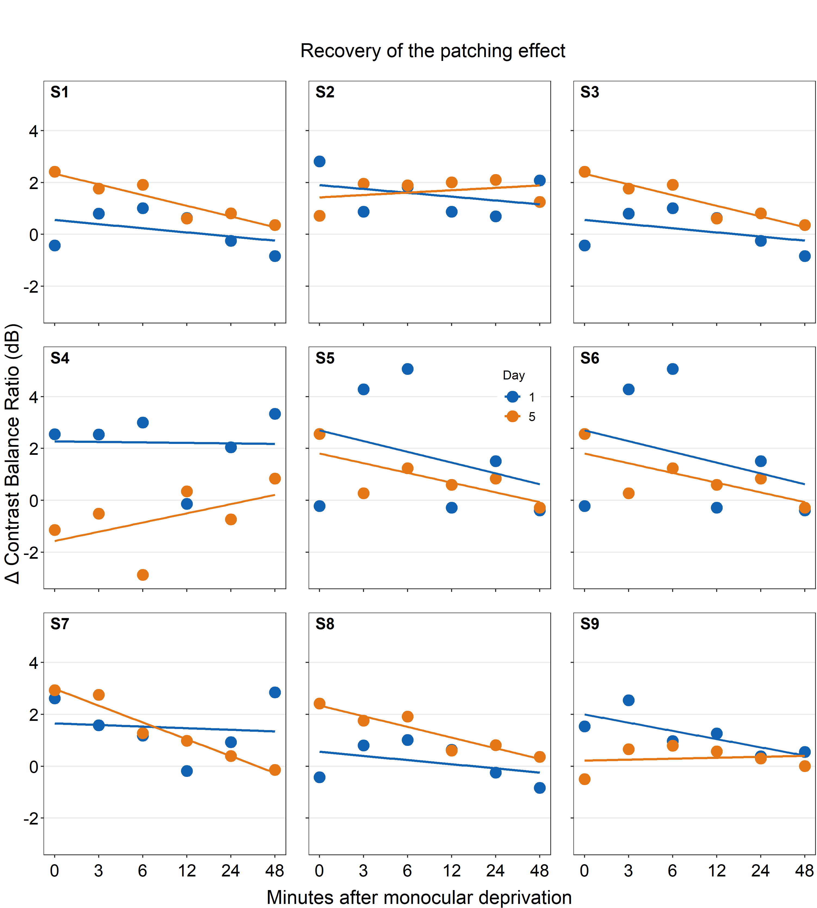

--- 
title: "Data Analysis and Visualization in R Using smplot"
author: "Seung Hyun Min"
date: "`r Sys.Date()`"
site: bookdown::bookdown_site
documentclass: book
---

```{r include=FALSE,cache=FALSE,purl=FALSE}
# don't cache anything on this page
knitr::opts_chunk$set(cache = FALSE)
```

# Welcome! {-#index}

```{r, echo=FALSE, message=FALSE, warning=FALSE, fig.width = 7.4, fig.height= 11.7,warning = F}
library(tidyverse)
library(cowplot)
library(smplot)
df <- read_csv('https://www.smin95.com/data.csv') 
df$Day <- factor(df$Day, levels = c('One','Two','Three'))
ggplot(data = df, mapping = aes(x = Day, y = Value, fill = Day)) + 
  sm_boxplot(color = 'white', shape = 21) + 
  scale_fill_manual(values = sm_palette(3)) +
  ggtitle('Boxplot') + 
  theme(plot.title = element_text(face="bold")) -> boxplot
ggplot(data = df, mapping = aes(x = Day, y = Value, color = Day)) + 
  sm_violin() + 
  scale_color_manual(values = sm_palette(3)) + 
  ggtitle('Violin plot') + 
  theme(plot.title = element_text(face="bold"))-> violin
set.seed(1) # generate random data
day1 = rnorm(20,0,1)
day2 = rnorm(20,5,1)
Subject <- rep(paste0('S',seq(1:20)), 2)
Data <- data.frame(Value = matrix(c(day1,day2),ncol=1))
Day <- rep(c('Day 1', 'Day 2'), each = length(day1))
df1 <- cbind(Subject, Data, Day)
ggplot(data = df1, mapping = aes(x = Day, y = Value, fill = Day)) +
  sm_bar(shape = 21, color = 'white', point_alpha = 1, bar_alpha = 0.2,
          bar_fill_color = 'black') +
  scale_fill_manual(values = sm_color('blue','orange')) +
  theme(axis.title.x = element_blank()) +
  ggtitle('Bar plot') + 
  theme(plot.title = element_text(face="bold")) -> bar
ggplot(data = df1, mapping = aes(x = Day, y = Value, 
                                group = Subject, fill = Day)) +
  sm_slope(labels = c('Day 1', 'Day 2'),
            shape = 21, color = 'white', line_alpha = 0.3) +
  scale_fill_manual(values = sm_color('blue','orange')) +
  ggtitle('Slope chart') + 
  theme(plot.title = element_text(face="bold")) -> slope
# raincloud plot
set.seed(2) # generate random data
day1 = rnorm(20,0,1)
day2 = rnorm(20,5,1)
day3 = rnorm(20,6,1.5)
day4 = rnorm(20,7,2)
Subject <- rep(paste0('S',seq(1:20)), 4)
Data <- data.frame(Value = matrix(c(day1,day2,day3,day4),ncol=1))
Day <- rep(c('Day 1', 'Day 2', 'Day 3', 'Day 4'), each = length(day1))
df2 <- cbind(Subject, Data, Day)
sm_raincloud(data = df2, x = Day, y = Value,
              boxplot_alpha = 0.5, color = 'white', shape = 21,
              sep_level = 2) +
  scale_x_continuous(limits = c(0.25,4.75), 
                     labels = c('1', '2', '3', '4'),
                     breaks = c(1,2,3,4)) +
  scale_color_manual(values = rep('transparent',4)) + 
  scale_fill_manual(values = sm_palette(4)) + 
  ggtitle('Raincloud plot') + 
  xlab('Day') + 
  theme(plot.title = element_text(face="bold")) -> raincloud
add_four <- plot_grid(boxplot, violin, bar, slope,
                 ncol =2,
                 nrow = 2, rel_widths = c(1,1,1,1),
                 scale = 0.95)
all <- plot_grid(add_four, raincloud, ncol = 1, 
                 nrow = 2, rel_widths = c(1,1), 
                 rel_heights = c(2,1.05))
print(all)
```

This book (https://smin95.com/dataviz) guides the reader to be familiar with R, a programming language, for data visualization. It also introduces the R package **smplot**, which aims to make the process of data visualization simple. This book was created entirely using RMarkdown for reproducibility. 

## Major updates on smplot {-}

If you downloaded **before May 8th, 2022**, please **re-download smplot**. Some updates include： 

- `sm_auc_list()` has a new argument `groups`. 
- `sm_slope_list()` has also been created.

```{r, eval = FALSE}
install.packages("devtools")
devtools::install_github('smin95/smplot', force = TRUE)
```

## Please cite this paper when smplot is used {-}

**Seung Hyun Min, Jiawei Zhou. smplot: An R Package for Easy and Elegant Data Visualization (2021). Frontiers in Genetics, 12:802894.**

## For R and ggplot2 experts {-}

Please read Chapter 4, which is a manual for **smplot**.

## Issues and contact {-}
If you spot any mistakes in this online book, please pull-request on [Github](https://github.com/smin95/dataviz) or email me seung.min@mail.mcgill.ca. If you find issues with the 'smplot' package, please pull-request on [Github](https://github.com/smin95/smplot).

## License {-}
smplot is under the MIT license. This tutorial is licensed under a [Creative Commons Attribution 4.0 International License](https://creativecommons.org/licenses/by/4.0/). Seung Hyun Min is the sole creator of **smplot**.

<!--chapter:end:index.Rmd-->

---
output: html_document
chapter: Download RStudio & Basics of R
editor_options:
  chunk_output_type: console
---

# Download RStudio & Basics of R

## Setting up RStudio

### Why use R for data visualization? {-}

- R is free.
- Often, less codes are needed in R to plot an elegant graph.
- for/while loops (basic concepts in programming) are not necessary in R to make a production-quality graph.
- R is the best software for statistical analysis.

### Other available resources for R {-}

- Stack Overflow: https://www.stackoverflow.com
- R for Data Science (a bible for learning R): https://r4ds.had.co.nz/
- R documentation: https://www.rdocumentation.org
- Learn Statistics with R: https://learningstatisticswithr.com/
- ggplot2 (a reference for plotting data in R): https://ggplot2-book.org/

### Download requirements for RStudio {-}

- Download R: http://cran.r-project.org/
- For Mac users: Mac: XQuartz https://www.xquartz.org/
- RStudio: http://www.rstudio.org/

### Open RStudio {-}

```{r pressure, echo=FALSE, fig.align = 'center',fig.cap="Rstudio layout, image from http://www.sthda.com/english/wiki/running-rstudio-and-setting-up-your-working-directory-easy-r-programming", out.width = '65%'}
knitr::include_graphics("img/rstudio.png")
```


- **Rstudio** is where people do R programming.
- You can type codes (**commands**) into the **console** (bottom-left panel).
  - `>` means that the console is ready to receive more code.
  - `+` means your code is not complete.
- You can also write (longer) codes in the **script** within the code editor (top-left panel). 
  - The code editor will run the script into the console.
  - A **new script** can be opened by clicking: **File -> New -> R Script**.
- You can run a script by clicking **'Run"** with the green arrow or by typing **ctrl + enter**. It is labeled with the red circle.
  - Or you can just type your codes directly into the console.

### Let's make a folder and set it as working directory {-}

```{r, echo=FALSE, fig.align = 'center',fig.cap="Setting your working directory, image from https://www.ucl.ac.uk/~uctqiax/PUBLG100/2015/faq/setwd.html", out.width = '80%'}
knitr::include_graphics("img/setwd.png")
```

- Create a folder named **LearnR** in Desktop.
- Set the folder as your working directory by clicking: **Session -> Set Working Directory -> Choose Directory**. Then find your **LearnR** folder.
- More information about setting up a directory is here:
http://www.sthda.com/english/wiki/running-rstudio-and-setting-up-your-working-directory-easy-r-programming
- You will need set the directory **every time** you start RStudio.


### How to run your code

- You can run code in 2 ways.

- First, you can type it in the script and run it after highlighting the codes you would like to run. 

```{r, echo=FALSE, fig.align = 'center',fig.cap="How to run your code - script", out.width = '100%'}
knitr::include_graphics("img/run_code.png")
```

- Second, you can type your code directly in the console. 

```{r, echo=FALSE, fig.align = 'center',fig.cap="How to run your code - console", out.width = '100%'}
knitr::include_graphics("img/run_code_console.png")
```


## Basics of R 

### Let's type some codes {-}

- Capitalization, punctuations and brackets are all important.
-  `' ' ` and `" "` mean the same. 
  - However, `' "` are not paired. So they will not work.
- `=` and `<-` mean equivalent.
  - I often use `<-`.
- Type `?` when you are not sure about the code (ex. `?t.test`)
- A code becomes comment when it is preceded by `#`.
  - Try typing `# g = 3` and see if the number gets stored in g by typing **g** in the console.

```{r}
x = 3 # x equals to 3
a <- 4 # a equals to 4 
d <- 'Group' # gr is equal to a character 'Group', which is not a number.
e <- "Group"
d == e # 'Group' and "Group" are equal
# g = 3 # its a comment
```


- Notice that I used `==` to test if **d** and **e** are equal. Therefore, `==` and `=` mean different. `==` **tests** if two things are equal. `=` **sets** two things to be equal.
  - `d == e` returns `TRUE` because they are both `'Group'`. `TRUE` is equivalent to 1 numerically.

- Now let's check if **x** and **a** are equal.

```{r}
x == a
```

- It returns `FALSE` because **x** and **a** are not equal. This is correct because 3 and 4 are not equal. `FALSE` equals to 0 numerically.

- Below are more examples showing that `TRUE` = 1 and `FALSE` = 0.

```{r}
TRUE + FALSE # 1 + 0
TRUE + TRUE # 1 + 1
FALSE + FALSE # 0 + 0
TRUE*2 # 1 * 2
TRUE*FALSE # 1 * 0
```


### How can I learn most effectively with the notes? {-}

- Don't just read it. 
- Don't just copy and paste the codes and run them in RStudio (ctrl + c & ctrl + p). **Make sure you type each code.**
- You can also change your code and see if it still works.
- If you are not sure of your code, you can type `?` before the function.
- If you are still not sure after reading the notes, check out Chapter 3 of **R for Data Science**: https://r4ds.had.co.nz/

### More installation {-}
- R is an old programming language. 
- So, people, such as statisticians and programmers, have created more functions in R in the form of the package to update the language. They are free but they have to be downloaded separately.
  - A **package** can contain several **functions**.
  - In this tutorial, you will mainly be using **ggplot2** package, which is elegant and flexible for visualizing data.
  - Also, you will be using **smplot** package. It improves ggplot2 graphs visually.
- So, you will need to install some packages, such as ggplot2 and smplot. Please type the codes below.

```{r, eval = FALSE}
install.packages('devtools')
devtools::install_github('smin95/smplot', force = TRUE) # requires VPN if you are in China
```

- You only need to install them once, but you will need to reload them whenever you start a new session in RStudio using the function `library()`.

```{r}
library(tidyverse) # it has ggplot2 package
library(cowplot) # it allows you to save figures in .png file
library(smplot)
```

- Now let's make some graphs in the subsequent chapters. 

<!--chapter:end:01-basics.Rmd-->

---
output: html_document
chapter: Basics of ggplot2 and Correlation Plot
editor_options:
  chunk_output_type: console
---

# Basics of ggplot2 and Correlation Plot

Load these packages by typing the codes below.

```{r}
library(tidyverse) # it has ggplot2 package
library(cowplot) # it allows you to save figures in .png file
library(smplot)
```

## Uploading data 

### Sample data: mpg {-}

- I will be using an example from the book *R for Data Science* (https://r4ds.had.co.nz/data-visualisation.html).
- **Question: Do cars with large engines use up more fuel than the those with small ones?**
- Let's open **mpg**, which is a **data frame** stored in the **ggplot2** package.
- **mpg** contains data about cars in the US. You can type `?mpg` for more information.
  - **displ**: the size of the car's engine in liters
  - **hwy**: fuel efficiency. If it's high, then the car uses less fuel per distance.
  
```{r}
mpg
```

- Notice that some columns and rows are not shown. You can type `View(mpg)` to see the entire **data frame**.
- Each row is an unique observation.
- Each column is an unique variable/condition. 

```{r, eval = FALSE}
View(mpg)
```

## Basics of ggplot2

### Let's make some graphs {-}

- Question: Do cars with large engines use up more fuel than the those with small ones?
- To answer our question, we need to plot **mpg** data. The x-axis should be **displ**, the y-axis should be **hwy**. 

```{r, fig.width = 3.7, fig.height=3.7}
ggplot(data = mpg) + 
  geom_point(mapping = aes(x = displ, y = hwy))
```

- We find that a smaller car has a higher efficiency and that a larger car has a lower efficiency. In other words, we see a negative relationship. 

### How ggplot works {-}

- When you are making a graph with **ggplot2**, always begin by typing the function `ggplot()`. 
  - The **data** you want to plot is the **first argument** here. Ex. `ggplot(data = mpg)`. 
- However, `ggplot(data = mpg)` alone does not create a graph. You will need **add** (by typing **+**) more layers, such as `geom_point()`.
  - `geom_point()` adds points to your graphs. You will need to specify (or map) x- and y-axes in the `aes()` function, which means aesthetics. This process is called **mapping**.
  - As you might expect, there are other **geom** functions, such as `geom_bar()`, `geom_boxplot()`, `geom_errorbar()`. They plot bar graphs, boxplots and error bars, respectively. 
- Here is the **template** for using **ggplot2** (copied from *R for Data Science*).

```{r, eval = FALSE}
ggplot(data = <DATA>) + 
  <GEOM_FUNCTION>(mapping = aes(<MAPPINGS>))
```
  
  
### Different color of points for each unique group {-}

- You can apply different colors by the **class** of each car (each car = each row of the **mpg** data frame).
  - Include `class` variable in the `aes()` function.
  - This maps the third variable `class` into your graph.
  - `aes()` means aesthetic (ex. color, shape, etc).

```{r, fig.width = 5.3, fig.height=3.7}
ggplot(data = mpg) + 
  geom_point(mapping = aes(x = displ, y = hwy, color = class))
```

- You can also set different shapes for each group of the data.

```{r, fig.width =5.3, fig.height = 3.7, warning = F}
ggplot(data = mpg) + 
  geom_point(mapping = aes(x = displ, y = hwy, shape = class))
```

- Or size or transparency (not recommended). But you get the idea. Using `aes()` in a geom function (ex. `geom_point()`), you can label different group of points.

```{r, fig.width =5.3, fig.height = 3.7, warning = F}
# different levels of transparency (alpha) for each group
ggplot(data = mpg) +
  geom_point(mapping = aes(x = displ, y = hwy, alpha = class))
```

```{r, fig.width =5.3, fig.height = 3.7, warning = F}
# different sizes of the points for each group
ggplot(data = mpg) + 
  geom_point(mapping = aes(x = displ, y = hwy, size = class))
```

### Different color & shape for each group {-}

- You can also apply different color & shape for each group of the data.
  - **Exercise**: Try it on your own before you look at the code below.
  
```{r, fig.width = 5.3, fig.height=3.7, warning = F}
ggplot(data = mpg) + 
  geom_point(mapping = aes(x = displ, y = hwy, color = class,
                           shape = class))
```

### Same shape across all groups {-}

- So far, you have put variables such as `shape` and `color` inside the function `aes()`.
  - This has enabled you to apply different shape and color for each group.
- If you put the variable for `shape`, `color`, `size` outside of `aes()` in the geom function, then all data points will have the specified `shape`, `color`, etc even if they are in different groups.

```{r, fig.width = 5.3, fig.height=3.7, warning = F}
ggplot(data = mpg) + 
  geom_point(mapping = aes(x = displ, y = hwy,
                           color = class), shape = 17)
```

- Notice that the `color` is different for each group because it is inside the function `aes()`. However, all the points are triangle because we have typed `shape = 17` outside the function `aes()`.
- **Exercise:** try changing the shape of the points to the circle with the border.

```{r, echo=FALSE, fig.align = 'center', fig.cap="image from http://www.sthda.com/english/wiki/ggplot2-point-shapes", out.width = '25%'}
knitr::include_graphics("img/shape.jpg")
```

### Exercise: try changing the shape of the points to the circle with the border. {-}

- When `shape = 19`, the shape is the circle without the border.
- When `shape = 20`, the shape is the small circle without the border.
- When `shape = 21`, the shape is the circle with the border.
- So let's set `shape` to 21.

```{r, fig.width = 5.3, fig.height=3.7}
ggplot(data = mpg) + 
  geom_point(mapping = aes(x = displ, y = hwy, color = class), shape = 21)
```

- Notice that the border color is different for each group, but not the color that fills the circle.
- Shapes without their borders (15-20) are filled with `color`.
- Shapes with the border (21-24) are filled with `fill` and its border colored with `color`.
- So let's change `color = Class` to `fill = Class`. 

```{r, fig.width = 5.3, fig.height=3.7}
ggplot(data = mpg) + 
  geom_point(mapping = aes(x = displ, y = hwy, fill = class), shape = 21)
```


### How do we draw the best-fit line of the graph? {-}

- Here is our graph. 

```{r, fig.width = 3.7, fig.height=3.7}
ggplot(data = mpg) + 
  geom_point(mapping = aes(x = displ, y = hwy))
```

- There seems to be a negative relationship. 
- How do we draw the best-fit line of the graph's negative relationship?
- Use another geom function `geom_smooth()`.

```{r, fig.width = 3.7, fig.height=3.7}
ggplot(data = mpg) + 
  geom_smooth(mapping = aes(x = displ, y = hwy))
```

### geom_point() + geom_smooth() {-}

```{r, fig.width = 3.7, fig.height=3.7}
```

- Now let's combine geom_point() + geom_smooth() into one graph.

```{r, fig.width = 3.7, fig.height=3.7}
ggplot(data = mpg) + 
  geom_point(mapping = aes(x = displ, y = hwy)) +
  geom_smooth(mapping = aes(x = displ, y = hwy))
```

- `ggplot()` acts as a system where you can add multiple `geom` objects, such as `geom_point()` and `geom_smooth()`.
- You can add multiple layers of geom in a single plot, like shown here.
- `ggplot()` and **at least one geom** function are necessary to draw a graph.
- `ggplot()` alone does not draw a graph. Try it on your own.

```{r, fig.width = 3.7, fig.height=3.7}
ggplot(data = mpg)
```

### Writing shorter codes {-}

```{r, eval = FALSE, fig.width = 3.7, fig.height=3.7}
ggplot(data = mpg) + 
  geom_point(mapping = aes(x = displ, y = hwy)) +
  geom_smooth(mapping = aes(x = displ, y = hwy))
```

- Notice that we have typed `mapping = aes(x = displ, y = hwy)` twice.  This is **repetitive**.
- If you type the `mapping` argument in `ggplot()`, you won't need to type them anymore in the subsequent `geom` functions.

```{r, fig.width = 3.7, fig.height=3.7, warning = F}
ggplot(data = mpg, mapping = aes(x = displ, y = hwy)) + 
  geom_point() +
  geom_smooth()
```

- This is exactly the same as the previous graph. In both cases, the mapping has been set so that the x-axis is `displ` and the y-axis is `hwy` in both `geom_point()` and `geom_smooth()`.

- Now let's apply different color of points and the fit the line for each group.

```{r, fig.width = 5.3, fig.height=3.7, warning = F}
ggplot(data = mpg, mapping = aes(x = displ, y = hwy, color = class)) + 
  geom_point() +
  geom_smooth()
```

- Okay, this is extremely messy and probably a bad idea. 
  - You might have gotten `warnings` but you can usually ignore them.
- Let's plot the best-fit line across all groups (i.e., one best-fit line) but apply different color for each class (i.e., many colors).
- To do so, type `color = class` in geom_point, not `ggplot()`. This enables you to specify that you will apply different color for each class **only** in `geom_point()` but not in `geom_smooth()`.

```{r, fig.width = 5.3, fig.height=3.7, warning = F}
ggplot(data = mpg, mapping = aes(x = displ, y = hwy)) + 
  geom_point(aes(color = class)) +
  geom_smooth()
```

## Improve Data Visualization using smplot

- Although the default theme of ggplot2 graphs is clean, there are some things that I do not like:
  - The fonts are too small.
  - The grey background is distracting.
  - There are too many grids.

```{r, fig.width = 5.2, fig.height=3.7, warning = F}
ggplot(data = mpg, mapping = aes(x = displ, y = hwy, color = class)) + 
  geom_point() 
```

- Let's make this graph prettier by using functions from **smplot**.
  - In this example, let's use `sm_corr_theme()`. I've made this function as a theme suitable for correlation plots.
  - Disclaimer: **smplot** package has been built based on my preference.
  - **smplot** is not necessary to make a **ggplot** graph or change its style. It is possible to change every aspect of the graph with **ggplot2** but this requires about 8-20 lines of codes (based on my experience). Instead, **smplot** function does so in one line of code.

```{r, fig.width = 5.2, fig.height=3.7, warning = F}
ggplot(data = mpg, mapping = aes(x = displ, y = hwy, color = class)) + 
  geom_point() + 
  sm_corr_theme()
```

- Now let's remove the border within `sm_corr_theme()` by setting `borders = FALSE`.

```{r, fig.width = 5.2, fig.height=3.7, warning = F}
ggplot(data = mpg, mapping = aes(x = displ, y = hwy, color = class)) + 
  geom_point() + 
  sm_corr_theme(borders = FALSE)
```

- **Exercise:** You can also set `borders = TRUE` and see what happens. 

```{r, eval = F}
ggplot(data = mpg, mapping = aes(x = displ, y = hwy, color = class)) + 
  geom_point() + 
  sm_corr_theme(borders = TRUE)
```

- You might notice that borders come back. This is exactly what happens when you do not include `borders` argument in `sm_corr_theme()`. This is because `sm_corr_theme()` is set to `borders = TRUE` as default. 

- I think the one with the border looks better. 
- You can also remove the legend by setting `legends = FALSE` in `sm_corr_theme()`. 

```{r, fig.width = 3.7, fig.height=3.7, warning = F}
ggplot(data = mpg, mapping = aes(x = displ, y = hwy, color = class)) + 
  geom_point() + 
  sm_corr_theme(legends = FALSE)
```

- **Exercise** Set `legends = TRUE` and see what happens. Type `?sm_corr_theme` to see why legends appear without directly writing `legends = TRUE`. 

```{r, eval = F}
ggplot(data = mpg, mapping = aes(x = displ, y = hwy, color = class)) + 
  geom_point() + 
  sm_corr_theme(legends = TRUE)
```

- However, in this case, I think we need a legend because there are many **classes**.

### Positive relationship between x- and y-axes {-}

- Let's plot another scatterplot using **mtcars** data. 
- Set the x-axis with **drat** and y-axis with **mpg**.
- Since you are making a scatterplot, you will need to use `geom_point()`.
- Set the **size** of all points to **3** by typing `size = 3`. 
- Set the **shape** of all points to the circle with a border by typing `shape = 21`.
- Set the **filled color** of all points to **green** by typing `fill = '#0f993d'`.
- Set the **border color** to **white** by typing `color = 'white'`. 
  - Since `shape = 21` refers to the circle with a border, `fill` is the color that fills the points and `color` is the border color.

```{r,fig.width = 3.7, fig.height=3.7}
ggplot(data = mtcars, mapping = aes(x = drat, y = mpg)) +
  geom_point(shape = 21, fill = '#0f993d', color = 'white',
             size = 3) 
```

- **drat** and **mpg** have a positive relationship.

- Now let's make it pretty by adding `sm_corr_theme()`. 

```{r,fig.width = 3.7,fig.height=3.7}
ggplot(data = mtcars, mapping = aes(x = drat, y = mpg)) +
  geom_point(shape = 21, fill = '#0f993d', color = 'white', size = 3) + 
  sm_corr_theme()
```

- You can remove borders too by setting `borders = FALSE` in `sm_corr_theme()`.

```{r,fig.width = 3.7,fig.height=3.7}
ggplot(data = mtcars, mapping = aes(x = drat, y = mpg)) +
  geom_point(shape = 21, fill = '#0f993d', color = 'white', size = 3) + 
  sm_corr_theme(borders = FALSE)
```


### Reporting statistics from a paired correlation {-}

- **smplot** also offers a function that plots the best-fit line of a scatterplot (i.e., correlation plot) and prints statistical values, such as p- and R-values.
  - p-value is used to check for statistical significance. If it's less than 0.05, its regarded as **statistically significant**. However, it gets smaller with a larger sample size.
  - R-value (correlation coefficient) measures the strength and the direction of the correlation. It ranges from -1 to 1. It does not depend on the sample size. 
- Let's add a function `sm_statCorr()`. The statistical results are from Pearson's correlation test. 

```{r,fig.width = 3.7, fig.height=3.7, warning = F}
ggplot(data = mtcars, mapping = aes(x = drat, y = mpg)) +
  geom_point(shape = 21, fill = '#0f993d', color = 'white', size = 3) + sm_corr_theme() + 
  sm_statCorr()
```

- I don't really like how the line color is different from that of the points. Let's change the color to green.
- Also let's get results from Spearman's correlation test rather than from Pearson's. 
  - To do so, type `corr_method = 'spearman'` in the function `sm_statCorr()`. You will get a different **R** value from 0.68, which is from Pearson's correlation test.

```{r,fig.width = 3.7, fig.height=3.7, warning = F}
ggplot(data = mtcars, mapping = aes(x = drat, y = mpg)) +
  geom_point(shape = 21, fill = '#0f993d', color = 'white', size = 3) + 
  sm_corr_theme() + 
  sm_statCorr(color = '#0f993d', corr_method = 'spearman')
```

- **Exercise**: Set `corr_method = 'pearson'`and see what happens.

```{r, eval = F}
ggplot(data = mtcars, aes(x = drat, y = mpg)) +
  geom_point(shape = 21, fill = '#0f993d', color = 'white', size = 3) + 
  sm_corr_theme() + 
  sm_statCorr(color = '#0f993d', corr_method = 'pearson')
```

- You will see that this is exactly the same as when `corr_method` argument is not included in `sm_statCorr()`. In short, the **default** correlation method for `sm_statCorr()` is `'pearson'`. So, if you don't write anything for `corr_method`, it will give results from Pearson's correlation test. Type `?sm_statCorr` to see the default of `line_type`.

- `#0f993d` is a specific green that I like. 
- Now, let's change the color. Replace `'#0f993d'` with `'green'` in `geom_point()` and `sm_statCorr`.
  - This `'green'` is the default green color of **R**.

```{r,fig.width = 3.7, fig.height=3.7, warning = F}
ggplot(data = mtcars, mapping = aes(x = drat, y = mpg)) +
  geom_point(shape = 21, fill = 'green', color = 'white', size = 3) + sm_corr_theme() + 
  sm_statCorr(color = 'green')
```

- Which one do you prefer?

### `fill = '#0f993d'` vs `fill = 'green'` {-}

- I personally like `#0f993d` more. However, **R** does not recognize this color as `green`.
- So how are you supposed to remember the color code?
- You do not have to. You can type `sm_color('green')` instead. This is a function from the **smplot** package.
- `sm_color()` accepts the name of the color. If you want to get the hex codes (color codes) for red and green, type `sm_color('red','green')`.

```{r, eval = F}
sm_color('red','green')
```

- Again, `sm_color()` has been built based on my preference. So it returns the hex codes of colors that I use most often. 
- There are many more color themes that are available in R. For more information, please check out Chapter 28 of *R for Data Science* (https://r4ds.had.co.nz/graphics-for-communication.html).


```{r,fig.width = 3.7, fig.height=3.7, warning = F}
ggplot(data = mtcars, mapping = aes(x = drat, y = mpg)) +
  geom_point(shape = 21, fill = sm_color('green'), color = 'white',size = 3) + 
  sm_corr_theme() + 
  sm_statCorr(color = sm_color('green'))
```

- **Exercise** Change the color of the points and the best-fit line to `blue` using `sm_color()`. If you want to see all the color options for `sm_color()`, type `?sm_color`. There are 16 colors total.

```{r, eval = F}
ggplot(data = mtcars, mapping = aes(x = drat, y = mpg)) +
  geom_point(shape = 21, fill = sm_color('blue'), color = 'white',size = 3) + 
  sm_corr_theme() + 
  sm_statCorr(color = sm_color('blue'))
```

### Different color for each group but with other colors {-}

- Let's go back to the **mpg** data. Set the x-axis with **displ** and y-axis with **hwy**. Then make a scatterplot using `geom_point()`.
  - Set the size of the points to 2 across all groups. So type `size = 2` outside of `aes()` in `geom_point()`.
- Let's apply different color for each `class` of the cars by writing `color = class` in `aes()` from `ggplot()`.
  - `fill = class` is needed when the shape of the point is set to 21-25.

```{r, fig.width = 5.2, fig.height = 3.7, warning = F}
ggplot(data = mpg, mapping = aes(x = displ, y = hwy, color = class)) + 
  geom_point(size = 2)
```

- To use other colors, we could use a function from **ggplot2** called `scale_color_manual()`.
  - `scale_fill_manual()` is used when the shape of the point has borders (shape = 21-25).
- To find how many colors we need total, we need to find how many groups exist.

```{r}
unique_classes <- unique(mpg$class)
```

- In R, you can extract data from one column by using `$`. You can try it with different variables too.
- `unique()` returns unique values in the selected data.
- Then compute the number of unique values using `length()` function.

```{r}
number_of_classes <- length(unique_classes)
number_of_classes
```

- `sm_palette` accepts the number of colors as input. It returns colors that I use most often.
- Now that we know we need 7 colors total, we can type `sm_palette(7)` or `sm_palette(number_of_classes)` for `values` in `scale_color_manual()`.
  
  
```{r, fig.width = 5.2, fig.height = 3.7, warning = F}
ggplot(data = mpg, mapping = aes(x = displ, y = hwy, color = class)) + 
  geom_point(size = 2) + 
  scale_color_manual(values = sm_palette(number_of_classes)) + 
  sm_corr_theme()
```

- Let's store this graph using a **variable** called `figure1`. 

```{r, eval = T}
figure1 <- ggplot(data = mpg, mapping = aes(x = displ, y = hwy, color = class)) + 
  geom_point() + 
  scale_color_manual(values = sm_palette(number_of_classes)) + 
  sm_corr_theme()
```

- **Notice that when you store a figure into a variable, the figure is not displayed** when you run the code that makes the figure, ex.  `figure1 <- ggplot(data = mpg, mapping = ...`. To display the figure, please type the variable name in the console.

```{r, fig.width = 5.2, fig.height = 3.7, warning = F}
figure1 # it will appear again by calling this variable 
```


### Let's save the plot as an image in your folder **LearnR** by using the variable **figure1**. {-}
 
- To save the figure as an image, we will use a function from the **cowplot** package. 
- The function is `save_plot()`. 
- There is one important argument: `base_asp`. 
  - This is the ratio of your image (width/height). I usually set it to 1.4. So let's type `base_asp = 1.4` in `save_plot()`.
  - If `base_asp` is larger than 1, it gets wider than its height. This is recommended when you have a legend.
  - If there is no legend, then `base_asp = 1` is recommended.
  
 ```{r, eval = F}
 save_plot('figure1.png', figure1, base_asp = 1.4)
 ```
 
- **Exercise**: try to save it again with a name **figure1b.png** by typing:

```{r, eval = F}
save_plot('figure1b.png', figure1)
```

- How's the picture? Why does it look different? Type `?save_plot` to see what the default `base_asp` is.

- Done! The graph (in png file) should be in your **LearnR** folder. 
- **Exercise:**  Try to open Microsoft Word or PowerPoint and upload **figure1**. The figure should look the same as it appears in the slides.
- **Exercise:** Remove the legend and save the scatterplot with `base_asp = 1`. 

- Congratulations! You can now make **correlation plots** with R.

## Summary 

- You have learned the basics of **ggplot**. 
  - You begin by writing a `ggplot()` function.
  - If aesthetics (color, shape, etc) are specified outside of `aes()` function, then there is no group difference.
  - If aesthetics are specified in `aes()`, different groups of data will have different looks.
  - You have learned to add geom layers such as `geom_point()`, which shows points, and `geom_smooth()`, which plots the best-fit function.
  - You have learned to plot `geom_point()` and `geom_smooth()` in the same graph.

- **smplot** functions can be used to improve **ggplot2** visually.
  - For correlation plots, add `sm_corr_theme()`.
  - You can report statistical results and plot linear regression from correlation by `sm_statCorr()`.
  - You can also select colors using `sm_color()`.
  
- Save the graph as an image file in your working directory.
  - Working directory has to be set in RStudio (**Session -> Set Working Directory -> Choose Directory**)
  - Then use `save_plot()` from **cowplot** to save the image in your directory (folder **LearnR**).

<!--chapter:end:02-corr.Rmd-->

---
output: html_document
chapter: Boxplot and Violin Plot
editor_options:
  chunk_output_type: console
---

# Boxplot and Violin Plot

Load these packages by typing the codes below.

```{r}
library(tidyverse) # it has ggplot2 package
library(cowplot) # it allows you to save figures in .png file
library(smplot)
```

## Upload Sample Data (csv file) in RStudio

### Download requirements {-}

- Download **data.csv** from
https://www.smin95.com/data.csv
- Put the file **data.csv** in your **LearnR** folder

### Before we get started {-}

- Set **LearnR** folder as your working directory by by clicking: **Session -> Set Working Directory -> Choose Directory**. Then find your **LearnR** folder.
- Load these three packages with the `library()` function: **ggplot2**, **cowplot** and **smplot**.
  - Since the **tidyverse** package includes the **ggplot2** package, you can load **tidyverse** instead. **tidyverse** has other packages beside **ggplot2**, so it is more useful.
- Remember from the last tutorial that:
  - Functions from the **ggplot2** package include `ggplot()` and other **geom** functions such as `geom_point()`, `geom_smooth()`, etc.
  - Functions from the **smplot** package improve the **ggplot2** graphs visually. However, they are not required to make a graph using **ggplot2**.
  - The **cowplot** package has a function called `save_plot`, which is very useful for saving a graph as an image.
  
### data.csv {-}

- Let's load **data.csv** in R from your **LearnR** folder.
- Then store the loaded data into a variable called `df`. 
- We will use a function from the **tidyverse** package called **read_csv()**.
  - For more information, type `?read_csv()`.

```{r}
df <- read_csv('data.csv')
```

- If you get an **error** such as `object 'data.csv' not found`, make sure you set your working directory in the **LearnR** folder. Also make sure you have downloaded your data and saved it in the **LearnR** folder.

- You can view the entire data frame by typing `View(df)`.

```{r, eval = F}
View(df)
```


- There are **three columns** in **df**.
  - The first column (**Subject**) is the subject number. S1 means the first subject, and S2 second.
  - The second column (**Value**) is the data. It contains numbers.
  - The third column (**Day**) is the day of testing. There are three days of measurement: **One**, **Two** and **Three**.
- **What is the data about?**
  - 30 patients were tested across three days to see if there was an improvement in their visual function (**Value**). The higher value, the better the vision.
  - Day **One**: first day of the study. This is the baseline value. After this measurement, patients received treatment (ex. drug, surgery, etc).
  - Day **Two**: second day of the study. This is the one day after receiving the treatment.
  - Day **Three**: third day of the study. This is two days after receiving the treatment.
- The data are all fake.

### `read_csv('data.csv')` {-}

- Let's use the variable **df** to store the output from **data.csv**. 

- **df** is shortened from **data frame**, which refers to a structure of the data that is commonly used for data analysis.

- In fact, 'data.csv' has the structure of a typical **data frame**.
  - Each **column** is a **variable**.
  - Each **row** represents an **observation** 

- In future, I suggest you save data that has a similar structure to that of **df**. 
  - Put your own data in Microsoft Excel and save it as a **csv file** to load it on R.
- **Exercise**: Open **data.csv** using Microsoft Excel. Change the name of third column into **Group**. Then, save it as **data2.csv**. What does this data frame indicate now?
  - It indicates there are 30 individuals for each group. Also, there are 3 groups, so there are 90 individuals total. So, it might be better to change the subject number so each person has a unique label, such as **S1** to **S90**. 
  
### Best way to plot data {-}

- A popular way to visualize data is plotting a bar graph. 
- However, a bar graph does not show the distribution of the data well.
- For this reason, boxplot and violin plots have become more popular in scientific writing. 

## Boxplot

### What is a boxplot? {-}

- This is the basic structure of the boxplot.

```{r, echo = FALSE,fig.width = 5*6/4.2}
set.seed(5)
y <- c(rnorm(100), 4)
s <- boxplot.stats(y)

random_df <- data.frame(y = c(s$stats, max(y)),
                 x = c(1.23, 1.605, 1.605, 1.605, 1.23, 1.24),
                 label = c("minimum", "first quartile", "median", "third quartile", "maximum within upper whisker", "outlier"))

bp <- ggplot(data.frame(y), aes(x = 1, y = y)) + geom_boxplot(fill = sm_color('lightblue')) +
  geom_text(data = random_df, aes(x, y, label = label), hjust = 0, size = 14/.pt) +
  scale_x_continuous(limits = c(0, 3.5), expand = c(0, 0)) +
  scale_y_continuous(limits = c(-2.55, 4.2), expand = c(0, 0)) +
  theme_nothing()

points <- ggplot(data.frame(y), aes(x = 0, y = y)) + 
  geom_point(color = sm_color('lightblue'), position = position_jitter(width = .4, height = 0, seed = 320)) +
  scale_x_continuous(limits = c(-1.8, .4), expand = c(0, 0)) +
  scale_y_continuous(limits = c(-2.55, 4.2), expand = c(0, 0)) +
  theme_nothing()

plot_grid(points, bp, rel_widths = c(.65, 1), nrow = 1)
```

- The line in the middle is the **median** of the data.
- The **first quartile** is the lower 25% of the data.
- The **third quartile** is the 75% percentile of the data. 
- The **interquartile range** is the distance between the first and third quartiles.
- The **lower whisker** is the lowest data point without outliers.
- The **upper whisker** is the highest data point without outliers.
- The point that lies outside the whisker is the **outlier**.


### Boxplot vs bar graph {-}

- Here is the basic structure of the bar graph.

```{r, echo = FALSE,fig.width = 5*6/4.2}
set.seed(5)
y <- c(rnorm(100,5,3))
avg <- mean(y)
se <- sd(y)/sqrt(length(y))

y_df <- data.frame(Avg = mean(y))

random_df <- data.frame(y = c(avg-se, avg, avg+se),
                 x = c(1.5, 0.1, 1.5),
                 label = c("lower standard error", "mean", "upper standard error"))

bar <- ggplot(y_df, aes(x = 1, y = Avg)) + geom_bar(stat = 'identity',fill = sm_color('lightblue'), width = .8) +
  geom_text(data = random_df, aes(x, y, label = label), hjust = 0, size = 5) +
  scale_x_continuous(limits = c(0, 3.5), expand = c(0, 0)) +
  scale_y_continuous(limits = c(-2, 13), expand = c(0, 0)) +
  theme_nothing() +
  geom_errorbar(aes(ymin = Avg - se, ymax = Avg + se),
                width = .1, size = 1.2)

points <- ggplot(data.frame(y), aes(x = -0.2, y = y)) + 
  geom_point(color = sm_color('lightblue'), position = position_jitter(width = .4, height = 0, seed = 320)) +
  scale_x_continuous(limits = c(-1.8, .4), expand = c(0, 0)) +
  scale_y_continuous(limits = c(-2, 13), expand = c(0, 0)) +
  theme_nothing()

plot_grid(points, bar, rel_widths = c(.65, 1), nrow = 1)
```

- The boxplot is more informative than bar graph.
- The bar graph only shows the mean (average) of the data and the standard error.
- The bar graph does not represent the distribution very well. The narrow errorbar is quite misleading here.
- For this reason, let's focus on drawing a boxplot.


### Boxplot using ggplot2 {-}

- We want to plot **Value** (y-axis) from each **Day** (x-axis).
- As always in **ggplot**, let's start by writing `ggplot()`.
  - Make sure you specify the data to plot by writing `data = df` in `ggplot()`.
- Also, you will need to specify the x- and y-axes in the `mapping` argument within `ggplot()`.
  - `x = Day` and `y = Value`.
  
```{r,fig.width = 3.7, fig.height=3.7, warning = F}
ggplot(data = df, mapping = aes(x = Day, y = Value))
```

- However, as we learned in the last lesson, **ggplot** requires **geom** objects to plot something. Last time we used **geom_point()**, which plots points.
- Now, let's use **geom_boxplot()** to plot a boxplot.

```{r,fig.width = 3.7, fig.height=3.7, warning = F}
ggplot(data = df, mapping = aes(x = Day, y = Value)) + geom_boxplot()
```

- Here's the boxplot! But I think there is a problem here.
- Day **Three** precedes Day **Two** in the x-axis. 
- **Exercise**: Why do you think **Three** appeared first?

### Problem: Alphabetical order {-}

- The issue with the boxplot is that the x-axis followed an alphabetical order.
- **Th** precedes **Tw**. In short, R does not seem to know that we want the order to be **One -> Two -> Three**.
- R decided to follow the alphabetical order is because the column **Day** is shown as `<chr>`, which means **character**.

```{r}
df
```

- Note that the **Subject** column is also considered as `<chr>` (**characters**) because it contains texts/alphabets.
- The **Value** column is categorized as `<dbl>`, which means **double**. 
  - **Double** basically means numbers.
- In R, **character** is also referred to as **string**. They mean the same thing.
- Here are more examples of **characters/strings**.

```{r}
a <- 'R is very useful!'
b <- 'Dogs are so cute.'
c <- 'Clarinet is the best.'
```

- In these examples, you have stored the **characters/strings** in the variables **a**, **b** and **c**.

### Displaying characters in a non-alphabetical order {-}

- **Factors** are important when you want to display characters in non-alphabetical order.

- **Factors** are variables that have a limited number of different values. 

- For example, if a dataset has two groups (**controls** and **patients**), these can be referred to as **factors**.

- However, when you are using `read_csv()` to load data into RStudio, `read_csv()` will interpret texts/alphabets as **characters**, not **factors**.
  - This is a problem when you need a non-alphabetical order, such as **one -> two -> three** and  **Jan -> Feb -> Mar -> Apr**. 

- To resolve this problem, you will need to change the **characters** into **factors** using `factor()` function.

```{r}
df$Day <- factor(df$Day, levels = c('One','Two','Three'))
```

- Remember that `<-` means equivalent. 
- Also,  `$` of a data frame can extract a specific column 
  - You can also type `df$Value` and run it to see what happens. You will get all values of the second column **Value**.

```{r, eval = F}
df$Value
```

- By using `factor()`, you are making the **Day** column of **df** into factor from character. 
- However, you will need to store the **factored** version of `df$Day` by using `<-`. If not, `df$Day` will stay as **character**.
- `levels` argument in `factor()` allows you to specify the order of the factors.
- For more information about **factors**, please check Chapter 15 of *R for Data Science* (https://r4ds.had.co.nz/factors.html).
- **Note:** you do not have to understand this part 100%. However, if you do encounter similar issues, I suggest you resolve it with the solution above.

### Double-check if the 'Day' column is factor {-}

- Let's open the data frame **df** again.

```{r}
df
```

- Now we see `<fct>` in the **Day** column. This means that the column is now **factor**, not **character**.

### Back to boxplot using ggplot2 {-}

- Now let's draw the boxplot again.

```{r,fig.width = 3.7, fig.height=3.7, warning = F}
ggplot(data = df, mapping = aes(x = Day, y = Value)) + geom_boxplot()
```

- Since we have converted the **Day** column of **df** into factor, the boxplot successfully plots each day in the correct order.

### A boxplot with individual data {-}

- Sometimes, it is preferable to plot individual data on top of the boxplot.

- There are many ways to do this. Here is a simple solution by using `geom_jitter()`. For more information, type `?geom_jitter`.

```{r,fig.width = 3.7, fig.height=3.7, warning = F}
ggplot(data = df, mapping = aes(x = Day, y = Value)) + geom_boxplot() + 
  geom_jitter()
```

- I think the points are too spread. So let's set the `width` of the spread in `geom_jitter()` to 0.15.
- Also, let's apply a different color of points for each **Day**.

```{r,fig.width = 5.1, fig.height=3.7, warning = F}
ggplot(data = df, mapping = aes(x = Day, y = Value, color = Day)) + 
  geom_boxplot() + 
  geom_jitter(width = 0.15)
```

- Now we can make the boxplot prettier with `sm_minimal()`, which removes all grids in the graph. We can also set `legends = FALSE` to remove the legends.
- Let's also add a title **Visual improvement after treatment** using `ggtitle()`, which is a function from the **ggplot2** package.

```{r,fig.width = 3.7, fig.height=3.7, warning = F}
ggplot(data = df, mapping = aes(x = Day, y = Value, color = Day)) + 
  geom_boxplot() + 
  geom_jitter(width = 0.15) + 
  sm_minimal(legends = FALSE) +
  ggtitle('Visual improvement after treatment')
```

- Now let's set the colors using `sm_palette()`. Remember from the last lesson that we set the colors in **ggplot** by using `scale_color_manual()` for points without borders.
- Let's write `3` in `sm_palette()` because we need 3 colors (for each **Day**).

```{r,fig.width = 3.7, fig.height=3.7, warning = F}
ggplot(data = df, mapping = aes(x = Day, y = Value, color = Day)) + 
  geom_boxplot() + 
  geom_jitter(width = 0.15) + 
  sm_minimal(legends = FALSE) +
  ggtitle('Visual improvement after treatment') +
  scale_color_manual(values = sm_palette(3))
```

- If you need horizontal grids, you can simply replace `sm_minimal()` with `sm_hgrid()`. There is also `sm_vgrid()` but I will not try it here because it is not so useful in our context.


```{r,fig.width = 3.7, fig.height=3.7, warning = F}
ggplot(data = df, mapping = aes(x = Day, y = Value, color = Day)) + 
  geom_boxplot() + 
  geom_jitter(width = 0.15) + 
  sm_hgrid(legends = FALSE) +
  ggtitle('Visual improvement after treatment') +
  scale_color_manual(values = sm_palette(3))
```

### `geom_boxplot()` vs `sm_boxplot()` {-}

- `geom_boxplot()` does not show individual data. You need to add `geom_jitter()`.
- `sm_boxplot()` shows both a boxplot and individual data.
  - It automatically uses `sm_hgrid()`.

```{r,fig.width = 3.7, fig.height=3.7, warning = F}
ggplot(data = df, mapping = aes(x = Day, y = Value, color = Day)) + 
  sm_boxplot() + 
  ggtitle('Visual improvement after treatment') +
  scale_color_manual(values = sm_palette(3))
```

- Let's keep the color of the boxplot the same across **Day**. So we should remove `color = Day` in `aes()`.
  - However, since the shape is 16 (circle without borders), this will cause the points across **Day** to have the same color too.
- So let's change the shape of the points to 21, which is a circle with borders. 
  - So `fill` decides the filling color now. Let's set  `fill = Day` in `aes()`.
  - Also, `color` here only affects the border color. Let's set it to `white`. 
- Make sure you change `scale_color_manual()` to `scale_fill_manual()`.

```{r,fig.width = 3.7, fig.height=3.7, warning = F}
ggplot(data = df, mapping = aes(x = Day, y = Value, fill = Day)) + 
  sm_boxplot(shape = 21, color = 'white') + 
  ggtitle('Visual improvement after treatment') +
  scale_fill_manual(values = sm_palette(3))
```

- Now, pick your favorite boxplot and store it in a variable called **my_boxplot** using `<-`.

```{r,fig.width = 3.7, fig.height=3.7, warning = F}
my_boxplot <- ggplot(data = df, mapping = aes(x = Day, y = Value, fill = Day)) + 
  sm_boxplot(shape = 21, color = 'white') + 
  ggtitle('Visual improvement after treatment') +
  scale_fill_manual(values = sm_palette(3))
```

### Save boxplot {-}

- We can save the boxplot by using `save_plot()` from the **cowplot** package.
- Let's set the aspect ratio (width/height) to 1. So, type `base_asp = 1`.

```{r, eval = F}
save_plot('boxplot.jpg', my_boxplot, base_asp = 1)
```

- This image file should now be in your **LearnR** folder.


## Violin Plot 

- The boxplot represents the distribution quite well but it can still be misleading. 
  - Also, it can be visually overwhelming (i.e., too crowded) to some readers.
- So, researchers have begun favoring the violin plot more.

### Structure of the violin plot {-}

```{r, fig.width = 5*6/4.2, echo = F, warning=F}
set.seed(7)
y <- c(rnorm(100), 3.4)
d <- density(y)
random_df <- data.frame(y = c(min(y), d$x[which(d$y == max(d$y))], max(y)), x = c(1.3, 1.7, 1.3),
                 label = c("minimum data", "maximum point density", "maximum data"))
p_violin <- ggplot(data.frame(y), aes(x = 1, y = y)) + geom_violin(fill = sm_color('lightblue'), color = sm_color('lightblue')) +
  geom_text(data = random_df, aes(x, y, label = label), hjust = 0,
            size = 14/.pt) +
  scale_x_continuous(limits = c(0, 3.5), expand = c(0, 0)) +
  scale_y_continuous(limits = c(-2.55, 3.6), expand = c(0, 0)) +
  theme_nothing()
p_points <- ggplot(data.frame(y), aes(x = 0, y = y)) + 
  geom_point(color = sm_color('lightblue'), position = position_jitter(width = .4, height = 0, seed = 320)) +
  scale_x_continuous(limits = c(-1.8, .4), expand = c(0, 0)) +
  scale_y_continuous(limits = c(-2.55, 3.6), expand = c(0, 0)) +
  theme_nothing()
plot_grid(p_points, p_violin, rel_widths = c(.65, 1), nrow = 1)
```

- The part in the middle is the widest because it has most points. This part has the highest **point density**.
- The lower and upper ends of the violin plot are thinner because there are less points.
- Let's draw a violin plot in R.

### Violin plot with ggplot2 {-}

- Let's draw the violin plot. Specify the x-axis to **Day** and the y-axis to **Value** using data frame **df**.

```{r,fig.width = 3.7, fig.height=3.7, warning = F}
ggplot(data = df, mapping = aes(x = Day, y = Value)) + geom_violin()
```

- Notice that since we have already converted the **Day** column of df into **factor**, the violin plot's x-axis is in the correct order.
- Also, notice that we can just replace `geom_boxplot()` with `geom_violin()`.

### Violin plot with individual points {-}

- Let's add individual points to the violin plot by using `geom_jitter()`. 
  - Set `width` of the spread to `0.15`.

```{r,fig.width = 3.7, fig.height=3.7, warning = F}
ggplot(data = df, mapping = aes(x = Day, y = Value)) + 
  geom_violin() + 
  geom_jitter(width = 0.15)
```

- Now let's apply different color to each **Day** like we did in boxplot by using `scale_color_manual()`.
  - Let's use `sm_palette(3)`.
  
```{r,fig.width = 4.8, fig.height=3.7, warning = F}
ggplot(data = df, mapping = aes(x = Day, y = Value, color = Day)) + 
  geom_violin() + 
  geom_jitter(width = 0.15) +
  scale_color_manual(values = sm_palette(3))
```

- Finally, let's make it pretty and remove the **legend** by applying `sm_hgrid()` theme, which only has horizontal grids.
- Let's also add a title **Visual improvement after treatment** using `ggtitle()`.

```{r, fig.width = 3.7, fig.height=3.7, warning = F}
ggplot(data = df, mapping = aes(x = Day, y = Value, color = Day)) +
  geom_violin() + 
  geom_jitter(width = 0.15) +
  scale_color_manual(values = sm_palette(3)) +
  sm_hgrid() +
  ggtitle('Visual improvement after treatment')
```

### geom_violin() vs sm_violin() {-}

- `geom_violin()` does not show individual data. You need to add geom_jitter().
- `sm_violin()` shows both a boxplot and individual data.
  - It automatically uses `sm_hgrid()`.
  - It also display lines that represent the mean and +/- standard deviation. 
- In `sm_violin()`, the default shape (`'point_shape'`) is 16, which is the circle without borders.
- **Let's try using `sm_violin()`.** 
- `color` here filling color of the jittered points. Also, `color` affects the color of the lines that show the mean and +/- standard deviation. 
- Let’s set `color = Day` in `aes()` so that we can apply different colors of the lines and the points for each group.
- Make sure you have `scale_color_manual()`.

```{r, fig.width = 3.7, fig.height=3.7, warning = F}
ggplot(data = df, mapping = aes(x = Day, y = Value, color = Day)) + 
  sm_violin() + 
  scale_color_manual(values = sm_palette(3)) +
  ggtitle('Visual improvement after treatment')
```

### Save your violin plot {-}

- Pick your violin plot and store it in a variable called `my_violin` using `<-`.

```{r, evak = F}
my_violin <- ggplot(data = df, mapping = aes(x = Day, y = Value, color = Day)) + 
  sm_violin() + 
  scale_color_manual(values = sm_palette(3)) +
  ggtitle('Visual improvement after treatment')
```

- We can save the violin plot by using `save_plot()` from the **cowplot** package.
- Let’s set the aspect ratio (width/height) to 1. So, type `base_asp = 1`.

```{r, eval = F}
save_plot('violin.jpg', my_violin, base_asp = 1)
```

- This image file should now be in your **LearnR** folder.

## Summary 

- You have learned how to convert **characters** to **factors**.
- **Factor** is important to order words/letters in a non-alphabetical order.
- You can now make a **boxplot** and a **violin plot** with R.
  - They are more informative than a bar graph.
- You have learned to use **geom** functions, such `geom_boxplot()`, `geom_violin()`, and `geom_jitter()`.
  - These are functions from the **ggplot2** package.
- You can also plot individual data at the same time with functions from the **smplot** package.
  - These functions are `sm_boxplot()` and `sm_violin()`.

<!--chapter:end:03-violinBox.Rmd-->

---
output: html_document
chapter: Manual for smplot 
editor_options:
  chunk_output_type: console
---


# Manual and Examples of smplot

This chapter is a manual for **smplot**; it includes numerous examples. It also includes tutorials about `sm_bar()`, `sm_bland_altman()` and `sm_raincloud()`, all of which are not mentioned in the preceding chapters. However, this chapter does not describe `sm_effsize()`, `sm_power()` and `sm_common_axis()`; these functions are described in Chapters 5-7.

- If you are not sure about any of the functions, please type `?` before the function names, ex. `?sm_bar`. 


```{r setup, include=FALSE}
knitr::opts_chunk$set(echo = TRUE, message = FALSE)
```

## Installation of the Package 

- The **smplot** package is NOT available on CRAN yet. So, you will need to download it directly from my github for now.
- To install it, please type in the R console:

```{r, eval = F}
install.packages('devtools')
devtools::install_github('smin95/smplot')
```

- To use the package, load it:

```{r}
library(smplot)
```

### What is `smplot`? {-}

- **smplot** is a package that provides functions that visually improve graphs produced from **ggplot2**.
  - So it does not work with plots made from base R.
- It was first developed in May 2021.
- It is **free** and **open source** (https://github.com/smin95/smplot).

## smplot's Color Palette and Graph Themes

### smplot's color palette {-}

- Its color palette can be accessed via two functions: `sm_color()` and `sm_palette()`.
- `sm_color()` accepts the **character string** of the color name.
- `sm_palette()` accepts the **number of colors** (up to **20**) and returns the hex codes accordingly.

```{r, echo=FALSE, fig.align = 'center',fig.cap="smplot's color palette", out.width = '85%'}
knitr::include_graphics("img/color.png")
```

- For example, if you want `blue` and `red`, just type the input like this:
```{r}
sm_color('blue','red')
```

- But, do not form a single vector that contains two characters. If so, `sm_color()` will only return the first color.

```{r}
sm_color(c('blue','red'))
```

- If you need 5 colors, you can use `sm_palette()`.

```{r}
sm_palette(5)
```

### smplot's graph themes {-}

- There are several its graph themes. The text positions and the font are all similar.
- `sm_corr_theme()` and `sm_hvgrid()` are **equivalent**. They have major horizontal and vertical grids.
  - This theme is useful for correlation, so I created a duplicate function `sm_corr_theme()`.
- `sm_bar_theme()` and `sm_hgrid()` are **equivalent**. They have major horizontal grids.
  - This theme is useful for a bar graph, so I created a duplicate function `sm_bar_theme()`.
- `sm_minimal` has no major grid. This is useful when a graph has a lot of annotation, such as texts and arrows. 
- `sm_slope_theme()` is a theme for a slope chart. It removes everything except the y-axis.
- All of these functions, except for `sm_slope_theme()`, have two arguments: `borders` and `legends`.
  - For some of these functions, the defaults are set to `borders = TRUE` and `legends = TRUE`.
  - You can check the defaults by typing `?` in front of the function. Ex: `?sm_corr_theme`
  - There is no option for `borders` in `sm_slope_theme()`.

- `p1` has the default theme of **ggplot2**.

```{r,fig.width = 5.3, fig.height=3.7}
library(tidyverse)
p1 <- ggplot(data = mpg, mapping = aes(x = displ, y = hwy, color = class)) + 
  geom_point(size = 2)
p1
```

- Now we can change the theme using `sm_corr_theme()`.

```{r,fig.width = 5.3, fig.height=3.7}
p1 + sm_corr_theme()
```

- We can also remove `borders` and `legends` by setting them as `FALSE`.

```{r,fig.width = 3.7, fig.height=3.7}
p2 <- p1 + sm_corr_theme(borders = FALSE, legends = FALSE)
p2
```

- You can also apply smplot's colors by using `scale_color_manual()`.

```{r,fig.width = 3.7, fig.height=3.7}
p2 + scale_color_manual(values = sm_palette(7))
```

## Correlation Plot 

- `sm_corr_theme()` and `sm_statCorr()` can be used as a pair when plotting a correlation.

- This is the plot using the default theme of **ggplot2**. 

```{r,fig.width = 3.7, fig.height=3.7}
p1 <- ggplot(data = mtcars, mapping = aes(x = drat, y = mpg)) +
  geom_point(shape = 21, fill = sm_color('green'), color = 'white', size = 3) 
p1
```

- The next plot uses `sm_corr_theme()` to apply the smplot's theme and `sm_statCorr()` to print linear regression slope and statistical results from a paired correlation test (Pearson's).
- **Important:** `sm_statCorr()` recognizes the data for the y- and x-axes from the `mapping = aes()` in `ggplot()` function.
  - There is no `mapping` argument in `sm_statCorr()`.

```{r,fig.width = 3.7, fig.height=3.7}
p1 + sm_corr_theme() + 
  sm_statCorr(color = sm_color('green'))
```

- You can also change the `line_type` to `'solid'` in `sm_statCorr()`, and change the location of the printed texts by using `label_x` and `label_y` arguments. 
- You can also change the font size of the printed texts by setting `text_size` to a larger numerical value.

```{r,fig.width = 3.7, fig.height=3.7}
p1 + sm_corr_theme() + 
  sm_statCorr(color = sm_color('green'),
               line_type = 'solid',
               label_x = 3.5,
               label_y = 30,
               text_size = 5)
```

### Data frame for a correlation plot
- Column 1 has to be the data for x-axis.
- Column 2 has to be the data for y-axis. 
- This structure of the data frame is slightly different from that is typically used in ggplot2 and smplot functions (ex. `sm_boxplot()`, `sm_bar()`, `sm_violin()` and `sm_raincloud()`).

- Correlation plot and a bar plot requires a different data frame structure. 

```{r}
# Example
set.seed(11) # generate random data
method1 = c(rnorm(19,0,1),2.5)
method2 = c(rnorm(19,0,1),2.5)
Subject <- rep(paste0('S',seq(1:20)), 2)
Data <- data.frame(Value = matrix(c(method1,method2),ncol=1))
Method <- rep(c('Method 1', 'Method 2'), each = length(method1))
df_general <- cbind(Subject, Data, Method) # used for sm_bar(), sm_boxplot(), sm_violin(), etc

df_corr <- data.frame(first = method1, second = method2) # used for correlation
```

- We have created two data frames: `df_general` and `df_corr`. Let's take a look at their structures. 

```{r}
head(df_general)
```

- Notice that `df_general` has three columns. The first column is subject, second column is data (i.e., `Value`) and third column is measurement group. 

```{r}
head(df_corr)
```

- Notice that `df_corr` has two columns, each of which represents a measurement group. 

```{r, fig.width = 3.7, fig.height=3.7}

# correlation plot using data frame 'df_corr' 
ggplot(data = df_corr, mapping = aes(x = first, y = second)) + 
  geom_point(shape = 21, fill = sm_color('crimson'), color = 'white',
             size = 3) + sm_corr_theme(borders = FALSE) +
  scale_y_continuous(limits = c(-2.5,2.5)) +
  scale_x_continuous(limits = c(-2.5,2.5)) +
  sm_statCorr(color = sm_color('crimson'), corr_method = 'pearson',
              label_x = -2.2, label_y = 2.3) +
  ggtitle('Correlation plot') + 
  xlab('Method 1') + ylab('Method 2') 

```

```{r, fig.width = 3.7, fig.height=3.7}
# bar graph using data frame 'df_general'
ggplot(data = df_general, mapping = aes(x = Method, y = Value, fill = Method)) +
  sm_bar(shape = 21, color = 'white', bar_fill_color = 'gray80') +
  scale_fill_manual(values = sm_color('crimson','green'))
```

### Correlation plot with both regression and reference lines

- You can also add a reference line (slope = 1) in a correlation plot.
- This can be done with `geom_abline()`. In this example, the reference line's slope is set to 1 and it has a dashed line style.

```{r, fig.width = 3.7, fig.height=3.7}

# correlation plot using data frame 'df_corr' 
ggplot(data = df_corr, mapping = aes(x = first, y = second)) + 
  geom_point(shape = 21, fill = sm_color('crimson'), color = 'white',
             size = 3) + sm_corr_theme(borders = FALSE) +
  geom_abline(slope = 1, linetype = 'dashed') +
  scale_y_continuous(limits = c(-2.8,2.8),  expand = c(0,0)) +
  scale_x_continuous(limits = c(-2.8,2.8), expand = c(0,0)) +
  sm_statCorr(color = sm_color('crimson'), corr_method = 'pearson',
              label_x = -2.2, label_y = 2.3) +
  ggtitle('Correlation plot') + 
  xlab('Method 1') + ylab('Method 2') 

```

## Boxplot - `sm_boxplot()`

- `sm_boxplot()` generates a boxplot and individual points at the same time. 
- It automatically uses `sm_hgrid()` as its default theme. 
- First, let's generate some random data. 

```{r}
set.seed(1) # generate random data
day1 = rnorm(16,0,1)
day2 = rnorm(16,5,1)
Subject <- rep(paste0('S',seq(1:16)), 2)
Data <- data.frame(Value = matrix(c(day1,day2),ncol=1))
Day <- rep(c('Day 1', 'Day 2'), each = length(day1))
df <- cbind(Subject, Data, Day)
```

- Now, let's make a boxplot using `sm_boxplot()`. 

```{r,fig.width = 3.7, fig.height=3.7, warning = F}
# a boxplot with the random data, all black points
ggplot(data = df, mapping = aes(x = Day, y = Value)) +
  sm_boxplot(fill = 'black')
```

- Now let's apply different color for each Day.

```{r, fig.width = 3.7, fig.height=3.7, warning = F}
# a boxplot with different colored points
ggplot(data = df, mapping = aes(x = Day, y = Value, fill = Day)) +
  sm_boxplot(shape = 21, color = 'white') +
  scale_fill_manual(values = sm_color('blue','orange'))
```

- You can change the shape of the boxplot by setting `notch = TRUE`. You can also change the size of the individual points using `point_size` argument.
- A notched boxplot shows the confidence interval around the median (+/- 1.58 * interquartile range / sqrt(n)).
  - The notches are used for group comparison.
  - If the notch of each box does not overlap, there is a strong likelihood that the medians are significantly different between groups.

```{r, fig.width = 3.7, fig.height=3.7,warning = F}
ggplot(data = df, mapping = aes(x = Day, y = Value, fill = Day)) +
  sm_boxplot(shape = 21, point_size = 4, notch = 'TRUE', alpha = 0.5) +
  scale_fill_manual(values = sm_color('blue','orange'))
```

### Plotting individual points with unique colors

- One can also use `sm_boxplot()` to plot individual points with unique colors. 
- But `sm_boxplot()` cannot print distinct box colors across distinct x levels (i.e., in this example, all boxes are grey). This is because the author thinks it is not a good practice to print different colors of boxes as they tend to distract the reader. 

```{r, fig.width = 3.7, fig.height=3.7, warning = F}
ggplot(data = df, mapping = aes(x = Day, y = Value, fill = Subject)) +
  sm_boxplot(shape = 21, color = 'white') +
  scale_fill_manual(values = sm_palette(16))
```


## Violin Plot - `sm_violin()` 

- `sm_violin()` plots a violin plot, individual points and lines that indicate means and +/- 1 standard deviation at the same time.
- It is very similar to `sm_boxplot()` except there is no option for `notch = TRUE` in `sm_violin()`.
- Also `sm_violin()` uses both `color` (for the lines of mean and SD) and `fill` (for the colors of the points) arguments. 
- The default border color of the points is `white`.
- `sm_violin()` automatically uses `sm_hgrid()` as its default theme.

```{r,fig.width = 3.7, fig.height=3.7,warning = F}
# a violin plot with the random data, all black points and lines
ggplot(data = df, mapping = aes(x = Day, y = Value)) +
  sm_violin(fill = 'black') 
```

```{r, fig.width = 3.7, fig.height=3.7,warning = F}
# a violin plot with different colored points and lines
ggplot(data = df, mapping = aes(x = Day, y = Value, color = Day)) +
  sm_violin() + 
  scale_color_manual(values = sm_color('blue','orange'))
```

### Plotting individual points with unique colors

- One can also use `sm_violin()` to plot individual points with unique colors. 
- The x-level has to be grouped in the aesthetics (ex. `group = Day`).
- But `sm_violin()` cannot print distinct violin colors across distinct x levels (i.e., in this example, all boxes are grey). This is because the author thinks it is not a good practice to print different colors of boxes as they tend to distract the reader. 

```{r, fig.width = 3.7, fig.height=3.7,warning = F}

ggplot(data = df, mapping = aes(x = Day, y = Value, fill = Subject,
                                group = Day)) +
  sm_violin(shape = 21, color = 'white', point_alpha = 0.6) + 
  scale_fill_manual(values = sm_palette(16)) 

```


```{r, fig.width = 3.7, fig.height=3.7,warning = F}

ggplot(data = df, mapping = aes(x = Day, y = Value, fill = Subject,
                                group = Day, color = Day)) +
  sm_violin(shape = 21, color = 'white', point_alpha = 0.6) + 
  scale_fill_manual(values = sm_palette(16)) +
  scale_color_manual(values = sm_color('blue', 'orange'))

```

## Bar Plot - `sm_bar()` 

- It automatically uses `sm_bar_theme()` / `sm_hgrid()`.
- Let's use data (`df`) we generated before.

```{r,fig.width = 3.7, fig.height=3.7,warning = F}
ggplot(data = df, mapping = aes(x = Day, y = Value, fill = Day)) +
  sm_bar(shape = 21, color = 'white', bar_fill_color = 'gray80') +
  scale_fill_manual(values = sm_color('blue','orange'))
```

- In this case, the error bar represents **standard error**. If you prefer to show **standard deviation**, then you should set `errorbar_type  = 'sd'` in `sm_bar()`.
  
  
```{r,fig.width = 3.7, fig.height=3.7,warning = F}
ggplot(data = df, mapping = aes(x = Day, y = Value, fill = Day)) +
  sm_bar(shape = 21, color = 'white', bar_fill_color = 'gray80', errorbar_type = 'sd') +
  scale_fill_manual(values = sm_color('blue','orange'))
```

- 95% confidence interval also be displayed with `errorbar_type  = 'ci'`. 

```{r,fig.width = 3.7, fig.height=3.7,warning = F}
ggplot(data = df, mapping = aes(x = Day, y = Value, fill = Day)) +
  sm_bar(shape = 21, color = 'white', bar_fill_color = 'gray80', errorbar_type = 'ci') +
  scale_fill_manual(values = sm_color('blue','orange'))
```

### Plotting individual points with unique colors

- One can also use `sm_bar()` to plot individual points with unique colors. 


```{r,fig.width = 3.7, fig.height=3.7,warning = F}
ggplot(data = df, mapping = aes(x = Day, y = Value, color = Subject)) +
  sm_bar(bar_fill_color = 'gray80') +
  scale_color_manual(values = sm_palette(16)) 
```

- `sm_bar()` can also print distinct box colors across distinct x levels.

```{r,fig.width = 3.7, fig.height=3.7,warning = F}
ggplot(data = df, mapping = aes(x = Day, y = Value, color = Subject,
                                fill = Day)) +
  sm_bar() +
  scale_color_manual(values = sm_palette(16)) +
  scale_fill_manual(values = sm_color('yelloworange','skyblue'))
```

## Slope Chart - `sm_slope()` 

- This function plots a slope chart. 
- A slope chart is useful to describe changes between two different timepoints for each measurement (ex. a participant).
- It automatically uses `sm_slope_theme()`.
- Let's use `df` that we generated before.
- **Important:** To make this function work, the `mapping` within `ggplot()` has to have a certain structure.
  - x- and y-axes have to be defined.
  - A slope chart groups each observation (ex. `Subject`) across x-axis. This has to be specified in `mapping` as `group = `.
- The x-axis cannot be **continuous**. It has to be **discrete**. So, it should take the form of `character` or `factor` (ex. 'One', 'Two', 'Three'). If x-axis only has number (i.e., `double` form, such as 1.02, 1.05, 1.5), then `sm_slope()` will produce an error.
- `labels` argument is required to use `sm_slope()`. This refers to the labels of the ticks in the x-axis. Ex. `labels = c('Day 1', 'Day 2')`.

```{r,fig.width = 3.7, fig.height=3.7,warning = F}
ggplot(data = df, mapping = aes(x = Day, y = Value, group = Subject)) +
  sm_slope(labels = c('Day 1', 'Day 2'))
```

- Let's set the shape to 21.
- Let's make the border color to `white`.
- Let's apply the same color to each **Day**.

```{r,fig.width = 3.7, fig.height=3.7,warning = F}
ggplot(data = df, mapping = aes(x = Day, y = Value, group = Subject)) +
  sm_slope(labels = c('Day 1','Day 2'), shape = 21, color = 'white', fill = sm_color('blue'))
```

- You could also apply different color for each `Day` using `scale_fill_manual()`.


```{r,fig.width = 3.7, fig.height=3.7,warning = F}
ggplot(data = df, mapping = aes(x = Day, y = Value, group = Subject, fill = Day)) +
  sm_slope(labels = c('Day 1','Day 2'), shape = 21, color = 'white') +
  scale_fill_manual(values = sm_color('blue','orange'))
```

- You can also change the line color and other aesthetics. For more information, please type `?sm_slope`. 

```{r,fig.width = 3.7, fig.height=3.7,warning = F}
ggplot(data = df, mapping = aes(x = Day, y = Value, group = Subject, fill = Day)) +
  sm_slope(labels = c('Day 1','Day 2'), shape = 21, color = 'white',
           fill = sm_color('blue'), line_color = '#ADD8E6',
           line_size = 0.6)
```

## A Bland Altman Plot - `sm_bland_altman()`

- `sm_bland_altman()` and `sm_statBlandAlt()` functions can be used to create a Bland-Altman plot.
- The plot is used to measure agreement between two different measurements.
- It is also used to measure test-retest variability of a method.
- Let's generate random data.

```{r}
set.seed(1)
first <- rnorm(20)
second <- rnorm(20)
df3 <- as_tibble(cbind(first,second)) # requires library(tidyverse)
```

- Now let's draw a Bland Altman plot using `sm_bland_altman()`, which requires two arguments: first dataset, second dataset. They have to be numerical vectors of equal length.
  - This function automatically uses `sm_classic()` theme.

```{r, fig.width = 3.7, fig.height = 3.7, warning = F}
sm_bland_altman(df3$first, df3$second, color = sm_color('green')) + 
  scale_y_continuous(limits = c(-4,4))
```

- The upper dashed line represents the upper limit of the difference between two measurements (mean difference + 1.96 * standard deviation of the difference). 
- The upper dashed line represents the upper limit of the difference between two measurements (mean difference - 1.96 * standard deviation of the difference). 
- The middle dashed line represents the mean difference.
- The shaded region is the 95% confidence interval of the difference between the two measuremnts from one-sample t-test (difference vs 0).
  - If the shaded region includes 0 in the y-axis, then there is no significant difference (p > 0.05) between 0 and the difference.
  - If it does not include 0, then there is a significant difference. This indicates that the two measurement results are considerably different.
- I usually label them with `annotate()`, which is a function
from **ggplot2**. This process can be tedious.
- Also, `sm_statBlandAlt()` calculates the statistical values that are 
necessary to draw a Bland-Altman plot, such as the mean difference, upper and lower limits. This function is used to annotate the values in the plot.
  - The arguments for this function are first and second datasets, just like in `sm_bland_altman()`.

```{r, fig.width = 3.7, fig.height = 3.7, warning = F}
res <- sm_statBlandAlt(df3$first,df3$second) # store the results in res variable 

sm_bland_altman(df3$first, df3$second, color = sm_color('green')) + 
  scale_y_continuous(limits = c(-4,4)) +
  annotate('text', label = 'Mean', x = -1, y = res$mean_diff + 0.4) +
  annotate('text', label = signif(res$mean_diff,3), x = -1, y = res$mean_diff - 0.4) +
  annotate('text', label = 'Upper limit', x = 1.2, y = res$upper_limit + 0.4) +
  annotate('text', label = signif(res$upper_limit,3), x = 1.2, y = res$upper_limit - 0.4) +
  annotate('text', label = 'Lower limit', x = 1.2, y = res$lower_limit + 0.4) +
  annotate('text', label = signif(res$lower_limit,3), x = 1.2, y = res$lower_limit-0.4)
```

- Let's change the border color of the circles to white. To do so, we will have to change their shape to 21.

```{r, fig.width = 3.7, fig.height = 3.7, warning = F}

sm_bland_altman(df3$first, df3$second, shape = 21, fill = sm_color('green'), color = 'white') + 
  scale_y_continuous(limits = c(-4,4)) +
  annotate('text', label = 'Mean', x = -1, y = res$mean_diff + 0.4) +
  annotate('text', label = signif(res$mean_diff,3), x = -1, y = res$mean_diff - 0.4) +
  annotate('text', label = 'Upper limit', x = 1.2, y = res$upper_limit + 0.4) +
  annotate('text', label = signif(res$upper_limit,3), x = 1.2, y = res$upper_limit - 0.4) +
  annotate('text', label = 'Lower limit', x = 1.2, y = res$lower_limit + 0.4) +
  annotate('text', label = signif(res$lower_limit,3), x = 1.2, y = res$lower_limit-0.4)
```

## Raincloud plot - `sm_raincloud()`

- A raincloud plot is a combination of jittered points, a boxplot and a violin plot. 
- However, this plot can be visually crowded. Some people like to use raincloud plots, some do not. So, the choice to use it is entirely yours. 
- Let's generate some random data.

```{r}
set.seed(2) # generate random data
day1 = rnorm(20,0,1)
day2 = rnorm(20,5,1)
day3 = rnorm(20,6,1.5)
day4 = rnorm(20,7,2)
Subject <- rep(paste0('S',seq(1:20)), 4)
Data <- data.frame(Value = matrix(c(day1,day2,day3,day4),ncol=1))
Day <- rep(c('Day 1', 'Day 2', 'Day 3', 'Day 4'), each = length(day1))
df2 <- cbind(Subject, Data, Day)
```

- The x-axis variable column has to have the right level. If not, you
should convert the column as factor and establish the levels correctly.
- Now let's draw a raincloud plot using `sm_raincloud()`.

```{r, fig.width = 5.7, fig.height = 3.7, warning = F}
sm_raincloud(data = df2, x = Day, y = Value) 
```

- Let's change the x-axis labels.

```{r, fig.width = 5.7, fig.height = 3.7, warning = F}
sm_raincloud(data = df2, x = Day, y = Value) +
  scale_x_continuous(limits = c(0.25,4.75), labels = c('1', '2', '3', '4'), breaks = c(1,2,3,4)) +
  xlab('Day') 
```

- The filling colors of the violin plots and boxplots can be modified by using `scale_fill_manual()`.
- The border color of the violin plot can be changed by using `scale_color_manual()`. 
  - I will set it `transparent` to remove the border of the violin plots. 
- The color of the points can be used by either of the 2 functions depending on the shape, which can be set within `sm_raincloud()`.

```{r, fig.width = 5.7, fig.height = 3.7, warning = F}
sm_raincloud(data = df2, x = Day, y = Value, boxplot_alpha = 0.5, 
              color = 'white', shape = 21, sep_level = 2) +
  scale_x_continuous(limits = c(0.25,4.75), labels = c('1', '2', '3', '4'), breaks = c(1,2,3,4)) +
  xlab('Day') +
  scale_color_manual(values = rep('transparent',4)) + 
  scale_fill_manual(values = sm_palette(4))
```

- `sep_level` is an argument to specify the degree of separation among points, boxplots and violin plots. When `sep_level = 0`, they will all be crowded. When `sep_level = 4`, they will all be separated from each other. 
  - I personally prefer when the boxplot and violin plots are together, but not the points. So I set the default to `sep_level = 2`.
  - Shown below is an example when `sep_level = 4` with a horizontal grid theme `sm_hgrid()`.

```{r, fig.width = 5.7, fig.height = 3.7, warning = F}
sm_raincloud(data = df2, x = Day, y = Value, boxplot_alpha = 0.5, 
              color = 'white', shape = 21, sep_level = 4) +
  scale_x_continuous(limits = c(0.25,4.75), labels = c('1', '2', '3', '4'), breaks = c(1,2,3,4)) +
  xlab('Day') +
  scale_color_manual(values = rep('transparent',4)) + 
  scale_fill_manual(values = sm_palette(4)) +
  sm_hgrid()
```

- You can also flip the raincloud plot by setting `which_side` to `left`.

```{r, fig.width = 5.7, fig.height = 3.7, warning = F}
sm_raincloud(data = df2, x = Day, y = Value, boxplot_alpha = 0.5, 
              color = 'white', shape = 21, sep_level = 2, which_side = 'left') +
  scale_x_continuous(limits = c(0.25,4.75), labels = c('1', '2', '3', '4'), breaks = c(1,2,3,4)) +
  xlab('Day') +
  scale_color_manual(values = rep('transparent',4)) + 
  scale_fill_manual(values = sm_palette(4))
```

- So far the distribution plots (violin plots) have been vertical. We can change their configuration by setting `vertical = FALSE`. 

```{r, fig.width = 3.7, fig.height = 5.7, warning = F}
sm_raincloud(data = df2, x = Day, y = Value, boxplot_alpha = 0.5, 
              color = 'white', shape = 21, sep_level = 2, which_side = 'left', vertical = FALSE) +
  scale_x_continuous(limits = c(0.25,4.75), labels = c('1', '2', '3', '4'), breaks = c(1,2,3,4)) +
  xlab('Day') +
  scale_color_manual(values = rep('transparent',4)) + 
  scale_fill_manual(values = sm_palette(4))
```

- The orientation is not correct, so let's change it by setting `which_side = 'right'`. 

```{r, fig.width = 3.7, fig.height = 5.7, warning = F}
sm_raincloud(data = df2, x = Day, y = Value, boxplot_alpha = 0.5, 
              color = 'white', shape = 21, sep_level = 2, which_side = 'right', vertical = FALSE) +
  scale_x_continuous(limits = c(0.25,4.75), labels = c('1', '2', '3', '4'), breaks = c(1,2,3,4)) +
  xlab('Day') +
  scale_color_manual(values = rep('transparent',4)) + 
  scale_fill_manual(values = sm_palette(4))
```


## Overriding Defaults of smplot's Themes 

- You can override all the defaults by adding `theme()` object to your **ggplot2** graph. 

- Here is a bar graph. 

```{r,fig.width = 3.7, fig.height=3.7,warning = F}
ggplot(data = df, mapping = aes(x = Day, y = Value, fill = Day)) +
  sm_bar(shape = 21, color = 'white', bar_fill_color = 'gray80') +
  scale_fill_manual(values = sm_color('blue','orange'))
```

- Now let's remove the x-axis title **Day**.

```{r,fig.width = 3.7, fig.height=3.7,warning = F}
ggplot(data = df, mapping = aes(x = Day, y = Value, fill = Day)) +
  sm_bar(shape = 21, color = 'white', bar_fill_color = 'gray80') +
  scale_fill_manual(values = sm_color('blue','orange')) +
  theme(axis.title.x = element_blank())
```

- Let's customise the graph more by changing the y-axis title and adding a main title.

```{r,fig.width = 3.7, fig.height=3.7,warning = F}
ggplot(data = df, mapping = aes(x = Day, y = Value, fill = Day)) +
  sm_bar(shape = 21, color = 'white', bar_fill_color = 'gray80') +
  scale_fill_manual(values = sm_color('blue','orange')) +
  theme(axis.title.x = element_blank()) +
  ylab('Value') +
  ggtitle('Reading performance in children')
```

## Overriding Defaults of smplot Colors

- `sm_color('blue)` prints a hex code for the corresponding. Likewise, `sm_color('blue','orange')` prints out two hex codes. 

- Therefore, instead of using `sm_color()` function to call forth the colors, you can directly write the hex codes.

```{r,fig.width = 3.7, fig.height=3.7,warning = F}

my_colors <- c('#ff1493', '#483d8B') # pink and lavender

ggplot(data = df, mapping = aes(x = Day, y = Value, fill = Day)) +
  sm_bar(shape = 21, color = 'white', bar_fill_color = 'gray80') +
  scale_fill_manual(values = my_colors)
```

<!--chapter:end:04-smplot.Rmd-->

---
output: html_document
chapter: Combining Plots with Common Axes
editor_options:
  chunk_output_type: console
---

# Combining Plots with Common Axes

First, you need to load data (.csv file). When you are loading your own .csv file for your data analysis, make sure you place the .csv file of your interest in the folder that has been set to the **working directory**. 

In this example, we will be using data from this paper:

**Seung Hyun Min, Alex S. Baldwin and Robert F. Hess. Ocular dominance plasticity: A binocular combination task finds no cumulative effect with repeated patching (2019). Vision Research, 161, 36-42.**

We will be creating similar figures to those in the paper (ex. **Figure 3A** and **Figure A2**) using **smplot**. For the PDF copy, please visit [this link](https://www.smin95.com/pubs/min2019.pdf).

```{r}
library(tidyverse)
```


```{r}
df <- read_csv('https://www.smin95.com/min2019.csv')
df$Day <- factor(df$Day)
head(df)
```

There are four columns in this data frame:

- First, `Subject` refers to each participant. There are 10 participants total. 
- Next, `Day` refers to the day of testing. The participants were tested on Day 1, 2, 3, 4 and 5. We will only use Day from 1 and 5.

- `Time` refers to the number of minutes after an experimental manipulation (ex. monocular deprivation). These are 0, 3, 6, 12, 24 and 48 minutes, but in the data frame, it says 0, 1, 2, 3, 4 and 5; we will change the labels manually. 

- The `Cbratio` column refers to the actual data that will be plotted here.  

In the example below, the plots will have different colors based on Day (1 or 5). Therefore, the values in `Day` column have to be discrete, not continuous. To make them discrete, one needs to convert the `Day` column from **double** (continuous variable) to **factor** (discrete variable).

## `filter()`, `select()` and `summarise()`

### `filter()` for rows

To plot data of each subject separately, we need the data frame to show data only from one subject. This can be achieved as using `filter()`:

```{r}
filter(df, Subject == 'S1')
```

- The first argument of `filter()`, `select()`, `summarise()` and `mutate()` is a data frame.
- The subsequent argument specifies how the data frame should be treated.
- The new printed result is a new data frame. 

`filter()` is used to filter for rows that meet the requirement of your interest. 

Here is another example. 

```{r}
filter(df, Day == 1)
```

The above code can be read as: **filter** for all rows of the data frame **df** that have `1` in the `Day` column.

Notice that S1 is a **character** because it has an alphabet. Therefore, it needs to be written as `'S1'`. However, `1` of `Day` is **double**, which is essentially just a number digit. Therefore, it can be written as `1` with no quotation mark. 

Let's try another example.

```{r}
day1 <- filter(df, Day == 1) # save the new data frame into a new variable
filter(day1, Subject == 'S1') # this new data frame contains Day 1 and Subject 1 data only.
```

The above code can be read as: **filter** for all rows of the data frame **df** that have `1` in the `Day` column. Save this new data frame as `day1`. Then,  **filter** for all rows of the data frame `day1` that have `S1` in the `Subject` column. 

The above can also be written like the one below:

```{r}
filter(df, Day == 1 & Subject == 'S1')
```

The above can be read as: **filter** for all rows of the data frame **df** that have `1` in the `Day` column **AND** have `S1` in the `Subject` column.

```{r}
filter(df, Day == 1 & Subject == 'S1')
```

The above can be read as: **filter** for all rows of the data frame **df** that have `1` in the `Day` column **OR** have `S1` in the `Subject` column.

### `select()` for columns

If you wish to see the `Cbratio` column only (i.e., data only) for rows of **df** that have `Day ==  1` and `Time == 0`, you can write it like this:

```{r}
day1_time0 <- filter(df, Day == 1 & Time == 0) # save the new data frame in the day1_time0 variable 
select(day1_time0, Cbratio)
```

There are 10 rows (i.e., 10 subjects) in this filtered data frame and 1 column, which is `Cbratio`. The above can be read as: **filter** for all rows of the data frame **df** that have `1` in the `Day` column **AND** have `0` in the `Time` column. Then, store the new data frame in `day1_time0`. Then, select for `Cbratio` column from `day1_time0`.

`select()` is used to filter for columns that meet the requirement of your interest. 

### `summarise()` for grouped summaries

**df** contains individual data for all subjects on Days 1 and 5 across all time points. However, it does not contain average data either for each **Day** or **Time**.

`summarise()` can help us enable us to collapse multiple rows of observations into values such as the mean.

```{r}
summarise(df, average = mean(Cbratio))
```

However, in this case, we got an example of `Cbratio` across `Subject`, `Day` and `Time`. This average value itself is not so meaningful. If we wish to obtain the average for each `Day` and `Time`, we can use the function `group_by()` to group data for each day and time. 

- As it was the case before, the first argument of `group_by()` is a data frame. 

- The second argument of `group_by()` is the name of the column through which you would like to group the data. 


```{r}
by_day_time <- group_by(df, Day, Time)
print(by_day_time)
```

The output of `group_by()` is a new data frame (it might appear exactly the same as before, ex. **df**). However, it will respond differently to `summarise()` because the rows of the data frame are now grouped based on day and time, as we have specified.

```{r}
summarise(by_day_time, Average_Cbratio = mean(Cbratio))
```

This new data frame yields average for each Day and Time. We have now created a new column `Average_Cbratio` which stores all the average data of `Cbratio`. 

Therefore, `group_by()` and `summarise()` are very useful together. They provide grouped summaries, such as the average. However, `summarise()` alone may not be so useful. 

Besides the **average**, one might also be interested in obtaining either **standard deviation** or **standard error**.

However, our **df** does not contain any data about the **standard deviation** or **standard error** per Day or Time, etc. Standard error can be computed with `sm_stdErr()`. 

We could obtain standard error with the help of the `summarise()` function for each `Day` and `Time`.

```{r}
summarise(df, standard_error = sm_stdErr(Cbratio))
```

As we have seen before, we see that `standard_error` has been calculated across all subjects, day and time. This is not so useful. We should use `summarise()` with `group_by()` so that each standard error could be for each `Day` and `Time`. 

```{r}
by_day_time <- group_by(df, Day, Time)
summarise(by_day_time, standard_error = sm_stdErr(Cbratio))
```

This standard error is for each `Day` and `Time` across all subjects. 

Now let's obtain the **mean** and **standard error**  of `Cbratio` for each `Day` and `Time` across all subjects using the data frame that has been grouped by `Day` and `Time` via `group_by()`.

```{r}
by_day_time1 <- summarise(by_day_time, Average = mean(Cbratio),
          StdError = sm_stdErr(Cbratio))
print(by_day_time1)
```

Now you see that the original **df**, which contains data for each subject, has now been transformed to a new data frame that contains grouped summaries, such as group averages and standard errors.

If you are interested in learning more about this topic (data transformation), please check out Chapter 5 of R for Data Science by Hadley Wickham (https://r4ds.had.co.nz/transform.html).

## Plotting average data with error bars

We will plot a similar graph to **Figure 3A** in the Vision Research paper (Min et al., 2019) in this section.

- Usually, a data frame that has grouped summary information, such as average and standard error across subject, is required to plot a graph that depicts average values. 
- `geom_errorbar()` is required to plot the error bar.
- Legend title has been removed with the `theme()` function.
- Greek letter **Delta** is printed with `\u0394`. 
- X-tick labels are originally 0, 1, 2, 3, 4, 5 (as specified in the **df** data frame). However, they can be manually changed using `labels = ` argument in the `scale_x_continuous()` function. 
- Legend label can also be changed in `labels = ` from the `scale_color_manual()` function because each `Day` has been defined by each `color`; this is the case because `color = Day` in `aes(..., ..., color = Day)`. 

```{r, fig.width = 3.65, fig.height = 3.65, warning = F}
ggplot(data = by_day_time1, aes(x = Time, y = Average, color = Day)) +
  geom_point(size = 4.5) +
  geom_errorbar(aes(ymin = Average - StdError, ymax = Average + StdError), size = .5, width = .05) +
  geom_smooth(method = 'lm', se = F, size = 0.9) + 
  # lm = linear regression method 
  scale_x_continuous(breaks = unique(df$Time), 
                     labels = c("0", "3", "6", "12", "24", "48")) +
  sm_hgrid(legends = TRUE) +
  scale_color_manual(values = sm_color('blue','orange'),
                     labels = c("Day 1", "Day 5")) +
  ggtitle("Recovery of the patching effect") +
  xlab("Time after monocular deprivation (min)") +
  ylab("\u0394 Contrast balance ratio (dB)") +
  theme(legend.justification = c(1,0), 
        legend.position = c(0.96, 0.67), 
        legend.title = element_blank()) 
```


## Plotting Individual Data

In this section, we will plot a similar graph to **Figure A2** in the Vision Research paper (Min et al., 2019).

First, you will need several packages for this section. 

- If you do not have the **gridExtra** and **grid** packages in your RStudio, please install them using the codes below. It might take less than a minute. 

```{r, eval = F}
install.packages('gridExtra')
install.packages('grid')
```

- Then load all these packages below. 

```{r}
library(tidyverse)
library(cowplot)
library(smplot)
library(gridExtra)
library(grid)
```

Now let's plot data for each subject (S1-S9) except S10. Each panel shows the data of each subject for both Days 1 and 5. 

```{r, fig.width = 3.65, fig.height = 3.65}
df_s1 <- filter(df, Subject == 'S1') 
# rows of df that only contain S1 in the Subject column

# use df_s1 to plot the data of S1

plot_s1 <- ggplot(data = df_s1, aes(x = Time, y = Cbratio, color = Day)) + 
  geom_point(size = 4.5) +
  geom_smooth(method = 'lm', se = F, size = 0.9) + 
  # lm = linear regression method 
  scale_x_continuous(breaks = unique(df$Time), 
                     labels = c("0", "3", "6", "12", "24", "48")) +
  sm_hgrid() +
  scale_color_manual(values = sm_color('blue','orange')) +
  scale_y_continuous(limits = c(-3, 5.5)) +
  theme(axis.text = element_text(size = rel(1.5), color = "black")) 
# axis text size is 1.5x the original font size. 

print(plot_s1)
```

Then make each one for the other subjects (S2-S9). 

```{r, fig.width = 3.65, fig.height = 3.65}
df_s2 <- filter(df, Subject == 'S2') 

plot_s2 <- ggplot(data = df_s2, aes(x = Time, y = Cbratio, color = Day)) + 
  geom_point(size = 4.5) +
  geom_smooth(method = 'lm', se = F, size = 0.9) + 
  # lm = linear regression method 
  scale_x_continuous(breaks = unique(df$Time), 
                     labels = c("0", "3", "6", "12", "24", "48")) +
  sm_hgrid() +
  scale_color_manual(values = sm_color('blue','orange')) +
  scale_y_continuous(limits = c(-3, 5.5)) +
  theme(axis.text = element_text(size = rel(1.5), color = "black")) 
# axis text size is 1.5x the original font size. 

print(plot_s2)
```

```{r, fig.width = 3.65, fig.height = 3.65}
df_s3 <- filter(df, Subject == 'S3')

plot_s3 <- ggplot(data = df_s3, aes(x = Time, y = Cbratio, color = Day)) + 
  geom_point(size = 4.5) +
  geom_smooth(method = 'lm', se = F, size = 0.9) + 
  # lm = linear regression method 
  scale_x_continuous(breaks = unique(df$Time), 
                     labels = c("0", "3", "6", "12", "24", "48")) +
  sm_hgrid() +
  scale_color_manual(values = sm_color('blue','orange')) +
  scale_y_continuous(limits = c(-3, 5.5)) +
  theme(axis.text = element_text(size = rel(1.5), color = "black")) 
# axis text size is 1.5x the original font size. 

print(plot_s3)
```

```{r, fig.width = 3.65, fig.height = 3.65}
df_s4 <- filter(df, Subject == 'S4')

plot_s4 <- ggplot(data = df_s4, aes(x = Time, y = Cbratio, color = Day)) + 
  geom_point(size = 4.5) +
  geom_smooth(method = 'lm', se = F, size = 0.9) + 
  # lm = linear regression method 
  scale_x_continuous(breaks = unique(df$Time), 
                     labels = c("0", "3", "6", "12", "24", "48")) +
  sm_hgrid() +
  scale_color_manual(values = sm_color('blue','orange')) +
  scale_y_continuous(limits = c(-3, 5.5)) +
  theme(axis.text = element_text(size = rel(1.5), color = "black")) 
# axis text size is 1.5x the original font size. 

print(plot_s4)
```

```{r, fig.width = 3.65, fig.height = 3.65}
# Subject 5
df_s5 <- filter(df, Subject == 'S5') 
# rows of df that only contain S5 in the Subject column

plot_s5 <- ggplot(data = df_s5, aes(x = Time, y = Cbratio, color = Day)) + 
  geom_point(size = 4.5) +
  geom_smooth(method = 'lm', se = F, size = 0.9) + 
  # lm = linear regression method 
  scale_x_continuous(breaks = unique(df$Time), 
                     labels = c("0", "3", "6", "12", "24", "48")) +
  sm_hgrid(legends = TRUE) + # show legends for the color
  scale_color_manual(values = sm_color('blue','orange')) +
  scale_y_continuous(limits = c(-3, 5.5)) +
  theme(axis.text = element_text(size = rel(1.5), color = "black")) + # axis text size is 1.5x the original font size. 
  theme(legend.justification = c(1,0), 
        legend.position = c(0.96, 0.65)) 
# location of legend (color label)

print(plot_s5)
```

```{r, fig.width = 3.65, fig.height = 3.65}
# Subject 6
df_s6 <- filter(df, Subject == 'S6') 
# rows of df that only contain S6 in the Subject column

plot_s6 <- ggplot(data = df_s5, aes(x = Time, y = Cbratio, color = Day)) + 
  geom_point(size = 4.5) +
  geom_smooth(method = 'lm', se = F, size = 0.9) + 
  # lm = linear regression method 
  scale_x_continuous(breaks = unique(df$Time), 
                     labels = c("0", "3", "6", "12", "24", "48")) +
  sm_hgrid() +
  scale_color_manual(values = sm_color('blue','orange')) +
  scale_y_continuous(limits = c(-3, 5.5))  +
  theme(axis.text = element_text(size = rel(1.5), color = "black")) 
# axis text size is 1.5x the original font size. 

print(plot_s6)
```

```{r, fig.width = 3.65, fig.height = 3.65}
df_s7 <- filter(df, Subject == 'S7')

plot_s7 <- ggplot(data = df_s7, aes(x = Time, y = Cbratio, color = Day)) + 
  geom_point(size = 4.5) +
  geom_smooth(method = 'lm', se = F, size = 0.9) + 
  # lm = linear regression method 
  scale_x_continuous(breaks = unique(df$Time), 
                     labels = c("0", "3", "6", "12", "24", "48")) +
  sm_hgrid() +
  scale_color_manual(values = sm_color('blue','orange')) +
  scale_y_continuous(limits = c(-3, 5.5)) +
  theme(axis.text = element_text(size = rel(1.5), color = "black")) 
# axis text size is 1.5x the original font size. 

print(plot_s7)
```

```{r, fig.width = 3.65, fig.height = 3.65}
df_s8 <- filter(df, Subject == 'S8')

plot_s8 <- ggplot(data = df_s8, aes(x = Time, y = Cbratio, color = Day)) + 
  geom_point(size = 4.5) +
  geom_smooth(method = 'lm', se = F, size = 0.9) + 
  # lm = linear regression method 
  scale_x_continuous(breaks = unique(df$Time), 
                     labels = c("0", "3", "6", "12", "24", "48")) +
  sm_hgrid() +
  scale_color_manual(values = sm_color('blue','orange')) +
  scale_y_continuous(limits = c(-3, 5.5)) +
  theme(axis.text = element_text(size = rel(1.5), color = "black")) 
# axis text size is 1.5x the original font size. 

print(plot_s8)
```

```{r, fig.width = 3.65, fig.height = 3.65}
# Subject 9

df_s9 <- filter(df, Subject == 'S9') 

plot_s9 <- ggplot(data = df_s9, aes(x = Time, y = Cbratio, color = Day)) + 
  geom_point(size = 4.5) +
  geom_smooth(method = 'lm', se = F, size = 0.9) + 
  # lm = linear regression method 
  scale_x_continuous(breaks = unique(df$Time), 
                     labels = c("0", "3", "6", "12", "24", "48")) +
  sm_hgrid() +
  scale_color_manual(values = sm_color('blue','orange')) +
  scale_y_continuous(limits = c(-3, 5.5)) +
  theme(axis.text = element_text(size = rel(1.5), color = "black"))
# axis text size is 1.5x the original font size. 

print(plot_s9)
```

Now let's put them together in a 3x3 figure (3 rows, 3 columns) using the function `plot_grid` from the **cowplot** package. Here is the illustration of what we are going to do. 

```{r, echo=FALSE, fig.align = 'center',fig.cap="3x3 figure. It has 3 columns and 3 rows", out.width = '75%'}
knitr::include_graphics("img/rc33.png")
```

When you are saving the graph as an image file, `nrow` and `ncol` in `save_plot()` have to match the values in `plot_grid()` as shown below. 

`plot_grid()` is a function that puts different graphs together (ex. 3x3 structure).

`save_plot()` is a function that saves a selected graph into an image or PDF file (or eps, etc).  

```{r, fig.width = 11.4, fig.height = 11.6}

together1 <- plot_grid(plot_s1, plot_s2, plot_s3,
                       plot_s4, plot_s5, plot_s6, 
                       plot_s7, plot_s8, plot_s9, 
          ncol = 3, # 3 columns in the final figure
          nrow = 3, # 3 rows in the final figure 
          align = 'hv',# set to the same horizontal and vertical                             # lengths of each panel. 
          labels = c('S1','S2', 'S3', 'S4','S5','S6',
                     'S7','S8','S9'), # each panel label
          label_x = 0.14,# horizontal position of the panel's 
          # label relative to each panel. 0 is the very 
          # left of the plot.
          label_y = 0.97)  # vertical position of the panel's 
          # label relative to each panel. 1 is the very 
          # top of the plot. 

print(together1)

save_plot('together1.png',together1,nrow=3,ncol=3,base_asp=0.95) 
# save as an image. ncol and nrow in save_plot() 
# nrow and ncol in save_plot() have to match the values in plot_grid() as shown above. 
```

Open `together1.png` in your directory folder. Notice that the **png** file may look different from the one printed in your RStudio screen or on the browser as shown in this guide. As long as your **png** file looks good, it should be okay. 

Note that are some repeating x and y-axes labels. We can remove them. For instance, the top left panel's x-axis labels can be removed because the bottom left panel also has the x-axis labels. 

Another instance is that the y-axis labels of the top right panel can be removed because the top left panel has the same label. 

Also, it seems that there are some empty space between amongst panel. Let's remove them by reducing the margin of each panel. For more information about the function `plot_grid`, please type `?plot_grid` in the console.

- We will use the function `sm_common_axis()` to resolve these issues.

- `sm_common_axis()` has an argument called `location`. This refers to the location of each panel in the combined figure that you will make. 

- The picture here illustrates what you will need to write for `location` in the function `sm_common_axis()`. 

- Example: `sm_common_axis(location = 'topleft')` for the very top left panel of the 3x3 combined figure.

```{r, echo=FALSE, fig.align = 'center',fig.cap="Arguments for location in sm_common_axis for 3x3 figure.", out.width = '75%'}
knitr::include_graphics("img/rc_arg.png")
```


```{r, fig.width = 11.1, fig.height = 11.3}

plot_s1_b <- plot_s1 + sm_common_axis(location = 'topleft')

plot_s2_b <- plot_s2 + sm_common_axis(location = 'topcenter')

plot_s3_b <- plot_s1 + sm_common_axis(location = 'topright')

plot_s4_b <- plot_s4 + sm_common_axis(location = 'topleft')

plot_s5_b <- plot_s5 + sm_common_axis(location = 'topcenter')

plot_s6_b <- plot_s6 + sm_common_axis(location = 'topright')

plot_s7_b <- plot_s7 + sm_common_axis(location = 'bottomleft')

plot_s8_b <- plot_s1 + sm_common_axis(location = 'bottomcenter')

plot_s9_b <- plot_s9 + sm_common_axis(location = 'bottomright')

together2 <- plot_grid(plot_s1_b, plot_s2_b, plot_s3_b,
                       plot_s4_b, plot_s5_b, plot_s6_b, 
                       plot_s7_b, plot_s8_b, plot_s9_b, 
          ncol = 3, # 3 columns in the final figure
          nrow = 3, # 3 rows in the final figure 
          align = 'hv',# set to the same horizontal and vertical 
          # lengths of each panel. 
          labels = c('S1','S2', 'S3', 'S4','S5','S6',
                     'S7','S8','S9'), # each panel label
          label_x = 0.07) # horizontal position of the panel's 
                          # label relative to each panel. 
                          # 0 is the very left of the plot. 

print(together2)

save_plot('together2.png',together2,nrow=3,ncol=3,base_asp=0.95)
# save as an image. ncol and nrow in save_plot() 
# nrow and ncol in save_plot() have to match the 
# values in plot_grid() as shown above. 
```

Open `together2.png` in your directory folder. I think it looks a lot cleaner!

If you are planning to make a 1x3 figure (1 row, 3 columns), here is the illustration.

```{r, echo=FALSE, fig.align = 'center',fig.cap="Arguments for location in sm_common_axis for 1x3 figure.", out.width = '75%'}
knitr::include_graphics("img/rc13.png")
```

If you are planning to make a 2x2 figure (2 rows, 2 columns), here is the illustration.

```{r, echo=FALSE, fig.align = 'center',fig.cap="Arguments for location in sm_common_axis for 2x2 figure.", out.width = '55%'}
knitr::include_graphics("img/rc22.png")
```

We are almost done now. You need to add the y-axis label (`'Contrast balance ratio'`), x-axis label (`'Minutes after monocular deprivation'`) and the title (`'Recovery of the patching effect'`) as shown in the original paper (Vision Research 2019).

You can do this in **Adobe Illustrator** or directly in **R**. Here, I present a solution with **R**.

You don't have to understand the codes below to use the codes.

```{r, fig.width = 11.5, fig.height = 12.5}

title <- ggdraw() + 
  draw_label('Recovery of the patching effect',
                               size = 17, hjust = 0.45, vjust = 1.2,
             fontface = 'bold') # title of the 3x3 figure. 
# vjust controls the vertical position of the title. 
# hjust controls the horizontal position of the title.

plot_with_title <- plot_grid(title, together2, ncol = 1, 
                             rel_heights = c(0.1 ,1)) 
# add the title and the 3x3 figure together 

combined_plot <- add_sub(plot_with_title, 
                         "Minutes after monocular deprivation", 
                         y = 0, vjust = -.3, size = 17) 
# add x-axis title to the 3x3 figure

# add y-axis title to the 3x3 figure
combined_plot <- grid.arrange(combined_plot, 
                              left = textGrob("\u0394 Contrast Balance Ratio (dB)",
                                              gp = gpar(fontsize = 17), 
                                              rot = 90))

save_plot("combined_plot.png", combined_plot, ncol = 3, nrow = 3,
          base_aspect_ratio = .9, limitsize = F)
```

Open `combined_plot.png` file in your directory folder. Does it look similar to the one in the web browser? On my computer, they look very different, and I much prefer the **png** file. 

Here is the actual **png** file:

```{r, echo=FALSE, fig.align = 'center',fig.cap="Combined plot", out.width = '100%'}

```

To be honest, for adding the titles of the axes and the graph, using **Adobe Illustrator** might be much easier. I just included the codes here to demonstrate that everything, however, can be done in R.

If you do not understand some of these functions, you can type in your console `?add_sub`, `?grid.arrange` to learn about these functions.

An astute reader will realize that the codes are quite repetitive. Could the codes be shortened? The answer is yes! However, this method is quite complex and beyond the scope of this book.


<!--chapter:end:05-Data.Rmd-->

---
output: html_document
chapter: Calculating Area under a Curve 
editor_options:
  chunk_output_type: console
---

# Calculating Area under a Curve 

In this chapter, we will continue to use data from this paper ([PDF](https://www.smin95.com/pubs/min2019.pdf)):

**Seung Hyun Min, Alex S. Baldwin and Robert F. Hess. Ocular dominance plasticity: A binocular combination task finds no cumulative effect with repeated patching (2019). Vision Research, 161, 36-42.**

In Chapter 5, we only dealt with data from Days 1 and 5. In this chapter, we will use data from Days 1, 2, 3, 4 and 5. 

Let's begin by loading the `tidyverse` and other libraries, and uploading the csv file `min2019b.csv` using `read_csv()` from the `tidyverse` package.

`head()` returns the first 6 rows of the data frame. `tail()` returns the last 6 rows of the data frame. 

```{r}
library(tidyverse)
library(smplot)
library(cowplot)
df <- read_csv('https://www.smin95.com/min2019b.csv') 
head(df)
```

`unique()` returns unique values in the data set. Let's see how many unique values there are in the `Day` column of the data set. A column can be extracted by using `$`. 

```{r}
df$Day <- factor(df$Day)
unique(df$Day)
```

Notice that there are now five different days in the data set. 

As previously mentioned, there are four columns in this data frame:

- First, `Subject` refers to each participant. There are 10 participants total. 
- Next, `Day` refers to the day of testing. The participants were tested on Days 1, 2, 3, 4 and 5, ad we will using all data.

- `Time` refers to the number of minutes after an experimental manipulation (ex. monocular deprivation). These are 0, 3, 6, 12, 24 and 48 minutes, but in the data frame, it says 0, 1, 2, 3, 4 and 5; we will change the labels manually. 

- The `Cbratio` column refers to the actual data that will be used for
data analysis.

## Pipe `%>%`

Let's plot data from Day 1 only. 

To do so, we will need to first filter for data from Day 1 using `filter()`, compute the average and standard error across subjects using `summarise()` and `sm_stdErr()`, and save the changed
format of the dataframe into a new variable using `<-` or `->`. 

```{r}
df_day1 <- filter(df, Day == 1)
by_time_day1 <- group_by(df, Time)
avg_day1 <- summarise(by_time_day1, Average = mean(Cbratio),
          StdError = sm_stdErr(Cbratio))

```

The steps above (`filter()`, `group_by()` and `summarise()`) are coded separately. Each line has one of these steps. However, these can be combined in one line by using pipe `%>%` as shown below.

```{r}
avg_day1 <- df %>% filter(Day == 1) %>% group_by(Time) %>%
  summarise(Average = mean(Cbratio),
          StdError = sm_stdErr(Cbratio))
```

Now the steps (`filter()`, `group_by()` and `summarise()`) are written from left-to-right in a continuous fashion, rather than a separate step. 

Pipe `%>%` is part of the `tidyverse` package, and it is deemed a necessary tool for data analysis using R. It is extremely useful because it allows you to write codes that are easier to understand. Notice that if you use `%>%`, the input does not have to written because the input is actually the code that is written just before. For example:

```{r}
df %>% filter(Day == 1)
```

```{r}
filter(df, Day == 1)
```

These two are identical. But notice that if you do not use pipe,
you might have to save the intermediate variables (such as `df_day1` and `by_time_day1`) multiple times, which can be tedious. Notice that when pipe `%>%` is used, the need to save these variables disappears.

I will use `%>%` from now on due to my personal preference.

## Area under a curve

Let's use the data set `avg_day1` to plot data only from Day 1.


```{r, fig.width = 3.65, fig.height = 3.65, warning = F}
avg_day1 %>% ggplot(aes(x = Time, y = Average)) +
  geom_area(fill = sm_color('skyblue'), alpha = 0.4) +
   geom_point(size = 4.5, color = sm_color('skyblue')) +
  geom_line(size = 1, color = sm_color('skyblue')) +
  geom_errorbar(aes(ymin = Average - StdError, ymax = Average + StdError), size = .75, width = .05, color = sm_color('skyblue')) +
  scale_x_continuous(breaks = unique(df$Time), 
                     labels = c("0", "3", "6", "12", "24", "48")) +
  sm_hgrid(legends = FALSE) +
  ggtitle("Day 1") +
  xlab("Minutes after monocular deprivation") +
  ylab("\u0394 Contrast balance ratio (dB)") +
  annotate('text', x = 16, y = 0.3, label = 'Area under curve')
```

One way to show data is to calculate the area under a curve (as shown by the colored area) in the figure above. Area under a curve is useful because it reduces a number of data points (6 in this case due to 6 time points) into one. In our context, a large area under a curve represents a large change in contrast balance ratio over time. In short, it captures both the magnitude and longevity of the effect.

Let's calculate area under a curve for each subject and day across 0 to 48 minutes in the x-axis (minutes after monocular deprivation) using `sm_auc()`.

```{r}
x <- c(0,3,6,12,24,48)
```

On the x-axis of the graph, there are six time points. You will need to store these values in a new variable, which I will call `x` here because it represents the x-axis. Instead of manually writing them down, you could extract the unique number of `Time` from the data frame.

```{r}
x <- unique(df$Time) # this is my preferred way
```

Now let's filter for one subject's data (subject `b`) on Day 1 using `filter()` and pipe `%>%`.

```{r}
subj_b_day1 <- df %>% filter(Day == 1 & Subject == 'b')
subj_b_day1
```


```{r, fig.width = 3.65, fig.height = 3.65, warning = F}
subj_b_day1 %>% ggplot(aes(x = Time, y = Cbratio)) +
  geom_area(fill = sm_color('skyblue'), alpha = 0.4) +
   geom_point(size = 4.5, color = sm_color('skyblue')) +
  geom_line(size = 1, color = sm_color('skyblue')) +
  scale_x_continuous(breaks = unique(df$Time), 
                     labels = c("0", "3", "6", "12", "24", "48")) +
  sm_hgrid(legends = FALSE) +
  ggtitle("Day 1, Subject b") +
  xlab("Minutes after monocular deprivation") +
  ylab("\u0394 Contrast balance ratio (dB)") +
  annotate('text', x = 16, y = 0.2, label = 'Area under curve = ?')
```

The variable `subj_b_day1` now stores the data of subject `b` on Day 1. Now let's calculate the area under a curve (AUC) from `subj_b_day1` using `sm_auc()`.

`sm_auc()` calculates the AUC using the method of trapezoid integration; this is equivalent to `trapz` function in Matlab and `numpy.trapz` in Python. It has two arguments:
- The first argument is the x point. In this case, it is the minutes after monocular deprivation (0, 3, 6, 12, 24 and 48). If this argument is left empty, it will use 0, 1, 2, 3 etc as default. For more information, please type `?sm_auc` in the command console.
- The second argument is the data, which is shown by the y-axis in the blue graph. In this case, it is the change of contrast balance ratio (dB). These values can be extracted from `subj_b_day1` using `$`.

```{r}
sm_auc(x, subj_b_day1$Cbratio)
```

The AUC equals 60.53. This shows that for subject `b`, the effect is large and long-lasting. 

```{r, fig.width = 3.65, fig.height = 3.65, warning = F}
subj_b_day1 %>% ggplot(aes(x = Time, y = Cbratio)) +
  geom_area(fill = sm_color('skyblue'), alpha = 0.4) +
   geom_point(size = 4.5, color = sm_color('skyblue')) +
  geom_line(size = 1, color = sm_color('skyblue')) +
  scale_x_continuous(breaks = unique(df$Time), 
                     labels = c("0", "3", "6", "12", "24", "48")) +
  sm_hgrid(legends = FALSE) +
  ggtitle("Day 1, Subject b") +
  xlab("Minutes after monocular deprivation") +
  ylab("\u0394 Contrast balance ratio (dB)") +
  annotate('text', x = 17.5, y = 0.2, label = 'Area under curve = 60.5')
```

Now let's visualize the data of subject `b` from Day 2. 

```{r, fig.width = 3.65, fig.height = 3.65, warning = F}
subj_b_day2 <- df %>% filter(Day == 2 & Subject == 'b')

subj_b_day2 %>% ggplot(aes(x = Time, y = Cbratio)) +
  geom_area(fill = sm_color('yelloworange'), alpha = 0.4) +
   geom_point(size = 4.5, color = sm_color('yelloworange')) +
  geom_line(size = 1, color = sm_color('yelloworange')) +
  scale_x_continuous(breaks = unique(df$Time), 
                     labels = c("0", "3", "6", "12", "24", "48")) +
  sm_hgrid(legends = FALSE) +
  ggtitle("Day 2, Subject b") +
  xlab("Minutes after monocular deprivation") +
  ylab("\u0394 Contrast balance ratio (dB)") +
  annotate('text', x = 16, y = 0.2, label = 'Area under curve = ?')
```

Now, let's calculate the AUC for subject `b` from Day 2. 

```{r}
sm_auc(x, subj_b_day2$Cbratio)
```

The AUC equals 80.38. In the case of subject `b`, the effect seems to have increased on Day 2 relative to Day 1. 

```{r, fig.width = 3.65, fig.height = 3.65, warning = F}
subj_b_day2 <- df %>% filter(Day == 2 & Subject == 'b')

subj_b_day2 %>% ggplot(aes(x = Time, y = Cbratio)) +
  geom_area(fill = sm_color('yelloworange'), alpha = 0.4) +
   geom_point(size = 4.5, color = sm_color('yelloworange')) +
  geom_line(size = 1, color = sm_color('yelloworange')) +
  scale_x_continuous(breaks = unique(df$Time), 
                     labels = c("0", "3", "6", "12", "24", "48")) +
  sm_hgrid(legends = FALSE) +
  ggtitle("Day 2, Subject b") +
  xlab("Minutes after monocular deprivation") +
  ylab("\u0394 Contrast balance ratio (dB)") +
  annotate('text', x = 17.5, y = 0.2, label = 'Area under curve = 80.4')
```


So far,we have 9 more subjects across five days and subject `b` from three other days. This will require us to compute 48 more AUCs total. This process is rater repetitive. Should we manually compute AUC for each one? Luckily, the answer is no. Let's use `sm_auc_list()`.

```{r}
sm_auc_list(subjects = 'Subject', conditions = 'Day', 
            x = 'Time', values = 'Cbratio',
            data = df)
```

`sm_auc_list()` creates a new data frame with AUC for each subject and condition (in this case, Day). It has five arguments:

- `data` = this argument requires the variable that stores the data frame. In our case, it is `df`.
- `subjects` = this argument requires the name of the column of the data frame that contains subjects. It must strings, ex. `'Subject'`, not `Subject`.
- `groups` = this argument requires the name of the column of the data frame that contains each group. In this example, there is no group. An example would be `Group` column that contains two groups: `Normal` and `Amblyopia` (see next chapter on Slope Analysis).
- `conditions` = this argument requires name of the column of the data frame that contains each condition. In our example, the condition is the day. It must strings, ex. `'Day'`, not `Day`.
- `x` = this argument requires the name of the column of the data frame that contains the x-axis points from which the AUC can be calculated. In our case, these are 0, 3, 6, 12, 24 minutes. It must  strings, ex. `'Time'`, not `Time`.
- `values` = this argument requires the name of the column of the data frame that contains the actual data, which are the y-axis points from which the AUC can be calculated. In our case, it is the change in contrast balance ratio. It must strings, ex. `'Cbratio'`, not `Cbratio`.

We can store the results from `sm_auc_list()` into a new variable. I will call the new variable `auc_df`.

```{r}
auc_df <- sm_auc_list(subjects = 'Subject', conditions = 'Day', 
            x = 'Time', values = 'Cbratio',
            data = df)
```

Now we can plot the AUCs using `sm_bar()`, `sm_boxplot` etc. Let's have a try.

Here is a bar graph showing `auc_df`'s data. This figure is similar to Figure 3E in the original paper (Min, Baldwin and Hess, 2019).

- re: means relative to X. The data are the differences compared to the baseline (re: Baseline).

```{r, fig.width = 3.65, fig.height = 3.65, warning = F}
auc_df %>% ggplot(aes(x = Day, y = AUC_Cbratio, fill = Day)) +
   sm_bar(shape = 21, color = 'white', 
          bar_fill_color = 'gray80',
          point_alpha = 1) +
  scale_fill_manual(values = sm_palette(5)) +
  ggtitle('\u0394 AUC re: Each day\'s baseline')
```

Here is a box plot showing `auc_df`'s data. 

```{r, fig.width = 3.65, fig.height = 3.65, warning = F}
auc_df %>% ggplot(mapping = aes(x = Day, y = AUC_Cbratio, color = Day)) +
  sm_boxplot(alpha = 0.6) + 
  scale_color_manual(values = sm_palette(5)) +
  ggtitle('\u0394 AUC re: Each day\'s baseline')
```

## Reproducing figures in the paper (Min et al., 2019)

Let's redraw some of the figures in the paper. In 2019, where the paper was published, there was no smplot. However, the themes I developed during then have become part of smplot. 

### Figure 3B (a best-fit line with points and error bars)

```{r, fig.width = 3.65, fig.height = 3.65, warning = F}
df <- read_csv('https://www.smin95.com/min2019b.csv') 
# filter data from Days 2-4. | means OR.
df1 <- df %>% filter(Day == 2 | Day == 3 | Day == 4) %>% group_by(Day, Time) %>% 
  summarise(avg = mean(Cbratio), se = sm_stdErr(Cbratio)) 
# mean and standard error computed for each day and time, both of which have been grouped.

df1$Time <- as.numeric(df1$Time)
df1$Day <- as.factor(df1$Day) # Day has to be factored here because they will be labelled as different colors. Factor means categorical variables. 

colors <- c("#55A868", "#C44E52", "#8172B2")

df1 %>% ggplot(aes(x = Time, y = avg, color = Day)) +
  geom_point(size = 4.5) +
  geom_errorbar(aes(ymin = avg - se, ymax = avg + se), size = .5, width = 1) +
  geom_smooth(method = 'lm', se = F, size = 0.9) + 
  # lm = linear regression method 
  scale_x_continuous(breaks = unique(df$Time), 
                   labels = c("0", "3", "6", "12", "24", "48")) +
  sm_hgrid(legends = TRUE) +
  scale_color_manual(values = colors,
                     labels = c("Day 2", "Day 3", "Day 4")) +
  ggtitle("Recovery of the patching effect") +
  xlab("Time after monocular deprivation (min)") +
  ylab("\u0394 Contrast balance ratio (dB)") +
  theme(legend.justification = c(1,0), 
        legend.position = c(0.96, 0.67), 
        legend.title = element_blank()) 

```

### Figure 3D (a bar graph)

This a bar graph that has been plotted with `sm_bar()`. The y-axis has been set with the function `coord_cartesian()`. 

```{r, fig.width = 3.65, fig.height = 3.65, warning = F}

baseline <- read_csv('https://www.smin95.com/baseline.csv') 

colors <- c("#4C72B0", "#55A868", "#C44E52",
       "#8172B2", "#D55E00")

baseline$Day <- as.factor(baseline$Day)

baseline %>%  ggplot(aes(x = Day, y= Baseline, fill = Day)) +
  sm_bar(points = FALSE, bar_width = 0.9, errSize = 0.5) +
  scale_fill_manual(values = colors) + 
  ggtitle("Baseline across days") +
  coord_cartesian(ylim = c(-2, 2))  +
  ylab("Contrast balance ratio (dB)") +
  xlab('Patching day')

```

### Figure 3E (modeling in Matlab and plotting in R)

The grey shades have actually been approximated using Matlab. The results have been saved in the .csv file `fit_error_shade.csv`. They are then imported into R, where the final figure is plotted.

Notice that two data frames are used to create this plot, `df_shade1` and `auc_df1`. The former contains the values from the modeling in Matlab, the latter contains AUC values.

So do not worry if your field does not use R for data analysis. One can still perform data visualization using R. 

```{r, fig.width = 3.65, fig.height = 3.65, warning = F}

df_shade <- read_csv('https://www.smin95.com/fit_error_shade.csv')
df_shade1 <- df_shade %>% mutate(yUpp = y_mean + y_se, yLow = y_mean - y_se)

df <- read_csv('https://www.smin95.com/min2019b.csv') 
auc_df <- sm_auc_list(subjects = 'Subject', conditions = 'Day', 
            x = 'Time', values = 'Cbratio',
            data = df)

auc_df1 <- auc_df %>% group_by(Day) %>% 
  summarise(y_mean = mean(AUC_Cbratio), std_err = sm_stdErr(AUC_Cbratio))

auc_df1$Day <- as.numeric(auc_df1$Day)

colors <- c("#4C72B0", "#55A868", "#C44E52",
       "#8172B2", "#D55E00")

df_shade1 %>% ggplot(aes(x=x, y=y_mean)) + 
  geom_ribbon(aes(ymin = yLow, ymax = yUpp), alpha = .08) +
  geom_linerange(data = auc_df1, aes(Day, ymin = y_mean - std_err, ymax = y_mean + std_err), size = .5) +
  geom_point(data = auc_df1, aes(Day, y_mean, color = as.factor(Day), size = 5)) +
  sm_hgrid(legends = FALSE) +
  scale_x_continuous(limits = c(1, 5)) +
  scale_y_continuous(limits = c(0, 90)) +
  scale_color_manual(values = colors) +
  ylab("Area Under Curve (dB min)") +
  xlab("Patching Day") +  
  ggtitle("\u0394 AUC re: Each Day's Baseline") +
  annotate("text", label = "y = -5.8(Day) + 67.8", x = 2.0, y=  5) +
  annotate("text", label = "***", x = 1, y = 82, size = 3.5, fontface="bold") +
  annotate("text", label = "**", x = 2, y = 75, size = 3.5, fontface="bold") +
  annotate("text", label = "**", x = 3, y = 68, size = 3.5, fontface="bold") +
  annotate("text", label = "*", x = 4, y = 65, size = 3.5, fontface="bold") +
  annotate("text", label = "**", x = 5, y = 60, size = 3.5, fontface="bold")
```


<!--chapter:end:06-Data2.Rmd-->

---
output: html_document
chapter: Calculating Slopes (in progress)
editor_options:
  chunk_output_type: console
---

# Calculating Linear Slopes

In this chapter, we will use a fake data set that I have generated by eyeballing Figure 3 from this paper ([PDF](https://www.smin95.com/pubs/mao2020.pdf)):

**Yu Mao, Seung Hyun Min, Shijia Chen, Ling Gong, Hao Chen, Robert F. Hess, Jiawei Zhou. Binocular imbalance in amblyopia depends on spatial frequency in binocular combination. IOVS. 2020;61(8):7.**

In Chapters 5 and 6, we only dealt with data from Days 1 and 5 (i.e., experimental conditions). In this chapter, we will use a dataset that contains both subject groups (`Normal` and `Amblyopia`) and conditions (`SF` = spatial frequency). 

Let's begin by loading the `tidyverse` and other libraries, and uploading the csv file `amblyopia_random.csv` using `read_csv()` from the `tidyverse` package.

It is always a good habit to make sure that the data set you intended to load uploads properly by using `head()`, which returns the first 6 rows of the data frame. 

```{r}
library(tidyverse)
library(smplot)
library(cowplot)
df <- read_csv('https://www.smin95.com/amblyopia_random.csv') 
head(df)
```

In this dataset, there are five columns.

- First, `Subject` column has all the subjects. People with amblyopia (a visual disorder) are labelled with `A`. First subject with amblyopia is written as `A1`. Normal subject is written with `N`; first normal subject is `N1`. We see that there are 10 subjects per group, so there are 20 subjects total.

```{r}
unique(df$Subject)
```

- Second, `absBP` is the data of our interest. 

- Third, `SF` refers to spatial frequency. We will be calculating slopes of `absBP` as a function of `SF`. So these are our x-coordinates for slope calculations (see sections below). Each unit increases by a factor of 2, so it is also helpful to convert the values into log2 units. 

```{r}
length(unique(df$SF))
df <- df %>% mutate(logSF = log2(SF))
head(df)
```

- Fourth, `Group` refers to as the subject gruop. There are two groups: `Amblyopia` and `Normal`.

```{r}
unique(df$Group)
```

- Lastly, `Condition` refers to the testing condition. In this dataset, there are two conditions.

```{r}
unique(df$Condition)
```

The columns `Group` and `Condition` are categorical variable and must therefore be factors. `head(df)` shows that `Group` and `Condition` are `<chr>`, which mean characters. Lets change them to factors `<fct>`. 

```{r}
df$Group <- factor(df$Group)
df$Condition <- factor(df$Condition)
head(df)
```

We see that `Group` and `Condition` columns are now factor `<fct>`. 

## Linear relationship using `lm()`

Linear relationship between $x$ and $y$ can be described as $y = mx + b$, where y is the dependent variable, x is the independent variable, m is the slope, and b is the y-intercept.

Let's try calculate $m$ and $b$ using the data of `A3`, which is the 3rd amblyopic observer.

```{r}
A3 <- df %>% filter(Subject == 'A3')
```

There are two conditions here. Let's filter for data from the second condition only (`Condition == Two`).

```{r}
A3_second <- A3 %>% filter(Condition == 'Two')
```

Now, we will use the function `lm()` to compute $m$ (slope) and $b$ (y-intercept).

In R, the relationship between $y$ (dependent variable) and $x$ (independent variable) is written as `y~x` using tilde (`~`). In other words, instead of directly writing $y = mx + b$ in R, we use `~` to describe the relationship between $y$ and $x$. Let's write the relationship between `absBP` (dependent variable) and `logSF` (independent variable) within the function `lm()`.

```{r}
lm(df$absBP ~ df$logSF)
```

This yields two main outputs. Let's store this result using a new variable `res`, which is short for **results**.

```{r}
res <- lm(A3_second$absBP ~ A3_second$logSF)
summary(res)
```

`summary()` is a function that prints all the outputs from a given model object. Here, the model object is `res`, which has been created using the `lm()` function. When using `lm()`, it is advisable to always store the results and print the results using `summary()`. For more information about `summary()`, please check out `?summary`.

We see that the y-intercept $b$ is 0.4582 under the column `Estimate`. We also see that the slope $m$ is 0.3046 under the column `Estimate`. You can ignore all the other values for now. 

Let's visualize the data of A3 and fit a linear slope.

```{r, fig.width = 3.65, fig.height = 3.65}
A3_second %>% ggplot(aes(x = logSF, y = absBP)) +
  geom_point() +
  geom_abline(slope = 0.4582, intercept = 0.3046)
```

Instead of writing the slope and intercept manually, we can subset these values using `$`.

```{r}
res$coefficients
```

The first value is the intercept. Therefore use `[[1]]` to subset the intercept.

```{r}
res$coefficients[[1]]
```

You can also subset the slope using `[[2]]`. 

```{r}
res$coefficients[[2]]
```

Now let's plot the graph again and label the y-intercept as well.
A separate data frame `y_int` containing the y-intercept is created below. The code below is a bit challenging, so please use `?` to figure out each function if you are not sure. 

```{r, fig.width = 3.65, fig.height = 3.65}
y_int <- data.frame(logSF = 0, absBP = res$coefficients[[1]])

A3_second %>% ggplot(aes(x = logSF, y = absBP)) +
  geom_point() +
  geom_abline(slope = res$coefficients[[2]], 
              intercept = res$coefficients[[1]]) +
  geom_point(data = y_int, color = sm_color('red'), size = 2) +
  sm_corr_theme() +
  annotate('text', x = 0, y = 1.2, size = 3.5,
           label = paste('Slope =',round(res$coefficients[[2]],2))) +
  annotate('text', x = 0, y = 0.9, size = 3.5,
           label = paste('Intercept =', round(res$coefficients[[1]],2)))
```

In summary, you can compute the slope of a linear function between $y$ and $x$ and using `lm()`, where you use `~` to describe the relationship. You also need to use `$` to subset the slopes directly. 

## Calculating slopes of all subjects, groups and conditions

Now that we know how to compute slope for each subject, let's calculate slopes of our entire dataset.

```{r}
df
```

We see that there are 20 subjects total, each of which has completed two conditions. So there are 40 slopes to calculate! Does that mean we need to use `lm()` 40 times?

The answer is **no**. smplot has a function `sm_slope_list()` that returns a dataframe of slopes from **linear regression**. It works similarly to `sm_auc_list()`.

- `data` = this argument requires the variable that stores the data frame. In our case, it is `df`.
- `subjects` = this argument requires the name of the column of the data frame that contains subjects. It must strings, ex. `'Subject'`, not `Subject`.
- `groups` = this argument requires the name of the column of the data frame that contains each group. In this example, there is no group. An example would be `Group` column that contains two groups: `Normal` and `Amblyopia`.
- `conditions` = this argument requires name of the column of the data frame that contains each condition. In our example, the two conditions are `One` and `Two`.
- `x` = this argument requires the name of the column of the data frame that contains the x-axis points from which the AUC can be calculated. In our case, these are values from the `logSF` column of `df`. It must  strings, ex. `'logSF'`, not `logSF`.
- `values` = this argument requires the name of the column of the data frame that contains the actual data, which are the y-axis points from which the AUC can be calculated. In our case, it is the change in contrast balance ratio. It must strings, ex. `'absBP'`, not `absBP`.

We can store the results from `sm_slope_list()` into a new variable. I will call the new variable `slope_df`.

```{r}
slope_df <- sm_slope_list(subjects = 'Subject', 
                          conditions = 'Condition',
                          groups = 'Group',
                          x = 'logSF', values = 'absBP', 
                          data = df)

slope_df
```

We see that the slope of A3 in `Two` condition is identical to the one we have obtained from the `lm()` function.

```{r}
res$coefficients[[2]] 
```

```{r}
slope_df %>% filter(Subject == 'A3' & Condition == 'Two') %>%
  select(Slope)
```

Now we can plot all the slopes from `One` condition using `sm_bar()`, `sm_boxplot` etc. Let's have a try.

The factor level of `slope_df_one$Group` is changed below so that bar plot of normal observer is plotted first, then amblyopia (rather than amblyopia -> normals as per alphabetical order).


```{r}
slope_df_one <- slope_df %>% filter(Condition == 'One')
slope_df_one$Group <- factor(slope_df_one$Group, 
                             levels = c('Normal','Amblyopia'))
```


Here is a box plot showing `slope_df_one`'s data. 

```{r, fig.width = 3.65, fig.height = 3.65, warning = F}
slope_df_one %>% ggplot(mapping = aes(x = Group, y = Slope, color = Group)) +
  sm_boxplot(alpha = 0.6) + 
  scale_color_manual(values = sm_palette(2)) +
  ggtitle('\u0394 AUC re: Each day\'s baseline')
```

Here is a bar graph showing `slope_df`'s data for `One` condition only. This figure is similar to Figure 3B in the paper (Mao et al., 2020).

```{r, fig.width = 3.65, fig.height = 3.65, warning = F}
slope_df_one %>% ggplot(aes(x = Group, y = Slope, fill = Group)) +
   sm_bar(shape = 21, color = 'white', 
          bar_fill_color = 'gray80',
          point_alpha = 1) +
  scale_fill_manual(values = sm_palette(2)) +
  ggtitle('Binocular imbalance')
```

<!--chapter:end:07-Data3.Rmd-->

---
output: html_document
chapter: Basic Statistics
editor_options:
  chunk_output_type: console
---

# Basic Statistics

As in the previous two chapters, we will continue to use data from this paper ([PDF](https://www.smin95.com/pubs/min2019.pdf)):

**Seung Hyun Min, Alex S. Baldwin and Robert F. Hess. Ocular dominance plasticity: A binocular combination task finds no cumulative effect with repeated patching (2019). Vision Research, 161, 36-42.**

Load the `tidyverse` and other libraries, and the csv file `min2019b.csv` using `read_csv()` from the `tidyverse` package.

```{r}
library(tidyverse)
library(smplot)
library(cowplot)
df <- read_csv('https://www.smin95.com/min2019b.csv') 
head(df)
```

## One-sample t-test

One sample t-test compares the mean of a sample to a hypothesized mean (often 0). 

For example, here is Figure 3E from the paper. What do the \*\*\* mean? How about \*\* and \*? Let's take a look. 

```{r, fig.width = 3.65, fig.height = 3.65, warning = F, echo = FALSE}

df_shade <- read_csv('https://www.smin95.com/fit_error_shade.csv')
df_shade1 <- df_shade %>% mutate(yUpp = y_mean + y_se, yLow = y_mean - y_se)

df <- read_csv('https://www.smin95.com/min2019b.csv') 
auc_df <- sm_auc_list(subjects = 'Subject', conditions = 'Day', 
            x = 'Time', values = 'Cbratio',
            data = df)

auc_df1 <- auc_df %>% group_by(Day) %>% 
  summarise(y_mean = mean(AUC_Cbratio), std_err = sm_stdErr(AUC_Cbratio))

auc_df1$Day <- as.numeric(auc_df1$Day)

colors <- c("#4C72B0", "#55A868", "#C44E52",
       "#8172B2", "#D55E00")

df_shade1 %>% ggplot(aes(x=x, y=y_mean)) + 
  geom_ribbon(aes(ymin = yLow, ymax = yUpp), alpha = .08) +
  geom_linerange(data = auc_df1, aes(Day, ymin = y_mean - std_err, ymax = y_mean + std_err), size = .5) +
  geom_point(data = auc_df1, aes(Day, y_mean, color = as.factor(Day), size = 5)) +
  sm_hgrid(legends = FALSE) +
  scale_x_continuous(limits = c(1, 5)) +
  scale_y_continuous(limits = c(0, 90)) +
  scale_color_manual(values = colors) +
  ylab("Area Under Curve (dB min)") +
  xlab("Patching Day") +  
  ggtitle("\u0394 AUC re: Each Day's Baseline") +
  annotate("text", label = "y = -5.8(Day) + 67.8", x = 2.0, y=  5) +
  annotate("text", label = "***", x = 1, y = 82, size = 3.5, fontface="bold") +
  annotate("text", label = "**", x = 2, y = 75, size = 3.5, fontface="bold") +
  annotate("text", label = "**", x = 3, y = 68, size = 3.5, fontface="bold") +
  annotate("text", label = "*", x = 4, y = 65, size = 3.5, fontface="bold") +
  annotate("text", label = "**", x = 5, y = 60, size = 3.5, fontface="bold")
```

For instance, to determine if the area under curve (changes in contrast balance ratio over time) after patching is significant, so much so that one can confidently say that it is different from 0, we can perform a one-sample t-test using `t.test()`.

Let's use data from the sampe paper. We import the data from online using `read_csv()` and store them into a variable (in this case, `df`). Then, we compute the area under a curve using `sm_auc_list()` and store the values in the variable `auc_df`.


```{r}
df <- read_csv('https://www.smin95.com/min2019b.csv') 

df$Day <- as.factor(df$Day)

auc_df <- sm_auc_list(subjects = 'Subject', conditions = 'Day', 
            x = 'Time', values = 'Cbratio',
            data = df)

head(auc_df)
```

The `Day` column of `df` has to be factored using `as.factor()` because `Day` here is a categorical, rather than, continuous variable.

To determine if the area under curve data on Day 1 were significantly different from 0, we could use one-sample t-test. First, let's filter for data from only Day 1.

```{r}
auc_df_day1 <- auc_df %>% filter(Day == 1)
auc_df_day1
```

Then, lets extract the values from the `AUC_Cbratio` column and perform one-sample t-test using `t.test()`.

```{r}
t.test(auc_df_day1$AUC_Cbratio, mu = 0)
```

The p-value must be less than **0.05** to be considered statistically significant. It is labelled with one asterisk \*. 0.001 < p < 0.01 is denoted with two asterisks \*\*, and p < 0.001 is denoted with three asterisks \*\*\*. Since the p-value reported here is less than 0.001, Figure 3E has \*\*\* for Day 1's area under a curve.

We can repeat this for Days 2-5. For brevity, we repeat the example with Days 2 and 4 only.

```{r}
auc_df_day2 <- auc_df %>% filter(Day == 2)
t.test(auc_df_day2$AUC_Cbratio, mu = 0)
```

The p value is 0.0065, which is less than 0.01 but larger than 0.001. In this case, the statistical significane is denoted as \*\*. Likewise, Figure 3E shows the AUC of Day 2 with \*\*.

```{r}
auc_df_day4 <- auc_df %>% filter(Day == 4)
t.test(auc_df_day4$AUC_Cbratio, mu = 0)
```

The p-value is 0.013, which is less than 0.05 but larger than 0.01. Therefore one asterisk \* is used to label the statistical significance. 

## Two-sample t-test

A two-sample t-test is used to compare the mean of one sample to that of another sample. 

For example, let's compare changes in sensory eye dominance after short-term monocular deprivation in Day 1 vs Day 5. These values are shown in the `Cbratio` column.

Let's filter only for AUC data from Days 1 and 5. 

```{r}
auc_df_day1 <- auc_df %>% filter(Day == 1)
auc_df_day5 <- auc_df %>% filter(Day == 5)

auc_df_day15 <- auc_df %>% filter(Day == 1 | Day == 5)
```

Now, let's plot a bar graph to display the AUC from Days 1 and 5 using `sm_bar()`.

```{r, fig.width = 3.7, fig.height=3.7, warning = F}
ggplot(data = auc_df_day15, mapping = aes(x = Day, y = AUC_Cbratio, fill = Day)) +
  sm_bar(shape = 21, color = 'white', bar_fill_color = 'gray80') +
  scale_fill_manual(values = sm_color('blue','orange')) +
  ggtitle('AUC in Days 1 and 5')
```

There seems to be a  difference in the AUC `AUC_Cbratio` between Days 1 and 5. The error bars (in this case, standard error) are barely overlapping. If the error bars are clearly overlapping, there is often no significant difference (p < 0.05) between the two data sets. If there is no overlap, it is highly likely that a statistical test will show a significant difference (p < 0.05). Let's take a look using **t-test** using the function `t.test()`.

`t.test()` allows us to compare whether data between two different groups are significantly different. Here, `$` is used to **extract** data from a specific column within a data frame. You could type `df_0min$`,  press the **Tab** button from the keyboard, and see what happens. Since we will only compare values in the `AUC_Cbratio` column, let's select for the `AUC_Cbratio` column and use these values in our `t.test()`. 

```{r}
t.test(auc_df_day1$AUC_Cbratio, auc_df_day5$AUC_Cbratio, paired = TRUE)
```

In this case, the subjects are **paired** because the 10 subjects performed on both Days 1 and 5. If your data are not paired (ex. patients vs controls) and you want to perform a t-test, you can set `paired = FALSE`. 

If we are reporting the results, we should report it as such, t(9) = 1.60, p = 0.15. The difference between Days 1 and 5 is not statistically significant.

### Shapiro-Wilk Test to test for Normality of Data

T-test can only be used when the data assume normality. In other word, the data that are to be analyzed using `t.test()` must have a normal distribution (shown below).

```{r, fig.width = 3.7, fig.height= 3.7, warning = F, echo = FALSE}

ggplot(data = data.frame(x = c(-40,40)), aes(x)) + 
  stat_function(fun = dnorm, n = 101, args = list(mean = 0, sd = 10),
                color = sm_color('blue'), size = 1) +
  ylab("") + scale_y_continuous(name = 'Frequency') +
  sm_hgrid() + 
  xlab('Data points (ex. AUC)') +
  ggtitle('Normal distribution') 
```

Whether the data have a normal distribution can be checked using a Shaprio-Wilk test (`shapiro.test()`). If p > 0.05, then the data have a normal distribution, and therefore, t-test can be used to analyze the data. If p < 0.05, the data are not normally distributed, and t-test cannot be used.

For example, let's check whether the AUC data from Day 1 have a normal distribution. 

```{r}
shapiro.test(auc_df_day1$AUC_Cbratio)
```

P value is 0.67, which is larger than 0.05. Therefore, the AUCs from Day 1 have a normal distribution.

```{r}
shapiro.test(auc_df_day5$AUC_Cbratio)
```

P value is 0.935, which is larger than 0.05. Therefore, the AUCs from Day 5 have a normal distribution. More information about `shapiro.test()` can be found in this link: http://www.sthda.com/english/wiki/normality-test-in-r. 

T-test is a type of **parametric** statistical test, which is used to analyze data that are normally distributed. If the data are not normally distributed, **non-parametric** statistical test can be used.

## Wilcoxon Signed-rank Test

Wilcoxon Signed-rank Test is a **non-parametric** statistical test that is used instead of a t-test when the data are **not normally distributed**.

If eShaprio-Wilk test yields p < 0.05 for the following datasets, a Wilcoxon Signed Rank Test must be used for both one-sample and two-sample tests.

```{r}
# one-sample Wilcoxon Signed-rank Test
wilcox.test(auc_df_day1$AUC_Cbratio, mu = 0)
```

The p-value is 0.0039, which is less than 0.05. Therefore, according to the Wilcoxon test, the AUCs from Day 1 are significantly different from 0.

```{r}
# two-sample Wilcoxon test
wilcox.test(auc_df_day1$AUC_Cbratio, auc_df_day5$AUC_Cbratio, paired = TRUE)
```

The p-value is 0.13, which is larger than 0.05. Therefore, according to the Wilcoxon test, the AUCs from Days 1 and 2 are not significantly different.


## Effect Size

However, even if p-value is larger than 0.05, this does not mean that there is no significant difference between the two groups/conditions. In fact, even a strong drug effect in a study that compares placebo vs. drug can result in p > 0.05 if the sample size is too small. 

On the other hand, if a study is conducted a very large sample size (1000 patients per group) to examine the effect of a very weak drug, the data between weak drug and control can give us a p < 0.05, which indicates a statistically significant difference. 

In short, **p-value is not everything because it depends on the sample size.**

If the sample size is small, p-value can be larger than 0.05. But as the sample gets larger, p-value will decrease even if the mean difference between the two groups remains the same. 

In this example, the sample size is not large (n=10). Therefore, one might ask whether our conclusion that there is no significant difference between Days 1 and 5 is truly valid. One might also believe that if our sample size was larger (ex. n=50), we would have found a significant difference between Days 1 and 5.

To respond to this concern, we might need to calculate the **effect size**. If the effect size is large, there is a large difference between the sample groups. **Unlike the p-value, the effect size does not depend on the sample size.** 

One measure to capture the effect size is **Cohen's d**. We can use `sm_effsize()` to calculate Cohen's d as a measure for the effect size. 

- **Small** effect size: Cohen's d around **0.2** 
- **Medium** effect size: Cohen's d around **0.5** 
- **Large** effect size: Cohen's d > **0.8**.

The inputs for `sm_effsize()` are the data of two sample groups, just as they were in `t.test()`. 

Let's compute the effect size (Cohen's d) using AUC data from Days 1 and 2.

```{r}
sm_effsize(auc_df_day1$AUC_Cbratio, auc_df_day2$AUC_Cbratio)
```

Cohen's d equals **0.224**, which is a very small effect size. This indicates that there is a very small difference in AUC between Days 1 and 2. 

```{r}
t.test(auc_df_day1$AUC_Cbratio, auc_df_day2$AUC_Cbratio,
       paired = TRUE)
```

Also, it is recommended that **both p-value and effect size are reported** at all times. In this example, I would report the results as: **t(9) = 0.46, p = 0.65, Cohen's d = 0.22**.

Let's see what happens in the effect size and p-value from t-test if there are 1000 subjects. 

```{r}
auc_df_day1b <- do.call('rbind', replicate(100, auc_df_day1, simplify = FALSE))
auc_df_day1b$Subject <- paste0('S',1:1000)
head(auc_df_day1b, 30)
```

We have replicated all the rows of the data frame `auc_df_day1` by 100 times to create 1000 rows total (i.e., 1000 subjects). 

```{r}
auc_df_day2b <- do.call('rbind', replicate(100, auc_df_day2, simplify = FALSE))
auc_df_day2b$Subject <- paste0('S',1:1000)
head(auc_df_day2b, 30)
```

We have replicated all the rows of the data frame `auc_df_day2` by 100 times to create 1000 rows total (i.e., 1000 subjects). 

```{r}
sm_effsize(auc_df_day1b$AUC_Cbratio, auc_df_day2b$AUC_Cbratio)
```

The effect size is 0.24. It has barely changed. Theoretically, it should **not** change (i.e., stay at 0.224), but for some reason here, it has changed very slightly.

```{r}
t.test(auc_df_day1b$AUC_Cbratio, auc_df_day2b$AUC_Cbratio,
       paired = T)
```

Now, the p-value is **much less than 0.001**, rather than staying at 0.65. Therefore, we can now observe that p-value is heavily affected by the sample size, whereas the effect size (Cohen's d) does not. In short, as the sample size increases, the p-value decreases even if the effect size stays the same.

## Power Analysis

We got p > 0.05 with our small sample size (n = 10). As we previously mentioned, we know that p-value gets smaller with an increasing sample size. **Therefore, given the mean difference between two sample groups (i.e., same effect size), the p-value can change depending on the sample size**. So, it is important to report both the p-value and the effect size.

So, one might be concerned with what would be the minimal sample size to detect a statistically significant difference between the two groups (Days 1 and 5). This can be achieved using **power analysis**. Note that p can always be less than 0.05 as long as the sample size meets the requirement (i.e., very large). 

If the effect size was large but the data yielded p > 0.05, then we could predict that the minimal sample size from power analysis would be not large. If the effect size was small and the data yielded p > 0.05, as it was for my data, the minimal sample size to yield p < 0.05 would need to be very large.

If the minimal sample size from power analysis was not large (hence, large effect size), then one could conclude that I did not collect enough data and incorrectly concluded that there was no significant difference between the two groups. This would be so because if the sample size was larger, I would have gotten p < 0.05. 

 **Power analysis**  can be performed using `sm_power()`. The inputs for `sm_power()` are data of two sample groups, just as they were in `t.test()`.

```{r}
sm_power(auc_df_day1b$AUC_Cbratio, auc_df_day2b$AUC_Cbratio,
         paired = TRUE)
```

According to our power analysis (significant level = 0.05, power = 80%), we would need about **143 subjects** per group (`n = 143.0411`) for the p-value to reach below 0.05 and, therefore, for us to detect a statistically significant difference in AUCs between Days 1 and 2. In other words, the difference between Days 1 and 2 is very small. Also, the conclusion that there was no difference between the days seems to be valid even though the sample size is small.


## One-way ANOVA

One-way analysis of variance (ANOVA) is used to compare the mean of multiple groups (2 groups or more). It can also be referred to as one-factor ANOVA. The data are separated into multiple groups based on one categorical variable (such as patching days, conditions or subject groups).

When one is comparing two groups, one-way ANOVA and two-sample t-test can yield the same results because both of these tests would compare two groups.

To do ANOVA, we will use `rstatix` package. Install the package if you have not done so.

```{r, eval = F}
install.packages('rstatix')
```

```{r, warning = F}
library(tidyverse)
library(rstatix)
```

**Note:** We will use `rstatix` to perform some statistical tests. However, both `tidyverse` and `rstatix` packages have the function called `filter()`. To use  `filter()` from the `tidyverse` (or `dplyr`) package, as we have done so before, you will need to type `dplyr::filter` rather than `filter` instead to specify `filter()` from the `dplyr` package.

To perform ANOVA, we have to make some assumptions about the data:

- Data should be normally distributed. This can be confirmed by using a Shapiro-Wilk test.

- No outliers.

- Homogeneity of variance. The variance of the data should be consistent as a function of the predictor (x-axis). This can be examined with the Levene's test.

- Observations should be independent: The data from one group should have no relationship with other data within the same group. In short, each observation should be unique and come from an unique individual. 

Let's investigate whether AUC data differ significantly across days (Days 1 to 5). To do so, we will need to perform one-way ANOVA where the factor is `Day`.

### Check for Outliers

We will check for outliers in the `auc_df` data frame, which stores the results of AUCs. Since we will compare the AUCs across different days (factor: `Day`), we will group each observation (each row) of the data frame by `Day`. Next, we will use the function `identify_outliers()` from the `rstatix` package to see if there are any outliers in the data set.

```{r}
auc_df %>% group_by(Day) %>%
  identify_outliers(AUC_Cbratio)
```

In this case, we have **2 outliers** of AUC data on Day 4. Since Figure 3E indicates that Day 4 is not outrageously different than the averaged AUCs of other days, I will infer that these 2 outliers do not significantly affect the data. Therefore, I will include these 2 outliers in my data analysis.

However, if your data set has too many outliers, then it might be inappropriate to proceed to one-way ANOVA.

Let's visually confirm whether there are 2 outliers in the AUC data from Day 4 by plotting a boxplot using `sm_boxplot()`.

```{r, fig.width = 3.65, fig.height = 3.65, warning = F}
auc_df %>% ggplot(mapping = aes(x = Day, y = AUC_Cbratio, color = Day)) +
  sm_boxplot(alpha = 0.6) + 
  scale_color_manual(values = sm_palette(5)) +
  ggtitle('\u0394 AUC re: Each day\'s baseline')
```

We see that there are two orange points that reside outside the whiskers of the boxplot. Points that are outside the whiskers represent outliers. Therefore, we confirm visually that there are two outliers on Day 4, and no outliers on any other days.

### Checking for Normality of Data 

Rather than using `shapiro.test()`, we will be using `shapiro_test()` from the `rstatix` package because we will be sorting data (`group_by()` by `Day`) using the pipe `%>%`. 

```{r}
auc_df %>% group_by(Day) %>%
  shapiro_test(AUC_Cbratio)
```

In this data set, Days 1, 2, 3 and 5 have normally distributed data sets. However, the data from Day 4 do not seem to be normally distributed. This could because there are 2 outliers on Day 4. Since bulk of the data are normally distributed, I will use **parametric** method to analyze the data, i.e., one-way ANOVA. If most of your data are not normally distributed, then one-way ANOVA should not be used.

### Checking the Assumption for Homogeneity of Variance

We can examine whether the variance of the response values (y values) is homogeneous using `levene_test()`.

```{r}
auc_df %>%levene_test(AUC_Cbratio ~ Day)
```

The Levene's test shows that the p-value is 0.64, which is larger than 0.05. Therefore, we can assume that the variance is homogeneous across different days. Therefore, we can proceed to using ANOVA. 

### Computing One-way ANOVA

We perform one-way ANOVA by comparing whether `AUC_Cbratio` values significantly differ across `Day`. `~` (tilde) defines the relationship between dependent and independent variables. `y = m*x + b` can be described with `~` as `y~x`, where the value of x can affect the value of y. In the example below, it is written as `AUC_Cbratio ~ Day` because `AUC_Cbratio` (dependent variable) is affected by `Day` (independent variable).

```{r}
res <- aov(formula = AUC_Cbratio ~ Day, data = auc_df)
summary(res)
```

`aov()` is used to perform **a**nalysis **o**f **v**ariance. In this example, the result from `aov()` is stored in the variable `res`. The summary of the results can be displayed using the function `summary()`.

The p-value is 0.67, which is larger than 0.05. This indicates that there is no significant difference across days in AUCs.

If your data show a p value less than 0.05, then you should proceed to the next step of performing post-hoc pairwise comparison tests.

### Post-hoc Tests

If one-way ANOVA shows a significant difference (p < 0.05), then the reader should perform **Tukey HSD** post-hoc pairwise comparison (**H**onestly **S**ignificant **D**ifference) tests to see which two specific groups vary significantly. In the example, I have saved the results in the variable `res` (short for results).

```{r}
TukeyHSD(res)
```

As expected from one-way ANOVA, which shows no significant difference across days, the post-hoc pairwise tests (Tukey HSD test) yield p-values higher than 0.05 between any combinations of two different days.

If one-way ANOVA yielded p < 0.05, then we could expect to see a p-value lower than 0.05 in the Tukey HSD post-hoc test. Therefore, when one-way ANOVA yields p > 0.05, it is not necessary to perform a pairwise post-hoc comparison (Tukey HSD) using the data set.

### One-way Repeated Measures ANOVA

If the subjects are identical across the factor (ex. `Day`), then `anova_test()` (from the `rstatix` package) can be used to perform repeated measures ANOVA.

```{r}
auc_df %>% anova_test(AUC_Cbratio ~ Day, wid = Subject,
                      within = Day)
```

`wid` is the column name containing individuals/subjects identifiers. It should be unique to each individual. `within` is an **optional** argument that contains within subject variable, which in this case is `Day` as the same subjects were tested across days.

If different subjects were tested on each day, then `wid` should be empty. In both occasions, the p-value is the same because the subject identifiers (ex. `S1`, `S2`) are unique to each subject. Therefore, `R` just recognizes that it should perform repeated measures ANOVA.

## Two-way ANOVA

In a two-way ANOVA, the effects of two factors are examined. In our example, we will use the data set from the paper, and examine the effects of `Day` and `Time`, which is the time point after short-term monocular deprivation (minutes).

Since we will be investigating whether the effects of `Day` and `Time` as variables significantly affect the values of `Cbratio`, we need to convert the columns `Day` and `Time` of `df` as factor using `as.factor()`. 

```{r}
df <- read_csv('https://www.smin95.com/min2019b.csv') 

df$Day <- as.factor(df$Day)
df$Time <- as.factor(df$Time)
```

As before, let's check for some of the assumptions that are required to perform ANOVA.

### Identifying Outliers

```{r}
df %>% group_by(Day, Time) %>%
  identify_outliers(Cbratio)
```

We observe that there are 13 outliers, 2 of which are considered to be extreme points. `identify_outliers()` pinpoint outliers based on the definition of boxplots. Outliers in boxplots can be ignored. However, extreme points can be considered to be slightly troublesome. In this example, 2 out of 230 (`nrow(df)`) observations seem to be extreme points. Therefore, the data set meets the requirement to be analyzed using two-way ANOVA.

### Checking for Normality of Data

Let's check for the normality of the data using `shapiro_test()` from the `rstatix` package for each `Day` and `Time`. To do so, we will have to group our data using `group_by()` for `Day` and `Time`.

```{r}
df %>% group_by(Day, Time) %>%
  shapiro_test(Cbratio)
```

Only the first 10 rows are shown. To view the entire results, store the results into a variable and use `View()`. 

```{r, eval = F}
res <- df %>% group_by(Day, Time) %>%
  shapiro_test(Cbratio)

print(res)
```

```{r}
sum(res$p < 0.05)
```

We see that there are 3 p-values (out of 30 combinations of `Day` and `Time`) that are smaller than 0.05. Ideally, we would want all of them to have a p-value higher than 0.05 for the data to be considered as normally distributed. However, since most data seem to be normally distributed in our example, it is okay to proceed to use a two-way ANOVA, which is a parametric procedure.


### Computing Two-way ANOVA

As before, let's use `aov()` function to compute ANOVA.

```{r}
res <- aov(formula = Cbratio ~ Day + Time + Day:Time,
           data = df)
summary(res)
```

As before, we specify the `formula` using tilde (`~`); its left side is the dependent variable (`Cbratio`), and the right side includes the independent variables (or predictors, ex. `Day` and `Time`). `+` is used to add more independent variables in the model formula. Interaction between the effects of `Day` and `Time` should also be included by `:`. 

Another way of writing the model formula is shown below. It uses `*` as a shortcut to include the effects of `Day`, `Time` and their interactions. Notice that the results of both ANOVAs are identical because the model formulas are the same. 

```{r}
res2 <- aov(formula = Cbratio ~ Day*Time, data = df)
summary(res2)
```

It appears that there is a statistically significant effect of `Time`, F(5, 270) = 7.83, p < 0.001. But the effect of `Day` seems to be not significant, F(4,270) = 0.49, p = 0.44. Also the effect of interaction between `Day` and `Time` is not significant, F(20,270) = 0.97, p > 0.05. 

An interaction effect between A and B exists when the effect of factor A (ex. `Day`) is different at different levels of factor B (ex. `Time`). Let's understand how the effect of interaction could affect the data.

```{r, fig.width = 3.65, fig.height = 3.65, warning = F, echo = F}
df <- read_csv('https://www.smin95.com/min2019b.csv') 
# filter data from Days 2-4. | means OR.
df1 <- df %>% filter(Day == 2 | Day == 3 | Day == 4) %>% group_by(Day, Time) %>% 
  summarise(avg = mean(Cbratio), se = sm_stdErr(Cbratio)) 
# mean and standard error computed for each day and time, both of which have been grouped.

df1$Time <- as.numeric(df1$Time)
df1$Day <- as.factor(df1$Day) # Day has to be factored here because they will be labelled as different colors. Factor means categorical variables. 

colors <- c("#55A868", "#C44E52", "#8172B2")

df1 %>% ggplot(aes(x = Time, y = avg, color = Day)) +
  geom_point(size = 4.5) +
  geom_errorbar(aes(ymin = avg - se, ymax = avg + se), size = .5, width = 1) +
  geom_smooth(method = 'lm', se = F, size = 0.9) + 
  # lm = linear regression method 
  scale_x_continuous(breaks = unique(df$Time), 
                   labels = c("0", "3", "6", "12", "24", "48")) +
  sm_hgrid(legends = TRUE) +
  scale_color_manual(values = colors,
                     labels = c("Day 2", "Day 3", "Day 4")) +
  ggtitle("Recovery of the patching effect") +
  xlab("Time after monocular deprivation (min)") +
  ylab("\u0394 Contrast balance ratio (dB)") +
  theme(legend.justification = c(1,0), 
        legend.position = c(0.96, 0.67), 
        legend.title = element_blank()) 

```

We see that best-fit regression slopes of the green, red and purple lines are almost identical. This is because the factor `Time` affects `Cbratio` at different levels of the factor `Day` (i.e., different days). This suggests that the slope of decay (decrease in changes in Contrast balance ratio) over time is similar across days. In other words, the interaction effect between `Time` and `Day` is not significant (p < 0.05). 

Conversely, if `Time` affects `Cbratio` differently across different days, we would see that the best-fit regression slopes would be different among days.

### Post-hoc Test 

The procedure for post-hoc analysis differs depending on whether the interaction effect is statistically significant (p < 0.05) or not (p > 0.05). 

Post-hoc test should be performed when there is a significant main effect from one of the factors (ex. `Time` or `Day`) in the two-way ANOVA. If not, it should not be performed.

If there is a significant main effect but the interaction effect is not significant, only interpret the results of post-hoc analysis that are related to the main effects. For example, if `Time` was a significant main effect, we could analyze the data as following.

```{r}
TukeyHSD(res, which = 'Time')
```

If there is a significant interaction effect between `Day` and `Time`, we can examine how the effect of `Time` varies across different days.


```{r}
df %>% group_by(Day) %>%
  anova_test(Cbratio ~ Time, wid = Subject, within = Day) %>%
  get_anova_table() %>%
  adjust_pvalue(method = 'bonferroni')
```

`within` refers to the within-subject factor, which in this case `Day`. If there are different subjects associated with each `Day`, then `between` argument can be filled instead of `within` in the `anova_test()` function.

It seems that the effect of `Time` is not statistically significant at different levels of the factor `Day`, except for Day 3. This means that the decrease of `Cbratio` over time does not differ significantly across most days. This (sort of) agrees with our results that the interaction effect is not statistically significant. 

Let's pretend that the interaction effect is still significant. If so, we can examine whether the second independent variable (`Day` in our case) differs across different levels of the first independent variable (`Time` in our example).

```{r}
df %>% group_by(Time) %>%
  anova_test(Cbratio ~ Day, wid = Subject, within = Time) %>%
  get_anova_table() %>%
  adjust_pvalue(method = 'bonferroni')
```

It seems that the effect of `Day` remains insignificant across all time points. 

You may realize that this result from the above is strange. Indeed, it is inappropriate to report these two results because the interaction effect is not statistically significant. Therefore, it is more appropriate to just report the post-hoc analysis that is only concerned with the effect of `Time`. 

```{r}
TukeyHSD(res, which = 'Time')
```

## Extra Resources

For detailed information about ANOVA in R, please check out this link: https://www.datanovia.com/en/lessons/anova-in-r/. 

To learn more about performing statistical tests in R, please check out the book entitled **YaRrr! The Pirate's Guide to R** by Nathaniel Phillips (https://bookdown.org/ndphillips/YaRrr/).

<!--chapter:end:08-statistics.Rmd-->

---
output: html_document
chapter: Recreating Figures from Front. Genetics 
editor_options:
  chunk_output_type: console
---

# Recreating Figures from Front. Genetics (2021)

This chapter refers to this paper: **Seung Hyun Min, Jiawei Zhou. smplot: An R Package for Easy and Elegant Data Visualization (2021). Frontiers in Genetics, 12:802894.**

Load these packages by typing the codes below.

```{r}
library(tidyverse) # it has ggplot2 package
library(cowplot) # it allows you to save figures in .png file
library(smplot)
```

## Figure 1 - Correlation Plot

```{r, fig.width = 7.25, fig.height= 11.7,warning = F}
corr1 <- ggplot(data = mtcars, mapping = aes(x = drat, y = mpg)) +
  geom_point(shape = 21, fill = sm_color('green'), color = 'white',
             size = 3) + # ggplot2 default
  ggtitle('Correlation plot without smplot')

text1 <- ggplot(data = mtcars, mapping = aes(x = drat, y = mpg)) + 
  geom_point(color = 'white', fill = 'white') + theme_nothing() +
  annotate('text', 
           label = 'Base plot only using \nthe defaults of ggplot2',
           x = 3.9, y = 25)

corr2 <- ggplot(data = mtcars, mapping = aes(x = drat, y = mpg)) + 
  geom_point(shape = 21, fill = sm_color('green'), color = 'white',
             size = 3) + 
  sm_corr_theme() + # smplot correlation theme 
  ggtitle('Correlation plot with smplot') 


text2 <- ggplot(data = mtcars, mapping = aes(x = drat, y = mpg)) + 
  geom_point(color = 'white', fill = 'white') + theme_nothing() +
  annotate('text', label = 'Base plot + sm_corr_theme()',
           x = 3.9, y = 29, fontface = 2) +
  annotate('text', x = 3.9, y = 23, parse = TRUE,
           label = 'bold(sm_corr_theme())~\nprovides~\na~theme~with') +
  annotate('text', x = 3.9, y = 20,
           label = 'minimalistic background\nlarger font\ncentered title')

corr3 <- ggplot(data = mtcars, mapping = aes(x = drat, y = mpg)) + 
  geom_point(shape = 21, fill = sm_color('green'), color = 'white',
             size = 3) + 
  sm_corr_theme() + # smplot corr theme + p and r values
  sm_statCorr(color = sm_color('green'), corr_method = 'spearman') +
  ggtitle('Statistics computed with smplot') 

text3 <- ggplot(data = mtcars, mapping = aes(x = drat, y = mpg)) + 
  geom_point(color = 'white', fill = 'white') + theme_nothing() +
  annotate('text', label = 'Base plot + sm_corr_theme() +\nsm_statCorr()',
           x = 3.9, y = 30, fontface = 2) +
  annotate('text', x = 3.9, y = 24, parse = TRUE,
           label = 'bold(sm_statCorr())~from~smplot~computes') +
  annotate('text', x = 3.9, y = 22.6, 
           label = 'R and p values from a correlation test.') +
  annotate('text', x = 3.9, y = 18,
           label = '\nIt also prints the best-fit \nlinear regression line \nbased on the R value.')

corr_all <- plot_grid(corr1, text1, corr2, text2, 
                      corr3, text3,
                 labels = c("A", "", "B", "", "C", ""),
                 label_size = 12,
                 ncol = 2, nrow = 3, 
                 scale = 0.95)

print(corr_all)

save_plot("corr_plots.png", 
          corr_all, ncol = 2, nrow = 3, base_asp = .95,
          dpi = 600)
```

## Figure 2 - Bar Plot

```{r, fig.width = 7.25, fig.height= 7.4,warning = F}
set.seed(1) # generate random data
day1 = rnorm(20,0,1)
day2 = rnorm(20,5,1)
Subject <- rep(paste0('S',seq(1:20)), 2)
Data <- data.frame(Value = matrix(c(day1,day2),ncol=1))
Day <- rep(c('Day 1', 'Day 2'), each = length(day1))
df <- cbind(Subject, Data, Day)

bar1 <- ggplot(data = df, mapping = aes(x = Day, y = Value, fill = Day)) + 
  stat_summary(fun = mean, geom = 'bar') + 
  theme(legend.position = 'none') +
  ggtitle('Bar plot without smplot')

text1 <- ggplot(data = df, mapping = aes(x = Day, y = Value)) + 
  geom_point(color = 'white', fill = 'white') + theme_nothing() +
  annotate('text', label = 'Bar~plot~using~bold(stat_summary())~from~ggplot2',
           x = 1.5, y = 3, parse = TRUE) 

bar2 <- ggplot(data = df, mapping = aes(x = Day, y = Value, fill = Day)) + 
  sm_bar(shape = 21, color = 'white', bar_fill_color = 'gray80') +
  scale_fill_manual(values = sm_color('blue','orange')) +
  ggtitle('Bar plot using smplot')

text2 <- ggplot(data = df, mapping = aes(x = Day, y = Value)) + 
  geom_point(color = 'white', fill = 'white') + theme_nothing() +
  annotate('text', label = 'Bar~plot~using~bold(sm_bar())',
           x = 1.5, y = 4.5, parse = TRUE) +
  annotate('text', label = 'Individual points,\nlarger font,\nminimalistic theme\ncentered title\nnarrower bar width\nerror bar',
           x = 1.5, y = 1.5)

bar_all <- plot_grid(bar1, text1, bar2, text2, 
                        labels = c("A", "", "B", ""),
                        label_size = 12,
                        ncol = 2, nrow = 2, 
                        scale = 0.95)

print(bar_all)

save_plot("bars.png", 
          bar_all, ncol = 2, nrow = 2, base_asp = .95,
          dpi = 600)
```

## Figure 3 - Boxplot

```{r, fig.width = 7.25, fig.height= 7.4,warning = F}
df <- read_csv('https://www.smin95.com/data.csv') 

df$Day <- factor(df$Day, levels = c('One','Two','Three'))

boxplot1 <- ggplot(data = df, mapping = aes(x = Day, y = Value, color = Day)) + 
  geom_boxplot() +
  theme(legend.position = 'none') +
  ggtitle('Boxplot without smplot')

text1 <- ggplot(data = df, mapping = aes(x = Day, y = Value)) + 
  geom_point(color = 'white', fill = 'white') + theme_nothing() +
  annotate('text', label = 'Boxplot~using~bold(geom_boxplot())\n~from~ggplot2',
           x = 2, y = 8, parse = TRUE)

boxplot2 <- ggplot(data = df, mapping = aes(x = Day, y = Value, color = Day)) + 
  sm_boxplot(shape = 16, alpha = 0.4) +
  scale_color_manual(values = sm_palette(3)) +
  ggtitle('Boxplot with smplot') # smplot's default

text2 <- ggplot(data = df, mapping = aes(x = Day, y = Value)) + 
  geom_point(color = 'white', fill = 'white') + theme_nothing() +
  annotate('text', label = 'Boxplot~using~bold(sm_boxplot())',
           x = 2, y = 11, parse = TRUE) +
  annotate('text', label = 'Individual points,\nlarger font,\nminimalistic theme\ncentered title',
           x = 2, y = 5)

boxplot_all <- plot_grid(boxplot1, text1, boxplot2, text2, 
                      labels = c("A", "", "B", ""),
                      label_size = 12,
                      ncol = 2, nrow = 2, 
                      scale = 0.95)

print(boxplot_all)

save_plot("boxplots.png", 
          boxplot_all, ncol = 2, nrow = 2, base_asp = .95,
          dpi = 600)
```

## Figure 4 - Violin Plot

```{r, fig.width = 7.25, fig.height= 7.4,warning = F}
violin1 <- ggplot(data = df, mapping = aes(x = Day, y = Value, color = Day)) + 
  geom_violin() + 
  theme(legend.position = 'none') +
  ggtitle('Violin plot without smplot') ## ggplot2 default

text1 <- ggplot(data = df, mapping = aes(x = Day, y = Value)) + 
  geom_point(color = 'white', fill = 'white') + theme_nothing() +
  annotate('text', label = 'Violin~plot~using~bold(geom_violin())\n~from~ggplot2',
           x = 2, y = 8, parse = TRUE)

violin2 <- ggplot(data = df, mapping = aes(x = Day, y = Value, color = Day)) + 
  sm_violin() + 
  scale_color_manual(values = sm_palette(3)) +
  ggtitle('Violin plot with smplot') # smplot default

text2 <- ggplot(data = df, mapping = aes(x = Day, y = Value)) + 
  geom_point(color = 'white', fill = 'white') + theme_nothing() +
  annotate('text', label = 'Violin~plot~using~bold(sm_violin())\nfrom~smplot',
           x = 2, y = 12, parse = TRUE) +
  annotate('text', label = 'Individual points,\nlarger font,\nminimalistic theme\ncentered title\nerror bars',
           x = 2, y = 4)

violin_all <- plot_grid(violin1, text1, violin2, text2, 
                         labels = c("A", "", "B", ""),
                         label_size = 12,
                         ncol = 2, nrow = 2, 
                         scale = 0.95)

print(violin_all)

save_plot("violins.png", 
          violin_all, ncol = 2, nrow = 2, base_asp = .95,
          dpi = 600)
```

## Figure 5 - Slope Chart

```{r, fig.width = 8, fig.height= 3.7,warning = F}
set.seed(1) # generate random data
day1 = rnorm(20,0,1)
day2 = rnorm(20,5,1)
Subject <- rep(paste0('S',seq(1:20)), 2)
Data <- data.frame(Value = matrix(c(day1,day2),ncol=1))
Day <- rep(c('Day 1', 'Day 2'), each = length(day1))
df1 <- cbind(Subject, Data, Day)

ggplot(data = df1, mapping = aes(x = Day, y = Value, 
                                 group = Subject, fill = Day)) +
  sm_slope(labels = c('Day 1', 'Day 2'),
           shape = 21, color = 'white', line_alpha = 0.3) +
  scale_fill_manual(values = sm_color('blue','orange')) +
  ggtitle('A slope chart with 2 x-levels') + 
  theme(plot.title = element_text(face="bold")) -> slope_n2

set.seed(2) # generate random data
day1 = rnorm(20,0,1)
day2 = rnorm(20,5,1)
day3 = rnorm(20,6,1.5)
day4 = rnorm(20,7,2)
Subject <- rep(paste0('S',seq(1:20)), 4)
Data <- data.frame(Value = matrix(c(day1,day2,day3,day4),ncol=1))
Day <- rep(c('Day 1', 'Day 2', 'Day 3', 'Day 4'), each = length(day1))
df2 <- cbind(Subject, Data, Day)

ggplot(data = df2, mapping = aes(x = Day, y = Value, 
                                 group = Subject, fill = Day)) +
  sm_slope(labels = c('Day 1', 'Day 2', 'Day 3', 'Day 4'),
           shape = 21, color = 'white', line_alpha = 0.3) +
  scale_fill_manual(values = sm_palette(4)) +
  ggtitle('sm_slope() with 4 x-levels') + 
  theme(plot.title = element_text(face="bold")) -> slope_n4

slopes <- plot_grid(slope_n2, slope_n4, 
          labels = c("A", "B"), rel_widths = c(1.5,2),
          label_size = 12,
          ncol = 2, nrow = 1, 
          scale = 0.95)

print(slopes)

save_plot("slopes.png", 
          slopes, ncol = 2, nrow = 1, base_asp = .95,
          dpi = 600)
```

## Figure 6 - Raincloud Plot

Due to the recent update of smplot (Feb. 21st, 2022), paired lines are no longer shown in this figure. 

```{r, fig.width = 7.25, fig.height= 15, warning = F}

raincloud1 <- sm_raincloud(data = df1, x = Day, y = Value, 
             boxplot_alpha = 0.5, color = 'white', shape = 21,
             sep_level = 0) +
  scale_x_continuous(limits = c(0.15,2.85), 
                     labels = c('1', '2'),
                     breaks = c(1,2)) +
  scale_color_manual(values = rep('transparent',2)) + 
  scale_fill_manual(values = sm_palette(2)) + 
  ggtitle('A raincloud plot with 2 x-levels') + 
  xlab('Day') + 
  theme(plot.title = element_text(face="bold"))

text1 <- ggplot(data = df1, mapping = aes(x = Day, y = Value)) + 
  geom_point(color = 'white', fill = 'white') + theme_nothing() +
  annotate('text', label = 'sep_level = 0\nwhich_side = "right"',
           x = 1.5, y = 5, fontface = 2) +
  annotate('text', x = 1.5, y = 2.5, 
           label = 'Separation is minimum amongst\npoints, violin plot and boxplot.\nThis can be adjusted with') +
  annotate('text', x = 1.5, y = 1.6, label = '\n  sep_level (0-4).', fontface = 2) +
  annotate('text', x = 1.5, y = -0.5,
           label = 'The violin plots face to the right.\nThis can be be changed with') +
  annotate('text', x = 1.5, y = -1.1, label = '\n   which_side ("right", "left", "mixed").', fontface = 2)
  

raincloud2 <- sm_raincloud(data = df1, x = Day, y = Value, 
             boxplot_alpha = 0.5, color = 'white', shape = 21,
             sep_level = 2, which_side = 'mixed') +
  scale_x_continuous(limits = c(0.15,2.85), 
                     labels = c('1', '2'),
                     breaks = c(1,2)) +
  scale_color_manual(values = rep('transparent',2)) + 
  scale_fill_manual(values = sm_palette(2)) + 
  ggtitle('sm_raincloud() with 2 x-levels') + 
  xlab('Day') + 
  theme(plot.title = element_text(face="bold"))

text2 <- ggplot(data = df1, mapping = aes(x = Day, y = Value)) + 
  geom_point(color = 'white', fill = 'white') + theme_nothing() +
  annotate('text', label = 'sep_level = 2\nwhich_side = "mixed"',
           x = 1.5, y = 4.7, fontface = 2) +
  annotate('text', x = 1.5, y = 2.8, 
           label = 'Default sep_level is set at 2\n but this can be changed (0-4).') +
  annotate('text', x = 1.5, y = 1,
           label = 'The violin plots face both to the\nleft (x=1) and right (x=2).') +
  annotate('text', x = 1.5, y = -0.6, label = '\nwhich_side = "mixed" only works when\nthere are 2 x discrete levels.', fontface = 2)

raincloud3 <- sm_raincloud(data = df1, x = Day, y = Value, 
             boxplot_alpha = 0.5, color = 'white', shape = 21,
             sep_level = 4, which_side = 'left') +
  scale_x_continuous(limits = c(0.15,2.85), 
                     labels = c('1', '2'),
                     breaks = c(1,2)) +
  scale_color_manual(values = rep('transparent',2)) + 
  scale_fill_manual(values = sm_palette(2)) + 
  ggtitle('A raincloud with no overlap') + 
  xlab('Day') + 
  theme(plot.title = element_text(face="bold"))

text3 <- ggplot(data = df1, mapping = aes(x = Day, y = Value)) + 
  geom_point(color = 'white', fill = 'white') + theme_nothing() +
  annotate('text', label = 'sep_level = 4\nwhich_side = "left"',
           x = 1.5, y = 3.5, fontface = 2) +
  annotate('text', x = 1.5, y = 1.5,
            label = 'The violin plots face to the left.')

raincloud_2x_all <- plot_grid(raincloud1, text1, 
                           raincloud2, text2, 
                           raincloud3, text3,  
                     labels = c("A", "", "B", "", "C", ""),
                     label_size = 12,
                     ncol = 2, nrow = 3, 
                     scale = 0.95)

raincloud4 <- sm_raincloud(data = df2, x = Day, y = Value, 
             boxplot_alpha = 0.5, color = 'white', shape = 21,
             sep_level = 2) +
  scale_x_continuous(limits = c(0.25,4.75), 
                     labels = c('1', '2', '3', '4'),
                     breaks = c(1,2,3,4)) +
  scale_color_manual(values = rep('transparent',4)) + 
  scale_fill_manual(values = sm_palette(4)) + 
  ggtitle('Four discrete levels of x, sep_level = 2, which_side = "right"') + 
  xlab('Day') + 
  theme(plot.title = element_text(face="bold"))

raincloud_all <- plot_grid(raincloud_2x_all, 
                           raincloud4,  
                           labels = c("","D"),
                           label_size = 12,
                           ncol = 1, nrow = 2, 
                           scale = 0.95,
                           rel_heights = c(7.5,2.5))

print(raincloud_all)

save_plot("rainclouds.png", 
          raincloud_all, ncol = 2, nrow = 4, base_asp = .95,
          dpi = 600)
```

## Figure 7 - Case Study 

```{r, fig.width = 10.95, fig.height= 3.7, warning = F}

set.seed(11) # generate random data
method1 = c(rnorm(19,0,1),2.5)
method2 = c(rnorm(19,0,1),2.5)
Subject <- rep(paste0('S',seq(1:20)), 2)
Data <- data.frame(Value = matrix(c(method1,method2),ncol=1))
Method <- rep(c('Method 1', 'Method 2'), each = length(method1))
df <- cbind(Subject, Data, Method)

# slope chart
ggplot(data = df, mapping = aes(x = Method, y = Value, 
                                 group = Subject, fill = Method)) +
  sm_slope(labels = c('Method 1', 'Method 2'),
           shape = 21, color = 'white', line_alpha = 0.3) +
  scale_fill_manual(values = sm_color('blue','orange')) +
  ggtitle('Slope chart') + 
  theme(plot.title = element_text(face="bold")) +
  ylab('Gene expression level') + 
  annotate('text', x = 1.5, y = 2, label = 'sm_slope()') -> slope

# correlation plot

df3 <- data.frame(first = method1, second = method2)

corr_plot <- ggplot(data = df3, mapping = aes(x = first, y = second)) + 
  geom_point(shape = 21, fill = sm_color('blue'), color = 'white',
             size = 3) + sm_corr_theme(borders = FALSE) +
  scale_y_continuous(limits = c(-2.5,2.5)) +
  scale_x_continuous(limits = c(-2.5,2.5)) +
  sm_statCorr(color = sm_color('blue'), corr_method = 'pearson',
              label_x = -2.2, label_y = 2.3) +
  ggtitle('Correlation plot') + 
  xlab('Method 1') + ylab('Method 2') +
  annotate('text', x = 0, y = -2.3, label = 'sm_corr_theme() + sm_statCorr()')

# BA plot
res <- sm_statBlandAlt(df3$first,df3$second)

ba_plot <- sm_bland_altman(df3$first, df3$second, shape = 21,
                color = 'white',
                fill = sm_color('blue')) + 
  scale_y_continuous(limits = c(-5,5)) +
  scale_x_continuous(limits = c(-2,5)) +
  annotate('text', label = 'Mean', x = 4.3, y = res$mean_diff + 0.4) +
  annotate('text', label = signif(res$mean_diff,3), x = 4.3, y = res$mean_diff - 0.4) +
  annotate('text', label = 'Upper limit', x = 4.3, y = res$upper_limit + 0.4) +
  annotate('text', label = signif(res$upper_limit,3), x = 4.3, y = res$upper_limit - 0.4) +
  annotate('text', label = 'Lower limit', x = 4.3, y = res$lower_limit + 0.4) +
  annotate('text', label = signif(res$lower_limit,3), x = 4.3, y = res$lower_limit - 0.4) + 
  ggtitle('Bland-Altman plot') +
  annotate('text', x = 1.5, y = -4, label = 'sm_statBlandAlt() + \nsm_bland_altman()')

case_study <- plot_grid(slope, corr_plot, ba_plot, 
                     labels = c("A", "B", "C"),
                     hjust = -4, # horizontal position of ABC labels
                     label_size = 12,
                     ncol = 3, nrow = 1, 
                     scale = 0.95)

print(case_study)

save_plot("case_study.png", 
          case_study, ncol = 3, nrow = 1, base_asp = .95,
          dpi = 600)
```


<!--chapter:end:09-manuscriptFig.Rmd-->

