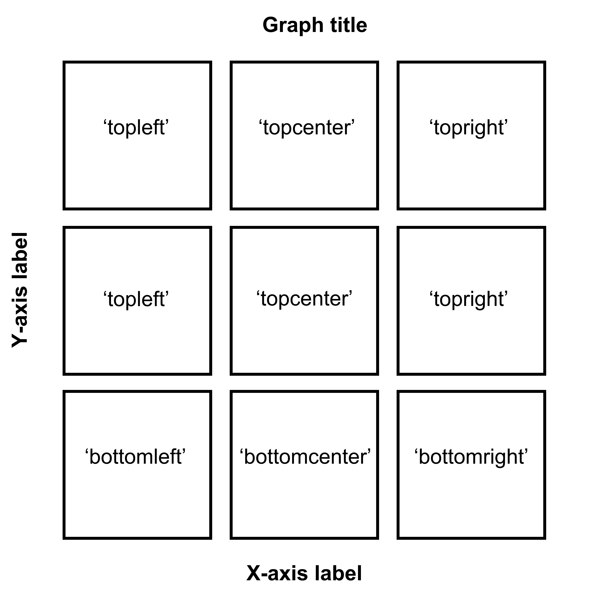

--- 
title: "Data Analysis and Visualization in R Using smplot2"
author: "Seung Hyun Min"
date: "Last Updated: `r Sys.Date()`"
site: bookdown::bookdown_site
documentclass: book
---

```{r include=FALSE,cache=FALSE,purl=FALSE}
# don't cache anything on this page
knitr::opts_chunk$set(cache = FALSE)
```

# Welcome! {-#index}

```{r, echo=FALSE, message=FALSE, warning=FALSE, fig.width = 7.4, fig.height= 18}
library(tidyverse)
library(cowplot)
library(smplot2)

# histogram
set.seed(2)
data=data.frame(value=rnorm(1000))
data2 = data.frame(value=rnorm(1000,5,1))
data$day <- 'day1'
data2$day <- 'day2'
rbind(data,data2) -> df
cbind(data,data2) -> dfc

df %>% ggplot(aes(x=value, fill=day, color = day)) +
  sm_hist(hist.params = list(binwidth = 1/4, alpha = 0.3),
          density.params = list(fill='transparent', size = 0.8),
          rug.params = list(alpha = 0.8), legends = T) +
  scale_color_manual(values = sm_color('blue', 'orange')) +
  scale_fill_manual(values = sm_color('blue', 'orange')) +
  ggtitle('Histograms + rugs + kernel estimations of two groups') +
  theme(plot.title= element_text(size = rel(0.85))) +
   theme(legend.position = c(0.84,0.82),
        legend.title = element_blank(),
        legend.text = element_text(size = 11))-> histogram2 # ratio:2

# slope chart 
set.seed(2) # generate random data
day1 = rnorm(20,0,1)
day2 = rnorm(20,5,1)

Subject <- rep(paste0('S',seq(1:20)), 2)
Data <- data.frame(Value = matrix(c(day1,day2),ncol=1))
Day <- rep(c('Day 1', 'Day 2'), each = length(day1))
df <- cbind(Subject, Data, Day)
df2 <- df

ggplot(data = df, aes(x = Day, y = Value, fill = Day)) +
  sm_slope(labels = c('Day 1','Day 2'),group = Subject,
           point.params = list(alpha = 0.3, size = 2.5, color = 'white',
                               shape = 21, fill = sm_color('skyblue')),
           line.params = list(color = sm_color('skyblue'),
                              alpha = 0.3),
           avgPoint.params = list(color='transparent', shape = 21,
                                  size = 4, fill = sm_color('blue')),
           avgLine.params = list(color = sm_color('blue'), size = 1),
           show_mean = TRUE) +
  ggtitle('Slope chart with mean') -> slope_avg

df %>% ggplot(aes(x = Day, y = Value, fill = Day)) +
  sm_slope(labels = c('Day 1', 'Day 2'), group = Subject) +
  scale_fill_manual(values=  sm_color('blue','orange')) +
  ggtitle('Slope chart with distinct colors') -> slope


#### raincloud
df2 %>% ggplot(aes(x = Day, y = Value, color = Day, fill = Day)) +
  sm_bar(point.params = list(shape=21,size=2.5,color='white')) +
  xlab('Day') +
  scale_fill_manual(values = sm_color('blue','orange')) +
  ggtitle('Bar graph') -> bar

df2 %>% ggplot(aes(x = Day, y = Value, color = Day, fill = Day)) +
  sm_raincloud() +
  xlab('Day')  +
  scale_fill_manual(values = sm_color('blue','orange')) +
  ggtitle('Raincloud plot') -> raincloud

# forest plot
df <- read_csv('https://www.smin95.com/amblyopia_random.csv')
df$SF <- as.factor(df$SF)
df %>% filter(Condition == 'One') %>%
  ggplot(aes(x = absBP, y = SF, color = Group, alpha = SF, group =Group)) +
  sm_forest(sep_level = 3) +
  scale_color_manual(values = sm_color('darkred', 'viridian')) +
  scale_alpha_manual(values = c(0.3,0.5,0.7,0.85, 1)) +
  ggtitle('Forest plot of two groups') -> forest

# raincloud two groups
df2 <- read_csv('https://www.smin95.com/amblyopia_random.csv')
df2a <- filter(df2, Condition == 'One')  
df2a <- filter(df2, SF %in% c(0.5,8))
df2a$SF <- as.factor(df2a$SF)

df2amb <-  filter(df2a, Group == 'Amblyopia')
df2norm <-  filter(df2a, Group == 'Normal')

ggplot(mapping = aes(x = SF, y = absBP, fill = Group)) +
  sm_raincloud(data = df2amb, position = position_nudge(x = +0.15),
               show.legend = FALSE,
               boxplot.params = list(color = 'white'),
               point.params = list(size = 2, shape = 21,
                                   color = 'transparent', 
                                   show.legend = TRUE,
                                   alpha = 0.3,
                                   position = sdamr::position_jitternudge(nudge.x = 0.06, seed = 10,
                                                                   jitter.width = 0.06))) +
  scale_fill_manual(values = sm_color('darkred', 'viridian')) +
  sm_raincloud(data = df2norm, which_side = 'left',
               show.legend = FALSE,
               position = position_nudge(x = -0.15),
               boxplot.params = list(color = 'white'),
               point.params = list(size = 2, shape = 21,
                                   show.legend = TRUE,
                                   color = 'transparent', alpha = 0.3,
                                   position = sdamr::position_jitternudge(nudge.x = -0.06, seed = 10,
                                                                   jitter.width = 0.06))) +
  theme(legend.position = c(0.24,0.85),
        legend.title = element_blank(),
        legend.text = element_text(size = 11)) +
  ggtitle('Raincloud plot of two groups') +
  scale_y_continuous(limits = c(0,2.5)) -> raincloud2


# boxplot with two groups


ggplot(mapping = aes(x = SF, y = absBP, fill = Group)) +
  sm_boxplot(data = df2amb, position = position_nudge(x = +0.25),
             boxplot.params = list(size=0.5, color='black',width=0.3,fill = "gray95"),
               point.params = list(size = 3, shape = 21,
                                   color = 'transparent', alpha = 0.4,
                                   position = sdamr::position_jitternudge(nudge.x = 0.25, seed = 10,
                                                                          jitter.width = 0.08))) +
  scale_fill_manual(values = sm_color('darkred', 'viridian')) +
  sm_boxplot(data = df2norm, legends = TRUE,
               position = position_nudge(x = -0.25),
             boxplot.params = list(size=0.5, color='black',width=0.3,fill = "gray95"),
               point.params = list(size = 2.5, shape = 21,
                                   color = 'transparent', alpha = 0.4,
                                   position = sdamr::position_jitternudge(nudge.x = -0.25, seed = 10,
                                                                          jitter.width = 0.08))) +
  theme(legend.position = c(0.24,0.85),
        legend.title = element_blank()) +
  ggtitle('Boxplot of two groups') +
  scale_y_continuous(limits = c(0,2.5)) -> boxplot2

# point plot (with shadow)
df <- read_csv('https://www.smin95.com/amblyopia_random.csv')
df1a <- df %>% filter(Condition == 'One') %>% filter(Group == 'Amblyopia')
df1a$SF <- as.factor(df1a$SF)

df1a %>%
  ggplot(aes(x = SF, y = absBP, color = Group, group = Group)) +
  sm_pointplot(show_shadow = T, group = Subject,
               avgPoint.params = list(size=3, fill = 'darkred', shape = 21,
                                      color = 'white'),
               avgLine.params = list(size=1.3,alpha = 0.65),
               err.params = list(size=1.3, alpha = 0.65))  +
  scale_color_manual(values = sm_color('darkred')) +
  ggtitle('Point plot with a shadow') -> shadow

top_four <- plot_grid(bar, raincloud, slope, slope_avg,
                 ncol = 2,
                 nrow = 2,# rel_widths = c(1,1,1,1,1,1),
                 rel_heights = c(1,1,1,1),
                 scale = 0.95)

top_four_hist <- plot_grid(top_four, histogram2, ncol = 1, 
                 nrow = 2, rel_widths = c(1,1), 
                 rel_heights = c(2,0.8))

bottom_four <- plot_grid(forest, shadow, raincloud2, boxplot2,
                         ncol = 2, nrow = 2,
                         rel_heights = c(1,1,1,1), scale = 0.95)

all <- plot_grid(top_four, histogram2, bottom_four, ncol =1,
                 nrow=3, rel_widths = c(1,1,1),
                 rel_heights = c(2,0.8,2)) 

#save_plot('all.png', all, ncol = 2, nrow = 5, base_asp = 1)

print(all)
```

This book (https://smin95.com/dataviz) guides the reader to be familiar with R, a programming language, for data visualization. It also introduces the R package **smplot2**, which aims to make the process of data visualization simple. This book was created entirely using RMarkdown for reproducibility. 

The old website (on **smplot**) can be accessed using this link (https://smin95.com/dataviz0).

## Major updates {-}

2022-11-26: **smplot2** has been debugged, notably `sm_violin()`, `sm_statCorr()` and `sm_corr_theme()`. Please update *smplot2* if you are a user.

```{r, eval = FALSE}
install.packages(c('tidyverse','devtools','gghalves'))

devtools::install_github('smin95/smplot2', force = TRUE)
```

Also, for those who have been a *smplot* user, if you are capable of adapting to some changes made to **smplot2**, **please delete smplot** and then use **smplot2**. More information about updates is on Chapters 11 and 12.

```{r, eval = FALSE}
remove.packages("smplot")
```

## Issues and contact {-}
If you spot any mistakes in this online book, please pull-request on [Github](https://github.com/smin95/dataviz) or email me seung.min@mail.mcgill.ca. If you find issues with the 'smplot' package, please pull-request on [Github](https://github.com/smin95/smplot).

## License {-}
**smplot2** is under the MIT license. This tutorial is licensed under a [Creative Commons Attribution 4.0 International License](https://creativecommons.org/licenses/by/4.0/). I am the sole creator of **smplot2**.

## About the author {-}
I am Assistant Professor in Dept. Ophthalmology and Optometry at Wenzhou Medical University. On June 2021, I received my PhD at McGill University under the supervision of Dr. Robert F. Hess. My research is focused on amblyopia, neural plasticity and binocular vision. During spare time, I play the clarinet and develop R packages. More details, such as my publications, are on my website: https://www.smin95.com. 

<!--chapter:end:index.Rmd-->

---
output: html_document
chapter: Opening Remarks
editor_options:
  chunk_output_type: console
---
# Opening Remarks

**smplot2** has been created to enable both novice and intermediate R users to perform elegant data visualization that is appropriate for scientific publications. Also, it provides tools that are important for performing data analysis that is common in medicine and psychology.

## How to read this book

If you are a proficient R user, I suggest that you read Chapters 11 and 12 because all the preceding sections incorporate contents about basics of R.

If you are a **smplot** user, you can either use its tutorial website (https://www.smin95.com/dataviz0) and continue to use **smplot** or modify your codes so that it works with **smplot2**. If you decide to use **smplot2**, I suggest you that you delete **smplot**. Also, I suggest that you read Chapters 11 (especially the sub-section: How `...` parameter and `xxx.params` work) and 12 to understand the changes that have been made to the new package rather than to read the book from the beginning.

```{r, eval = FALSE}
remove.packages("smplot")
```

If you are a newcomer, then you can just start reading from the next chapter.

<!--chapter:end:updates.Rmd-->

---
output: html_document
chapter: Download RStudio & Basics of R
editor_options:
  chunk_output_type: console
---
# Download RStudio & Basics of R

## Setting up RStudio

### Why use R for data visualization? {-}

- R is free.
- Often, less codes are needed in R to plot an elegant graph.
- for/while loops (basic concepts in programming) are not necessary in R to make a production-quality graph.
- R is the best software for statistical analysis.

### Other available resources for R {-}

- Stack Overflow: https://www.stackoverflow.com
- R for Data Science (a bible for learning R): https://r4ds.had.co.nz/
- R documentation: https://www.rdocumentation.org
- Learn Statistics with R: https://learningstatisticswithr.com/
- ggplot2 (a reference for plotting data in R): https://ggplot2-book.org/

### Download requirements for RStudio {-}

- Download R: http://cran.r-project.org/
- For Mac users: Mac: XQuartz https://www.xquartz.org/
- RStudio: http://www.rstudio.org/

### Open RStudio {-}

```{r pressure, echo=FALSE, fig.align = 'center',fig.cap="Rstudio layout, image from http://www.sthda.com/english/wiki/running-rstudio-and-setting-up-your-working-directory-easy-r-programming", out.width = '65%'}
knitr::include_graphics("img/rstudio.png")
```


- **Rstudio** is where people do R programming.
- You can type codes (**commands**) into the **console** (bottom-left panel).
  - `>` means that the console is ready to receive more code.
  - `+` means your code is not complete.
- You can also write (longer) codes in the **script** within the code editor (top-left panel). 
  - The code editor will run the script into the console.
  - A **new script** can be opened by clicking: **File -> New -> R Script**.
- You can run a script by clicking **'Run"** with the green arrow or by typing **ctrl + enter**. It is labeled with the red circle.
  - Or you can just type your codes directly into the console.

### Let's make a folder and set it as working directory {-}

```{r, echo=FALSE, fig.align = 'center',fig.cap="Setting your working directory, image from https://www.ucl.ac.uk/~uctqiax/PUBLG100/2015/faq/setwd.html", out.width = '80%'}

```

- Create a folder named **LearnR** in Desktop.
- Set the folder as your working directory by clicking: **Session -> Set Working Directory -> Choose Directory**. Then find your **LearnR** folder.
- More information about setting up a directory is here:
http://www.sthda.com/english/wiki/running-rstudio-and-setting-up-your-working-directory-easy-r-programming
- You will need set the directory **every time** you start RStudio.


### How to run your code

- You can run code in 2 ways.

- First, you can type it in the script and run it after highlighting the codes you would like to run. 

```{r, echo=FALSE, fig.align = 'center',fig.cap="How to run your code - script", out.width = '100%'}
knitr::include_graphics("img/run_code.png")
```

- Second, you can type your code directly in the console. 

```{r, echo=FALSE, fig.align = 'center',fig.cap="How to run your code - console", out.width = '100%'}
knitr::include_graphics("img/run_code_console.png")
```


## Basics of R 

### Let's type some codes {-}

- Capitalization, punctuations and brackets are all important.
-  `' ' ` and `" "` mean the same. 
  - However, `' "` are not paired. So they will not work.
- `=` and `<-` mean equivalent.
  - I often use `<-`.
- Type `?` when you are not sure about the code (ex. `?t.test`)
- A code becomes comment when it is preceded by `#`.
  - Try typing `# g = 3` and see if the number gets stored in g by typing **g** in the console.

```{r}
x = 3 # x equals to 3
a <- 4 # a equals to 4 
d <- 'Group' # gr is equal to a character 'Group', which is not a number.
e <- "Group"
d == e # 'Group' and "Group" are equal
# g = 3 # its a comment
```


- Notice that I used `==` to test if **d** and **e** are equal. Therefore, `==` and `=` mean different. `==` **tests** if two things are equal. `=` **sets** two things to be equal.
  - `d == e` returns `TRUE` because they are both `'Group'`. `TRUE` is equivalent to 1 numerically.

- Now let's check if **x** and **a** are equal.

```{r}
x == a
```

- It returns `FALSE` because **x** and **a** are not equal. This is correct because 3 and 4 are not equal. `FALSE` equals to 0 numerically.

- Below are more examples showing that `TRUE` = 1 and `FALSE` = 0.

```{r}
TRUE + FALSE # 1 + 0
TRUE + TRUE # 1 + 1
FALSE + FALSE # 0 + 0
TRUE*2 # 1 * 2
TRUE*FALSE # 1 * 0
```


### How can I learn most effectively with the notes? {-}

- Don't just read it. 
- Don't just copy and paste the codes and run them in RStudio (ctrl + c & ctrl + p). **Make sure you type each code.**
- You can also change your code and see if it still works.
- If you are not sure of your code, you can type `?` before the function.
- If you are still not sure after reading the notes, check out Chapter 3 of **R for Data Science**: https://r4ds.had.co.nz/

### More installation {-}
- R is an old programming language. 
- So, people, such as statisticians and programmers, have created more functions in R in the form of the package to update the language. They are free but they have to be downloaded separately.
  - A **package** can contain several **functions**.
  - In this tutorial, you will mainly be using **ggplot2** package, which is elegant and flexible for visualizing data.
  - Also, you will be using **smplot2** package. It improves ggplot2 graphs visually.
- So, you will need to install some packages, such as ggplot2 and smplot2. Please type the codes below.

```{r, eval = FALSE}
install.packages('devtools')
devtools::install_github('smin95/smplot2', force = TRUE) # requires VPN if you are in China
```

- You only need to install them once, but you will need to reload them whenever you start a new session in RStudio using the function `library()`.

```{r, eval = F}
install.packages('tidyverse') # only need to install once
install.packages('cowplot')
```

```{r}
# packages must be loaded every time by using library() when you run your script

library(tidyverse) # it has ggplot2 package
library(cowplot) # it allows you to save figures in .png file
library(smplot2)
```

- Now let's make some graphs in the subsequent chapters. 

<!--chapter:end:basics.Rmd-->

---
output: html_document
chapter: Basics of ggplot2 and Correlation Plot
editor_options:
  chunk_output_type: console
---

# (PART) Data Visualization with smplot2 {-}

# Basics of ggplot2 and Correlation Plot

Load these packages by typing the codes below.

```{r}
library(tidyverse) # it has ggplot2 package
library(cowplot) # it allows you to save figures in .png file
library(smplot2)
```

## Uploading data 

### Sample data: mpg 

I will be using an example from the book *R for Data Science* (https://r4ds.had.co.nz/data-visualisation.html).

- **Question: Do cars with large engines use up more fuel than the those with small ones?**

First, let's open **mpg**, which is a **data frame** stored in the **ggplot2** package.

- **mpg** contains data about cars in the US. You can type `?mpg` for more information.

  - **displ**: the size of the car's engine in liters
  - **hwy**: fuel efficiency. If it's high, then the car uses less fuel per distance.
  
```{r}
mpg
```

Notice that some columns and rows are not shown. You can type `View(mpg)` to see the entire **data frame**.

- Each row is an unique observation.
- Each column is an unique variable/condition. 

```{r, eval = FALSE}
View(mpg)
```

## Basics of ggplot2

### Let's make some graphs 

Question: Do cars with large engines use up more fuel than the those with small ones?

To answer our question, we need to plot **mpg** data. The x-axis should be **displ**, the y-axis should be **hwy**. 

```{r, fig.width = 3.5, fig.height=3.5}
ggplot(data = mpg) + 
  geom_point(mapping = aes(x = displ, y = hwy))
```

We find that a smaller car has a higher efficiency and that a larger car has a lower efficiency. In other words, we see a negative relationship. 

### How ggplot works 

When you are making a graph with **ggplot2**, always begin by typing the function `ggplot()`. 

- The **data** you want to plot is the **first argument** here. Ex. `ggplot(data = mpg)`. 

However, `ggplot(data = mpg)` alone does not create a graph. You will need **add** (by typing **+**) more layers, such as `geom_point()`.

- `geom_point()` adds points to your graphs. You will need to specify (or map) x- and y-axes in the `aes()` function, which means aesthetics. This process is called **mapping**.

- As you might expect, there are other **geom** functions, such as `geom_bar()`, `geom_boxplot()`, `geom_errorbar()`. They plot bar graphs, boxplots and error bars, respectively. 

Here is the **template** for using **ggplot2** (copied from *R for Data Science*).

```{r, eval = FALSE}
ggplot(data = <DATA>) + 
  <GEOM_FUNCTION>(mapping = aes(<MAPPINGS>))
```
  
  
### Different color of points for each unique group 

You can apply different colors by the **class** of each car (each car = each row of the **mpg** data frame).

  - Include `class` variable in the `aes()` function.
  
  - This maps the third variable `class` into your graph.
  
  - `aes()` means aesthetic (ex. color, shape, etc).

```{r, fig.width = 5, fig.height=3.5}
ggplot(data = mpg) + 
  geom_point(mapping = aes(x = displ, y = hwy, color = class))
```

You can also set different shapes for each group of the data.

```{r, fig.width =5, fig.height = 3.5, warning = F}
ggplot(data = mpg) + 
  geom_point(mapping = aes(x = displ, y = hwy, shape = class))
```

You could also set it using aesthetic parameter such as size or transparency (not recommended) across groups. However these are not recommended as it is very hard for us to see the differences in both size and alpha as these are **continuous** parameters. But you get the idea. Using `aes()` in a geom function (ex. `geom_point()`), you can label different group of points.

```{r, fig.width =5, fig.height = 3.5, warning = F}
# different levels of transparency (alpha) for each group
ggplot(data = mpg) +
  geom_point(mapping = aes(x = displ, y = hwy, alpha = class))
```

```{r, fig.width =5, fig.height = 3.5, warning = F}
# different sizes of the points for each group
ggplot(data = mpg) + 
  geom_point(mapping = aes(x = displ, y = hwy, size = class))
```

### Different color & shape for each group 

You can also apply different color & shape for each group of the data.

**Exercise**: Try it on your own before you look at the code below.
  
```{r, fig.width = 5, fig.height=3.5, warning = F}
ggplot(data = mpg) + 
  geom_point(mapping = aes(x = displ, y = hwy, color = class,
                           shape = class))
```

### Same shape across all groups 

So far, you have put variables such as `shape` and `color` inside the function `aes()`. This can enable you to apply different shape and color for each group.

If you put the variable for `shape`, `color`, `size` outside of `aes()` in the geom function, then all data points will have the specified `shape`, `color`, etc even if they are in different groups.

```{r, fig.width = 5, fig.height=3.5, warning = F}
ggplot(data = mpg) + 
  geom_point(mapping = aes(x = displ, y = hwy,
                           color = class), shape = 17)
```

Notice that the `color` is different for each group because it is inside the function `aes()`. However, all the points are triangle because we have typed `shape = 17` outside the function `aes()`.

**Exercise:** try changing the shape of the points to the circle with the border.

```{r, echo=FALSE, fig.align = 'center', fig.cap="image from http://www.sthda.com/english/wiki/ggplot2-point-shapes", out.width = '25%'}
knitr::include_graphics("img/shape.jpg")
```


- `shape = 19`: the shape is circle without the border.

- `shape = 20`: the shape is small circle without the border.

- `shape = 21`, the shape is  circle with the border.

- So let's set `shape` to 21.

```{r, fig.width = 5, fig.height=3.5}
ggplot(data = mpg) + 
  geom_point(mapping = aes(x = displ, y = hwy, color = class), shape = 21)
```

- Notice that the border color is different for each group, but not the color that fills the circle.
- Shapes without their borders (15-20) are filled with `color`.
- Shapes with the border (21-24) are filled with `fill` and its border colored with `color`.
- So let's change `color = Class` to `fill = Class`. 

```{r, fig.width = 5, fig.height=3.5}
ggplot(data = mpg) + 
  geom_point(mapping = aes(x = displ, y = hwy, fill = class), shape = 21)
```


### How do we draw the best-fit line of the graph? 

Here is our graph. 

```{r, fig.width = 3.5, fig.height=3.5}
ggplot(data = mpg) + 
  geom_point(mapping = aes(x = displ, y = hwy))
```

There seems to be a negative relationship. How do we draw the best-fit line of the graph's negative relationship? Use another geom function `geom_smooth()`.

```{r, fig.width = 3.5, fig.height=3.5}
ggplot(data = mpg) + 
  geom_smooth(mapping = aes(x = displ, y = hwy))
```

### geom_point() + geom_smooth() 

```{r, fig.width = 3.5, fig.height=3.5}
```

Now let's combine geom_point() + geom_smooth() into one graph.

```{r, fig.width = 3.5, fig.height=3.5}
ggplot(data = mpg) + 
  geom_point(mapping = aes(x = displ, y = hwy)) +
  geom_smooth(mapping = aes(x = displ, y = hwy))
```

`ggplot()` acts as a system where you can add multiple `geom` objects, such as `geom_point()` and `geom_smooth()`. You can add multiple layers of geom in a single plot, like shown here.

`ggplot()` and **at least one geom** function are necessary to draw a graph. `ggplot()` alone does not draw a graph. Try it on your own.

```{r, fig.width = 3.5, fig.height=3.5}
ggplot(data = mpg)
```

### Writing shorter codes 

```{r, eval = FALSE, fig.width = 3.5, fig.height=3.5}
ggplot(data = mpg) + 
  geom_point(mapping = aes(x = displ, y = hwy)) +
  geom_smooth(mapping = aes(x = displ, y = hwy))
```

Notice that we have typed `mapping = aes(x = displ, y = hwy)` twice.  This is **repetitive**. If you type the `mapping` argument in `ggplot()`, you won't need to type them anymore in the subsequent `geom` functions.

```{r, fig.width = 3.5, fig.height=3.5, warning = F}
ggplot(data = mpg, mapping = aes(x = displ, y = hwy)) + 
  geom_point() +
  geom_smooth()
```

This is exactly the same as the previous graph. In both cases, the mapping has been set so that the x-axis is `displ` and the y-axis is `hwy` in both `geom_point()` and `geom_smooth()`.

Now let's apply different color of points and the fit the line for each group.

```{r, fig.width = 5, fig.height=3.5, warning = F}
ggplot(data = mpg, mapping = aes(x = displ, y = hwy, color = class)) + 
  geom_point() +
  geom_smooth()
```

Okay, this is extremely messy and probably a bad idea.

- You might have gotten `warnings` but you can usually ignore them.

Let's plot the best-fit line across all groups (i.e., one best-fit line) but apply different color for each class (i.e., many colors). To do so, type `color = class` in geom_point, not `ggplot()`. This enables you to specify that you will apply different color for each class **only** in `geom_point()` but not in `geom_smooth()`.

```{r, fig.width = 5, fig.height=3.5, warning = F}
ggplot(data = mpg, mapping = aes(x = displ, y = hwy)) + 
  geom_point(aes(color = class)) +
  geom_smooth()
```

## Improve data visualization using smplot2

Although the default theme of ggplot2 graphs is clean, there are some things that I do not like:

- The fonts are too small.

- The grey background is distracting.

- There are too many grids.

```{r, fig.width = 5, fig.height=3.5, warning = F}
ggplot(data = mpg, mapping = aes(x = displ, y = hwy, color = class)) + 
  geom_point() 
```

Let's make this graph prettier by using functions from **smplot2**.
- In this example, let's use `sm_corr_theme()`. I've made this function as a theme suitable for correlation plots.
  - Disclaimer: **smplot2** package has been built based on my preference.
  - **smplot2** is not necessary to make a **ggplot** graph or change its style. 

It is possible to change every aspect of the graph with **ggplot2** but this requires about 8-20 lines of codes (based on my experience). Instead, **smplot2** function does so in a few lines of code.

```{r, fig.width = 5, fig.height=3.5, warning = F}
ggplot(data = mpg, mapping = aes(x = displ, y = hwy, color = class)) + 
  geom_point() + 
  sm_corr_theme()
```

Now let's remove the border within `sm_corr_theme()` by setting `borders = FALSE`.

```{r, fig.width = 5, fig.height=3.5, warning = F}
ggplot(data = mpg, mapping = aes(x = displ, y = hwy, color = class)) + 
  geom_point() + 
  sm_corr_theme(borders = FALSE)
```

**Exercise:** You can also set `borders = TRUE` and see what happens. 

```{r, eval = F}
ggplot(data = mpg, mapping = aes(x = displ, y = hwy, color = class)) + 
  geom_point() + 
  sm_corr_theme(borders = TRUE)
```

You might notice that borders come back. This is exactly what happens when you do not include `borders` argument in `sm_corr_theme()`. This is because `sm_corr_theme()` is set to `borders = TRUE` as default. 

- I think the one with the border looks better. 
- You can also remove the legend by setting `legends = FALSE` in `sm_corr_theme()`. 

```{r, fig.width = 3.5, fig.height=3.5, warning = F}
ggplot(data = mpg, mapping = aes(x = displ, y = hwy, color = class)) + 
  geom_point() + 
  sm_corr_theme(legends = FALSE)
```

**Exercise** Set `legends = TRUE` and see what happens. Type `?sm_corr_theme` to see why legends appear without directly writing `legends = TRUE`. 

```{r, eval = F}
ggplot(data = mpg, mapping = aes(x = displ, y = hwy, color = class)) + 
  geom_point() + 
  sm_corr_theme(legends = TRUE)
```

However, in this case, I think we need a legend because there are many **classes**.

### Positive relationship between x- and y-axes 

Let's plot another scatterplot using **mtcars** data. 

- Set the x-axis with **drat** and y-axis with **mpg**.
- Since you are making a scatterplot, you will need to use `geom_point()`.
- Set the **size** of all points to **3** by typing `size = 3`. 
- Set the **shape** of all points to the circle with a border by typing `shape = 21`.
- Set the **filled color** of all points to **green** by typing `fill = '#0f993d'`.
- Set the **border color** to **white** by typing `color = 'white'`. 
  - Since `shape = 21` refers to the circle with a border, `fill` is the color that fills the points and `color` is the border color.

```{r,fig.width = 3.5, fig.height=3.5}
ggplot(data = mtcars, mapping = aes(x = drat, y = mpg)) +
  geom_point(shape = 21, fill = '#0f993d', color = 'white',
             size = 3) 
```

**drat** and **mpg** have a positive relationship. Now let's make it pretty by adding `sm_corr_theme()`. 

```{r,fig.width = 3.5,fig.height=3.5}
ggplot(data = mtcars, mapping = aes(x = drat, y = mpg)) +
  geom_point(shape = 21, fill = '#0f993d', color = 'white', size = 3) + 
  sm_corr_theme()
```

You can remove borders too by setting `borders = FALSE` in `sm_corr_theme()`.

```{r,fig.width = 3.5,fig.height=3.5}
ggplot(data = mtcars, mapping = aes(x = drat, y = mpg)) +
  geom_point(shape = 21, fill = '#0f993d', color = 'white', size = 3) + 
  sm_corr_theme(borders = FALSE)
```


### Reporting statistics from a paired correlation 

**smplot2** also offers a function that plots the best-fit line of a scatterplot (i.e., correlation plot) and prints statistical values, such as p- and R-values.

- p-value is used to check for statistical significance. If it's less than 0.05, its regarded as **statistically significant**. However, it gets smaller with a larger sample size.
- R-value (correlation coefficient) measures the strength and the direction of the correlation. It ranges from -1 to 1. It does not depend on the sample size. 
- Let's add a function `sm_statCorr()`. The statistical results are from Pearson's correlation test.

`sm_statCorr()` is combined with `sm_corr_theme()` (updated in smplot2). Therefore, when you print the statstical values using `sm_statCorr()`, the correlation theme is automatically used.

```{r,fig.width = 3.5, fig.height=3.5, warning = F}
ggplot(data = mtcars, mapping = aes(x = drat, y = mpg)) +
  geom_point(shape = 21, fill = '#0f993d', color = 'white', size = 3) +
  sm_statCorr()
```

I don't really like how the line color is different from that of the points. 

Let's change the color to green.

- You can also change the `linetype` by setting it as `linetype = 'dashed'` or `linetype = 'solid'`, which is the default as shown here.
- Also let's get results from Spearman's correlation test rather than from Pearson's. 
- To do so, type `corr_method = 'spearman'` in the function `sm_statCorr()`. You will get a different **R** value from 0.68, which is from Pearson's correlation test.

```{r,fig.width = 3.5, fig.height=3.5, warning = F}
ggplot(data = mtcars, mapping = aes(x = drat, y = mpg)) +
  geom_point(shape = 21, fill = '#0f993d', color = 'white', size = 3) + 
  sm_statCorr(color = '#0f993d', corr_method = 'spearman',
              linetype = 'dashed')
```

- **Exercise**: Set `corr_method = 'pearson'`and see what happens.


```{r, eval = F}
ggplot(data = mtcars, aes(x = drat, y = mpg)) +
  geom_point(shape = 21, fill = '#0f993d', color = 'white', size = 3) +
  sm_statCorr(color = '#0f993d', corr_method = 'pearson')
```

You will see that this is exactly the same as when `corr_method` argument is not included in `sm_statCorr()`. In short, the **default** correlation method for `sm_statCorr()` is `'pearson'`. So, if you don't write anything for `corr_method`, it will give results from Pearson's correlation test. Type `?sm_statCorr` to see the default of `line_type`.

- `#0f993d` is a specific green that I like. 
- Now, let's change the color. Replace `'#0f993d'` with `'green'` in `geom_point()` and `sm_statCorr`.
  - This `'green'` is the default green color of **R**.

```{r,fig.width = 3.5, fig.height=3.5, warning = F}
ggplot(data = mtcars, mapping = aes(x = drat, y = mpg)) +
  geom_point(shape = 21, fill = 'green', color = 'white', size = 3) +
  sm_statCorr(color = 'green')
```

To precisely change the parameter for the fitted line, you can do it as shown below by filling the `fit.params` argument in the form of `list`, such as `fit.params = list(color = ..., linetype = ...)`. 

- `fit.params` feeds arguments for aesthetics into `geom_smooth()` such as `color` so that the fitted regression line can have specified aesthetics.

In fact, this is the major update of **smplot2** across most visualizing functions from **smplot**. As you will notice later, this offers more aesthetic flexibility for users.


```{r,fig.width = 3.5, fig.height=3.5, warning = F}
ggplot(data = mtcars, mapping = aes(x = drat, y = mpg)) +
  geom_point(shape = 21, fill = '#0f993d', color = 'white', size = 3) + 
  sm_statCorr(corr_method = 'spearman',
              fit.params = list(color = '#0f993d', 
                                linetype = 'dashed'))
```

You can also remove the `borders` of the plot using `sm_statCorr`.

```{r,fig.width = 3.5, fig.height=3.5, warning = F}
ggplot(data = mtcars, mapping = aes(x = drat, y = mpg)) +
  geom_point(shape = 21, fill = '#0f993d', color = 'white', size = 3) + 
  sm_statCorr(corr_method = 'spearman',
              fit.params = list(color = '#0f993d', 
                                linetype = 'dashed'),
              borders = FALSE)
```

Which one do you prefer? With or without the border?

### Changing the text 

If you do not like the fact that the correlation stats are displayed as `R = 0.65, p < 0.001` and that you rather show it as `R = 0.65` and `p < 0.001` in separate lines, you can do it too.

In `R`, `\n` means addition of a new line. So you can set the argument `separate_by = '\n'`, which essentially means `R = 0.65\n p < 0.001`, which will create two lines.

You would test this directly by typing in R console.

```{r}
cat('R = 0.65\np < 0.001')
```

```{r,fig.width = 3.5, fig.height=3.5, warning = F}
ggplot(data = mtcars, mapping = aes(x = drat, y = mpg)) +
  geom_point(shape = 21, fill = '#0f993d', color = 'white', size = 3) + 
  sm_statCorr(corr_method = 'spearman',
              fit.params = list(color = '#0f993d', 
                                linetype = 'dashed'), 
              separate_by = '\n')
```

Another way is just do directly compute it yourself using `cor()` or `cor.test()`, and annotate the statistical results on the plot. This might be a better alternative if you wish to precisely modify how the text is presented. 

```{r, warning = F}
cor.test(mtcars$drat, mtcars$mpg, method = 'spearman')
```

Store the results from `cor.test()` into a variable called `res`, which is short for **results**.

```{r, warning = F}
res <- cor.test(mtcars$drat, mtcars$mpg, method = 'spearman')
res$p.value 
```

You can extract certain component of the results from `cor.test()` from the variable `res` by using `$`. `res$p.value` extracts the p-value, and `res$estimate` extracts the correlation coefficient `R`.

```{r}
res$estimate
```

We will round the values to 2 decimal points using `round(..., 2)`, where 2 denotes the number of decimal places. `paste0()` is used to construct strings from various vectors, such as the numerical values extracted from `res`. 

```{r,fig.width = 3.5, fig.height=3.5, warning = F}
ggplot(data = mtcars, mapping = aes(x = drat, y = mpg)) +
  geom_point(shape = 21, fill = '#0f993d', color = 'white', size = 3) + 
  annotate('text', x = 3, y = 32, label = paste0('R =', 
                                                 round(res$estimate,2),
                                                 '\n   p < 0.001')) +
  sm_statCorr(show_text = FALSE,
              fit.params = list(color = '#0f993d', 
                                linetype = 'dashed'))
  
```

### Plotting the average with standard errors 

**smplot2** also offers `sm_corr_avgErr()`, which is a function that enables the users to plot the mean with errors, such as standard error (`errorbar_type = 'se'` as default), standard deviation (`errorbar_type = 'sd'`) or 95% confidence interval (`errorbar_type = 'ci'`).

```{r,fig.width = 3.5, fig.height=3.5, warning = F}
ggplot(data = mtcars, mapping = aes(x = drat, y = mpg)) +
  geom_point(shape = 21, fill = '#0f993d', color = 'white', size = 3) + 
  sm_corr_avgErr(data = mtcars, x = drat, y = mpg)
```

The black point in the middle represents the mean with vertical and horizontal standard errors.

The `data` argument of `sm_corr_avgErr` requires the variable that stores the data frame that is used to plot the data, which is `mtcars`. `x` argument is the variable that is plotted along the x-axis. `y` argument is the variable that is plotted along the y-axis. Actually these arguments are nearly identical to what you have provided `ggplot(data = ..., aes(x = ..., y = ...)`.

You can control the aesthetics with a high flexibility using `point.params`, `errh.params` and `errv.params`.

- `point.params` feeds the arguments to `geom_point()`, such as `color`, `alpha`, etc, to plot the average point.

- `errv.params` feeds the arguments to `geom_errorbar()`, such as `color`, `size` and `width` etc, to plot the vertical (y-axis) error bar.

- `errh.params` feeds the arguments to `geom_errorbarh()`, such as `color`, `size` and `height` etc, to plot the horizontal (x-axis) error bar.

If you write `xxx.params = list()`, even with empty ones, you will remove the defaults of `sm_corr_avgErr()`, which has default of `width = 0` (for `errv.params`) / `height = 0` (for `errh.params`). `width` and `height` are equivalent. 

```{r,fig.width = 3.5, fig.height=3.5, warning = F}
ggplot(data = mtcars, mapping = aes(x = drat, y = mpg)) +
  geom_point(shape = 21, fill = '#0f993d', color = 'white', size = 3) + 
  sm_corr_avgErr(data = mtcars, x = drat, y = mpg,
                 errh.params = list(),
                 errv.params = list()) +
  sm_corr_theme()
```

After removing the defaults, we see that `width` of `errv.params` and `height` of `errh.params` are no longer 0. We can control both `width` and `height` separately.

```{r,fig.width = 3.5, fig.height=3.5, warning = F}
ggplot(data = mtcars, mapping = aes(x = drat, y = mpg)) +
  geom_point(shape = 21, fill = '#0f993d', color = 'white', size = 3) + 
  sm_corr_avgErr(data = mtcars, x = drat, y = mpg,
                 errh.params = list(height = 1),
                 errv.params = list(width = 0.12)) +
  sm_corr_theme()
```

In this case, `height` is much longer because the scale of y-axis is much longer than that of x-axis. We can also set unique colors to horizontal and vertical error bars.

```{r,fig.width = 3.5, fig.height=3.5, warning = F}
ggplot(data = mtcars, mapping = aes(x = drat, y = mpg)) +
  geom_point(shape = 21, fill = '#0f993d', color = 'white', size = 3) + 
  sm_corr_avgErr(data = mtcars, x = drat, y = mpg,
                 errh.params = list(height = 1, color = "#1262b3"),
                 errv.params = list(width = 0.12, color = "#cc3d3d")) +
  sm_corr_theme()
```

The error bar might appear too thin and the average point too small. We can control the `size` to make it more noticeable in the plot.

```{r,fig.width = 3.5, fig.height=3.5, warning = F}
ggplot(data = mtcars, mapping = aes(x = drat, y = mpg)) +
  geom_point(shape = 21, fill = '#0f993d', color = 'white', size = 3) + 
  sm_corr_avgErr(data = mtcars, x = drat, y = mpg,
                 point.params = list(size = 4),
                 errh.params = list(height = 1, color = "#1262b3",
                                    size = 0.8),
                 errv.params = list(width = 0.12, color = "#cc3d3d",
                                    size = 0.8)) +
  sm_corr_theme()
```

We can control the transparency of the individual points and fine tune the aesthetics of the average point to make it more noticeable in the sea of individual points.

```{r,fig.width = 3.5, fig.height=3.5, warning = F}
ggplot(data = mtcars, mapping = aes(x = drat, y = mpg)) +
  geom_point(shape = 21, fill = '#0f993d', color = 'white', size = 3,
             alpha = 0.6) + 
  sm_corr_avgErr(data = mtcars, x = drat, y = mpg,
                 point.params = list(size = 4, shape = 21, color = 'white',
                                     fill = 'black'),
                 errh.params = list(height = 1, color = "#1262b3",
                                    size = 0.8),
                 errv.params = list(width = 0.12, color = "#cc3d3d",
                                    size = 0.8)) +
  sm_corr_theme()
```

Notice that the transparency of the individual point allows us see that there are some points with some serious overlap. 

### `fill = '#0f993d'` vs `fill = 'green'` 

I personally like `#0f993d` more. However, **R** does not recognize this color as `green`. So how are you supposed to remember the color code?

You do not have to. You can type `sm_color('green')` instead. This is a function from the **smplot** package.

`sm_color()` accepts the name of the color. If you want to get the hex codes (color codes) for red and green, type `sm_color('red','green')`.

```{r, eval = F}
sm_color('red','green')
```

Again, `sm_color()` has been built based on my preference. So it returns the hex codes of colors that I use most often. 

There are many more color themes that are available in R. For more information, please check out Chapter 28 of *R for Data Science* (https://r4ds.had.co.nz/graphics-for-communication.html).


```{r,fig.width = 3.5, fig.height=3.5, warning = F, message = F}
ggplot(data = mtcars, mapping = aes(x = drat, y = mpg)) +
  geom_point(shape = 21, fill = sm_color('green'), color = 'white',size = 3) + 
  sm_corr_theme() + 
  sm_statCorr(color = sm_color('green'))
```

**Exercise** Change the color of the points and the best-fit line to `blue` using `sm_color()`. If you want to see all the color options for `sm_color()`, type `?sm_color`. There are 16 colors total.

```{r, eval = F}
ggplot(data = mtcars, mapping = aes(x = drat, y = mpg)) +
  geom_point(shape = 21, fill = sm_color('blue'), color = 'white',size = 3) + 
  sm_corr_theme() + 
  sm_statCorr(color = sm_color('blue'))
```

### Different color for each group but with other colors 

Let's go back to the **mpg** data. Set the x-axis with **displ** and y-axis with **hwy**. Then make a scatterplot using `geom_point()`.
  - Set the size of the points to 2 across all groups. So type `size = 2` outside of `aes()` in `geom_point()`.

Let's apply different color for each `class` of the cars by writing `color = class` in `aes()` from `ggplot()`.

  - `fill = class` is needed when the shape of the point is set to 21-25.

```{r, fig.width = 5, fig.height = 3.5, warning = F}
ggplot(data = mpg, mapping = aes(x = displ, y = hwy, color = class)) + 
  geom_point(size = 2)
```

To use other colors, we could use a function from **ggplot2** called `scale_color_manual()`.

  - `scale_fill_manual()` is used when the shape of the point has borders (shape = 21-25).

To find how many colors we need total, we need to find how many groups exist.

```{r}
unique_classes <- unique(mpg$class)
```

In R, you can extract data from one column by using `$`. You can try it with different variables too. `unique()` returns unique values in the selected data.
Then compute the number of unique values using `length()` function.

```{r}
number_of_classes <- length(unique_classes)
number_of_classes
```

`sm_palette` accepts the number of colors as input. It returns colors that I use most often. Now that we know we need 7 colors total, we can type `sm_palette(7)` or `sm_palette(number_of_classes)` for `values` in `scale_color_manual()`.
  
  
```{r, fig.width = 5, fig.height = 3.5, warning = F}
ggplot(data = mpg, mapping = aes(x = displ, y = hwy, color = class)) + 
  geom_point(size = 2) + 
  scale_color_manual(values = sm_palette(number_of_classes)) + 
  sm_corr_theme()
```

Let's store this graph using a **variable** called `figure1`. 

```{r, eval = T}
figure1 <- ggplot(data = mpg, mapping = aes(x = displ, y = hwy, color = class)) + 
  geom_point() + 
  scale_color_manual(values = sm_palette(number_of_classes)) + 
  sm_corr_theme()
```

**Notice that when you store a figure into a variable, the figure is not displayed** when you run the code that makes the figure, ex.  `figure1 <- ggplot(data = mpg, mapping = ...`. To display the figure, please type the variable name in the console.

```{r, fig.width = 5, fig.height = 3.5, warning = F}
figure1 # it will appear again by calling this variable 
```


### Let's save the plot as an image in your folder **LearnR** by using the variable **figure1**. 
 
To save the figure as an image, we will use the function `save_plot()` from the **cowplot** package. 

- There is one important argument: `base_asp`. 

  - This is the ratio of your image (width/height). I usually set it to 1.4. So let's type `base_asp = 1.4` in `save_plot()`.
  - If `base_asp` is larger than 1, it gets wider than its height. This is recommended when you have a legend.
  - If there is no legend, then `base_asp = 1` is recommended.
  
 ```{r, eval = F}
 save_plot('figure1.png', figure1, base_asp = 1.4)
 ```
 
**Exercise**: try to save it again with a name **figure1b.png** by typing:

```{r, eval = F}
save_plot('figure1b.png', figure1)
```

How's the picture? Why does it look different? Type `?save_plot` to see what the default `base_asp` is.

Done! The graph (in png file) should be in your **LearnR** folder. 

**Exercise:**  Try to open Microsoft Word or PowerPoint and upload **figure1**. The figure should look the same as it appears in the slides.

**Exercise:** Remove the legend and save the scatterplot with `base_asp = 1`. 

Congratulations! You can now make **correlation plots** with R.

## Summary 

- You have learned the basics of **ggplot**. 
  - You begin by writing a `ggplot()` function.
  - If aesthetics (color, shape, etc) are specified outside of `aes()` function, then there is no group difference.
  - If aesthetics are specified in `aes()`, different groups of data will have different looks.
  - You have learned to add geom layers such as `geom_point()`, which shows points, and `geom_smooth()`, which plots the best-fit function.
  - You have learned to plot `geom_point()` and `geom_smooth()` in the same graph.

- **smplot2** functions can be used to improve **ggplot2** visually.
  - For correlation plots, add `sm_corr_theme()`.
  - You can report statistical results and plot linear regression from correlation by `sm_statCorr()`, which also provides `sm_corr_theme()`. So there is no need to write `sm_corr_theme()` when using `sm_statCorr()`.
  - You can also select colors using `sm_color()`.
  
- Save the graph as an image file in your working directory.
  - Working directory has to be set in RStudio (**Session -> Set Working Directory -> Choose Directory**)
  - Then use `save_plot()` from **cowplot** to save the image in your directory (folder **LearnR**).

<!--chapter:end:corr.Rmd-->

---
output: html_document
chapter: Boxplot and Violin Plot
editor_options:
  chunk_output_type: console
---

# Boxplot and Violin Plot

Load these packages by typing the codes below.

```{r, warning = FALSE, message = FALSE}
library(tidyverse) # it has ggplot2 package
library(cowplot) # it allows you to save figures in .png file
library(smplot2)
```

## Upload sample data (csv file) in RStudio

### Download requirements 

Download **data.csv** from
https://www.smin95.com/data.csv

Put the file **data.csv** in your **LearnR** folder, where you will create a new script using RStudio.

### Before we get started 

First, within RStudio, set **LearnR** folder as your working directory by clicking: **Session -> Set Working Directory -> Choose Directory**. 

Then, load these three packages with the `library()` function: **ggplot2**, **cowplot** and **smplot2**.

The **tidyverse** package includes the **ggplot2** package. For this reason, instead of loading **ggplot2**, you can load **tidyverse** instead. **tidyverse** has other packages beside **ggplot2**, such as **dplyr**, which is also necessary to handle and manage data.

Remember from the last chapter that:

- Functions from the **ggplot2** package include `ggplot()` and other **geom** functions such as `geom_point()`, `geom_smooth()`, etc.

- Functions from the **smplot2** package improve the **ggplot2** graphs visually. However, they are not required to make a graph using **ggplot2**.

- The **cowplot** package has a function called `save_plot`, which is very useful for saving a graph as an image.
  
### data.csv 

To start off, let's load **data.csv** in R from your **LearnR** folder. Then store the loaded data into a variable called `df`. 

We will use a function from the **tidyverse** package called **read_csv()**.
  - For more information, type `?read_csv()`.

```{r}
df <- read_csv('data.csv')
```

If you get an **error** such as `object 'data.csv' not found`, make sure you set your working directory in the **LearnR** folder. Also make sure you have downloaded your data and saved it in the **LearnR** folder.

You can view the entire data frame by typing `View(df)`.

```{r, eval = F}
View(df)
```


There are **three columns** in **df**.

- The first column (**Subject**) is the subject number. S1 means the first subject, and S2 second.

- The second column (**Value**) is the data. It contains numbers.

- The third column (**Day**) is the day of testing. There are three days of measurement: **One**, **Two** and **Three**.


**What is the data about?**

- 30 patients were tested across three days to see if there was an improvement in their visual function (**Value**). The higher value, the better the vision.

- Day **One**: first day of the study. This is the baseline value. After this measurement, patients received treatment (ex. drug, surgery, etc).

- Day **Two**: second day of the study. This is the one day after receiving the treatment.

- Day **Three**: third day of the study. This is two days after receiving the treatment.

As some of you may have noticed, the data are all made from statistical simulations (i.e., fake data).

### `read_csv('data.csv')` 

Let's use the variable **df** to store the output from **data.csv**. 

**df** is shortened from **data frame**, which refers to a structure of the data that is commonly used for data analysis.

In fact, 'data.csv' has the structure of a typical **data frame**.

- Each **column** is a **variable**.

- Each **row** represents an **observation** 

In future, I suggest you save data that has a similar structure to that of **df**. 

- Put your own data in Microsoft Excel and save it as a **csv file** to load it on R.

**Exercise**: Open **data.csv** using Microsoft Excel. Change the name of third column into **Group**. Then, save it as **data2.csv**. What does this data frame indicate now?

It indicates there are 30 individuals for each group. Also, there are 3 groups, so there are 90 individuals total. So, it might be better to change the subject number so each person has a unique label, such as **S1** to **S90**. 
  
### Best way to plot data 

A popular way to visualize data is plotting a bar graph. However, a bar graph does not show the distribution of the data well.For this reason, boxplot and violin plots have become more popular in scientific writing. 

## Boxplot

### What is a boxplot? 

This is the basic structure of the boxplot.

```{r, echo = FALSE,fig.width = 5*6/4.2}
set.seed(5)
y <- c(rnorm(100), 4)
s <- boxplot.stats(y)

random_df <- data.frame(y = c(s$stats, max(y)),
                 x = c(1.23, 1.605, 1.605, 1.605, 1.23, 1.24),
                 label = c("minimum", "first quartile", "median", "third quartile", "maximum within upper whisker", "outlier"))

bp <- ggplot(data.frame(y), aes(x = 1, y = y)) + geom_boxplot(fill = sm_color('darkred')) +
  geom_text(data = random_df, aes(x, y, label = label), hjust = 0, size = 14/.pt) +
  scale_x_continuous(limits = c(0, 3.5), expand = c(0, 0)) +
  scale_y_continuous(limits = c(-2.55, 4.2), expand = c(0, 0)) +
  theme_nothing()

points <- ggplot(data.frame(y), aes(x = 0, y = y)) + 
  geom_point(color = sm_color('darkred'), position = position_jitter(width = .4, height = 0, seed = 320)) +
  scale_x_continuous(limits = c(-1.8, .4), expand = c(0, 0)) +
  scale_y_continuous(limits = c(-2.55, 4.2), expand = c(0, 0)) +
  theme_nothing()

plot_grid(points, bp, rel_widths = c(.65, 1), nrow = 1)
```

- The line in the middle is the **median** of the data.
- The **first quartile** is the lower 25% of the data.
- The **third quartile** is the 75% percentile of the data. 
- The **interquartile range** is the distance between the first and third quartiles.
- The **lower whisker** is the lowest data point without outliers.
- The **upper whisker** is the highest data point without outliers.
- The point that lies outside the whisker is the **outlier**.


### Boxplot vs bar graph 

Here is the basic structure of the bar graph.

```{r, echo = FALSE,fig.width = 5*6/4.2}
set.seed(5)
y <- c(rnorm(100,5,3))
avg <- mean(y)
se <- sd(y)/sqrt(length(y))

y_df <- data.frame(Avg = mean(y))

random_df <- data.frame(y = c(avg-se, avg, avg+se),
                 x = c(1.5, 0.1, 1.5),
                 label = c("lower standard error", "mean", "upper standard error"))

bar <- ggplot(y_df, aes(x = 1, y = Avg)) + geom_bar(stat = 'identity',fill = sm_color('darkred'), width = .8) +
  geom_text(data = random_df, aes(x, y, label = label), hjust = 0, size = 5) +
  scale_x_continuous(limits = c(0, 3.5), expand = c(0, 0)) +
  scale_y_continuous(limits = c(-2, 13), expand = c(0, 0)) +
  theme_nothing() +
  geom_errorbar(aes(ymin = Avg - se, ymax = Avg + se),
                width = .1, size = 1.2)

points <- ggplot(data.frame(y), aes(x = -0.2, y = y)) + 
  geom_point(color = sm_color('darkred'), position = position_jitter(width = .4, height = 0, seed = 320)) +
  scale_x_continuous(limits = c(-1.8, .4), expand = c(0, 0)) +
  scale_y_continuous(limits = c(-2, 13), expand = c(0, 0)) +
  theme_nothing()

plot_grid(points, bar, rel_widths = c(.65, 1), nrow = 1)
```

- The boxplot is more informative than bar graph.
- The bar graph only shows the mean (average) of the data and the standard error.
- The bar graph does not represent the distribution very well. The narrow errorbar is quite misleading here.
- For this reason, let's focus on drawing a boxplot.


### Boxplot using ggplot2 

We want to plot **Value** (y-axis) from each **Day** (x-axis). As always in **ggplot**, let's start by writing `ggplot()`.

Make sure you specify the data to plot by writing `data = df` in `ggplot()`. Also, you will need to specify the x- and y-axes in the `mapping` argument within `ggplot()`.

- `x = Day` and `y = Value`.
  
```{r,fig.width = 3.5, fig.height=3.5, warning = F}
ggplot(data = df, mapping = aes(x = Day, y = Value))
```

However, as we learned in the last lesson, **ggplot** requires **geom** objects to plot something. Last time we used **geom_point()**, which plots points.
- Now, let's use **geom_boxplot()** to plot a boxplot.

```{r,fig.width = 3.5, fig.height=3.5, warning = F}
ggplot(data = df, mapping = aes(x = Day, y = Value)) + geom_boxplot()
```

Here's the boxplot! But I think there is a problem here. Day **Three** precedes Day **Two** in the x-axis. 

- **Exercise**: Why do you think **Three** appeared first?

### Problem: Alphabetical order 

The issue with the boxplot is that the x-axis follows an alphabetical order.

- **Th** precedes **Tw**. In short, R does not seem to know that we want the order to be **One -> Two -> Three**.

R has decided to follow the alphabetical order is because the column **Day** is shown as `<chr>`, which means **character**.

```{r}
df
```

- Note that the **Subject** column is also considered as `<chr>` (**characters**) because it contains texts/alphabets.
- The **Value** column is categorized as `<dbl>`, which means **double**. 
  - **Double** basically means numbers.

In R, **character** is also referred to as **string**. They mean the same thing. Here are more examples of **characters/strings**.

```{r}
a <- 'R is very useful!'
b <- 'Dogs are so cute.'
c <- 'Clarinet is the best.'
```

In these examples, you have stored the **characters/strings** in the variables **a**, **b** and **c**.

### Displaying characters in a non-alphabetical order 

**Factors** are important when you want to display characters in non-alphabetical order. **Factors** are variables that have a limited number of different values. 

For example, if a dataset has two groups (**controls** and **patients**), these can be referred to as **factors**.

However, when you are using `read_csv()` to load data into RStudio, `read_csv()` will interpret texts/alphabets as **characters**, not **factors**.

- This is a problem when you need a non-alphabetical order, such as **one -> two -> three** and  **Jan -> Feb -> Mar -> Apr**. 

To resolve this problem, you will need to change the **characters** into **factors** using `factor()` function.

```{r}
df$Day <- factor(df$Day, levels = c('One','Two','Three'))
```

Remember that `<-` means equivalent. Also,  `$` of a data frame can extract a specific column 

- You can also type `df$Value` and run it to see what happens. You will get all values of the second column **Value**.

```{r, eval = F}
df$Value
```

By using `factor()`, you are making the **Day** column of **df** into factor from character. However, you will need to store the **factored** version of `df$Day` by using `<-`. If not, `df$Day` will stay as **character**.

`levels` argument in `factor()` allows you to specify the order of the factors.

For more information about **factors**, please check Chapter 15 of *R for Data Science* (https://r4ds.had.co.nz/factors.html).

- **Note:** you do not have to understand this part 100%. However, if you do encounter similar issues, I suggest you resolve it with the solution above.

### Double-check if the 'Day' column is factor 

- Let's open the data frame **df** again.

```{r}
df
```

Now we see `<fct>` in the **Day** column. This means that the column is now **factor**, not **character**.

### Back to boxplot using ggplot2 

Now let's draw the boxplot again.

```{r,fig.width = 3.5, fig.height=3.5, warning = F}
ggplot(data = df, mapping = aes(x = Day, y = Value)) + geom_boxplot()
```

Since we have converted the **Day** column of **df** into factor, the boxplot successfully plots each day in the correct order.

### A boxplot with individual data 

Sometimes, it is preferable to plot individual data on top of the boxplot. There are many ways to do this. Here is a simple solution by using `geom_jitter()`. For more information, type `?geom_jitter`.

```{r,fig.width = 3.5, fig.height=3.5, warning = F}
ggplot(data = df, mapping = aes(x = Day, y = Value)) + geom_boxplot() + 
  geom_jitter()
```

I think the points are too spread. So let's set the `width` of the spread in `geom_jitter()` to 0.15. Also, let's apply a different color of points for each **Day**.

```{r,fig.width = 4.8, fig.height=3.5, warning = F}
ggplot(data = df, mapping = aes(x = Day, y = Value, color = Day)) + 
  geom_boxplot() + 
  geom_jitter(width = 0.15)
```

Now we can make the boxplot prettier with `sm_minimal()`, which removes all grids in the graph. We can also set `legends = FALSE` to remove the legends.

Let's also add a title **Visual improvement after treatment** using `ggtitle()`, which is a function from the **ggplot2** package.

```{r,fig.width = 3.5, fig.height=3.5, warning = F}
ggplot(data = df, mapping = aes(x = Day, y = Value, color = Day)) + 
  geom_boxplot() + 
  geom_jitter(width = 0.15) + 
  sm_minimal(legends = FALSE) +
  ggtitle('Visual improvement after treatment')
```

Now let's set the colors using `sm_palette()`. Remember from the last lesson that we set the colors in **ggplot** by using `scale_color_manual()` for points without borders.

- Let's write `3` in `sm_palette()` because we need 3 colors (for each **Day**). It will automatically extract 3 different colors from the color palette in **smplot2**. 

```{r,fig.width = 3.5, fig.height=3.5, warning = F}
ggplot(data = df, mapping = aes(x = Day, y = Value, color = Day)) + 
  geom_boxplot() + 
  geom_jitter(width = 0.15) + 
  sm_minimal(legends = FALSE) +
  ggtitle('Visual improvement after treatment') +
  scale_color_manual(values = sm_palette(3))
```

If you need horizontal grids, you can simply replace `sm_minimal()` with `sm_hgrid()`. There is also `sm_vgrid()` but I will not try it here because it is not so useful in our context.


```{r,fig.width = 3.5, fig.height=3.5, warning = F}
ggplot(data = df, mapping = aes(x = Day, y = Value, color = Day)) + 
  geom_boxplot() + 
  geom_jitter(width = 0.15) + 
  sm_hgrid(legends = FALSE) +
  ggtitle('Visual improvement after treatment') +
  scale_color_manual(values = sm_palette(3))
```

### `geom_boxplot()` vs `sm_boxplot()` 

`geom_boxplot()` does not show individual data. You need to add `geom_jitter()`.

`sm_boxplot()` shows both a boxplot and jittered individual data. It automatically uses `sm_hgrid()`. Also it stores defaults that are aesthetically pleasing and has flexibility with which you can entirely overturn the defaults.

```{r,fig.width = 3.5, fig.height=3.5, warning = F}
ggplot(data = df, mapping = aes(x = Day, y = Value, color = Day)) + 
  sm_boxplot() + 
  ggtitle('Visual improvement after treatment') +
  scale_color_manual(values = sm_palette(3))
```

As you can see the default of the point is slightly transparent (`alpha = 0.65'`). If you prefer it to change it to opaque with white borders, we can by specifying the parameters of the points, `point.param`, which is an argument that is found across multiple functions of **smplot2**.

In arguments that look like`xxx.params = list()`. `sm_boxplot()` has two `xxx.param`s: `point.param` and `boxplot.param`. 

- Parameters in `point.param` are used in `geom_point()` to plot the points.

- Parameters in `boxplot.param` are used in `geom_boxplot()` to plot the boxplot.

In the default of `sm_boxplot()`, the shape of the point is `16`. This information can be accessed by seeing the defaults within the `help` page of `?sm_boxplot`. 

We could change the shape to `21` so that the points have the circular shape with borders. In the case of `shape = 21`, `fill` decides the filling color rather than `color`, which sets the color of the border. Therefore, the variable in `aes()` has to be changed so that there is unique filling color for each day as `fill = Day`.

Also, `scale_color_manual()` is now used to apply distinct border colors of the points rather than their filling colors. So now we should use `scale_fill_manual()`.

```{r,fig.width = 3.5, fig.height=3.5, warning = F}
ggplot(data = df, mapping = aes(x = Day, y = Value, fill = Day)) + 
  sm_boxplot(point.params = list(shape = 21, color = 'white',
                                 size = 2.5)) + 
  ggtitle('Visual improvement after treatment') +
  scale_fill_manual(values = sm_palette(3))
```

Notice that when you leave `point.params = list()` as empty or filled, then the aesthetic defaults of `sm_boxplot()` will disappear, such as the transparency of the points (`alpha = 0.65`). To fully restore the defaults while keeping the shape of the points, you will need to specify all the parameters.

```{r,fig.width = 3.5, fig.height=3.5, warning = F}
ggplot(data = df, mapping = aes(x = Day, y = Value, fill = Day)) + 
  sm_boxplot(point.params = list(shape = 21, color = 'white',
                                 size = 2.5, alpha = 0.65)) + 
  ggtitle('Visual improvement after treatment') +
  scale_fill_manual(values = sm_palette(3))
```

Also, this is an example that shows that the defaults (i.e., transparency) are no longer maintained when `point.params = list()` is written but not filled. 

```{r,fig.width = 3.5, fig.height=3.5, warning = F}
ggplot(data = df, mapping = aes(x = Day, y = Value, color = Day)) + 
  sm_boxplot(point.params = list()) + 
  ggtitle('Visual improvement after treatment') +
  scale_color_manual(values = sm_palette(3))
```

Another way to change the shape is to not use `point.params = list()`. You could directly use `shape` argument within `sm_boxplot()` but this could affect other aesthetic components.

```{r,fig.width = 3.5, fig.height=3.5, warning = F}
ggplot(data = df, mapping = aes(x = Day, y = Value, color = Day)) + 
  sm_boxplot(shape = 15) + 
  ggtitle('Visual improvement after treatment') +
  scale_color_manual(values = sm_palette(3))
```

In this case, we are lucky because `shape` is an aesthetic parameter that does not affect the boxplot, which is drawn using `geom_boxplot()`. We can set the size and transparency explicity in `point.params()`. 


```{r,fig.width = 3.5, fig.height=3.5, warning = F}
ggplot(data = df, mapping = aes(x = Day, y = Value, color = Day)) + 
  sm_boxplot(shape = 15, point.params = list(alpha = 0.65, 
                                             size = 2.5)) + 
  ggtitle('Visual improvement after treatment') +
  scale_color_manual(values = sm_palette(3))
```

What happens if you explicittly write `boxplot.params = list()` in `sm_boxplot()`? 

```{r,fig.width = 3.5, fig.height=3.5, warning = F}
ggplot(data = df, mapping = aes(x = Day, y = Value, color = Day)) + 
  sm_boxplot(boxplot.params = list()) + 
  ggtitle('Visual improvement after treatment') +
  scale_color_manual(values = sm_palette(3))
```

Now the defaults of the boxplot are gone. The boxplot's `fill` is white, and the line colors are no longer `black`. Also, the `width` is wider now than the default (`width = 0.5`).

```{r,fig.width = 3.5, fig.height=3.5, warning = F}
ggplot(data = df, mapping = aes(x = Day, y = Value, color = Day)) + 
  sm_boxplot(boxplot.params = list(fill = 'gray95', width = 0.5, 
                                   color = 'black')) + 
  ggtitle('Visual improvement after treatment') +
  scale_color_manual(values = sm_palette(3))
```

You can remove the label of the outlier by specifying `outlier.shape = NA`, which is an argument within `geom_boxplot()`, in `boxplot.params`.

```{r,fig.width = 3.5, fig.height=3.5, warning = F}
ggplot(data = df, mapping = aes(x = Day, y = Value, color = Day)) + 
  sm_boxplot(boxplot.params = list(fill = 'gray95', width = 0.5, 
                                   color = 'black', outlier.shape = NA)) + 
  ggtitle('Visual improvement after treatment') +
  scale_color_manual(values = sm_palette(3))
```

Now we are essentially back to where we were.

In addition, you can also change the `size` as a generic aesthetic parameter without affecting others because the `size` of the boxplot (`boxplot.params`) already has a specific default. 


```{r,fig.width = 3.5, fig.height=3.5, warning = F}
ggplot(data = df, mapping = aes(x = Day, y = Value, color = Day)) + 
  sm_boxplot(shape = 15, size = 2) + 
  ggtitle('Visual improvement after treatment') +
  scale_color_manual(values = sm_palette(3))
```

**Important:** The generic parameter (`...` in ex. `sm_boxplot()`) cannot overturn the smplot2's default unless the user makes the default gone by explictly writing `param.xxx = list()`.

```{r,fig.width = 3.5, fig.height=3.5, warning = F}
ggplot(data = df, mapping = aes(x = Day, y = Value, color = Day)) + 
  sm_boxplot(shape = 15, size = 2,
             boxplot.params = list()) + 
  ggtitle('Visual improvement after treatment') +
  scale_color_manual(values = sm_palette(3))
```

Now the `size` affects both the points and the boxplot because the default of `boxplot.params` is gone after we have written it in the argument.

Advanced users can really have much flexibility with this feature of **smplot2**. For example, you can essentially remove all the defaults by including empty `boxplot.params` and `point.params`.

```{r,fig.width = 3.5, fig.height=3.5, warning = F}
ggplot(data = df, mapping = aes(x = Day, y = Value, color = Day)) + 
  sm_boxplot(boxplot.params = list(),
             point.params = list()) + 
  ggtitle('Visual improvement after treatment') +
  scale_color_manual(values = sm_palette(3))
```

Then you can change the `color` across points and boxplot to be just `black`.

```{r,fig.width = 3.5, fig.height=3.5, warning = F}
ggplot(data = df, mapping = aes(x = Day, y = Value, color = Day)) + 
  sm_boxplot(color = 'black', boxplot.params = list(),
             point.params = list()) + 
  ggtitle('Visual improvement after treatment') +
  scale_color_manual(values = sm_palette(3))
```

If you are confused about this, do not worry because you can directly set the `size` and `shape` of the points as generic parameter without affecting other aesthetic components. You could probably get by with the defaults of **smplot2** without specifying much. 

Now, pick your favorite boxplot and store it in a variable called **my_boxplot** using `<-`.

```{r,fig.width = 3.5, fig.height=3.5, warning = F}
my_boxplot <- ggplot(data = df, mapping = aes(x = Day, y = Value, fill = Day)) + 
  sm_boxplot(point.params = list(size = 2.5, color='white', shape = 21)) + 
  ggtitle('Visual improvement after treatment') +
  scale_fill_manual(values = sm_palette(3))
```

### Save boxplot 

We can save the boxplot by using `save_plot()` from the **cowplot** package.

Let's set the aspect ratio (width/height) to 1. So, type `base_asp = 1`.

```{r, eval = F}
save_plot('boxplot.jpg', my_boxplot, base_asp = 1)
```

This image file should now be in your **LearnR** folder.


## Violin Plot 

The boxplot represents the distribution quite well but it can still be misleading.Also, it can be visually overwhelming (i.e., too crowded) to some readers. For this reason, researchers have begun favoring the violin plot more.

### Structure of the violin plot 

```{r, fig.width = 5*6/4.2, echo = F, warning=F}
set.seed(7)
y <- c(rnorm(100), 3.4)
d <- density(y)
random_df <- data.frame(y = c(min(y), d$x[which(d$y == max(d$y))], max(y)), x = c(1.3, 1.7, 1.3),
                 label = c("minimum data", "maximum point density", "maximum data"))
p_violin <- ggplot(data.frame(y), aes(x = 1, y = y)) + geom_violin(fill = sm_color('darkred'), color = sm_color('darkred')) +
  geom_text(data = random_df, aes(x, y, label = label), hjust = 0,
            size = 14/.pt) +
  scale_x_continuous(limits = c(0, 3.5), expand = c(0, 0)) +
  scale_y_continuous(limits = c(-2.55, 3.6), expand = c(0, 0)) +
  theme_nothing()
p_points <- ggplot(data.frame(y), aes(x = 0, y = y)) + 
  geom_point(color = sm_color('darkred'), position = position_jitter(width = .4, height = 0, seed = 320)) +
  scale_x_continuous(limits = c(-1.8, .4), expand = c(0, 0)) +
  scale_y_continuous(limits = c(-2.55, 3.6), expand = c(0, 0)) +
  theme_nothing()
plot_grid(p_points, p_violin, rel_widths = c(.65, 1), nrow = 1)
```

- The part in the middle is the widest because it has most points. This part has the highest **point density**.
- The lower and upper ends of the violin plot are thinner because there are less points.
- Let's draw a violin plot in R.

### Violin plot with ggplot2 

Let's draw the violin plot. Specify the x-axis to **Day** and the y-axis to **Value** using data frame **df**.

```{r,fig.width = 3.5, fig.height=3.5, warning = F}
ggplot(data = df, mapping = aes(x = Day, y = Value)) + geom_violin()
```

Notice that since we have already converted the **Day** column of df into **factor**, the violin plot's x-axis is in the correct order. Also, notice that we can just replace `geom_boxplot()` with `geom_violin()`.

### Violin plot with individual points 

Let's add individual points to the violin plot by using `geom_jitter()`. 
- Set `width` of the spread to `0.15`.

```{r,fig.width = 3.5, fig.height=3.5, warning = F}
ggplot(data = df, mapping = aes(x = Day, y = Value)) + 
  geom_violin() + 
  geom_jitter(width = 0.15)
```

Now let's apply different color to each **Day** like we did in boxplot by using `scale_color_manual()`. Let's use `sm_palette(3)`.
  
```{r,fig.width = 4.54, fig.height=3.5, warning = F}
ggplot(data = df, mapping = aes(x = Day, y = Value, color = Day)) + 
  geom_violin() + 
  geom_jitter(width = 0.15) +
  scale_color_manual(values = sm_palette(3))
```

Finally, let's make it pretty and remove the **legend** by applying `sm_hgrid()` theme, which only has horizontal grids.
- Let's also add a title **Visual improvement after treatment** using `ggtitle()`.

```{r, fig.width = 3.5, fig.height=3.5, warning = F}
ggplot(data = df, mapping = aes(x = Day, y = Value, color = Day)) +
  geom_violin() + 
  geom_jitter(width = 0.15) +
  scale_color_manual(values = sm_palette(3)) +
  sm_hgrid() +
  ggtitle('Visual improvement after treatment')
```

### geom_violin() vs sm_violin() 

- `geom_violin()` does not show individual data. You need to add geom_jitter().
- `sm_violin()` shows both a violin plot and individual data.
  - It automatically uses `sm_hgrid()`.
  - It also display lines that represent the mean and +/- standard deviation. 

In `sm_violin()`, the default shape (`'point_shape'`) is 16, which is the circle without borders. Therefore, `color` fills the color of the individual points rather than `fill`. Also, `color` affects the color of the lines that show the mean and +/- standard deviation as well as the average point. 

Lets set `color = Day` in `aes()` so that we can apply different colors of the lines and the points for each group.
- Make sure you use `scale_color_manual()` rather than `scale_fill_manual` to have a unique filling color for each `Day`.

```{r, fig.width = 3.5, fig.height=3.5, warning = F}
ggplot(data = df, mapping = aes(x = Day, y = Value, color = Day)) + 
  sm_violin() + 
  scale_color_manual(values = sm_palette(3)) +
  ggtitle('Visual improvement after treatment')
```

As in the case of `sm_boxplot()`, you can specify the aesthetics of `sm_violin()` using `point.params`, `err.params` and `violin.params`. 

- `point.params` feeds the arguments to `geom_point()`, such as `color`, `alpha`, etc, to plot the individual points.

- `err.params` feeds the arguments to `geom_linerange()`, such as `color`, `size` etc, to plot the error bar in either standard error (`errorbar_type = se`), standard deviation (`errorbar_type = sd`) or 95% confidence interval (`errorbar_type = ci`).

- `violin.params` feeds the arguments to `geom_violin()`, such as `color` and `fill`, to plot the violin.

By using `size` and `shape` as generic parameter, you can easily change the mean and individual points' color and shapes, but not those of the violin because `geom_violin()` does not use these two parameters.

```{r, fig.width = 3.5, fig.height=3.5, warning = F}
ggplot(data = df, mapping = aes(x = Day, y = Value, color = Day)) + 
  sm_violin(size = 3, shape = 15) + 
  scale_color_manual(values = sm_palette(3)) +
  ggtitle('Visual improvement after treatment')
```

In this case, we have successfully changed the size (larger) and shape (circle to square) of the mean and individual points. 

If you write `xxx.params = list()`, even with empty ones, you will remove the defaults of `sm_violin()`.

```{r, fig.width = 3.5, fig.height=3.5, warning = F}
ggplot(data = df, mapping = aes(x = Day, y = Value, color = Day)) + 
  sm_violin(point.params = list(), 
            violin.params = list()) +
  ggtitle('Visual improvement after treatment')
```

Now we can add `color = 'black'` and `fill = 'black'` to affect it across all components of the graph (violin, error bar and points).

```{r, fig.width = 3.5, fig.height=3.5, warning = F}
ggplot(data = df, mapping = aes(x = Day, y = Value, color = Day)) + 
  sm_violin(color = 'black', fill = 'black', 
            point.params = list(), 
            violin.params = list()) + 
  ggtitle('Visual improvement after treatment')
```

Only after the defaults are gone, the generic parameters (`...`) in `sm_violin()` have power to affect different components of the violin plot. However, if we add parameters within `xxx.params`, we see that these parameters will ignore the generic ones.

```{r, fig.width = 3.5, fig.height=3.5, warning = F}
ggplot(data = df, mapping = aes(x = Day, y = Value, color = Day)) + 
  sm_violin(color = 'black', fill = 'black', 
            point.params = list(fill = 'white', shape = 21, 
                                color ='black', size = 2), 
            violin.params = list(alpha = 0.5)) + 
  ggtitle('Visual improvement after treatment')
```

You could also remove `borders` or add `legends` by setting them as `FALSE` or `TRUE` respectively (ex. `sm_violin(..., borders = FALSE)`).

```{r, fig.width = 3.5, fig.height=3.5, warning = F}
ggplot(data = df, mapping = aes(x = Day, y = Value, color = Day)) + 
  sm_violin(size = 2, shape = 17, borders = 'FALSE') + 
  scale_color_manual(values = sm_palette(3)) +
  ggtitle('Visual improvement after treatment')
```


### Save your violin plot 

Pick your favorite violin plot and store it in a variable called `my_violin` using `<-`.

```{r, evak = F}
my_violin <- ggplot(data = df, mapping = aes(x = Day, y = Value, color = Day)) + 
  sm_violin() + 
  scale_color_manual(values = sm_palette(3)) +
  ggtitle('Visual improvement after treatment')
```

We can save the violin plot by using `save_plot()` from the **cowplot** package, and set the aspect ratio (width/height) to 1. So, type `base_asp = 1`.

```{r, eval = F}
save_plot('violin.jpg', my_violin, base_asp = 1)
```

This image file should now be in your **LearnR** folder.

**Exercise**: `xxx.params` feeds arguments to `geom_xxx` functions. Understand the difference between the parameters that are within `xxx.params = list()` and `...`, which can be generic parameters. 

## Summary 

- You have learned how to convert **characters** to **factors**.
- **Factor** is important to order words/letters in a non-alphabetical order.
- You can now make a **boxplot** and a **violin plot** with R.
  - They are more informative than a bar graph.
- You have learned to use **geom** functions, such `geom_boxplot()`, `geom_violin()`, and `geom_jitter()`.
  - These are functions from the **ggplot2** package.
- You can also plot individual data at the same time with functions from the **smplot2** package.
  - These functions are `sm_boxplot()` and `sm_violin()`.
  

<!--chapter:end:violinBox.Rmd-->

---
output: html_document
chapter: Bar Graph, Slope Chart and Point plot
editor_options:
  chunk_output_type: console
---

# Bar Graph, Slope Chart and Point plot

These packages are required to be loaded in this chapter, where we will focus on drawing a bar graph, slope chart and point plot. I think these three plots are most commonly used in my research field (perceptual science).

```{r, warning = FALSE, message = FALSE}
library(tidyverse) 
library(cowplot) 
library(smplot2)
```

## Bar graph

Even if a bar graph does not provide as much information as a boxplot or a violin plot, it has been proved extremely useful due to its minimal aesthetics. Moreover, in general, providing a bar, jittered individual points and a respective error bar is enough in psychological research.

For this reason, I think that it is necessary to discuss in detail about the usage of bar graph.

Over time, I've learned that many users directly use the aesthetic defaults of `sm_bar()`. So in this chapter, we will discuss ways to overcome the defaults.


```{r}
set.seed(211) # generate random data
group1 = abs(rnorm(20,2.5,1))
group2 = abs(rnorm(20,5,1))
Subject <- rep(paste0('S',seq(1:20)), 2)
Data <- data.frame(Value = matrix(c(group1,group2),ncol=1))
Group <- rep(c('Group 1', 'Group 2'), each = length(group1))
df <- cbind(Subject, Data, Group)
```

After generating the random data, let's plot a bar graph. In this case, there are two distinct instances / time points.

```{r, fig.width = 3.5, fig.height=3.5}

ggplot(data = df, mapping = aes(x = Group, y = Value, color = Group)) +
  sm_bar() +
  scale_color_manual(values = sm_color('blue','orange')) +
  ggtitle('A bar graph')

```

`sm_bar()` automatically uses `sm_hgrid()`, which provides horizontal major grids. Moreover, it has arguments `borders` and `legends` so that the user can wish to remove border or legend easily.

```{r, fig.width = 3.5, fig.height=3.5}

ggplot(data = df, mapping = aes(x = Group, y = Value, color = Group)) +
  sm_bar(borders = FALSE) +
  scale_color_manual(values = sm_color('blue','orange')) +
  ggtitle('A bar graph')

```

The default of the error bar's type is standard error, i.e., `errorbar_type = 'se'`. There are three options: standard error (`se`), standard deviation (`sd`) and 95% confidence interval (`ci`). The `sd` and `ci` are shown below.

```{r, fig.width = 3.5, fig.height=3.5}

ggplot(data = df, mapping = aes(x = Group, y = Value, color = Group)) +
  sm_bar(errorbar_type = 'sd') +
  scale_color_manual(values = sm_color('blue','orange')) +
  ggtitle('A bar graph')

```

```{r, fig.width = 3.5, fig.height=3.5}

ggplot(data = df, mapping = aes(x = Group, y = Value, color = Group)) +
  sm_bar(errorbar_type = 'ci') +
  scale_color_manual(values = sm_color('blue','orange')) +
  ggtitle('A bar graph')

```

You can also use `theme()` to finely modify the aesthetics. For instance, you can remove the title of the x-axis `Group`. `ylab()` and `xlab()` are functions to modify the title of y- and x-axes.

```{r, fig.width = 3.5, fig.height=3.5}

ggplot(data = df, mapping = aes(x = Group, y = Value, color = Group)) +
  sm_bar() +
  scale_color_manual(values = sm_color('blue','orange')) +
  theme(axis.title.x = element_blank()) +
  ggtitle('Reading performance in children') +
  ylab('Reading speed') 

```

### Scaling the y-axis 

Upon a closer look, we realize that the y-axis starts from below 0 even if all data are higher than 0. We can specify the y-axis limit manually using `scale_y_continuous()` between 0 and 8.

```{r, fig.width = 3.5, fig.height=3.5}

ggplot(data = df, mapping = aes(x = Group, y = Value, color = Group)) +
  sm_bar() +
  scale_color_manual(values = sm_color('blue','orange')) +
  theme(axis.title.x = element_blank()) +
  ggtitle('Reading performance in children') +
  ylab('Reading speed') +
  scale_y_continuous(limits = c(0,8))

```

Although we have specified that the y-axis limit begins from 0 and ends at 7, there is still a small margin below 0. What is going on here?

The default of **ggplot2** is that there is always a small margin below the lowest point of the y-axis limit and above the largest point of the y-axis.The empty space below 0 and above 7 can be removed by using `expand = c(0,0)` within `scale_y_continuous()`.

```{r, fig.width = 3.5, fig.height=3.5}

ggplot(data = df, mapping = aes(x = Group, y = Value, color = Group)) +
  sm_bar() +
  scale_color_manual(values = sm_color('blue','orange')) +
  theme(axis.title.x = element_blank()) +
  ggtitle('Reading performance in children') +
  ylab('Reading speed') +
  scale_y_continuous(limits = c(0,8), expand = c(0,0))

```

If you would like a small margin between the bottom of the plot and the bars, you could so by replacing `0` with `0.05`, i.e., `expand = c(0,0.05)`. Then the vertical margin will slightly increase.

```{r, fig.width = 3.5, fig.height=3.5, w}

ggplot(data = df, mapping = aes(x = Group, y = Value, color = Group)) +
  sm_bar() +
  scale_color_manual(values = sm_color('blue','orange')) +
  theme(axis.title.x = element_blank()) +
  ggtitle('Reading performance in children') +
  ylab('Reading speed') +
  scale_y_continuous(limits = c(0,8), expand = c(0,0.05))

```

### Plotting individual points with unique colors

Plotting each point with distinct color is possible if each color is specified for each subject as part of the aesthetics, i.e., `aes(..., color = Subject)`, where `Subject` is the name of the data frame's column that provides identifiers for each observation/person.

```{r, fig.width = 3.5, fig.height=3.5}

ggplot(data = df, mapping = aes(x = Group, y = Value, color = Subject)) +
  sm_bar() +
  theme(axis.title.x = element_blank()) +
  ggtitle('Reading performance in children') +
  ylab('Reading speed') +
  scale_y_continuous(limits = c(0,8), expand = c(0,0.05)) +
  scale_color_manual(values = sm_palette(16))

```

### Other parameters 

You can also control the jitter's width by setting `point_jitter_width`. The default is `sm_bar(..., point_jitter_width = 0.12)`. Let's increase it to `0.2`. 

```{r, fig.width = 3.5, fig.height=3.5}

ggplot(data = df, mapping = aes(x = Group, y = Value, color = Subject)) +
  sm_bar(point_jitter_width = 0.2) +
  theme(axis.title.x = element_blank()) +
  ggtitle('Reading performance in children') +
  ylab('Reading speed') +
  scale_y_continuous(limits = c(0,8), expand = c(0,0.05)) +
  scale_color_manual(values = sm_palette(16))

```

You can also adjust different parameters of the bar graph using `bar.params`, `err.params` and `point.params`.

- `bar.params = list()` feeds arguments, such as `color`, `fill`, `width` and `alpha` to `geom_bar()` to plot the bar.

- `err.params = list()` feeds arguments, such as `color`, to `geom_linerange()` to plot the error bar.

- `point.params = list()` feeds arguments, such as `color`, `fill`, and `alpha` to `geom_point()` to plot the jittered individual points.

- `...` is generic argument that can affect the bar graph, error bar and points if these do not have defaults set within `bar.params = list()`, `err.params = list()` and `point.params = list()`.

In the example below, various aspects of the plot have been modified, such as the bar's `width`, `alpha` as well as points' `stroke`, which refers to the thickness of their border.

```{r, fig.width = 3.5, fig.height=3.5}
ggplot(data = df, mapping = aes(x = Group, y = Value, fill = Group)) +
  sm_bar(bar.params = list(fill = 'gray80', width = 0.5, alpha = 0.5),
         point.params = list(size = 2.5, shape = 21, color ='white', 
                             stroke = 0.75)) +
  scale_y_continuous(limits = c(0,8), expand = c(0,0.05)) +
  scale_fill_manual(values = sm_color('blue', 'orange')) 
```

Now, let's get rid of all the defaults imposed by `sm_bar()` to see what happens by including `bar.params = list()` and `point.params = list()`.

```{r, fig.width = 3.5, fig.height=3.5}
ggplot(data = df, mapping = aes(x = Group, y = Value, fill = Group)) +
  sm_bar(bar.params = list(),
         point.params = list(),
         err.params = list()) +
  scale_y_continuous(limits = c(0,8), expand = c(0,0.05)) +
  scale_fill_manual(values = sm_color('blue', 'orange')) 
```

Now, the `size` of the point is smaller. Let's add `size` as a generic paramater to control for the aesthetics.

```{r, fig.width = 3.5, fig.height=3.5}
ggplot(data = df, mapping = aes(x = Group, y = Value, fill = Group)) +
  sm_bar(size = 3, bar.params = list(),
         point.params = list(),
         err.params = list()) +
  scale_y_continuous(limits = c(0,8), expand = c(0,0.05)) +
  scale_fill_manual(values = sm_color('blue', 'orange')) 
```

In this case, `size` affects both the points and the error bar, but not the bar plot because `geom_bar()` does not accept `size` as argument.

How about `width`?

```{r, fig.width = 3.5, fig.height=3.5}
ggplot(data = df, mapping = aes(x = Group, y = Value, fill = Group)) +
  sm_bar(width = 0.5, bar.params = list(),
         point.params = list(),
         err.params = list()) +
  scale_y_continuous(limits = c(0,8), expand = c(0,0.05)) +
  scale_fill_manual(values = sm_color('blue', 'orange')) 
```

We see that `width` only affects the bar's `width` because it does not affect the points and error bars as shown by the warning above `Ignoring unknown parameters: width`. 

Let's try `fill` and `color` next by setting them to black.

```{r, fig.width = 3.5, fig.height=3.5}
ggplot(data = df, mapping = aes(x = Group, y = Value)) +
  sm_bar(fill = 'black', 
         color = 'black', bar.params = list(),
         point.params = list(),
         err.params = list()) +
  scale_y_continuous(limits = c(0,8), expand = c(0,0.05)) 
```

We see that everything is `'black'` now, affecting across the bar, error bar and the points. Now, as previously mentioned in the previous chapter, if we add parameters within `xxx.params`, we see that these parameters will ignore the generic ones.

```{r, fig.width = 3.5, fig.height=3.5, warning = FALSE}
ggplot(data = df, mapping = aes(x = Group, y = Value)) +
  sm_bar(fill = 'black', 
         color = 'black', bar.params = list(width = 0.5, alpha = 0.80),
         point.params = list(shape = 21, fill = 'gray90', color = 'black',
                             size = 2.5),
         err.params = list(size = 1)) +
  scale_y_continuous(limits = c(0,8), expand = c(0,0.05)) 
```

You can also set to remove the points by using `points` argument.

```{r, fig.width = 3.5, fig.height=3.5, warning = FALSE}
ggplot(data = df, mapping = aes(x = Group, y = Value)) +
  sm_bar(fill = 'black', 
         color = 'black', bar.params = list(width = 0.5, alpha = 0.80),
         point.params = list(shape = 21, fill = 'gray90', color = 'black',
                             size = 2.5),
         err.params = list(size = 1),
         points = FALSE) +
  scale_y_continuous(limits = c(0,8), expand = c(0,0.05)) 
```

Obviously, this is not a good bar graph because we cannot see where the error bar begins. We can change the colors to `blue` and `orange` for each x level.

```{r, fig.width = 3.5, fig.height=3.5}
ggplot(data = df, mapping = aes(x = Group, y = Value, fill = Group)) +
  sm_bar(bar.params = list(width = 0.5, alpha = 0.85),
         point.params = list(),
         err.params = list(size = 1),
         points = FALSE) +
  scale_y_continuous(limits = c(0,8), expand = c(0,0.05)) + 
  scale_fill_manual(values = sm_color('blue', 'orange')) 
```

We can see that `sm_bar()` can offer a huge flexibility for users to control over the aesthetics with relative ease while maintaining the minimalistic style.

### Bar graph with data of multiple groups

In this section, we will load data set from online. Details about the data set are described in the section below entitled **Point Plot**. You do not need to understand the data set to follow this section.

```{r, warning = FALSE}
df2 <- read_csv('https://www.smin95.com/amblyopia_random.csv')
df2a <- filter(df2, Condition == 'One')  
df2a <- filter(df2, SF %in% c(0.5,8))
df2a$SF <- as.factor(df2a$SF)
df2a$Group <- as.factor(df2a$Group)
unique(df2a$Group)
```

We see that there are two groups in the data set: `Amblyopia` and `Normal`.

```{r}
unique(df2a$SF)
```

Also there are two conditions `SF`: `0.5` and `8`.

Ideally, a plot that shows the data of these two groups and conditions would be very informative. Let's attempt to plot such a bar graph.

```{r,fig.width = 3.5, fig.height=3.5,warning = F}

ggplot(data = df2a, aes(x = SF, y = absBP, color = SF)) +
  sm_bar() +
  scale_color_manual(values=  sm_color('blue','orange'))

```

Immediately we see that something is wrong here. There seem to be too many points in this bar graph compared to the sample size of each group per condition.

```{r}
df2amb <- filter(df2a, Group == 'Amblyopia')
df2norm <- filter(df2a, Group == 'Normal')
length(unique(df2amb$Subject)) # 10 amblyopes
length(unique(df2norm$Subject)) # 10 normal observers
```

There are 10 subjects per group (`Group`) and condition (`SF`) but we see about 20 points per bar. It seems that the data of `Amblyopia` and `Normal` got combined at each `SF`. This is not a good representation of the data as we are interested in the difference between the two groups of observers.

Let's add `group = Group` within `aes()` to group the data based on each `Group`.

```{r,fig.width = 3.5, fig.height=3.5,warning = F}

ggplot(data = df2a, aes(x = SF, y = absBP, color = SF, group = Group)) +
  sm_bar() +
  scale_color_manual(values=  sm_color('blue','orange'))

```

We see there are two error bars in the midst of the orange plots, indicating that the data are superimpsoed on top of another. Let's change border color of the bar to verify this observation.

```{r,fig.width = 3.5, fig.height=3.5,warning = F}

ggplot(data = df2a, aes(x = SF, y = absBP, color = SF, group = Group)) +
  sm_bar(alpha = 0.3, 
         bar.params = list(color = 'black')) +
  scale_color_manual(values=  sm_color('blue','orange'))

```

In fact, it turns out that our observation is true. We need to separate their position (i.e., `dodge`) using `position_dodge()` across all visual components of the bar graph: `err.params`, `bar.params` and `point.params`. This can be done easily by setting it as a generic parameter `...`.

```{r,fig.width = 4.5, fig.height=3.5,warning = F}

ggplot(data = df2a, aes(x = SF, y = absBP, color = Group, group = Group)) +
  sm_bar(alpha = 0.5, 
         position = position_dodge(width = 1),
         legends = T,
         bar.params = list(width = 0.8, alpha = 1,
                           color = 'transparent',
                           fill = 'gray80')) +
  scale_color_manual(values=  sm_color('blue','orange'))

```

Let's add some jitter to the points. This part is quite complicated. In this example, `point.params` has to be set separately using `position_jitterdodge()` so that the points remained jittered and dodged at the same time. 

```{r,fig.width = 4.5, fig.height=3.5,warning = F}

ggplot(data = df2a, aes(x = SF, y = absBP, color = Group, group = Group)) +
  sm_bar(position = position_dodge(width = 1),
         bar.params = list(width = 0.8, alpha = 1,
                           color = 'transparent',
                           fill = 'gray80'),
         point.params = list(alpha=0.5,
                             position = position_jitterdodge(jitter.width = 0.12,
                                                  dodge.width = 1)),
         legends = T) +
  scale_color_manual(values=  sm_color('blue','orange'))  +
  scale_y_continuous(expand = c(0,0.05))

```


We have now successfully plotted the bar graph using data of multiple groups and conditions. Another solution is to plot each group per panel and combine the two panels into one figure using `sm_common_axis()`, which will be described in the later part of the book.

## Slope chart

A slope chart is useful to describe changes between two different time points for each measurement (ex. a participant).

Sometimes, it is a great alternative to showing bar graph because bar graph does not show individual trends/changes.

Let's generate some random data to explore this difference.

```{r}
set.seed(201) # generate random data
before = abs(rnorm(20,2.5,1))
after = abs(rnorm(20,5,1))
Subject <- rep(paste0('S',seq(1:20)), 2)
Data <- data.frame(Value = matrix(c(before,after),ncol=1))
beforeAfter <- rep(c('Before', 'After'), each = length(before))
df <- cbind(Subject, Data, beforeAfter)
```

As mentioned in the previous, factor level is important when dealing with discrete variable. In this case, the two factor levels of the data are `Before` and `After`.

Since, in the context of time, `Before` is the first level followed by `After`, let's set the level properly so that the alphabetical order is overturned. 

```{r}
df$beforeAfter <- factor(df$beforeAfter, levels = c('Before','After'))
df$beforeAfter
```

Based on the output, we have successfully ordered the factor levels. Now, we can start plotting a slope chart.

```{r,fig.width = 3, fig.height=3.5,warning = F}
ggplot(data = df, aes(x = beforeAfter, y = Value, fill = beforeAfter)) +
  sm_slope(group = Subject) +
  scale_fill_manual(values=  sm_color('blue','orange'))
```

Notice that each line is grouped for each subject. For this to properly happen, `group` argument has to be specified within `sm_slope()`. In fact, due to the update from **smplot2**, the user is required to specify this at the level of `sm_slope()` rather than at `aes()`.

Also, to assign a unique color to each discrete level in x-axis, `fill` has to be specified because the default shape of the point is `21`, which is a circle with borders.

Now let's add `labels` for the x-axis tick. To do so, include `labels = c('Before', 'After')`.

```{r,fig.width = 3.2, fig.height=3.5,warning = F}
ggplot(data = df, aes(x = beforeAfter, y = Value, fill = beforeAfter)) +
  sm_slope(group = Subject, labels = c('Before', 'After')) +
  scale_fill_manual(values=  sm_color('blue','orange'))
```

If you would like to do statistical test that is paired, such as a paired t-test, then the apt means to visualize the data would be to use slope chart, rather than a bar graph. This is because the p-value gets smaller as a larger proportion of the sample experiences a change in the same direction (i.e., all increase). It is the direction of the overall change that is important, rather than the difference of the means from unique groups/conditions/instances. 

### Slope chart with mean plot

Due to several requests from students, I have added the feature of showing a mean plot using `sm_slope()` as an update from **smplot2**. 

Just by setting `show_mean = TRUE`, you can draw the mean. 

```{r,fig.width = 3.2, fig.height = 3.5,warning = F}
ggplot(data = df, aes(x = beforeAfter, y = Value, fill = beforeAfter)) +
  sm_slope(labels = c('Before','After'), group = Subject,
           show_mean = TRUE) +
  scale_fill_manual(values=  sm_color('blue','orange'))
```

When a mean plot is included in slope chart, I personally prefer to visually emphasize the mean plot while treating the individual plots as **shadow**. Hence, I would use similar colors across all levels. Here is an example below using blue colors. The maen plot should be slightly larger than the individual points from the shadow.


```{r,fig.width = 3.2, fig.height=3.5,warning = F}
ggplot(data = df, aes(x = beforeAfter, y = Value)) +
  sm_slope(labels = c('Before','After'), group = Subject,
           point.params = list(alpha = 0.4, size = 2.5, color = 'white',
                               shape = 21, fill = sm_color('skyblue')),
           line.params = list(color = sm_color('skyblue'),
                              alpha = 0.3),
           avgPoint.params = list(color='transparent', shape = 21,
                                  size = 4, fill = sm_color('blue')),
           avgLine.params = list(color = sm_color('blue'), size = 1),
           show_mean = TRUE)
```


- `point.params` feeds arguments to `geom_point()` to plot the points with specified `color`, `fill`, `size`, `shape` and `alpha`. 

- `line.params` feeds arguments to `geom_line()` to plot the points with specified `color`, `size` and `alpha`. 

- `avgPoint.params` feeds arguments to `geom_point()` to plot the average point with specified `color`, `fill`, `size`, `shape` and `alpha`.

- `avgLine.params` feeds arguments to `geom_line()` to plot the average plot (line) with specified `color`, `size` and `alpha`. 

- `err.params` feeds arguments to `geom_linerange()` to plot the error bar with specified `color`, `size` etc.

- `xtick.params` feeds arguments to `scale_x_discrete()` so that the user can have control over specific aesthetics of the x-tick. Type `?scale_x_discrete()` for more information.

- `...` is generic paramater that can affect multiple components of the plot.

You can also change the `stroke` of the points and lines (thickness of the borders) as a stylistic preference. To make the `stroke` of the average points more stand out in the midst of the colors, `alpha` of the `points` can be raised.

```{r,fig.width = 3.2, fig.height=3.5,warning = F}
ggplot(data = df, aes(x = beforeAfter, y = Value)) +
  sm_slope(labels = c('Before','After'), group = Subject,
           point.params = list(alpha = 0.5, size = 2.5, color = 'white',
                               shape = 21, fill = sm_color('skyblue'),
                               stroke = 0.6),
           line.params = list(color = sm_color('skyblue'),
                              alpha = 0.3),
           avgPoint.params = list(color='white', shape = 21,
                                  size = 4, fill = sm_color('blue'),
                                  stroke = 1),
           avgLine.params = list(color = sm_color('blue'), size = 1),
           show_mean = TRUE)
```

As before, let's remove the defaults by providing arguments in this format `xxx.param = list()`.

```{r,fig.width = 3.2, fig.height=3.5,warning = F}
ggplot(data = df, aes(x = beforeAfter, y = Value)) +
  sm_slope(labels = c('Before','After'), group = Subject,
           point.params = list(),
           line.params = list(),
           avgPoint.params = list(),
           avgLine.params = list(),
           show_mean = TRUE)
```

Now we see that the mean and the individual plots are indistinguishable.

```{r,fig.width = 3.2, fig.height=3.5,warning = F}
ggplot(data = df, aes(x = beforeAfter, y = Value)) +
  sm_slope(color = sm_color('purple'), labels = c('Before','After'), group = Subject,
           point.params = list(),
           line.params = list(),
           avgPoint.params = list(),
           avgLine.params = list(),
           show_mean = TRUE)
```

By specifying `color` as a generic parameter (`...`) to `purple`, we have changed all components of the plot to `purple`.

Now we can choose specific `alpha`s for individual plots in `xxx.params` to distinguish from the mean and the individual plots.

```{r,fig.width = 3.2, fig.height=3.5,warning = F}
ggplot(data = df, aes(x = beforeAfter, y = Value)) +
  sm_slope(color = sm_color('purple'), labels = c('Before','After'), group = Subject,
           point.params = list(alpha = 0.2),
           line.params = list(alpha = 0.2),
           avgPoint.params = list(),
           avgLine.params = list(),
           show_mean = TRUE)
```

Now we see the average plot in the midst of the purple sea. Let's enlarge it slightly by specifying the parameters within `avgPoint.params` and `avgLine.params`. We can also change the `shape` to triangle by setting the generic parameter (`...`) as `shape = 17`. 

```{r,fig.width = 3.2, fig.height=3.5,warning = F}
ggplot(data = df, aes(x = beforeAfter, y = Value)) +
  sm_slope(color = sm_color('purple'), 
           shape = 17,
           labels = c('Before','After'), 
           group = Subject,
           point.params = list(alpha = 0.2),
           line.params = list(alpha = 0.2),
           avgPoint.params = list(size = 4),
           avgLine.params = list(size = 1),
           show_mean = TRUE)
```


### Slope chart with mean plot and error bar

Error bar can also be added to show either standard error (`errorbar_type = 'se'`), standard deviation (`errorbar_type = 'sd'`, default) or 95% confidence interval (`errorbar_type = 'ci'`) by setting `sm_slope(..., show_err = TRUE)`.

```{r,fig.width = 3.2, fig.height=3.5,warning = F}
ggplot(data = df, aes(x = beforeAfter, y = Value)) +
  sm_slope(color = sm_color('purple'), 
           shape = 17,
           labels = c('Before','After'), 
           group = Subject,
           point.params = list(alpha = 0.2),
           line.params = list(alpha = 0.2),
           avgPoint.params = list(size = 4),
           avgLine.params = list(size = 1),
           show_mean = TRUE,
           show_err = TRUE)
```

As in `sm_bar()`, you can control the specific aesthetics of the error bar using `err.param`.

- `err.params = list()` feeds arguments, such as `color`, to `geom_linerange()` to plot the error bar.

You can control the width of the error bar by changing the `size` within `err.params`.

```{r,fig.width = 3.2, fig.height=3.5,warning = F}
ggplot(data = df, aes(x = beforeAfter, y = Value)) +
  sm_slope(color = sm_color('purple'), 
           shape = 17,
           labels = c('Before','After'), 
           group = Subject,
           point.params = list(alpha = 0.2),
           line.params = list(alpha = 0.2),
           avgPoint.params = list(size = 4),
           avgLine.params = list(size = 1),
           err.params = list(size = 1),
           show_mean = TRUE,
           show_err = TRUE)
```

This form of slope chart highly resembles a point plot with a shadow, which we will discuss below using the function `sm_pointplot()`.

### Slope chart with multiple x levels

Obviously, you can plot the slope chart when there are more than two discrete x levels. Let's generate data with 3 x levels.

```{r}
set.seed(201) # generate random data
day1 = abs(rnorm(20,2.5,1))
day2 = abs(rnorm(20,5,1))
day3 = abs(rnorm(20,7.5,1))
Subject <- rep(paste0('S',seq(1:20)), 3)
Data <- data.frame(Value = matrix(c(day1,day2,day3),ncol=1))
Day <- rep(c('Day 1', 'Day 2', 'Day 3'), each = length(day1))
df <- cbind(Subject, Data, Day)
```

Since there are 3 discrete x-levels, `labels` must be modified accordingly.

```{r,fig.width = 3.8, fig.height=3.5,warning = F}
ggplot(data = df, aes(x = Day, y = Value)) +
  sm_slope(color = sm_color('purple'), 
           shape = 17,
           labels = c('Day 1','Day 2', 'Day 3'), 
           group = Subject,
           point.params = list(alpha = 0.2),
           line.params = list(alpha = 0.2),
           avgPoint.params = list(size = 4),
           avgLine.params = list(size = 1),
           err.params = list(size = 1),
           show_mean = TRUE,
           show_err = TRUE)
```

Now we have a mean plot with error bar representing standard deviation with a shadow of individual plots behind at 3 discrete x-levels.

### Slope chart with multiple groups and x levels

```{r}
set.seed(201) # generate random data
day1 = abs(rnorm(20,2.5,1))
day2 = abs(rnorm(20,5,1))
day3 = abs(rnorm(20,7.5,1))
Subject <- rep(paste0('N',seq(1:20)), 3)
Data <- data.frame(Value = matrix(c(day1,day2,day3),ncol=1))
Day <- rep(c('Day 1', 'Day 2', 'Day 3'), each = length(day1))
df <- cbind(Subject, Data, Day)
df$group <- 'Normal'

set.seed(191) # generate random data
day1 = abs(rnorm(20,1.5,1))
day2 = abs(rnorm(20,1.8,1))
day3 = abs(rnorm(20,2.3,1))
Subject <- rep(paste0('P',seq(1:20)), 3)
Data <- data.frame(Value = matrix(c(day1,day2,day3),ncol=1))
Day <- rep(c('Day 1', 'Day 2', 'Day 3'), each = length(day1))
df2 <- cbind(Subject, Data, Day)
df2$group <- 'Patients'

df3 <- rbind(df,df2)
```

This data set `df3` has two groups: `Normal` and `Patients`. Each group has 20 `Subjects` and has three days of data. 

**Important**: each subject has to have **unique** identifiers. Across multiple groups, there cannot be same identifiers such as `S10`. Therefore, in this example, all `Normal` observers are listed as `N1`, `N2` etc, and all `Patients` are listd as `P1`, `P2` etc.

Let's start an example without the mean plot, where `show_mean = FALSE` (i.e., default). We will provide unique `color` and `shape` to each group.

```{r,fig.width = 3.8, fig.height=3.5,warning = F}
ggplot(data = df3, aes(x = Day, y = Value, color = group, 
                       shape = group, group = group)) +
  sm_slope(labels = c('Day 1','Day 2', 'Day 3'), 
           group = Subject,
           point.params = list(alpha = 0.2),
           line.params = list(alpha = 0.2),
           avgPoint.params = list(size = 4),
           avgLine.params = list(size = 1),
           err.params = list(size = 1)) +
  scale_color_manual(values = sm_color('blue','orange')) +
  scale_shape_manual(values = c(16,17))
```

You can also add legends by setting `legends = TRUE` and put in the upperleft part of the plot.

```{r,fig.width = 3.8, fig.height=3.5,warning = F}
ggplot(data = df3, aes(x = Day, y = Value, color = group, 
                       shape = group, group = group)) +
  sm_slope(labels = c('Day 1','Day 2', 'Day 3'), 
           group = Subject,
           point.params = list(alpha = 0.2),
           line.params = list(alpha = 0.2),
           avgPoint.params = list(size = 4),
           avgLine.params = list(size = 1),
           err.params = list(size = 1),
           legends = TRUE) +
  scale_color_manual(values = sm_color('blue','orange')) +
  scale_shape_manual(values = c(16,17)) +
  theme(legend.position = c(0.2,0.85),
        legend.title = element_blank(),
        legend.text = element_text(size = 10))
```

Next, we can also draw the mean plot for each group by setting `show_mean = TRUE`.

```{r,fig.width = 3.8, fig.height=3.5,warning = F}
ggplot(data = df3, aes(x = Day, y = Value, color = group, 
                       shape = group, group = group)) +
  sm_slope(labels = c('Day 1','Day 2', 'Day 3'), 
           group = Subject,
           point.params = list(alpha = 0.2),
           line.params = list(alpha = 0.2),
           avgPoint.params = list(size = 4),
           avgLine.params = list(size = 1),
           err.params = list(size = 1),
           legends = TRUE,
           show_mean = TRUE) +
  scale_color_manual(values = sm_color('blue','orange')) +
  scale_shape_manual(values = c(16,17)) +
  theme(legend.position = c(0.2,0.85),
        legend.title = element_blank(),
        legend.text = element_text(size = 10))
```


Here, we see that the average line is across all presented data (from `Normal` and `Patients`). This is not what we wanted. To resolve this issue, set `many_groups = TRUE`, which then plots the average line for each group.

```{r,fig.width = 3.8, fig.height=3.5,warning = F}
ggplot(data = df3, aes(x = Day, y = Value, color = group, 
                       shape = group, group = group)) +
  sm_slope(labels = c('Day 1','Day 2', 'Day 3'), 
           group = Subject,
           point.params = list(alpha = 0.2),
           line.params = list(alpha = 0.2),
           avgPoint.params = list(size = 4),
           avgLine.params = list(size = 1),
           err.params = list(size = 1),
           legends = TRUE,
           show_mean = TRUE,
           many_groups = TRUE) +
  scale_color_manual(values = sm_color('blue','orange')) +
  scale_shape_manual(values = c(16,17)) +
  theme(legend.position = c(0.2,0.85),
        legend.title = element_blank(),
        legend.text = element_text(size = 10))
```

This plot can appear quite complicated. The point of this subsection is to show the flexibility of `sm_slope()`, not necessarily to talk about my preferred practices of data visualization.

Another solution is to draw a separate slope chart for each group and put them together using `sm_common_axis()`, which is described in the subsequent chapter called **Combining Plots with Common Axes** in the **Data Analysis** section of the book.

## Point plot

In this chapter, we will use a fake data set that I have generated by eyeballing Figure 3 from this paper ([PDF](https://www.smin95.com/pubs/mao2020.pdf)):

**Yu Mao, Seung Hyun Min, Shijia Chen, Ling Gong, Hao Chen, Robert F. Hess, Jiawei Zhou. Binocular imbalance in amblyopia depends on spatial frequency in binocular combination. IOVS. 2020;61(8):7.**

This data set contains both subject groups (`Normal` and `Amblyopia`) and conditions (`Condition`). 

We will only use data from the first condition (`Condition = 'One'`) and convert the numerical column `SF` into categorical column by using the `as.factor()` function.

```{r, message = F, warning = F}
df <- read_csv('https://www.smin95.com/amblyopia_random.csv')
df1 <- filter(df, Condition == 'One') 
df1$SF <- as.factor(df1$SF)
```


`sm_pointplot()` groups each observation based on a specific variable, such as `Subject` or `group`. Therefore,  when `sm_pointplot()` is used, the grouping **always** have to be specified like the following: `ggplot(aes(x = ..., y = ..., group = xxx))`.

```{r,fig.width = 3.5, fig.height=3.5,warning = F}
ggplot(data = df1, aes(x = SF, y = absBP, 
             color = Group, group = Group)) +
  sm_pointplot()
```

We can customise the colors as well in a standard way using `sm_color_manual()`. The default shape of the point is `16`, therefore it has no border.

```{r,fig.width = 3.5, fig.height = 3.5,warning = F}
ggplot(data = df1, aes(x = SF, y = absBP, 
             color = Group, group = Group)) +
  sm_pointplot() +
  scale_color_manual(values = sm_color('darkred', 'viridian'))
```

However, we see that the position of the two plots is overlapped! Therefore, we cannot see where the error bar of the `darkred` plot (`Normal`) begins and where the `viridian` plot (`Amblyopia`) ends.

This is where the generic variable `...` in **smplot2** comes in handy. You will need to **dodge** all components of a plot (error bar, point, line) from another plot's entire components along the `x` axis. This can be done using the `position_dodge()` function. Otherwise, you might have to `dodge` one component by one separately.

The argument `position_dodge(width = ...)` determines the size of the dodging distance between the plots.

```{r,fig.width = 3.5, fig.height = 3.5,warning = F}
ggplot(data = df1, aes(x = SF, y = absBP, 
             color = Group, group = Group)) +
  sm_pointplot(position = position_dodge(width = 0.05)) +
  scale_color_manual(values = sm_color('darkred', 'viridian'))
```

### Change the range of y-axis

There are two functions that can be used to change the range of the y-axis: `scale_y_continuous()` and `coord_cartesian()`.

**In most cases, `scale_y_continuous()` is sufficient. But for `sm_pointplot()`, use `coord_cartesian()`.** 

The difference is that, when `sm_pointplot()` computes the average point from individual observations that are supplied by the data frame, if the y-axis range does not include an individual observation, then the average is computed without the observation when the y-axis range is set with `scale_y_continuous()`. On the other hand, when `coord_cartesian()` is used, the average is still computed from all individual observations.


```{r,fig.width = 3.5, fig.height = 3.5,warning = F}
ggplot(data = df1, aes(x = SF, y = absBP, 
             color = Group, group = Group)) +
  sm_pointplot(position = position_dodge(width = 0.05)) +
  scale_color_manual(values = sm_color('darkred', 'viridian')) +
  coord_cartesian(ylim = c(0,1.35))
```


### Data with more than two groups

What happens if we have data more than 3 groups? Let's make a fake dataset using `df1`.

```{r}
set.seed(1412)
df1a <- df1 %>% filter(Group == 'Amblyopia')
df1a$absBP <- df1a$absBP + abs(rnorm(50,0,0.1)) 
df1a$Group <- 'Myopia'
df1a$Subject <- rep(paste0('M',1:10),5)

df2 <- rbind(df1, df1a)
set.seed(111)
df1a$absBP <- df1a$absBP + abs(rnorm(50,0.2,0.2)) 
df1a$Group <- 'Aniso'
df1a$Subject <- rep(paste0('AN', 1:10),5)

df2 <- rbind(df2, df1a)
```

Now we have a data frame `df2` that has four groups across five spatial frequencies (`SF`).

```{r}
unique(df2$Group)
```

Now let's plot a point plot using `sm_pointplot()`.

```{r,fig.width = 3.5, fig.height = 3.5,warning = F}
ggplot(data = df2, aes(x = SF, y = absBP, 
             color = Group, group = Group)) +
  sm_pointplot() +
  scale_color_manual(values = sm_color('darkred', 'viridian','skyblue','purple'))
```

We immediately see that the plots are noticeably overlapped. This becomes a huge issue if the user attempts to plot repeated-measures data (i.e., each participant measured across time) of multiple groups/condition in a single panel. Fortunately, we can resolve this issue by using `position_dodge()`.

```{r,fig.width = 3.5, fig.height = 3.5,warning = F}

ggplot(data = df2, aes(x = SF, y = absBP, 
             color = Group, group = Group)) +
  sm_pointplot(position = position_dodge(width = 0.05)) +
  scale_color_manual(values = sm_color('darkred', 'viridian','skyblue','purple'))

```

Let's increase the `width` more because we still see a large overlap and not see where the error bars begin and end.

```{r,fig.width = 3.5, fig.height = 3.5,warning = F}

ggplot(data = df2, aes(x = SF, y = absBP, 
             color = Group, group = Group)) +
  sm_pointplot(position = position_dodge(width = 0.08)) +
  scale_color_manual(values = sm_color('darkred', 'viridian','skyblue','purple'))

```

By using the function `position_dodge()`, we can see each plot quite clearly.

Following is the equivalent code but it only nudges the error bar because it does not take advantage of using a generic parameter `...` to control the aesthetics. Instead it uses `err.params = list(position = position_dodge(width = ...))`.

```{r,fig.width = 3.5, fig.height = 3.5,warning = F}

ggplot(data = df2, aes(x = SF, y = absBP, 
             color = Group, group = Group)) +
  sm_pointplot(err.params = list(position = position_dodge(width = 0.08))) +
  scale_color_manual(values = sm_color('darkred', 'viridian','skyblue','purple'))

```

Notice that only the error bars have shifted, not the lines and points. We can nudge all components of the plot using `xxx.params`. These are:

- `err.params` feeds arguments to `geom_linerange()` to plot the error bar with specified `color`, `size` etc.

- `avgPoint.params` feeds arguments to `geom_point()` to plot the average point with specified `color`, `fill`, `size`, `shape` and `alpha`.

- `avgLine.params` feeds arguments to `geom_line()` to plot the average line with specified `color`, `size` and `alpha`. 

- `point.params` feeds arguments to `geom_point()` to plot the points in the shadow with specified `color`, `fill`, `size`, `shape` and `alpha`. 

- `line.params` feeds arguments to `geom_line()` to plot the lines in the shadow with specified `color`, `size` and `alpha`. 

Notice that these components are also found in `sm_slope()`. 

```{r,fig.width = 3.5, fig.height = 3.5,warning = F}

ggplot(data = df2, aes(x = SF, y = absBP, 
             color = Group, group = Group)) +
  sm_pointplot(err.params = list(position = position_dodge(width = 0.08)),
               avgPoint.params = list(position = position_dodge(width = 0.08)),
               avgLine.params = list(position = position_dodge(width = 0.08))) +
  scale_color_manual(values = sm_color('darkred', 'viridian','skyblue','purple'))

```

Notice that the `size` of the points have become smaller as the defaults of **smplot2** have disappeared with the writing of `xxx.params`. 

Now that we know how convenient it is to use the generic parameter `...` to shift the plot's position, lets use it to `position_dodge` and change the `size` of all components of the plots. Therefore, we will use `size` as a generic argument (`sm_pointplot(size = ...,)`).

```{r, fig.width = 3.5, fig.height = 3.5,warning = F}

ggplot(data = df2, aes(x = SF, y = absBP, 
             color = Group, group = Group)) +
  sm_pointplot(size = 1, position = position_dodge(width = 0.1)) +
  scale_color_manual(values = sm_color('darkred', 'viridian','skyblue','purple'))

```

### Point plot with a shadow using data of one group

Now let's say you would like to plot the mean data of one group (`amblyopia`) as well as individual plots behind the mean plot as a dim shadow by setting `sm_pointplot(..., show_shadow = T)`.

Let's use the same dataset and filter for observations from `Condition = 'One'` and `Group = 'Amblyopia'`.

```{r}
df2a <- filter(df2, Group == 'Amblyopia')
df2a$SF <- as.factor(df2a$SF)
```

When you decide to show shadow using `sm_pointplot()`, you need to specify `group` argument in `sm_pointplot()` in this format: `sm_pointplot(group = xxx)`, where `xxx` is the name of the variable that includes identifiers for each observation.

In the shadow, each individual point has to be plotted, and the points have to be connected to form a line. This line has to be connected for each `Subject` in our example, therefore it should be set as `sm_pointplot(group = Subject, ...)`.

Therefore, notice that there are two `group` arguments in this case. The first one is for the average plot in `aes()` in this format: `ggplot(data, aes(x = ..., y =..., group = yyy))`, where `yyy` is the name of the variable that includes identifiers for condition/group of all observers from which the average can be computed. The second `group` is within `sm_pointplot()` in this format: `sm_pointplot(group = xxx)`, where `xxx` represents the name of the variable for individual identifiers.

```{r, fig.width = 3.5, fig.height = 3.5,warning = F}
ggplot(df2a, aes(x = SF, y = absBP, color = Group, 
                 group = Group)) + # grouped for average
  sm_pointplot(group = Subject, ## grouped for shadow
               avgPoint.params = list(size=2.5),
               show_shadow = T)  +
  scale_color_manual(values = sm_color('viridian'))
```

You can finely control the aesthetics of the shadow by using `line.params = list()` and `point.params = list()`.

First let's remove the defaults of the shadow.

```{r, fig.width = 3.5, fig.height = 3.5,warning = F}
ggplot(df2a, aes(x = SF, y = absBP, color = Group, group = Group)) +
  sm_pointplot(group = Subject,
               avgPoint.params = list(size=2.5),
               line.params = list(),
               point.params = list(),
               show_shadow = T)  +
  scale_color_manual(values = sm_color('viridian'))
```

It is a mangled mess because they all have the same color `viridian`. We can make the shadow more transparent (`alpha = 0.2`).

```{r, fig.width = 3.5, fig.height = 3.5,warning = F}
ggplot(df2a, aes(x = SF, y = absBP, color = Group, group = Group)) +
  sm_pointplot(group = Subject,
               avgPoint.params = list(size=3,fill = sm_color('viridian'),
                                      shape = 21,
                                      color = 'white'),
               avgLine.params = list(size = 1.3, alpha = 0.65),
               err.params = list(size = 1.3, alpha = 0.65),
               line.params = list(alpha = 0.2),
               point.params = list(alpha = 0.2),
               show_shadow = T)  +
  scale_color_manual(values = sm_color('viridian'))
```

Now it looks a lot better! 

### Point plot with a shadow using data of multiple groups

Now' lets filter data from two groups `Amblyopia` and `Normal`. We can do so by using `|`, which means **OR**. `&` means **AND**.

```{r}
df2b <- filter(df2, Group == 'Amblyopia' | Group == 'Normal')
df2b$SF <- as.factor(df2b$SF)
unique(df2b$Group)
```

After confirming that we have successfully filtered the data, we can plot the data of the two groups with a shadow for each group.

```{r, fig.width = 3.5, fig.height = 3.5,warning = F}
ggplot(df2b, aes(x = SF, y = absBP, 
           color = Group, group = Group)) +
  sm_pointplot(group = Subject, show_shadow = T,
               size = 1,
               position = position_dodge(width = 0.08),
               line.params = list(alpha = 0.1, size = 0.6),
               point.params = list(alpha = 0.1, size = 0.6)) +
  scale_color_manual(values = sm_color('darkred', 'viridian'))
```

This is a point plot that includes everything we have learned thus far, such as `position_dodge()`, the importance of generic paramter `...`, inclusion of a shadow `show_shadow = T`, and using two `group` arguments (one for the average plot, one for the individual points for the shadow).


### Adding and modifying legends 

You can also add `legend` to label the two colors by setting `sm_pointplot(..., legends = TRUE)`

```{r, fig.width = 4.2, fig.height = 3.5,warning = F}
ggplot(df2b, aes(x = SF, y = absBP, 
           color = Group, group = Group)) +
  sm_pointplot(group = Subject, show_shadow = T,
               size = 1,
               position = position_dodge(width = 0.08),
               line.params = list(alpha = 0.1, size = 0.6),
               point.params = list(alpha = 0.1, size = 0.6),
               legends = TRUE) +
  scale_color_manual(values = sm_color('darkred', 'viridian'))
```

We can move the legend to the topleft part of the plot that has most empty space using `theme(legend.position = ...)`. Also, the title of the legend can be removed with `theme(legend.title = element_blank`)

```{r, fig.width = 3.5, fig.height = 3.5,warning = F}
ggplot(df2b, aes(x = SF, y = absBP, 
           color = Group, group = Group)) +
  sm_pointplot(group = Subject, show_shadow = T,
               size = 1,
               position = position_dodge(width = 0.08),
               line.params = list(alpha = 0.1, size = 0.6),
               point.params = list(alpha = 0.1, size = 0.6),
               legends = TRUE) +
  scale_color_manual(values = sm_color('darkred', 'viridian')) +
  theme(legend.position = c(0.24,0.80),
        legend.title = element_blank())
```

Note that the legend includes horizontal and vertical lines around the plot. The vertical line represents the error bar, and the horizontal line represents the line that connects between the points at various x levels. The symbols in legend can be manually modified. In this case, I will remove the vertical error bar from the legend by writing `err.params = list(show.legend = FALSE)`.


```{r, fig.width = 3.5, fig.height = 3.5,warning = F}
ggplot(df2b, aes(x = SF, y = absBP, 
           color = Group, group = Group)) +
  sm_pointplot(group = Subject, show_shadow = T,
               size = 1,
               position = position_dodge(width = 0.08),
               line.params = list(alpha = 0.1, size = 0.6),
               point.params = list(alpha = 0.1, size = 0.6),
               err.params = list(show.legend = FALSE),
               legends = TRUE) +
  scale_color_manual(values = sm_color('darkred', 'viridian')) +
  theme(legend.position = c(0.24,0.80),
        legend.title = element_blank()) 
```

You can also think about controlling the ratio of the figure when saving the figure. In this example, `base_height` and `base_width` are specifically controlled. 

```{r, fig.width = 4, fig.height = 2.8, warning = F}
ggplot(df2b, aes(x = SF, y = absBP, 
           color = Group, group = Group)) +
  sm_pointplot(group = Subject, show_shadow = T,
               size = 1,
               position = position_dodge(width = 0.08),
               line.params = list(alpha = 0.1, size = 0.6),
               point.params = list(alpha = 0.1, size = 0.6),
               err.params = list(show.legend = FALSE),
               legends = TRUE) +
  scale_color_manual(values = sm_color('darkred', 'viridian')) +
  theme(legend.position = c(0.24,0.80),
        legend.title = element_blank())  -> pointplot

print(pointplot)

save_plot('pointplot.png', pointplot, base_height = 2.8,
          base_width = 4)
```

<!--chapter:end:barSlopePoint.Rmd-->

---
output: html_document
chapter: Raincloud and Forest Plots
editor_options:
  chunk_output_type: console
---

# Raincloud and Forest Plots

Please load these three packages to go through the chapter.

```{r, warning = FALSE, message = FALSE}
library(tidyverse) 
library(cowplot) 
library(smplot2)
```

## Raincloud plot

A raincloud plot shows the raw data, probability density and summary statistics such as the median, quantiles etc by presenting individual data, a violin plot and a boxplot together.

It might be appealing to present all these components simultaneously to ensure that the data are shown transparently. However, whether this is truly necessary in the field of psychological/neuroscience research has not been entirely resolved because showing all at the same time can be visually overwhelming.

Nevertheless, I have decided to create a function `sm_raincloud()`. It is flexible and enables users to fine-control the aesthetics of the raincloud plot. I will leave it up to users to decide whether using raincloud is appropriate. Most importantly, this can depend on the type and nature of data set that is used.

Let's generate random data to explore this function.

```{r}
set.seed(211) # generate random data
group1 = abs(rnorm(20,2.5,1))
group2 = abs(rnorm(20,5,1))
Subject <- rep(paste0('S',seq(1:20)), 2)
Data <- data.frame(Value = matrix(c(group1,group2),ncol=1))
Group <- rep(c('Group 1', 'Group 2'), each = length(group1))
df <- cbind(Subject, Data, Group)
```

In this data set, there are two distinct groups.

```{r, fig.width = 3.5, fig.height=3.5}

ggplot(data = df, mapping = aes(x = Group, y = Value, fill = Group)) +
  sm_raincloud() +
  scale_fill_manual(values = sm_color('blue','orange'))

```

The default of the individual points' `shape` is 21, which is circle with borders. Therefore `fill` parameter has to be specified to change the filling colors. 

After removing the defaults from **smplot2** by including `xxx.param = list()`, you can set the color of all visual components by setting `color = 'black'` as a generic parameter. Note that the boxplot and violin have both `fill` and `color` parameters. When `color = 'black'` is included as a generic parameter, `shape` of the point becomes 16 because the default of *smplot2* is overridden. Therefore, now that the point has no border, `color` affects the filling color rather than `fill`.

```{r, fig.width = 3.5, fig.height=3.5}
ggplot(data = df, mapping = aes(x = Group, y = Value, color = Group)) +
  sm_raincloud(color = 'black', point.params = list(),
               boxplot.params = list(),
               violin.params = list()) 
```

The limitation of this function is that you cannot assign unique to the boxplot for each group using `scale_color_manual()`. We can test this using the script below.

```{r, fig.width = 3.5, fig.height=3.5}

ggplot(data = df, mapping = aes(x = Group, y = Value, color = Group)) +
  sm_raincloud(point.params = list(),
               boxplot.params = list(),
               violin.params = list()) +
  scale_color_manual(values = sm_color('blue','orange')) 

```

In this example, the `color` affects the border color of the violin. However, the boxplot's line color is still black even with `scale_color_manual()`.

```{r, fig.width = 3.5, fig.height=3.5}

ggplot(data = df, mapping = aes(x = Group, y = Value, fill = Group)) +
  sm_raincloud(point.params = list(),
               boxplot.params = list(),
               violin.params = list()) +
  scale_fill_manual(values = sm_color('blue','orange')) 

```

In this example, the `fill` affects the filling color of the violin but not points. 

In most cases, users might not need to manually tweak the defaults of *smplot2*. This is the default appearance with two custom colors `darkred` and `viridian`.

```{r, fig.width = 3.5, fig.height=3.5}

ggplot(data = df, mapping = aes(x = Group, y = Value, fill = Group)) +
  sm_raincloud() +
  scale_fill_manual(values = sm_color('darkred','viridian'))

```

Notice that there is an outlier in Group 2. The black circle at the top that is aligned to the top `viridian` point indicates that the `viridian` point is an outlier. This option of indicating outlier can be removed setting `boxplot.params = list(outlier.shape = NA)`.

```{r, fig.width = 3.5, fig.height=3.5}

ggplot(data = df, mapping = aes(x = Group, y = Value, fill = Group)) +
  sm_raincloud(boxplot.params = list(outlier.shape = NA)) +
  scale_fill_manual(values = sm_color('darkred','viridian'))

```

To truly modify each component of the raincloud plot that is generated using `sm_raincloud()`, you have to understand these `xxx.param = list()`:

- `boxplot.params` feeds arguments to `geom_half_boxplot()` (almost identical to `geom_boxplot()`) to plot the boxplot with specified `color`, `fill`, `outlier.shape` etc.

- `violin.params` feeds arguments to `geom_half_violin()` (almost identical to `geom_violin()`) to plot the violin plot with specified `color`, `alpha` and `fill`, etc

- `point.params` feeds arguments to `geom_point()` to plot the points in the shadow with specified `color`, `fill`, `size`, `shape` and `alpha`. 

### Changing the x-axis labels

Note that the x-axis title is `Group` and the x-axis tick also says `Group 1` and `Group 2`, making the labels repetitive. Therefore we can consider to modify the tick labels as `One` and `Two` using `scale_x_discrete()`.

```{r, fig.width = 3.5, fig.height=3.5}

ggplot(data = df, mapping = aes(x = Group, y = Value, fill = Group)) +
  sm_raincloud(boxplot.params = list(outlier.shape = NA)) +
  scale_fill_manual(values = sm_color('darkred','viridian')) +
  scale_x_discrete(labels = c('One', 'Two'))

```

Note that in **smplot**, `scale_x_continous()` was used to modify the label at each x level. In **smplot2**, `scale_x_discrete()` is used instead because `sm_raincloud()` keeps the x-axis `discrete` rather than forcibly converting it to becoming `continuous`.

`scale_x_discrete()` is used here because the data frame that is used to plot the data has categorical x variables as shown below.

```{r}
df$Group
```

This shows that `df$Group` is discrete and has two unique levels.

```{r}
unique(df$Group)
```

Instead of changing the x-tick label, we can remove the x-axis title instead by writing `theme(axis.title.x = element_blank())`.

```{r, fig.width = 3.5, fig.height=3.5}

ggplot(data = df, mapping = aes(x = Group, y = Value, fill = Group)) +
  sm_raincloud(boxplot.params = list(outlier.shape = NA)) +
  scale_fill_manual(values = sm_color('darkred','viridian')) +
  theme(axis.title.x = element_blank())

```

### Separating the components and configuration

`sm_raincloud()` has an interesting parameter `sep_level`. It enables users to separate components of the raincloud plot. It is a reduced word of separation level and has a range between 0 and 4. 

When `sep_level = 0`, all components are overlapped. If `sep_level = 4`, all components are separated. The default of `sm_raincloud()` is set to `sep_level = 2`.

```{r, fig.width = 3.5, fig.height=3.5}

ggplot(data = df, mapping = aes(x = Group, y = Value, fill = Group)) +
  sm_raincloud(boxplot.params = list(outlier.shape = NA),
               sep_level = 0) +
  scale_fill_manual(values = sm_color('darkred','viridian')) +
  theme(axis.title.x = element_blank())

```

```{r, fig.width = 3.5, fig.height=3.5}

ggplot(data = df, mapping = aes(x = Group, y = Value, fill = Group)) +
  sm_raincloud(boxplot.params = list(outlier.shape = NA),
               sep_level = 4) +
  scale_fill_manual(values = sm_color('darkred','viridian')) +
  theme(axis.title.x = element_blank())

```

You also change the configuration of the raincloud plot so that it faces to the left rather than to the right using the argument `which_side`.

- `which_side` controls the configuration of the raincloud plot. It accepts `'r'` and `'right'` for right configuration (violin plot facing to the right), and `'l'` and `'left'` for left configuration.

```{r, fig.width = 3.5, fig.height=3.5}

ggplot(data = df, mapping = aes(x = Group, y = Value, fill = Group)) +
  sm_raincloud(boxplot.params = list(outlier.shape = NA),
               sep_level = 0,
               which_side = 'l') +
  scale_fill_manual(values = sm_color('darkred','viridian')) +
  theme(axis.title.x = element_blank())

```

### Changng the theme and orientation

`sm_raincloud()` uses `sm_hgrid()` automatically and receives `legends` and `borders` as arguments as all other visualizing functions of **smplot2**.

```{r, fig.width = 3.5, fig.height=3.5}

ggplot(data = df, mapping = aes(x = Group, y = Value, fill = Group)) +
  sm_raincloud() +
  scale_fill_manual(values = sm_color('darkred','viridian')) +
  theme(axis.title.x = element_blank())
```

We can remove the borders by setting `borders = FALSE`.

```{r, fig.width = 3.5, fig.height=3.5}

ggplot(data = df, mapping = aes(x = Group, y = Value, fill = Group)) +
  sm_raincloud(borders = F) +
  scale_fill_manual(values = sm_color('darkred','viridian')) +
  theme(axis.title.x = element_blank()) 
```

Also, you can bypass `sm_hgrid()` by adding another theme, such as `sm_minimal()`.

```{r, fig.width = 3.5, fig.height=3.5}

ggplot(data = df, mapping = aes(x = Group, y = Value, fill = Group)) +
  sm_raincloud() +
  scale_fill_manual(values = sm_color('darkred','viridian')) +
  theme(axis.title.x = element_blank()) +
  sm_minimal()
```

You can also change the orientation of the raincloud plot from vertical to horizontal by setting `vertical = FALSE`.

```{r, fig.width = 3.5, fig.height=3.5}

ggplot(data = df, mapping = aes(x = Group, y = Value, fill = Group)) +
  sm_raincloud(vertical = FALSE) +
  scale_fill_manual(values = sm_color('darkred','viridian')) 
```

We can remove the y-axis title of the plot by using `theme(axis.title.y = element_blank())` instead ` theme(axis.title.x = element_blank())`.

```{r, fig.width = 3.5, fig.height=3.5}

ggplot(data = df, mapping = aes(x = Group, y = Value, fill = Group)) +
  sm_raincloud(vertical = FALSE) +
  scale_fill_manual(values = sm_color('darkred','viridian')) +
  theme(axis.title.y = element_blank()) 
```


### Raincloud plot with data from multiple groups

`sm_raincloud()` can also raincloud plots for data from multiple groups. Let's load this fake data set.

```{r, message = F, warning = F}
df2 <- read_csv('https://www.smin95.com/amblyopia_random.csv')
df2a <- filter(df2, Condition == 'One')  
df2a <- filter(df2, SF %in% c(0.5,8))
df2a$SF <- as.factor(df2a$SF)
```

Make sure `SF` is converted to `factor` first because the x-scale has to be **discrete**, not continuous. In this example, we have filtered for `SF` that equals `0.5` or `8`.

```{r, fig.width = 3.5, fig.height=3.5}

ggplot(data = df2a, mapping = aes(x = SF, y = absBP, fill = Group,
                                 color = Group)) +
  sm_raincloud(sep_level = 2) +
  scale_fill_manual(values = sm_color('darkred','viridian')) 
```

We immediately see that the plot is extremely crowded because there are four violin plots, four boxplots and overlapping individual points. 

We could still try to make it visually neat, however. In the upcoming approach, we will use two separate data frames, one for each group (`Normal` and `Amblyopia`).

```{r}
df2amb <-  filter(df2a, Group == 'Amblyopia')
df2norm <-  filter(df2a, Group == 'Normal')
```

Next we first plot the data from one of the data frames. Make sure that the first set of raincloud plot is faced slightly to the right using `position_nudge()`.

```{r, fig.width = 3.5, fig.height=3.5, warning = FALSE}
ggplot(mapping = aes(x = SF, y = absBP, fill = Group)) +
  sm_raincloud(data = df2amb, position = position_nudge(x = +0.3)) +
  scale_fill_manual(values = sm_color('darkred')) 
```

Next, we plot the `viridian` (`Normal`) data on the figure which `left` configuration.

```{r, fig.width = 3.5, fig.height=3.5, warning = FALSE}
ggplot(mapping = aes(x = SF, y = absBP, fill = Group)) +
  sm_raincloud(data = df2amb, position = position_nudge(x = +0.15),
               point.params = list(size = 3, shape = 21,
                                   color = 'transparent', alpha = 0.4,
                                   position = sdamr::position_jitternudge(nudge.x = 0.06, 
                                                                   jitter.width = 0.06))) +
  scale_fill_manual(values = sm_color('darkred', 'viridian')) +
  sm_raincloud(data = df2norm, which_side = 'left',
               position = position_nudge(x = -0.15),
               point.params = list(size = 3, shape = 21,
                                   color = 'transparent', alpha = 0.4,
                                   position = sdamr::position_jitternudge(nudge.x = -0.06, 
                                                                   jitter.width = 0.06)))
```

I think this attempt is somewhat acceptable. Let's improve the aesthetics slightly by adjusting the `size` of the point and adding `legends`.

```{r, fig.width = 3.5, fig.height=3.5, warning = FALSE}
ggplot(mapping = aes(x = SF, y = absBP, fill = Group)) +
  sm_raincloud(data = df2amb, position = position_nudge(x = +0.15),
               show.legend = FALSE,
               point.params = list(size = 2, shape = 21,
                                   color = 'transparent', 
                                   show.legend = TRUE,
                                   alpha = 0.3,
                                   position = sdamr::position_jitternudge(nudge.x = 0.06, seed = 10,
                                                                   jitter.width = 0.06))) +
  scale_fill_manual(values = sm_color('darkred', 'viridian')) +
  sm_raincloud(data = df2norm, which_side = 'left',
               show.legend = FALSE,
               position = position_nudge(x = -0.15),
               point.params = list(size = 2, shape = 21,
                                   show.legend = TRUE,
                                   color = 'transparent', alpha = 0.3,
                                   position = sdamr::position_jitternudge(nudge.x = -0.06, seed = 10,
                                                                   jitter.width = 0.06))) +
  theme(legend.position = c(0.24,0.85),
        legend.title = element_blank(),
        legend.text = element_text(size = 11)) +
  ggtitle('Raincloud plot of two groups') +
  scale_y_continuous(limits = c(0,2.5)) 
```

Another solution is to plot the raincloud plot for each group per panel, and put two panels together. In fact, I don't recommend the reader to plot data of multiple groups within the same figure when drawing a raincloud plot.

**Exercise**: By using this script above with some minor changes, you can also generate boxplot (`sm_boxplot()`) and violin (`sm_violin()`) using data from multiple groups. You can try them on your own.

## Forest plot

A forest plot is commonly known as a visualization method to summarise data across multiple studies or experiments. For this reason, it has been widely used in meta analysis studies that aim to summarise the results of tens or hundreds of studies into a few figures. I believe that forest plot's usage can exceed beyond simple meta analysis, all the way to describing results from a single study with numerous experimental conditions.

Let's generate some random data first and draw a forest plot using `sm_forest()` to explore what the function provides.

```{r}
set.seed(2) # generate random data
day1 = rnorm(20,0,1)
day2 = rnorm(20,5,1)
day3 = rnorm(20,6,1.5)
day4 = rnorm(20,7,2)
Subject <- rep(paste0('S',seq(1:20)), 4)
Data <- data.frame(Value = matrix(c(day1,day2,day3,day4),ncol=1))
Day <- rep(c('Day 1', 'Day 2', 'Day 3', 'Day 4'), each = length(day1))
df2 <- cbind(Subject, Data, Day)
```

When using `sm_forest()`, `x` is required to be a continuous variable. `y` should be a categorical variable (i.e., `factor`).

```{r,fig.width = 3.1, fig.height= 4.8, warning = FALSE}
ggplot(data = df2, aes(x = Value, y = Day, color = Day)) +
  sm_forest() 
```

`sm_forest()` has various `xxx.params` arguments as well as `...` generic parameter to control the aesthetics across various components of the plot.

- `avgPoint.params` sends arguments to `geom_point()` to plot the average point with specified `color`, `fill`, `size`, `shape` and `alpha`.

- `err.params = list()` sends arguments, such as `color`, to `geom_linerange()` to plot the error bar.

- `point.params = list()` sends arguments, such as `color`, `fill`, and `alpha` to `geom_point()` to plot the individual points.

- `refLine.params = list()` sends arguments, such as `color` and `size` to `geom_vline()` to plot the reference line.


We can reset all the defaults by listing these parameters as `xxx.params = list()`.

```{r, fig.width = 3.1, fig.height= 4.8, warning = FALSE}
ggplot(data = df2, aes(x = Value, y = Day, color = Day)) +
  sm_forest(avgPoint.params = list(),
            err.params = list(),
            point.params = list())
```

Let's restore the defaults and change colors now using `scale_color_manual()`.

```{r, fig.width = 3.1, fig.height= 4.8, warning = FALSE}
ggplot(data = df2, aes(x = Value, y = Day, color = Day)) +
  sm_forest() +
  scale_color_manual(values = sm_palette(4))
```


These points could be jittered (`point_jitter_width`) and increase the separation level between the average point and the individual points (`sep_level`), which has no limited range as opposed to 0-4 in `sm_raincloud()`.


```{r, fig.width = 3.1, fig.height= 4.8, warning = FALSE}
ggplot(data = df2, aes(x = Value, y = Day, color = Day)) +
  sm_forest(point_jitter_width = 0.12, sep_level = 3) +
  scale_color_manual(values = sm_palette(4))

```

If `sep_level` is positive, the average point is above the individual points. If `sep_level` is negative, then the average point is below the individual points.

```{r, fig.width = 3.1, fig.height= 4.8, warning = FALSE}
ggplot(data = df2, aes(x = Value, y = Day, color = Day)) +
  sm_forest(point_jitter_width = 0.12, sep_level = -3) +
  scale_color_manual(values = sm_palette(4))

```

The default error bar type is 95% confidence interval (`errorbar_type = 'ci'`). You can change it to either standard error (`'se'`) or standard deviation (`'sd'`). Here is standard deviation.

```{r, fig.width = 3.1, fig.height= 4.8, warning = FALSE}
ggplot(data = df2, aes(x = Value, y = Day, color = Day)) +
  sm_forest(point_jitter_width = 0.12, sep_level = 3,
            errorbar_type = 'sd') +
  scale_color_manual(values = sm_palette(4))

```

A common practice is to annotate the error range (95% confidence interval) in text on on the forest plot. This could be done using `sm_forest_annot()`.

```{r, fig.width = 3.1, fig.height= 4.8, warning = FALSE}
ggplot(data = df2, aes(x = Value, y = Day, color = Day)) +
  sm_forest(point_jitter_width = 0.12, sep_level = 3) +
  scale_color_manual(values = sm_palette(4)) +
  sm_forest_annot(data = df2, x = Value, y = Day, sep_level = 3)

```

`sm_forest_annot()` has various arguments. These arguments should be identical to what you have provided `ggplot(data = ..., aes(x = ..., y = ...)`.

- The `data` argument requires the variable that stores the data frame that is used to plot the data, which is `df2` in this example. 

- `x` argument is the variable that is plotted along the x-axis. 

- `y` argument is the variable that is plotted along the y-axis. 

Also, there are some additional arguments.

- `sep_level` refers to the separation level between the text annotation and the average point. If it is positive, the text will be above the mean point. **In practice, put the same value of** `sep_level` **in both** `sm_forest()` **and **`sm_forest_annot()`. The default is `sep_level = 2`, which is also found in `sm_forest()`.

- `errorbar_type` refers to the type of error by which the text annotation should be written. **In practice, put the same argument of** `sep_level` **in both** `sm_forest()` **and **`sm_forest_annot()`. The default is set to confidence interval (`errorbar_type = 'ci'`).

- `text.params` feeds arguments to `geom_text()` to set the aesthetics of the texts such as `color` and `size`. 

We can try `sep_level = -3` across `sm_forest()` and `sm_forest_annot()` to see what happens.

```{r, fig.width = 3.1, fig.height= 4.8, warning = FALSE}
ggplot(data = df2, aes(x = Value, y = Day, color = Day)) +
  sm_forest(point_jitter_width = 0.12, sep_level = -3) +
  scale_color_manual(values = sm_palette(4)) +
  sm_forest_annot(data = df2, x = Value, y = Day, sep_level = -3)

```

We see that the positions of the individual points and texts have been flipped in relation to the average points.

You can also draw a vertical reference line by setting `refLine = TRUE`.

```{r, fig.width = 3.1, fig.height= 4.8, warning = FALSE}
ggplot(data = df2, aes(x = Value, y = Day, color = Day)) +
  sm_forest(point_jitter_width = 0.12, sep_level = -3,
            refLine = TRUE) +
  scale_color_manual(values = sm_palette(4)) +
  sm_forest_annot(data = df2, x = Value, y = Day, sep_level = -3)

```

We could change the reference line's location using the argument `xintercept`.

```{r, fig.width = 3.1, fig.height= 4.8, warning = FALSE}
ggplot(data = df2, aes(x = Value, y = Day, color = Day)) +
  sm_forest(point_jitter_width = 0.12, sep_level = -3,
            refLine = TRUE,
            xintercept = 4) +
  scale_color_manual(values = sm_palette(4)) +
  sm_forest_annot(data = df2, x = Value, y = Day, sep_level = -3)

```

We could change the aesthetics of the reference line using `refLine.params`.

```{r, fig.width = 3.1, fig.height= 4.8, warning = FALSE}
ggplot(data = df2, aes(x = Value, y = Day, color = Day)) +
  sm_forest(point_jitter_width = 0.12, sep_level = -3,
            refLine = TRUE,
            xintercept = 4,
            ref.params = list(size = 1, alpha = 0.3, 
                              color = sm_color('darkred'))) +
  scale_color_manual(values = sm_palette(4)) +
  sm_forest_annot(data = df2, x = Value, y = Day, sep_level = -3)

```

### Plotting the forest plot using data of multiple groups

Plotting the forest plot using data of multiple groups is also possible with `sm_forest()`. To explore this feature, lets upload data from online.

```{r, warning = FALSE, message = FALSE}
df <- read_csv('https://www.smin95.com/amblyopia_random.csv')
df$SF <- as.factor(df$SF)
df1 <- filter(df, Condition == 'One') 
```

Now let's plot these data using `sm_forest()`. Make sure that group the data for each group `group = Group`.

```{r, fig.width = 3.1, fig.height= 4.8}
ggplot(df1, aes(x = absBP, y = SF, color = Group, group = Group)) +
  sm_forest(sep_level = 3) +
  scale_color_manual(values = sm_color('darkred', 'viridian')) +
  ggtitle('Forest plot of two groups') 
```

We could also set the transparency of the points so that the `alpha` increases over `SF`.

```{r, fig.width = 3.1, fig.height= 4.8}
ggplot(df1, aes(x = absBP, y = SF, color = Group, alpha = SF, group =Group)) +
  sm_forest(sep_level = 3) +
  scale_color_manual(values = sm_color('darkred', 'viridian')) +
  scale_alpha_manual(values = c(0.3,0.5,0.7,0.85, 1)) +
  ggtitle('Forest plot of two groups')
```

The issue with this plot is that the individual points are overlapped, as well as the mean points at `0.5` on the y-axis `SF`. You could use `position_dodge()` to `dodge` the position of one group to prevent the overlap.

```{r, fig.width = 3.1, fig.height= 4.8}
ggplot(df1, aes(x = absBP, y = SF, color = Group, alpha = SF, group =Group)) +
  sm_forest(sep_level = 3,
            position = position_dodge(width = .8)) +
  scale_color_manual(values = sm_color('darkred', 'viridian')) +
  scale_alpha_manual(values = c(0.3,0.5,0.7,0.85, 1)) +
  ggtitle('Forest plot of two groups')
```

As in `sm_raincloud()`, we could split the data frames into two and plot them separately. 

```{r}
df1amb <- filter(df1, Group == 'Amblyopia')
df1norm <- filter(df1, Group == 'Normal')
```

We could plot each group separately using the two data frames. First, plot the `Amblyopia` group.

```{r, fig.width = 3.1, fig.height= 4.8}

ggplot(mapping = aes(x = absBP, y = SF, color = Group, fill = Group)) +
  sm_forest(data = df1amb) +
  scale_color_manual(values = sm_color('darkred', 'viridian')) 
```

Next, apply `position_nudge()` to move all the components.

```{r, fig.width = 3.1, fig.height= 4.8}
ggplot(mapping = aes(x = absBP, y = SF, color = Group, fill = Group)) +
  sm_forest(data = df1amb, position = position_nudge(y = +0.25)) +
  scale_color_manual(values = sm_color('darkred', 'viridian')) 
```

We see that `sep_level = 2` no longer works when we apply `position_nudge()` here because `sep_level` also controls the position of the components using `position_nudge()`. We have bypassed its control by explicitly writing `position_nudge()`. Therefore, we will need to separate the points from the mean points manually by using `point.params`. 


```{r, fig.width = 3.1, fig.height= 4.8}
ggplot(mapping = aes(x = absBP, y = SF, color = Group, fill = Group)) +
  sm_forest(data = df1amb, position = position_nudge(y = +0.4),
            point.params = list(size = 2,
                                   show.legend = FALSE, alpha = 0.3,
                                   position = position_nudge(y = 0.2))) +
  scale_color_manual(values = sm_color('darkred', 'viridian')) 
```

Then, we can plot the data of `Normal` on top of the `Amblyopia` plot.

```{r, fig.width = 3.1, fig.height= 4.8}

ggplot(mapping = aes(x = absBP, y = SF, color = Group, fill = Group)) +
  sm_forest(data = df1amb, position = position_nudge(y = +0.3),
               point.params = list(size = 2, alpha = 0.3,
                                   position = position_nudge(y = 0.1))) +
  scale_color_manual(values = sm_color('darkred', 'viridian')) +
  sm_forest(data = df1norm,
               position = position_nudge(y = -0.3),
               point.params = list(size = 2,
                                   show.legend = FALSE, alpha = 0.3,
                                   position = position_nudge(y = -0.1)))  +
  ggtitle('Forest plot of two groups') 
```

This looks acceptable. Another solution is to just remove the individual points altogether by setting `sm_forest(points = FALSE)`. In this method, we do not need to split the data frame into two.

```{r, fig.width = 3.1, fig.height= 4.8}
ggplot(df1, aes(x = absBP, y = SF, color = Group, alpha = SF, group = Group)) +
  sm_forest(sep_level = 3,
            position = position_dodge(width = .8), points = FALSE) +
  scale_color_manual(values = sm_color('darkred', 'viridian')) +
  scale_alpha_manual(values = c(0.3,0.5,0.7,0.85, 1)) +
  ggtitle('Forest plot of two groups')
```

Also, `sm_forest_annot()` can be used to provide text annotations for the error range when presenting data of multiple groups. However, first, we will need to separate the two data frames as shown below for each group: `Amblyopia` and `Normal`.

```{r}
df1amb <- filter(df1, Group == 'Amblyopia')
df1norm <- filter(df1, Group == 'Normal')
```

Next, we will have to `position_nudge` for each annotation and group. There are five numbers that are provided in `position_nudge()`; the first one is for `SF = 0.5`, and the last one is for `SF = 8`. 

```{r, fig.width = 3.1, fig.height= 4.8}

ggplot(mapping = aes(x = absBP, y = SF, color = Group)) +
  sm_forest(data = df1amb, position = position_nudge(y = +0.2),
              points = FALSE) +
  sm_forest_annot(data = df1amb, x = absBP, y = SF,
                    position = position_nudge(y = c(0.2,-0.2,-0.2,-0.2,-0.2), 
                                            x = c(0.4,0,0,0,0)),
                  text.params = list(color = sm_color('darkred'), 
                                     size = 3)) +
  scale_color_manual(values = sm_color('darkred', 'viridian')) +
  sm_forest(data = df1norm,
               position = position_nudge(y = -0.2),
               points = FALSE)  +
  sm_forest_annot(data = df1norm, x = absBP, y = SF,
                  position = position_nudge(y = c(-0.18,0.2,0.2,0.2,0.2), 
                                            x = c(0.4, 0, 0, 0,0)), 
                  text.params = list(color = sm_color('viridian'),
                                     size = 3)) +
  ggtitle('Forest plot of two groups')
```

Here is the forest plot with data from multiple groups with text annotations but without individual points. As you may realize, text annotations can be extremely tedious so much so that I personally think using Adobe Illustrator might be better in this case. 

<!--chapter:end:forestRaincloud.Rmd-->

---
output: html_document
chapter: Combining Plots with Common Axes
editor_options:
  chunk_output_type: console
---

# (PART) Data Analysis with smplot2 {-}

# Combining Plots with Common Axes

First, you need to load data (.csv file). When you are loading your own .csv file for your data analysis, make sure you place the .csv file of your interest in the folder that has been set to the **working directory**. 

In this example, we will be using data from this paper:

**Seung Hyun Min, Alex S. Baldwin and Robert F. Hess. Ocular dominance plasticity: A binocular combination task finds no cumulative effect with repeated patching (2019). Vision Research, 161, 36-42.**

We will be creating similar figures to those in the paper (ex. **Figure 3A** and **Figure A2**) using **smplot**. For the PDF copy, please visit [this link](https://www.smin95.com/pubs/min2019.pdf).

```{r}
library(tidyverse)
```


```{r, eval  = F, warning=F ,message=F}
df <- read_csv('https://www.smin95.com/min2019.csv')
```

```{r, echo  = F, warning=F, message=F}
df <- read_csv('min2019.csv')
```

```{r}
df$Day <- factor(df$Day)
head(df)
```

There are four columns in this data frame:

- First, `Subject` refers to each participant. There are 10 participants total. 
- Next, `Day` refers to the day of testing. The participants were tested on Day 1, 2, 3, 4 and 5. We will only use Day from 1 and 5.

- `Time` refers to the number of minutes after an experimental manipulation (ex. monocular deprivation). These are 0, 3, 6, 12, 24 and 48 minutes, but in the data frame, it says 0, 1, 2, 3, 4 and 5; we will change the labels manually. 

- The `Cbratio` column refers to the actual data that will be plotted here.  

In the example below, the plots will have different colors based on Day (1 or 5). Therefore, the values in `Day` column have to be discrete, not continuous. To make them discrete, one needs to convert the `Day` column from **double** (continuous variable) to **factor** (discrete variable).

## `filter()`, `select()` and `summarise()`

### `filter()` for rows

To plot data of each subject separately, we need the data frame to show data only from one subject. This can be achieved as using `filter()`:

```{r}
filter(df, Subject == 'S1')
```

- The first argument of `filter()`, `select()`, `summarise()` and `mutate()` is a data frame.
- The subsequent argument specifies how the data frame should be treated.
- The new printed result is a new data frame. 

`filter()` is used to filter for rows that meet the requirement of your interest. 

Here is another example. 

```{r}
filter(df, Day == 1)
```

The above code can be read as: **filter** for all rows of the data frame **df** that have `1` in the `Day` column.

Notice that S1 is a **character** because it has an alphabet. Therefore, it needs to be written as `'S1'`. However, `1` of `Day` is **double**, which is essentially just a number digit. Therefore, it can be written as `1` with no quotation mark. 

Let's try another example.

```{r}
day1 <- filter(df, Day == 1) # save the new data frame into a new variable
filter(day1, Subject == 'S1') # this new data frame contains Day 1 and Subject 1 data only.
```

The above code can be read as: **filter** for all rows of the data frame **df** that have `1` in the `Day` column. Save this new data frame as `day1`. Then,  **filter** for all rows of the data frame `day1` that have `S1` in the `Subject` column. 

The above can also be written like the one below:

```{r}
filter(df, Day == 1 & Subject == 'S1')
```

The above can be read as: **filter** for all rows of the data frame **df** that have `1` in the `Day` column **AND** have `S1` in the `Subject` column.

```{r}
filter(df, Day == 1 | Subject == 'S1')
```

The above can be read as: **filter** for all rows of the data frame **df** that have `1` in the `Day` column **OR** have `S1` in the `Subject` column. `|` represents **OR**, `&` represents **AND**.

### `select()` for columns

If you wish to see the `Cbratio` column only (i.e., data only) for rows of **df** that have `Day ==  1` and `Time == 0`, you can write it like this:

```{r}
day1_time0 <- filter(df, Day == 1 & Time == 0) # save the new data frame in the day1_time0 variable 
select(day1_time0, Cbratio)
```

There are 10 rows (i.e., 10 subjects) in this filtered data frame and 1 column, which is `Cbratio`. The above can be read as: **filter** for all rows of the data frame **df** that have `1` in the `Day` column **AND** have `0` in the `Time` column. Then, store the new data frame in `day1_time0`. Then, select for `Cbratio` column from `day1_time0`.

`select()` is used to filter for columns that meet the requirement of your interest. 

### `summarise()` for grouped summaries

**df** contains individual data for all subjects on Days 1 and 5 across all time points. However, it does not contain average data either for each **Day** or **Time**.

`summarise()` can collapse multiple rows of observations into values such as the mean.

```{r}
summarise(df, average = mean(Cbratio))
```

However, in this case, we get an example of `Cbratio` across `Subject`, `Day` and `Time`. This average value itself is not so meaningful. If we wish to obtain the average for each `Day` and `Time`, we can use the function `group_by()` to group data for each day and time. 

- As it was the case before, the first argument of `group_by()` is a data frame. 

- The second argument of `group_by()` is the name of the column through which you would like to group the data. 


```{r}
by_day_time <- group_by(df, Day, Time)
print(by_day_time)
```

The output of `group_by()` is a new data frame (it might appear exactly the same as before, ex. **df**). However, it will respond differently to `summarise()` because the rows of the data frame are now grouped based on day and time, as we have specified.

```{r}
summarise(by_day_time, Average_Cbratio = mean(Cbratio))
```

This new data frame yields average for each Day and Time. We have now created a new column `Average_Cbratio` which stores all the average data of `Cbratio`. 

Therefore, `group_by()` and `summarise()` are very useful together. They provide grouped summaries, such as the average. However, `summarise()` alone may not be so useful. `group_by()` alone is also rarely used. 

Besides the **average**, one might also be interested in obtaining either **standard deviation** or **standard error**.

However, our **df** does not contain any data about the **standard deviation** or **standard error** per Day or Time, etc. Standard deviation can be calculated via `sd()` and standard error can be computed with `sm_stdErr()`. 

Below, we obtain standard error with the help of the `summarise()` function for each `Day` and `Time`.

```{r}
summarise(df, standard_error = sm_stdErr(Cbratio))
```

As we have seen before, we see that `standard_error` has been calculated across all subjects, day and time. This is not so useful. We should use `summarise()` with `group_by()` so that each standard error could be for each `Day` and `Time`. 

```{r}
by_day_time <- group_by(df, Day, Time)
summarise(by_day_time, standard_error = sm_stdErr(Cbratio))
```

This standard error is for each `Day` and `Time` across all subjects. 

Now let's obtain the **mean** and **standard error**  of `Cbratio` for each `Day` and `Time` across all subjects using the data frame that has been grouped by `Day` and `Time` via `group_by()`.

```{r}
by_day_time1 <- summarise(by_day_time, Average = mean(Cbratio),
          StdError = sm_stdErr(Cbratio))
print(by_day_time1)
```

The original **df**, which contains data for each subject, has now been transformed to a new data frame that contains grouped summaries, such as group averages and standard errors.

If you are interested in learning more about this topic (data transformation), please check out Chapter 5 of R for Data Science by Hadley Wickham (https://r4ds.had.co.nz/transform.html).

## Plotting the averaged data with error bars

Plotting the averaged data can be done with a data frame that contains individual observation (ex. each subject, condition, etc). This data frame can be modified to only contain summary values, such as mean and standard error, using `group_by()` and `summarise()` together as shown above.

We will plot a similar graph to **Figure 3A** in the Vision Research paper (Min et al., 2019) in this section.

- A data frame that has grouped summary information (`group_by()` and `summarise()`), such as average and standard error across subject, is needed to plot a graph that shows the average data with error bars. 
- `geom_errorbar()` is required to plot the error bar of the sample.
- Legend title has been removed with the `theme()` function.
- Greek letter **Delta** is printed with `\u0394`. 
- X-tick labels are originally 0, 1, 2, 3, 4, 5 (as specified in the **df** data frame). However, they can be manually changed using `labels = ` argument in the `scale_x_continuous()` function. 
- Legend label can also be changed in `labels = ` from the `scale_color_manual()` function because each `Day` has been defined by each `color`; this is the case because `color = Day` in `aes(..., ..., color = Day)`. 

```{r, fig.width = 3.5, fig.height = 3.5, warning = F}
ggplot(data = by_day_time1, aes(x = Time, y = Average, color = Day)) +
  geom_point(size = 4.5) +
  geom_errorbar(aes(ymin = Average - StdError, ymax = Average + StdError), size = .5, width = .05) +
  geom_smooth(method = 'lm', se = F, size = 0.9) + 
  # lm = linear regression method 
  scale_x_continuous(breaks = unique(df$Time), 
                     labels = c("0", "3", "6", "12", "24", "48")) +
  sm_hgrid(legends = TRUE) +
  scale_color_manual(values = sm_color('blue','orange'),
                     labels = c("Day 1", "Day 5")) +
  ggtitle("Recovery of the patching effect") +
  xlab("Time after monocular deprivation (min)") +
  ylab("\u0394 Contrast balance ratio (dB)") +
  theme(legend.justification = c(1,0), 
        legend.position = c(0.96, 0.67), 
        legend.title = element_blank()) 
```


## Plotting individual data

In this section, we will plot a similar graph to **Figure A2** in the Vision Research paper (Min et al., 2019).

First, you will need several packages for this section. 

- If you do not have the **gridExtra** and **grid** packages in your RStudio, please install them using the codes below. It might take less than a minute. 

```{r, eval = F}
install.packages('gridExtra')
install.packages('grid')
```

- Then load all these packages below. 

```{r, message = FALSE, warning = FALSE}
library(tidyverse)
library(cowplot)
library(smplot2)
library(gridExtra)
library(grid)
```

Now let's plot data for each subject (S1-S9) except S10. Each panel shows the data of each subject for both Days 1 and 5. 

```{r, fig.width = 3.5, fig.height = 3.5}
df_s1 <- filter(df, Subject == 'S1') 
# rows of df that only contain S1 in the Subject column

# use df_s1 to plot the data of S1

plot_s1 <- ggplot(data = df_s1, aes(x = Time, y = Cbratio, color = Day)) + 
  geom_point(size = 4.5) +
  geom_smooth(method = 'lm', se = F, size = 0.9) + 
  # lm = linear regression method 
  scale_x_continuous(breaks = unique(df$Time), 
                     labels = c("0", "3", "6", "12", "24", "48")) +
  sm_hgrid() +
  scale_color_manual(values = sm_color('blue','orange')) +
  scale_y_continuous(limits = c(-3, 5.5)) +
  theme(axis.text = element_text(size = rel(1.5), color = "black")) 
# axis text size is 1.5x the original font size. 

print(plot_s1)
```

Then make each one for the other subjects (S2-S9). 

```{r, fig.width = 3.5, fig.height = 3.5}
df_s2 <- filter(df, Subject == 'S2') 

plot_s2 <- ggplot(data = df_s2, aes(x = Time, y = Cbratio, color = Day)) + 
  geom_point(size = 4.5) +
  geom_smooth(method = 'lm', se = F, size = 0.9) + 
  # lm = linear regression method 
  scale_x_continuous(breaks = unique(df$Time), 
                     labels = c("0", "3", "6", "12", "24", "48")) +
  sm_hgrid() +
  scale_color_manual(values = sm_color('blue','orange')) +
  scale_y_continuous(limits = c(-3, 5.5)) +
  theme(axis.text = element_text(size = rel(1.5), color = "black")) 
# axis text size is 1.5x the original font size. 

print(plot_s2)
```

```{r, fig.width = 3.5, fig.height = 3.5}
df_s3 <- filter(df, Subject == 'S3')

plot_s3 <- ggplot(data = df_s3, aes(x = Time, y = Cbratio, color = Day)) + 
  geom_point(size = 4.5) +
  geom_smooth(method = 'lm', se = F, size = 0.9) + 
  # lm = linear regression method 
  scale_x_continuous(breaks = unique(df$Time), 
                     labels = c("0", "3", "6", "12", "24", "48")) +
  sm_hgrid() +
  scale_color_manual(values = sm_color('blue','orange')) +
  scale_y_continuous(limits = c(-3, 5.5)) +
  theme(axis.text = element_text(size = rel(1.5), color = "black")) 
# axis text size is 1.5x the original font size. 

print(plot_s3)
```

```{r, fig.width = 3.5, fig.height = 3.5}
df_s4 <- filter(df, Subject == 'S4')

plot_s4 <- ggplot(data = df_s4, aes(x = Time, y = Cbratio, color = Day)) + 
  geom_point(size = 4.5) +
  geom_smooth(method = 'lm', se = F, size = 0.9) + 
  # lm = linear regression method 
  scale_x_continuous(breaks = unique(df$Time), 
                     labels = c("0", "3", "6", "12", "24", "48")) +
  sm_hgrid() +
  scale_color_manual(values = sm_color('blue','orange')) +
  scale_y_continuous(limits = c(-3, 5.5)) +
  theme(axis.text = element_text(size = rel(1.5), color = "black")) 
# axis text size is 1.5x the original font size. 

print(plot_s4)
```

```{r, fig.width = 3.5, fig.height = 3.5}
# Subject 5
df_s5 <- filter(df, Subject == 'S5') 
# rows of df that only contain S5 in the Subject column

plot_s5 <- ggplot(data = df_s5, aes(x = Time, y = Cbratio, color = Day)) + 
  geom_point(size = 4.5) +
  geom_smooth(method = 'lm', se = F, size = 0.9) + 
  # lm = linear regression method 
  scale_x_continuous(breaks = unique(df$Time), 
                     labels = c("0", "3", "6", "12", "24", "48")) +
  sm_hgrid(legends = TRUE) + # show legends for the color
  scale_color_manual(values = sm_color('blue','orange')) +
  scale_y_continuous(limits = c(-3, 5.5)) +
  theme(axis.text = element_text(size = rel(1.5), color = "black")) + # axis text size is 1.5x the original font size. 
  theme(legend.justification = c(1,0), 
        legend.position = c(0.96, 0.65)) 
# location of legend (color label)

print(plot_s5)
```

```{r, fig.width = 3.5, fig.height = 3.5}
# Subject 6
df_s6 <- filter(df, Subject == 'S6') 
# rows of df that only contain S6 in the Subject column

plot_s6 <- ggplot(data = df_s5, aes(x = Time, y = Cbratio, color = Day)) + 
  geom_point(size = 4.5) +
  geom_smooth(method = 'lm', se = F, size = 0.9) + 
  # lm = linear regression method 
  scale_x_continuous(breaks = unique(df$Time), 
                     labels = c("0", "3", "6", "12", "24", "48")) +
  sm_hgrid() +
  scale_color_manual(values = sm_color('blue','orange')) +
  scale_y_continuous(limits = c(-3, 5.5))  +
  theme(axis.text = element_text(size = rel(1.5), color = "black")) 
# axis text size is 1.5x the original font size. 

print(plot_s6)
```

```{r, fig.width = 3.5, fig.height = 3.5}
df_s7 <- filter(df, Subject == 'S7')

plot_s7 <- ggplot(data = df_s7, aes(x = Time, y = Cbratio, color = Day)) + 
  geom_point(size = 4.5) +
  geom_smooth(method = 'lm', se = F, size = 0.9) + 
  # lm = linear regression method 
  scale_x_continuous(breaks = unique(df$Time), 
                     labels = c("0", "3", "6", "12", "24", "48")) +
  sm_hgrid() +
  scale_color_manual(values = sm_color('blue','orange')) +
  scale_y_continuous(limits = c(-3, 5.5)) +
  theme(axis.text = element_text(size = rel(1.5), color = "black")) 
# axis text size is 1.5x the original font size. 

print(plot_s7)
```

```{r, fig.width = 3.5, fig.height = 3.5}
df_s8 <- filter(df, Subject == 'S8')

plot_s8 <- ggplot(data = df_s8, aes(x = Time, y = Cbratio, color = Day)) + 
  geom_point(size = 4.5) +
  geom_smooth(method = 'lm', se = F, size = 0.9) + 
  # lm = linear regression method 
  scale_x_continuous(breaks = unique(df$Time), 
                     labels = c("0", "3", "6", "12", "24", "48")) +
  sm_hgrid() +
  scale_color_manual(values = sm_color('blue','orange')) +
  scale_y_continuous(limits = c(-3, 5.5)) +
  theme(axis.text = element_text(size = rel(1.5), color = "black")) 
# axis text size is 1.5x the original font size. 

print(plot_s8)
```

```{r, fig.width = 3.5, fig.height = 3.5}
# Subject 9

df_s9 <- filter(df, Subject == 'S9') 

plot_s9 <- ggplot(data = df_s9, aes(x = Time, y = Cbratio, color = Day)) + 
  geom_point(size = 4.5) +
  geom_smooth(method = 'lm', se = F, size = 0.9) + 
  # lm = linear regression method 
  scale_x_continuous(breaks = unique(df$Time), 
                     labels = c("0", "3", "6", "12", "24", "48")) +
  sm_hgrid() +
  scale_color_manual(values = sm_color('blue','orange')) +
  scale_y_continuous(limits = c(-3, 5.5)) +
  theme(axis.text = element_text(size = rel(1.5), color = "black"))
# axis text size is 1.5x the original font size. 

print(plot_s9)
```

## Putting multiple plots together 

Now let's put them together in a 3x3 figure (3 rows, 3 columns) using the function `plot_grid` from the **cowplot** package. Here is the illustration of what we are going to do. 

```{r, echo=FALSE, fig.align = 'center',fig.cap="3x3 figure. It has 3 columns and 3 rows", out.width = '75%'}
knitr::include_graphics("img/rc33.png")
```

When you are saving the graph as an image file, `nrow` and `ncol` in `save_plot()` have to match the values in `plot_grid()` as shown below. 

`plot_grid()` is a function that puts different graphs together (ex. 3x3 structure).  For more information about the function `plot_grid`, please type `?plot_grid` in the console.

`save_plot()` is a function that saves a selected graph into an image or PDF file (or eps, etc).  

```{r, fig.width = 11.4, fig.height = 11.6}

together1 <- plot_grid(plot_s1, plot_s2, plot_s3,
                       plot_s4, plot_s5, plot_s6, 
                       plot_s7, plot_s8, plot_s9, 
          ncol = 3, # 3 columns in the final figure
          nrow = 3, # 3 rows in the final figure 
          align = 'hv',# set to the same horizontal and vertical                             # lengths of each panel. 
          labels = c('S1','S2', 'S3', 'S4','S5','S6',
                     'S7','S8','S9'), # each panel label
          label_x = 0.14,# horizontal position of the panel's 
          # label relative to each panel. 0 is the very 
          # left of the plot.
          label_y = 0.97)  # vertical position of the panel's 
          # label relative to each panel. 1 is the very 
          # top of the plot. 

print(together1)

save_plot('together1.png',together1,nrow=3,ncol=3,base_asp=0.95) 
# save as an image. ncol and nrow in save_plot() 
# nrow and ncol in save_plot() have to match the values in plot_grid() as shown above. 
```

Open `together1.png` in your directory folder. Notice that the **png** file may look different from the one printed in your RStudio screen or on the browser as shown in this guide. As long as your **png** file looks good, it should be okay.

Note that there are some repeating x and y-axes labels. **We can remove them in this example because the y-axis and x-axis scales are set to the same limit** using `scale_x_continuous()` and `scale_y_continuous()`. In other words, the maximum and minimum values of the axes are the same across the panels. For example, the top left panel's x-axis labels can be removed because the bottom left panel also has the same x-axis labels. In addition, the horizontal grids are located at the same places. Each grid line represents the same x-axis value. The range of the x-axis of the panels is also the same. Moreover, the y-axis labels of the top right panel can be removed because the top left panel has the same label. 

In short, to combine multiple plots together, you must ensure that:

- The scales of the x and y are equal between plots.

- The grids are identical. Otherwise, you won't be able to decipher what the points mean in panels without x- or y-tick labels.

After confirming these and combining the plots by removing the common x-axis and y-axis labels, you will realize that there will be a lot of empty space between the panels. This has to be reduced.

- We will use the function `sm_common_axis()` to resolve these issues.

- `sm_common_axis()` has an argument called `location`. This refers to the location of each panel in the combined figure that you will make. 

- The picture here illustrates what you will need to write for `location` in the function `sm_common_axis()`. 

- Example: `sm_common_axis(location = 'topleft')` for the very top left panel of the 3x3 combined figure.

```{r, echo=FALSE, fig.align = 'center',fig.cap="Arguments for location in sm_common_axis for 3x3 figure.", out.width = '75%'}

```


```{r, fig.width = 11.1, fig.height = 11.3}

plot_s1_b <- plot_s1 + sm_common_axis(location = 'topleft')

plot_s2_b <- plot_s2 + sm_common_axis(location = 'topcenter')

plot_s3_b <- plot_s3 + sm_common_axis(location = 'topright')

plot_s4_b <- plot_s4 + sm_common_axis(location = 'topleft')

plot_s5_b <- plot_s5 + sm_common_axis(location = 'topcenter')

plot_s6_b <- plot_s6 + sm_common_axis(location = 'topright')

plot_s7_b <- plot_s7 + sm_common_axis(location = 'bottomleft')

plot_s8_b <- plot_s8 + sm_common_axis(location = 'bottomcenter')

plot_s9_b <- plot_s9 + sm_common_axis(location = 'bottomright')

together2 <- plot_grid(plot_s1_b, plot_s2_b, plot_s3_b,
                       plot_s4_b, plot_s5_b, plot_s6_b, 
                       plot_s7_b, plot_s8_b, plot_s9_b, 
          ncol = 3, # 3 columns in the final figure
          nrow = 3, # 3 rows in the final figure 
          align = 'hv',# set to the same horizontal and vertical 
          # lengths of each panel. 
          labels = c('S1','S2', 'S3', 'S4','S5','S6',
                     'S7','S8','S9'), # each panel label
          label_x = 0.07) # horizontal position of the panel's 
                          # label relative to each panel. 
                          # 0 is the very left of the plot. 

print(together2)

save_plot('together2.png',together2,nrow=3,ncol=3,base_asp=0.95)
# save as an image. ncol and nrow in save_plot() 
# nrow and ncol in save_plot() have to match the 
# values in plot_grid() as shown above. 
```

Open `together2.png` in your directory folder. I think it looks a lot cleaner!

The figure shows how to make a 1x3 figure (1 row, 3 columns).

```{r, echo=FALSE, fig.align = 'center',fig.cap="Arguments for location in sm_common_axis for 1x3 figure.", out.width = '75%'}
knitr::include_graphics("img/rc13.png")
```

If you are planning to make a 2x2 figure (2 rows, 2 columns), please understand the diagram below.

```{r, echo=FALSE, fig.align = 'center',fig.cap="Arguments for location in sm_common_axis for 2x2 figure.", out.width = '55%'}
knitr::include_graphics("img/rc22.png")
```

We are almost done now. Now, you will need to add the y-axis label (`'Contrast balance ratio\n '`), x-axis label (`'Minutes after monocular deprivation\n '`) and the title (`'Recovery of the patching effect'`) as shown in the original paper (Vision Research 2019).

`\n` is added to have more space in the x and y axes title.

You can do this in **Adobe Illustrator** or directly in **R**. Here, I present a solution with **R**.

You don't have to understand the codes below to use the codes.

```{r, fig.width = 11.5, fig.height = 12.5}

title <- ggdraw() + 
  draw_label('Recovery of the patching effect',
                               size = 17, hjust = 0.45, vjust = 1.2,
             fontface = 'bold') # title of the 3x3 figure. 
# vjust controls the vertical position of the title. 
# hjust controls the horizontal position of the title.

plot_with_title <- plot_grid(title, together2, ncol = 1, 
                             rel_heights = c(0.1 ,1)) 
# add the title and the 3x3 figure together 

combined_plot <- add_sub(plot_with_title, 
                         " \nMinutes after monocular deprivation\n ", 
                         y = 0, vjust = -.4, size = 17) 
# add x-axis title to the 3x3 figure

# add y-axis title to the 3x3 figure
combined_plot <- grid.arrange(combined_plot, 
                              left = textGrob("\u0394 Contrast Balance Ratio (dB)\n ",
                                              gp = gpar(fontsize = 17), 
                                              rot = 90))

save_plot("combined_plot.png", combined_plot, ncol = 3, nrow = 3,
          base_aspect_ratio = .9, limitsize = F)
```


To be honest, for adding the titles of the axes and the graph, using **Adobe Illustrator** might be much easier. I have just included the codes here to demonstrate that everything, however, could be done in R.

If you do not understand some of these functions, you can type in your console `?add_sub`, `?grid.arrange` to learn about these functions.

An astute reader will realize that the codes are quite repetitive. Could the codes be shortened? The answer is yes! However, this method is quite complex and beyond the scope of this book.


<!--chapter:end:CommonAxis.Rmd-->

---
output: html_document
chapter: Calculating Area under a Curve 
editor_options:
  chunk_output_type: console
---

# Calculating Area under a Curve  

In this chapter, we will continue to use data from this paper ([PDF](https://www.smin95.com/pubs/min2019.pdf)):

**Seung Hyun Min, Alex S. Baldwin and Robert F. Hess. Ocular dominance plasticity: A binocular combination task finds no cumulative effect with repeated patching (2019). Vision Research, 161, 36-42.**

In Chapter 5, we only dealt with data from Days 1 and 5. In this chapter, we will use data from Days 1, 2, 3, 4 and 5. 

Let's begin by loading the `tidyverse` and other libraries, and uploading the csv file `min2019b.csv` using `read_csv()` from the `tidyverse` package.

`head()` returns the first 6 rows of the data frame. `tail()` returns the last 6 rows of the data frame. 

```{r, message = FALSE, warning = FALSE}
library(tidyverse)
library(smplot2)
library(cowplot)
df <- read_csv('https://www.smin95.com/min2019b.csv') 
head(df)
```

`unique()` returns unique values in the data set. Let's see how many unique values there are in the `Day` column of the data set. A column can be extracted by using `$`. 

```{r}
df$Day <- factor(df$Day)
unique(df$Day)
```

Notice that there are now five different days in the data set. 

As previously mentioned, there are four columns in this data frame:

- First, `Subject` refers to each participant. There are 10 participants total. 
- Next, `Day` refers to the day of testing. The participants were tested on Days 1, 2, 3, 4 and 5, ad we will using all data.

- `Time` refers to the number of minutes after an experimental manipulation (ex. monocular deprivation). These are 0, 3, 6, 12, 24 and 48 minutes, but in the data frame, it says 0, 1, 2, 3, 4 and 5; we will change the labels manually. 

- The `Cbratio` column refers to the actual data that will be used for
data analysis.

## Pipe `%>%`

Let's plot data from Day 1 only. 

To do so, we will need to first filter for data from Day 1 using `filter()`, compute the average and standard error across subjects using `summarise()` and `sm_stdErr()`, and save the changed
format of the dataframe into a new variable using `<-` or `->`. 

```{r}
df_day1 <- filter(df, Day == 1)
by_time_day1 <- group_by(df_day1, Time)
avg_day1 <- summarise(by_time_day1, Average = mean(Cbratio),
          StdError = sm_stdErr(Cbratio))

```

The steps above (`filter()`, `group_by()` and `summarise()`) are coded separately. Each line has one of these steps. However, these can be combined in one line by using pipe `%>%` as shown below.

```{r}
avg_day1 <- df %>% filter(Day == 1) %>% group_by(Time) %>%
  summarise(Average = mean(Cbratio),
          StdError = sm_stdErr(Cbratio))
```

Now the steps (`filter()`, `group_by()` and `summarise()`) are written from left-to-right in a continuous fashion, rather than a separate step. 

Pipe `%>%` is part of the `tidyverse` package, and it is deemed a necessary tool for data analysis using R. It is extremely useful because it allows you to write codes that are easier to understand. Notice that if you use `%>%`, the input does not have to written because the input is actually the code that is written just before. For example:

```{r}
df %>% filter(Day == 1)
```

```{r}
filter(df, Day == 1)
```

These two are identical. But notice that if you do not use pipe,
you might have to save the intermediate variables (such as `df_day1` and `by_time_day1`) multiple times, which can be tedious. Notice that when pipe `%>%` is used, the need to save these variables disappears.

I will use `%>%` from now on due to my personal preference.

## Area under a curve

Let's use the data set `avg_day1` to plot data only from Day 1.


```{r, fig.width = 3.5, fig.height = 3.5, warning = F}
avg_day1 %>% ggplot(aes(x = Time, y = Average)) +
  geom_area(fill = sm_color('skyblue'), alpha = 0.4) +
  geom_point(size = 4.5, color = sm_color('skyblue')) +
  geom_line(size = 1, color = sm_color('skyblue')) +
  geom_errorbar(aes(ymin = Average - StdError, ymax = Average + StdError), size = .75, width = .05, color = sm_color('skyblue')) +
  scale_x_continuous(breaks = unique(df$Time), 
                     labels = c("0", "3", "6", "12", "24", "48")) +
  sm_hgrid(legends = FALSE) +
  ggtitle("Day 1") +
  xlab("Minutes after monocular deprivation") +
  ylab("\u0394 Contrast balance ratio (dB)") +
  annotate('text', x = 13, y = 0.3, label = 'Area under curve')
```

One way to show data is to calculate the area under a curve (as shown by the colored area) in the figure above. Area under a curve is useful because it reduces a number of data points (6 in this case due to 6 time points) into one. In our context, a large area under a curve represents a large change in contrast balance ratio over time. In short, it captures both the magnitude and longevity of the effect.

Let's calculate area under a curve for each subject and day across 0 to 48 minutes in the x-axis (minutes after monocular deprivation) using `sm_auc()`.

```{r}
x <- c(0,3,6,12,24,48)
```

On the x-axis of the graph, there are six time points. You will need to store these values in a new variable, which I will call `x` here because it represents the x-axis. Instead of manually writing them down, you could extract the unique number of `Time` from the data frame.

```{r}
x <- unique(df$Time) # this is my preferred way
```

Now let's filter for one subject's data (subject `b`) on Day 1 using `filter()` and pipe `%>%`.

```{r}
subj_b_day1 <- df %>% filter(Day == 1 & Subject == 'b')
subj_b_day1
```


```{r, fig.width = 3.5, fig.height = 3.5, warning = F}
subj_b_day1 %>% ggplot(aes(x = Time, y = Cbratio)) +
  geom_area(fill = sm_color('skyblue'), alpha = 0.4) +
  geom_point(size = 4.5, color = sm_color('skyblue')) +
  geom_line(size = 1, color = sm_color('skyblue')) +
  scale_x_continuous(breaks = unique(df$Time), 
                     labels = c("0", "3", "6", "12", "24", "48")) +
  sm_hgrid(legends = FALSE) +
  ggtitle("Day 1, Subject b") +
  xlab("Minutes after monocular deprivation") +
  ylab("\u0394 Contrast balance ratio (dB)") +
  annotate('text', x = 13, y = 0.2, label = 'Area under curve = ?')
```

The variable `subj_b_day1` now stores the data of subject `b` on Day 1. Now let's calculate the area under a curve (AUC) from `subj_b_day1` using `sm_auc()`.

`sm_auc()` calculates the AUC using the method of trapezoid integration; this is equivalent to `trapz` function in Matlab and `numpy.trapz` in Python. It has two arguments:
- The first argument is the x point. In this case, it is the minutes after monocular deprivation (0, 3, 6, 12, 24 and 48). If this argument is left empty, it will use 0, 1, 2, 3 etc as default. For more information, please type `?sm_auc` in the command console.
- The second argument is the data, which is shown by the y-axis in the blue graph. In this case, it is the change of contrast balance ratio (dB). These values can be extracted from `subj_b_day1` using `$`.

```{r}
sm_auc(x, subj_b_day1$Cbratio)
```

The AUC equals 60.53. This shows that for subject `b`, the effect is large and long-lasting. 

```{r, fig.width = 3.5, fig.height = 3.5, warning = F}
subj_b_day1 %>% ggplot(aes(x = Time, y = Cbratio)) +
  geom_area(fill = sm_color('skyblue'), alpha = 0.4) +
  geom_point(size = 4.5, color = sm_color('skyblue')) +
  geom_line(size = 1, color = sm_color('skyblue')) +
  scale_x_continuous(breaks = unique(df$Time), 
                     labels = c("0", "3", "6", "12", "24", "48")) +
  sm_hgrid(legends = FALSE) +
  ggtitle("Day 1, Subject b") +
  xlab("Minutes after monocular deprivation") +
  ylab("\u0394 Contrast balance ratio (dB)") +
  annotate('text', x = 14.5, y = 0.2, label = 'Area under curve = 60.5')
```

Now let's visualize the data of subject `b` from Day 2. 

```{r, fig.width = 3.5, fig.height = 3.5, warning = F}
subj_b_day2 <- df %>% filter(Day == 2 & Subject == 'b')

subj_b_day2 %>% ggplot(aes(x = Time, y = Cbratio)) +
  geom_area(fill = sm_color('yelloworange'), alpha = 0.4) +
  geom_point(size = 4.5, color = sm_color('yelloworange')) +
  geom_line(size = 1, color = sm_color('yelloworange')) +
  scale_x_continuous(breaks = unique(df$Time), 
                     labels = c("0", "3", "6", "12", "24", "48")) +
  sm_hgrid(legends = FALSE) +
  ggtitle("Day 2, Subject b") +
  xlab("Minutes after monocular deprivation") +
  ylab("\u0394 Contrast balance ratio (dB)") +
  annotate('text', x = 13, y = 0.2, label = 'Area under curve = ?')
```

Now, let's calculate the AUC for subject `b` from Day 2. 

```{r}
sm_auc(x, subj_b_day2$Cbratio)
```

The AUC equals 80.38. In the case of subject `b`, the effect seems to have increased on Day 2 relative to Day 1. 

```{r, fig.width = 3.5, fig.height = 3.5, warning = F}
subj_b_day2 <- df %>% filter(Day == 2 & Subject == 'b')

subj_b_day2 %>% ggplot(aes(x = Time, y = Cbratio)) +
  geom_area(fill = sm_color('yelloworange'), alpha = 0.4) +
  geom_point(size = 4.5, color = sm_color('yelloworange')) +
  geom_line(size = 1, color = sm_color('yelloworange')) +
  scale_x_continuous(breaks = unique(df$Time), 
                     labels = c("0", "3", "6", "12", "24", "48")) +
  sm_hgrid(legends = FALSE) +
  ggtitle("Day 2, Subject b") +
  xlab("Minutes after monocular deprivation") +
  ylab("\u0394 Contrast balance ratio (dB)") +
  annotate('text', x = 14.5, y = 0.2, label = 'Area under curve = 80.4')
```


So far,we have 9 more subjects across five days and subject `b` from three other days. This will require us to compute 48 more AUCs total. This process is rater repetitive. Should we manually compute AUC for each one? Luckily, the answer is no. Let's use `sm_auc_all()`.

```{r}
sm_auc_all(subjects = 'Subject', conditions = 'Day', 
            x = 'Time', values = 'Cbratio',
            data = df)
```

`sm_auc_all()` creates a new data frame with AUC for each subject and condition (in this case, Day). It has six arguments:

- `data` = this argument requires the variable that stores the data frame. In our case, it is `df`.
- `subjects` = this argument requires the name of the column of the data frame that contains subjects. It must strings, ex. `'Subject'`, not `Subject`.
- `groups` = this argument requires the name of the column of the data frame that contains each group. In this example, there is no group. An example would be `Group` column that contains two groups: `Normal` and `Amblyopia` (see next chapter on Slope Analysis).
- `conditions` = this argument requires name of the column of the data frame that contains each condition. In our example, the condition is the day. It must strings, ex. `'Day'`, not `Day`.
- `x` = this argument requires the name of the column of the data frame that contains the x-axis points from which the AUC can be calculated. In our case, these are 0, 3, 6, 12, 24 minutes. It must be strings, ex. `'Time'`, not `Time`. Also, it must be **numeric**/**double**, NOT **factor**. Make sure you check that the column is numeric. If its not, convert the column of the dataframe into **double** beforehand. ex. `df$Time <- as.numeric(df$Time)` or `df$SpatialFreq <- as.numeric(df$Time)`.
- `values` = this argument requires the name of the column of the data frame that contains the actual data, which are the y-axis points from which the AUC can be calculated. In our case, it is the change in contrast balance ratio. It must strings, ex. `'Cbratio'`, not `Cbratio`.

Before using `sm_auc_all()`, you will need to check for a few things. First, check if the x column is numeric, not factor, by using `is.numeric()` function. If it is numeric, proceed with using `sm_auc_all()`. Second, see if the x levels (ex. 0, 3, 6, 12, 24 and 48 etc) are identical for each subject and condition (ex. no 7, 16, 29 minutes for subject 10). 

**Note**: If you have a column for `condition` (as an example) but you only have one identifier for condition (and hence one condition total), you will still need to include it as `sm_auc_all(..., conditions='condition')`. If you do not want to include the `condition` column in `sm_auc_all()`, then you should remove the column from the data frame altogether. This also applies to `sm_slope_all()`.

```{r}
# check if the x column is numeric
is.numeric(df$Time) 

# check if the x column is factor
is.factor(df$Time)

# if it is factor and not numeric:
df$Time <- as.numeric(df$Time)
```


After checking, we can store the results from `sm_auc_all()` into a new variable. I will call the new variable `auc_df`.

```{r}
auc_df <- sm_auc_all(subjects = 'Subject', conditions = 'Day', 
            x = 'Time', values = 'Cbratio',
            data = df)
```

Now we can plot the AUCs using `sm_bar()`, `sm_boxplot` etc. Let's have a try.

Here is a bar graph showing `auc_df`'s data. This figure is similar to Figure 3E in the original paper (Min, Baldwin and Hess, 2019).

- re: means relative to X. The data are the differences compared to the baseline (re: Baseline).

```{r, fig.width = 3.5, fig.height = 3.5, warning = F}
auc_df %>% ggplot(aes(x = Day, y = AUC_Cbratio, color = Day)) +
   sm_bar() +
  scale_color_manual(values = sm_palette(5)) +
  ggtitle('\u0394 AUC re: Each day\'s baseline')
```

Here is a box plot showing `auc_df`'s data. 

```{r, fig.width = 3.5, fig.height = 3.5, warning = F}
auc_df %>% ggplot(mapping = aes(x = Day, y = AUC_Cbratio, color = Day)) +
  sm_boxplot(alpha = 0.6,
             point.params = list(size = 2.2)) + 
  scale_color_manual(values = sm_palette(5)) +
  ggtitle('\u0394 AUC re: Each day\'s baseline')
```

## Reproducing figures in the paper (Min et al., 2019)

Let's redraw some of the figures in the paper. In 2019, when the paper was published, there was no smplot. However, the themes I developed during then have become part of smplot. So, I have incorporated functions from smplot to reproduce the figures here. 

### Figure 3B (a best-fit line with points and error bars)

```{r, fig.width = 3.65, fig.height = 3.65, warning = F, message = F}
df <- read_csv('https://www.smin95.com/min2019b.csv') 
# filter data from Days 2-4. | means OR.
df1 <- df %>% filter(Day == 2 | Day == 3 | Day == 4) %>% group_by(Day, Time) %>% 
  summarise(avg = mean(Cbratio), se = sm_stdErr(Cbratio)) 
# mean and standard error computed for each day and time, both of which have been grouped.

df1$Time <- as.numeric(df1$Time)
df1$Day <- as.factor(df1$Day) # Day has to be factored here because they will be labelled as different colors. Factor means categorical variables. 

colors <- c("#55A868", "#C44E52", "#8172B2")

df1 %>% ggplot(aes(x = Time, y = avg, color = Day)) +
  geom_point(size = 4.5) +
  geom_errorbar(aes(ymin = avg - se, ymax = avg + se), size = .5, width = 1) +
  geom_smooth(method = 'lm', se = F, size = 0.9) + 
  # lm = linear regression method 
  scale_x_continuous(breaks = unique(df$Time), 
                   labels = c("0", "3", "6", "12", "24", "48")) +
  sm_hgrid(legends = TRUE) +
  scale_color_manual(values = colors,
                     labels = c("Day 2", "Day 3", "Day 4")) +
  ggtitle("Recovery of the patching effect") +
  xlab("Time after monocular deprivation (min)") +
  ylab("\u0394 Contrast balance ratio (dB)") +
  theme(legend.justification = c(1,0), 
        legend.position = c(0.96, 0.67), 
        legend.title = element_blank()) 

```

### Figure 3D (a bar graph)

This a bar graph that has been plotted with `sm_bar()`. The y-axis has been set with the function `coord_cartesian()`. 

```{r, fig.width = 3.5, fig.height = 3.5, warning = F, message = F}

baseline <- read_csv('https://www.smin95.com/baseline.csv') 

colors <- c("#4C72B0", "#55A868", "#C44E52",
       "#8172B2", "#D55E00")

baseline$Day <- as.factor(baseline$Day)

baseline %>%  ggplot(aes(x = Day, y= Baseline, fill = Day)) +
  sm_bar(points = FALSE,
         err.params = list(size = 0.4),
         bar.params = list()) + # remove defaults of bar.params
  scale_fill_manual(values = colors) + 
  ggtitle("Baseline across days") +
  coord_cartesian(ylim = c(-2, 2))  +
  ylab("Contrast balance ratio (dB)") +
  xlab('Patching day')

```

### Figure 3E (modeling in Matlab and plotting in R)

The grey shades have actually been approximated using Matlab. The results have been saved in the .csv file `fit_error_shade.csv`. They are then imported into R, where the final figure is plotted.

Notice that two data frames are used to create this plot, `df_shade1` and `auc_df1`. The former contains the values from the modeling in Matlab, the latter contains AUC values.

So do not worry if your field does not use R for data analysis. One can still perform data visualization using R. 

```{r, fig.width = 3.5, fig.height = 3.5, warning = F, message = F}

df_shade <- read_csv('https://www.smin95.com/fit_error_shade.csv')
df_shade1 <- df_shade %>% mutate(yUpp = y_mean + y_se, yLow = y_mean - y_se)

df <- read_csv('https://www.smin95.com/min2019b.csv') 
auc_df <- sm_auc_all(subjects = 'Subject', conditions = 'Day', 
            x = 'Time', values = 'Cbratio',
            data = df)

auc_df1 <- auc_df %>% group_by(Day) %>% 
  summarise(y_mean = mean(AUC_Cbratio), std_err = sm_stdErr(AUC_Cbratio))

auc_df1$Day <- as.numeric(auc_df1$Day)

colors <- c("#4C72B0", "#55A868", "#C44E52",
       "#8172B2", "#D55E00")

df_shade1 %>% ggplot(aes(x=x, y=y_mean)) + 
  geom_ribbon(aes(ymin = yLow, ymax = yUpp), alpha = .08) +
  geom_linerange(data = auc_df1, aes(Day, ymin = y_mean - std_err, ymax = y_mean + std_err), size = .5) +
  geom_point(data = auc_df1, aes(Day, y_mean, color = as.factor(Day), size = 5)) +
  sm_hgrid(legends = FALSE) +
  scale_x_continuous(limits = c(1, 5)) +
  scale_y_continuous(limits = c(0, 90)) +
  scale_color_manual(values = colors) +
  ylab("Area Under Curve (dB min)") +
  xlab("Patching Day") +  
  ggtitle("\u0394 AUC re: Each Day's Baseline") +
  annotate("text", label = "y = -5.8(Day) + 67.8", x = 2.0, y=  5) +
  annotate("text", label = "***", x = 1, y = 82, size = 3.5, fontface="bold") +
  annotate("text", label = "**", x = 2, y = 75, size = 3.5, fontface="bold") +
  annotate("text", label = "**", x = 3, y = 68, size = 3.5, fontface="bold") +
  annotate("text", label = "*", x = 4, y = 65, size = 3.5, fontface="bold") +
  annotate("text", label = "**", x = 5, y = 60, size = 3.5, fontface="bold")
```


<!--chapter:end:AreaUC.Rmd-->

---
output: html_document
chapter: Calculating Slopes (in progress)
editor_options:
  chunk_output_type: console
---

# Calculating Linear Slopes

In this chapter, we will use a fake data set that I have generated by eyeballing Figure 3 from this paper ([PDF](https://www.smin95.com/pubs/mao2020.pdf)):

**Yu Mao, Seung Hyun Min, Shijia Chen, Ling Gong, Hao Chen, Robert F. Hess, Jiawei Zhou. Binocular imbalance in amblyopia depends on spatial frequency in binocular combination. IOVS. 2020;61(8):7.**

This data set contains both subject groups (`Normal` and `Amblyopia`) and conditions (`Condition`). 

Let's begin by loading the `tidyverse` and other libraries, and uploading the csv file `amblyopia_random.csv` using `read_csv()` from the `tidyverse` package.

It is always a good habit to make sure that the data set you intended to load uploads properly by using `head()`, which returns the first 6 rows of the data frame. 

```{r, warning = F, message = F}
library(tidyverse)
library(smplot2)
library(cowplot)
df <- read_csv('https://www.smin95.com/amblyopia_random.csv') 
head(df)
```

In this dataset, there are five columns.

- First, `Subject` column has all the subjects. People with amblyopia (a visual disorder) are labelled with `A`. First subject with amblyopia is written as `A1`. Normal subject is written with `N`; first normal subject is `N1`. We see that there are 10 subjects per group, so there are 20 subjects total.

```{r}
unique(df$Subject)
```

- Second, `absBP` is the data of our interest. 

- Third, `SF` refers to spatial frequency. We will be calculating slopes of `absBP` as a function of `SF`. So these are our x-coordinates for slope calculations (see sections below). Each unit increases by a factor of 2, so it is also helpful to convert the values into log2 units. 

```{r}
length(unique(df$SF))
df <- df %>% mutate(logSF = log2(SF))
head(df)
```

- Fourth, `Group` refers to as the subject gruop. There are two groups: `Amblyopia` and `Normal`.

```{r}
unique(df$Group)
```

- Lastly, `Condition` refers to the testing condition. In this dataset, there are two conditions.

```{r}
unique(df$Condition)
```

The columns `Group` and `Condition` are categorical variable and must therefore be factors. `head(df)` shows that `Group` and `Condition` are `<chr>`, which mean characters. Lets change them to factors `<fct>`. 

```{r}
df$Group <- factor(df$Group)
df$Condition <- factor(df$Condition)
head(df)
```

We see that `Group` and `Condition` columns are now factor `<fct>`. 

## Linear relationship using `lm()`

Linear relationship between $x$ and $y$ can be described as $y = mx + b$, where y is the dependent variable, x is the independent variable, m is the slope, and b is the y-intercept.

Let's try calculate $m$ and $b$ using the data of `A3`, which is the 3rd amblyopic observer.

```{r}
A3 <- df %>% filter(Subject == 'A3')
```

There are two conditions here. Let's filter for data from the second condition only (`Condition == Two`).

```{r}
A3_second <- A3 %>% filter(Condition == 'Two')
```

Now, we will use the function `lm()` to compute $m$ (slope) and $b$ (y-intercept).

In R, the relationship between $y$ (dependent variable) and $x$ (independent variable) is written as `y~x` using tilde (`~`). In other words, instead of directly writing $y = mx + b$ in R, we use `~` to describe the relationship between $y$ and $x$. Let's write the relationship between `absBP` (dependent variable) and `logSF` (independent variable) within the function `lm()`.

```{r}
lm(df$absBP ~ df$logSF)
```

This yields two main outputs. Let's store this result using a new variable `res`, which is short for **results**.

```{r}
res <- lm(A3_second$absBP ~ A3_second$logSF)
summary(res)
```

`summary()` is a function that prints all the outputs from a given model object. Here, the model object is `res`, which has been created using the `lm()` function. When using `lm()`, it is advisable to always store the results and print the results using `summary()`. For more information about `summary()`, please check out `?summary`.

We see that the y-intercept $b$ is 0.3046 under the column `Estimate`. We also see that the slope $m$ is 0.4582 under the column `Estimate`. You can ignore all the other values for now. 

Let's visualize the data of A3 and fit a linear slope.

```{r, fig.width = 3.5, fig.height = 3.5}
A3_second %>% ggplot(aes(x = logSF, y = absBP)) +
  geom_point() +
  geom_abline(slope = 0.4582, intercept = 0.3046)
```

Instead of writing the slope and intercept manually, we can subset these values using `$`.

```{r}
res$coefficients
```

The first value is the intercept. Therefore use `[[1]]` to subset the intercept.

```{r}
res$coefficients[[1]]
```

You can also subset the slope using `[[2]]`. 

```{r}
res$coefficients[[2]]
```

Now let's plot the graph again and label the y-intercept as well.
A separate data frame `y_int` containing the y-intercept is created below. The code below is a bit challenging, so please use `?` to figure out each function if you are not sure. 

```{r, fig.width = 3.5, fig.height = 3.5}
y_int <- data.frame(logSF = 0, absBP = res$coefficients[[1]])

A3_second %>% ggplot(aes(x = logSF, y = absBP)) +
  geom_point(size = 3) +
  geom_abline(slope = res$coefficients[[2]], 
              intercept = res$coefficients[[1]]) +
  geom_point(data = y_int, color = sm_color('red'), size = 3) +
  sm_corr_theme() +
  annotate('text', x = 0, y = 1.2, size = 3.5,
           label = paste('Slope =',round(res$coefficients[[2]],2))) +
  annotate('text', x = 0, y = 0.9, size = 3.5,
           label = paste('Intercept =', round(res$coefficients[[1]],2)))
```

In summary, you can compute the slope of a linear function between $y$ and $x$ and using `lm()`, where you use `~` to describe the relationship. You also need to use `$` to subset the slopes directly. 

## Calculating slopes of all subjects, groups and conditions

Now that we know how to compute slope for each subject, let's calculate slopes of our entire dataset.

```{r}
df
```

We see that there are 20 subjects total, each of which has completed two conditions. So there are 40 slopes to calculate! Does that mean we need to use `lm()` 40 times?

The answer is **no**. **smplot** has a function `sm_slope_all()` that returns a dataframe of slopes from **linear regression**. It works similarly to `sm_auc_all()`.

- `data` = this argument requires the variable that stores the data frame. In our case, it is `df`.
- `subjects` = this argument requires the name of the column of the data frame that contains subjects. It must strings, ex. `'Subject'`, not `Subject`.
- `groups` = this argument requires the name of the column of the data frame that contains each group. In this example, there is no group. An example would be `Group` column that contains two groups: `Normal` and `Amblyopia`.
- `conditions` = this argument requires name of the column of the data frame that contains each condition. In our example, the two conditions are `One` and `Two`.
- `x` = this argument requires the name of the column of the data frame that contains the x-axis points from which the AUC can be calculated. In our case, these are values from the `logSF` column of `df`. It must be strings, ex. `'logSF'`, not `logSF`. Also, it must be **numeric**/**double**, NOT **factor**. Make sure you check that the column is numeric. If its not, convert the column of the dataframe into **double** beforehand. ex. `df$logSF <- as.numeric(df$logSF)` or `df$SpatialFreq <- as.numeric(df$SpatialFreq)`. 
- `values` = this argument requires the name of the column of the data frame that contains the actual data, which are the y-axis points from which the AUC can be calculated. In our case, it is the change in contrast balance ratio. It must strings, ex. `'absBP'`, not `absBP`.

Before using `sm_slope_all()`, you will need to check for a few things. First, check if the x column is numeric, not factor, by using `is.numeric()` function. If it is numeric, proceed with using `sm_slope_all()`. Second, see if the x levels (ex. 0, 3, 6, 12, 24 and 48 etc) are identical for each subject and condition (ex. no 7, 16, 29 minutes for subject 10). 


```{r}
# check if the x column is numeric
is.numeric(df$logSF) 

# check if the x column is factor
is.factor(df$logSF)

# if it is factor and not numeric:
df$logSF <- as.numeric(df$logSF)
```


After checking, we can store the results from `sm_slope_all()` into a new variable. I will call the new variable `slope_df`.

```{r}
slope_df <- sm_slope_all(subjects = 'Subject', 
                          conditions = 'Condition',
                          groups = 'Group',
                          x = 'logSF', values = 'absBP', 
                          data = df)

slope_df
```

We see that the slope of A3 in `Two` condition is identical to the one we have obtained from the `lm()` function.

```{r}
res$coefficients[[2]] 
```

```{r}
slope_df %>% filter(Subject == 'A3' & Condition == 'Two') %>%
  select(Slope)
```

Now we can plot all the slopes from `One` condition using `sm_bar()`, `sm_boxplot` etc. Let's have a try.

The factor level of `slope_df_one$Group` is changed below so that bar plot of normal observer is plotted first, then amblyopia (rather than amblyopia -> normals as per alphabetical order).


```{r}
slope_df_one <- slope_df %>% filter(Condition == 'One')
slope_df_one$Group <- factor(slope_df_one$Group, 
                             levels = c('Normal','Amblyopia'))
```


Here is a boxplot showing `slope_df_one`'s data. 

```{r, fig.width = 3.5, fig.height = 3.5, warning = F}
slope_df_one %>% ggplot(mapping = aes(x = Group, y = Slope, color = Group)) +
  sm_boxplot(alpha = 0.6,
             point.params = list(size = 2.2, 
                                 alpha = 0.6)) + 
  scale_color_manual(values = sm_palette(2)) +
  ggtitle('Binocular imbalance')
```

Here is a bar graph showing `slope_df`'s data for `One` condition only. This figure is similar to Figure 3B in the paper (Mao et al., 2020).

```{r, fig.width = 3.5, fig.height = 3.5, warning = F}
slope_df_one %>% ggplot(aes(x = Group, y = Slope, color = Group)) +
   sm_bar(shape = 21) +
  scale_color_manual(values = sm_palette(2)) +
  ggtitle('Binocular imbalance')
```

<!--chapter:end:Slope.Rmd-->

---
output: html_document
chapter: Basic Statistics
editor_options:
  chunk_output_type: console
---

# Basic Statistics

As in the previous two chapters, we will continue to use data from this paper ([PDF](https://www.smin95.com/pubs/min2019.pdf)):

**Seung Hyun Min, Alex S. Baldwin and Robert F. Hess. Ocular dominance plasticity: A binocular combination task finds no cumulative effect with repeated patching (2019). Vision Research, 161, 36-42.**

Load the `tidyverse` and other libraries, and the csv file `min2019b.csv` using `read_csv()` from the `tidyverse` package.

```{r, warning = FALSE, message = FALSE}
library(tidyverse)
library(smplot2)
library(cowplot)
df <- read_csv('https://www.smin95.com/min2019b.csv') 
head(df)
```

## One-sample t-test

One sample t-test compares the mean of a sample to a hypothesized mean (often 0). 

For example, here is Figure 3E from the paper. What do the \*\*\* mean? How about \*\* and \*? Let's take a look. 

```{r, fig.width = 3.5, fig.height = 3.5, warning = F, message = FALSE,echo = FALSE}

df_shade <- read_csv('https://www.smin95.com/fit_error_shade.csv')
df_shade1 <- df_shade %>% mutate(yUpp = y_mean + y_se, yLow = y_mean - y_se)

df <- read_csv('https://www.smin95.com/min2019b.csv') 
auc_df <- sm_auc_list(subjects = 'Subject', conditions = 'Day', 
            x = 'Time', values = 'Cbratio',
            data = df)

auc_df1 <- auc_df %>% group_by(Day) %>% 
  summarise(y_mean = mean(AUC_Cbratio), std_err = sm_stdErr(AUC_Cbratio))

auc_df1$Day <- as.numeric(auc_df1$Day)

colors <- c("#4C72B0", "#55A868", "#C44E52",
       "#8172B2", "#D55E00")

df_shade1 %>% ggplot(aes(x=x, y=y_mean)) + 
  geom_ribbon(aes(ymin = yLow, ymax = yUpp), alpha = .08) +
  geom_linerange(data = auc_df1, aes(Day, ymin = y_mean - std_err, ymax = y_mean + std_err), size = .5) +
  geom_point(data = auc_df1, aes(Day, y_mean, color = as.factor(Day), size = 5)) +
  sm_hgrid(legends = FALSE) +
  scale_x_continuous(limits = c(1, 5)) +
  scale_y_continuous(limits = c(0, 90)) +
  scale_color_manual(values = colors) +
  ylab("Area Under Curve (dB min)") +
  xlab("Patching Day") +  
  ggtitle("\u0394 AUC re: Each Day's Baseline") +
  annotate("text", label = "y = -5.8(Day) + 67.8", x = 2.0, y=  5) +
  annotate("text", label = "***", x = 1, y = 82, size = 3.5, fontface="bold") +
  annotate("text", label = "**", x = 2, y = 75, size = 3.5, fontface="bold") +
  annotate("text", label = "**", x = 3, y = 68, size = 3.5, fontface="bold") +
  annotate("text", label = "*", x = 4, y = 65, size = 3.5, fontface="bold") +
  annotate("text", label = "**", x = 5, y = 60, size = 3.5, fontface="bold")
```

For instance, to determine if the area under curve (changes in contrast balance ratio over time) after patching is significant, so much so that one can confidently say that it is different from 0, we can perform a one-sample t-test using `t.test()`.

Let's use data from the same paper. We import the data from online using `read_csv()` and store them into a variable (in this case, `df`). Then, we compute the area under a curve using `sm_auc_list()` and store the values in the variable `auc_df`.


```{r, warning = FALSE, message = FALSE}
df <- read_csv('https://www.smin95.com/min2019b.csv') 

df$Day <- as.factor(df$Day)

auc_df <- sm_auc_list(subjects = 'Subject', conditions = 'Day', 
            x = 'Time', values = 'Cbratio',
            data = df)

head(auc_df)
```

The `Day` column of `df` has to be factored using `as.factor()` because `Day` here is a categorical, rather than, continuous variable.

To determine if the area under curve data on Day 1 were significantly different from 0, we could use one-sample t-test. First, let's filter for data from only Day 1.

```{r}
auc_df_day1 <- auc_df %>% filter(Day == 1)
auc_df_day1
```

Then, lets extract the values from the `AUC_Cbratio` column and perform one-sample t-test using `t.test()`. 

```{r}
t.test(auc_df_day1$AUC_Cbratio, mu = 0)
```

`mu = 0 ` is included as an argument when performing one-sample `t.test`; this means an average of 0. In this case, you are comparing the data from `auc_df_day1$AUC_Cbratio` to `mu = 0`. 

The p-value must be less than **0.05** to be considered statistically significant. It is labelled with one asterisk \*. 0.001 < p < 0.01 is denoted with two asterisks \*\*, and p < 0.001 is denoted with three asterisks \*\*\*. Since the p-value reported here is less than 0.001, Figure 3E has \*\*\* for Day 1's area under a curve.

We can repeat this for Days 2-5. For brevity, we repeat the example with Days 2 and 4 only.

```{r}
auc_df_day2 <- auc_df %>% filter(Day == 2)
t.test(auc_df_day2$AUC_Cbratio, mu = 0)
```

The p value is 0.0065, which is less than 0.01 but larger than 0.001. In this case, the statistical significance is denoted as \*\*. Likewise, Figure 3E shows the AUC of Day 2 with \*\*.

```{r}
auc_df_day4 <- auc_df %>% filter(Day == 4)
t.test(auc_df_day4$AUC_Cbratio, mu = 0)
```

The p-value is 0.013, which is less than 0.05 but larger than 0.01. Therefore one asterisk \* is used to label the statistical significance. 

## Two-sample t-test

A two-sample t-test is used to compare the mean of one sample to that of another sample. 

For example, let's compare changes in sensory eye dominance after short-term monocular deprivation in Day 1 vs Day 5. These values are shown in the `Cbratio` column.

Let's filter only for AUC data from Days 1 and 5. 

```{r}
auc_df_day1 <- auc_df %>% filter(Day == 1)
auc_df_day5 <- auc_df %>% filter(Day == 5)

auc_df_day15 <- auc_df %>% filter(Day == 1 | Day == 5)
```

Now, let's plot a bar graph to display the AUC from Days 1 and 5 using `sm_bar()`.

```{r, fig.width = 3.7, fig.height=3.7, warning = F}
ggplot(data = auc_df_day15, mapping = aes(x = Day, y = AUC_Cbratio, color = Day)) +
  sm_bar() +
  scale_color_manual(values = sm_color('blue','orange')) +
  ggtitle('AUC in Days 1 and 5')
```

There seems to be a  difference in the AUC `AUC_Cbratio` between Days 1 and 5. The error bars (in this case, standard error) are barely overlapping. If the error bars are clearly overlapping, there is often no significant difference (p < 0.05) between the two data sets. If there is no overlap, it is highly likely that a statistical test will show a significant difference (p < 0.05). Let's take a look using **t-test** using the function `t.test()`.

`t.test()` allows us to compare whether data between two different groups are significantly different. Here, `$` is used to **extract** data from a specific column within a data frame. You could type `df_0min$`,  press the **Tab** button from the keyboard, and see what happens. Since we will only compare values in the `AUC_Cbratio` column, let's select for the `AUC_Cbratio` column and use these values in our `t.test()`. 

```{r}
t.test(auc_df_day1$AUC_Cbratio, auc_df_day5$AUC_Cbratio, paired = TRUE)
```

In this case, the subjects are **paired** because the 10 subjects performed on both Days 1 and 5. If your data are not paired (ex. patients vs controls) and you want to perform a t-test, you can set `paired = FALSE`. 

If we are reporting the results, we should report it as such, t(9) = 1.57, p = 0.15. The difference between Days 1 and 5 is not statistically significant.

### Shapiro-Wilk Test to test for Normality of Data

T-test can only be used when the data assume normality. In other word, the data that are to be analyzed using `t.test()` must have a normal distribution (shown below).

```{r, fig.width = 3.7, fig.height= 3.7, warning = F, echo = FALSE}

ggplot(data = data.frame(x = c(-40,40)), aes(x)) + 
  stat_function(fun = dnorm, n = 101, args = list(mean = 0, sd = 10),
                color = sm_color('blue'), size = 1) +
  ylab("") + scale_y_continuous(name = 'Frequency') +
  sm_hgrid() + 
  xlab('Data points (ex. AUC)') +
  ggtitle('Normal distribution') 
```

Whether the data have a normal distribution can be checked using a Shapiro-Wilk test (`shapiro.test()`). If p > 0.05, then the data have a normal distribution, and therefore, t-test can be used to analyze the data. If p < 0.05, the data are not normally distributed, and t-test cannot be used.

For example, let's check whether the AUC data from Day 1 have a normal distribution. 

```{r}
shapiro.test(auc_df_day1$AUC_Cbratio)
```

P value is 0.67, which is larger than 0.05. Therefore, the AUCs from Day 1 have a normal distribution.

```{r}
shapiro.test(auc_df_day5$AUC_Cbratio)
```

P value is 0.935, which is larger than 0.05. Therefore, the AUCs from Day 5 have a normal distribution. More information about `shapiro.test()` can be found in this link: http://www.sthda.com/english/wiki/normality-test-in-r. 

T-test is a type of **parametric** statistical test, which is used to analyze data that are normally distributed. If the data are not normally distributed, **non-parametric** statistical test can be used.

## Wilcoxon Signed-rank Test

Wilcoxon Signed-rank Test is a **non-parametric** statistical test that is used instead of a t-test when the data are **not normally distributed**.

If Shapiro-Wilk test yields p < 0.05 for the following datasets, a Wilcoxon Signed Rank Test must be used for both one-sample and two-sample tests.

```{r}
# one-sample Wilcoxon Signed-rank Test
wilcox.test(auc_df_day1$AUC_Cbratio, mu = 0)
```

The p-value is 0.0039, which is less than 0.05. Therefore, according to the Wilcoxon test, the AUCs from Day 1 are significantly different from 0.

```{r}
# two-sample Wilcoxon test
wilcox.test(auc_df_day1$AUC_Cbratio, auc_df_day5$AUC_Cbratio, paired = TRUE)
```

The p-value is 0.13, which is larger than 0.05. Therefore, according to the Wilcoxon test, the AUCs from Days 1 and 5 are not significantly different.


## Effect Size

However, even if p-value is larger than 0.05, this does not mean that there is no significant difference between the two groups/conditions. In fact, even a strong drug effect in a study that compares placebo vs. drug can result in p > 0.05 if the sample size is too small. 

On the other hand, if a study is conducted with a very large sample size (1000 patients per group) to examine the effect of a very weak drug, the data between weak drug and control can give us a p < 0.05, which indicates a statistically significant difference. 

In short, **p-value is not everything because it depends on the sample size.**

If the sample size is small, p-value can be larger than 0.05. But as the sample gets larger, p-value will decrease even if the mean difference between the two groups remains the same. 

In this example, the sample size is not large (n=10). Therefore, one might ask whether our conclusion that there is no significant difference between Days 1 and 5 is truly valid. One might also believe that if our sample size was larger (ex. n=50), we would have found a significant difference between Days 1 and 5.

To respond to this concern, we might need to calculate the **effect size**. If the effect size is large, there is a large difference between the sample groups. **Unlike the p-value, the effect size does not depend on the sample size.** 

One measure to capture the effect size is **Cohen's d**. We can use `sm_effsize()` to calculate Cohen's d as a measure for the effect size. 

- **Small** effect size: Cohen's d around **0.2** 
- **Medium** effect size: Cohen's d around **0.5** 
- **Large** effect size: Cohen's d > **0.8**.

The inputs for `sm_effsize()` are the data of two sample groups, just as they were in `t.test()`. 

Let's compute the effect size (Cohen's d) using AUC data from Days 1 and 2.

```{r}
sm_effsize(auc_df_day1$AUC_Cbratio, auc_df_day2$AUC_Cbratio)
```

Cohen's d equals **0.224**, which is a very small effect size. This indicates that there is a very small difference in AUC between Days 1 and 2. 

```{r}
t.test(auc_df_day1$AUC_Cbratio, auc_df_day2$AUC_Cbratio,
       paired = TRUE)
```

Also, it is recommended that **both p-value and effect size are reported** at all times. In this example, I would report the results as: **t(9) = 0.46, p = 0.65, Cohen's d = 0.22**.

Let's see what happens in the effect size and p-value from t-test if there are 1000 subjects. 

```{r}
auc_df_day1b <- do.call('rbind', replicate(100, auc_df_day1, simplify = FALSE))
auc_df_day1b$Subject <- paste0('S',1:1000)
head(auc_df_day1b, 30)
```

We have replicated all the rows of the data frame `auc_df_day1` by 100 times to create 1000 rows total (i.e., 1000 subjects). 

```{r}
auc_df_day2b <- do.call('rbind', replicate(100, auc_df_day2, simplify = FALSE))
auc_df_day2b$Subject <- paste0('S',1:1000)
head(auc_df_day2b, 30)
```

We have replicated all the rows of the data frame `auc_df_day2` by 100 times to create 1000 rows total (i.e., 1000 subjects). 

```{r}
sm_effsize(auc_df_day1b$AUC_Cbratio, auc_df_day2b$AUC_Cbratio)
```

The effect size is 0.24. It has barely changed despite the significantly larger sample size. 

```{r}
t.test(auc_df_day1b$AUC_Cbratio, auc_df_day2b$AUC_Cbratio,
       paired = T)
```

Now, the p-value is **much less than 0.001**, rather than staying at 0.65. Therefore, we can now observe that p-value is heavily affected by the sample size, whereas the effect size (Cohen's d) does not. In short, as the sample size increases, the p-value decreases even if the effect size stays the same.

## Post-hoc Power Analysis

We got p > 0.05 with our small sample size (n = 10). As we previously mentioned, we know that p-value gets smaller with an increasing sample size. **Therefore, given the mean difference between two sample groups (i.e., same effect size), the p-value can change depending on the sample size**. So, it is important to report both the p-value and the effect size.

So, one might be concerned with what would be the minimal sample size to detect a statistically significant difference between the two groups (Days 1 and 5). This can be achieved using **post-hoc power analysis** (post-hoc means *after* the study has been completed). A *prior* power analysis is used to estimate the sample size before one performs the study and collects data. Note that p can always be less than 0.05 as long as the sample size meets the requirement (i.e., very large). 

If the effect size was large but the data yielded p > 0.05, then we could predict that the minimal sample size from power analysis would be not large. If the effect size was small and the data yielded p > 0.05, as it was for my data, the minimal sample size to yield p < 0.05 would need to be very large.

If the minimal sample size from power analysis was not large (hence, large effect size), then one could conclude that I did not collect enough data and incorrectly concluded that there was no significant difference between the two groups. This would be so because if the sample size was larger, I would have gotten p < 0.05. 

 **Post-hoc power analysis**  can be performed using `sm_power()`. The inputs for `sm_power()` are data of two sample groups, just as they were in `t.test()`.

```{r}
sm_power(auc_df_day1b$AUC_Cbratio, auc_df_day2b$AUC_Cbratio,
         paired = TRUE)
```

According to our power analysis (significant level = 0.05, power = 80%), we would need about **143 subjects** per group (`n = 143.0411`) for the p-value to reach below 0.05 and, therefore, for us to detect a statistically significant difference in AUCs between Days 1 and 2. In other words, the difference between Days 1 and 2 is very small. Also, the conclusion that there was no difference between the days seems to be valid even though the sample size is small.

Although using post-hoc power analysis has been under dispute, since the technique is straightforward, it has been discussed here. Power analysis is often used *prior* to a study, not *after*. A better alternative to post-hoc power analysis that has gained in popularity is to compute *Bayes factor*.

*Prior power analysis* can be computed using the *pwr* package's functions, such as `pwr.t.test`. 

## Bayes Factor

### Issues with post-hoc power analysis

If p-value is smaller than 0.05, we can say that there is a statistical significance between two samples. However, if p = 0.99, we cannot say that there are 99% similar. They are just **not** significantly different.

For this reason, computing the effect size and performing post-hoc power analysis can help. However, the issue with post-hoc power analysis is that it is directly related with the p-value from your data. As the p-value gets larger, the sample size that is needed to detect a statistical significance directly increases. Therefore, post-hoc power analysis might not provide any additional information because it merely depends on your data's p-value.

Here is a simulation using random numbers.


```{r}
set.seed(10)

day1 <- rnorm(15, mean=0, sd=1)
day2 <- rnorm(15, mean=0.2, sd=1)

t.test(day1, day2, paired = T)
```

The p-value is 0.24, which is large. Let's compute the needed sample size (power = 0.8, alpha = 0.05) to reach a statistical significant difference between `day1` and `day5`.

```{r}
sm_power(day1,day2,paired = T)
```

In this case, we will need at least 73 individuals per group to detect a statistical significant difference at a 80% rate.

Now, by decreasing the p-value, we can decrease the needed sample size.

```{r}
set.seed(5123)

day1 <- rnorm(15, mean=0, sd=1)
day2 <- rnorm(15, mean=0.2, sd=1)

t.test(day1, day2, paired = T)
sm_power(day1, day2, paired = T)
```

Now that the p-value has decreased, the needed sample size has also decreased *despite* the fact that the difference between `day1` and `day2` has remained at 0.2. Therefore, we can see that the result of post-hoc power analysis is directly related to your sample data and does not provide much additional information.

Here is a series of 1000 simulations. A following iteration has a larger difference between `day1` and `day2` samples than the previous iteration.

```{r}
set.seed(10)
nSim <- 1000 # number of simulations
res <- as.data.frame(matrix(NA, nrow=nSim, ncol=2))
names(res) <- c('pval','power_sample') 

for (i in 1:nSim) {
  day1 <- rnorm(15, mean=0, sd=1)
  day2 <- rnorm(15, mean=0.2, sd=1) + i*0.001
  res[i,1] <- t.test(day1, day2, paired=T)$p.value
  res[i,2] <- sm_power(day1, day2, paired=T)$n
}

res1 <- res[which(res[,2] < 200),]
```

After running the simulations, I have excluded rows that included sample size from power analysis larger than 200.

Here is the plot showing the relationship between p-value and sample size obtained from post-hoc power analysis.

```{r, fig.width=3.65, fig.height=3.65}
res1 %>% 
  ggplot(aes(x = pval, y = power_sample)) +
  geom_point() 
```


We see that these two are directly related. Therefore, it is enough just to report the p-value on its own without providing the sample size obtained from post-hoc power analysis. 

Unlike p-value, Bayes factor can be used to *support* the null hypothesis. In other words, it can be used to support the finding that there is no difference between Day 1 and Day 2, rather than just saying that there is no significant difference between these two days.

### Computing the Bayes factor in R

```{r, message = F, warning = F}
library(BayesFactor) # install.packages('BayesFactor')
```

```{r}
ttestBF(auc_df_day1b$AUC_Cbratio, auc_df_day2b$AUC_Cbratio,
         paired = TRUE)
```

We have run a Bayesian t-test using the `BayesFactor` package and obtained a Bayes factor of `0.71`. Note that `sm_power()` performs a power analysis that is related to a t-test. So these two are quite similar. As a general rule, a Bayes factor less than 1 supports that there is no difference between the two samples and therefore *supports* the null hypothesis.

A Bayes Factor above 10 is a strong evidence that there is a statistical difference between two samples (as in p < 0.05). It is related to both sample size per group and effect size (Cohen's *d*).

When you are reporting results, I suggest you that report results such as p-value, effect size, and Bayes Factor. Post-hoc power analysis can be additionally provided but its usage has gained less traction. 

## One-way ANOVA

One-way analysis of variance (ANOVA) is used to compare the mean of multiple groups (2 groups or more). It can also be referred to as one-factor ANOVA. The data are separated into multiple groups based on one categorical variable (such as patching days, conditions or subject groups).

When one is comparing two groups, one-way ANOVA and two-sample t-test can yield the same results because both of these tests would compare two groups.

To do ANOVA, we will use `rstatix` package. Install the package if you have not done so.

```{r, eval = F}
install.packages('rstatix')
```

```{r, warning = F}
library(tidyverse)
library(rstatix)
```

**Note:** We will use `rstatix` to perform some statistical tests. However, both `tidyverse` and `rstatix` packages have the function called `filter()`. To use  `filter()` from the `tidyverse` (or `dplyr`) package, as we have done so before, you will need to type `dplyr::filter` rather than `filter` instead to specify `filter()` from the `dplyr` package.

To perform ANOVA, we have to make some assumptions about the data:

- Data should be normally distributed. This can be confirmed by using a Shapiro-Wilk test.

- No outliers.

- Homogeneity of variance. The variance of the data should be consistent as a function of the predictor (x-axis). This can be examined with the Levene's test.

- Observations should be independent: The data from one group should have no relationship with other data within the same group. In short, each observation should be unique and come from an unique individual. 

Let's investigate whether AUC data differ significantly across days (Days 1 to 5). To do so, we will need to perform one-way ANOVA where the factor is `Day`.

### Check for Outliers

We will check for outliers in the `auc_df` data frame, which stores the results of AUCs. Since we will compare the AUCs across different days (factor: `Day`), we will group each observation (each row) of the data frame by `Day`. Next, we will use the function `identify_outliers()` from the `rstatix` package to see if there are any outliers in the data set.

```{r}
auc_df %>% group_by(Day) %>%
  identify_outliers(AUC_Cbratio)
```

In this case, we have **2 outliers** of AUC data on Day 4. Since Figure 3E indicates that Day 4 is not outrageously different than the averaged AUCs of other days, I will infer that these 2 outliers do not significantly affect the data. Therefore, I will include these 2 outliers in my data analysis.

However, if your data set has too many outliers, then it might be inappropriate to proceed to one-way ANOVA.

Let's visually confirm whether there are 2 outliers in the AUC data from Day 4 by plotting a boxplot using `sm_boxplot()`.

```{r, fig.width = 3.5, fig.height = 3.5, warning = F}
auc_df %>% ggplot(mapping = aes(x = Day, y = AUC_Cbratio, color = Day)) +
  sm_boxplot(alpha = 0.6,
             point.params = list(size = 2.2)) + 
  scale_color_manual(values = sm_palette(5)) +
  ggtitle('\u0394 AUC re: Each day\'s baseline')
```

We see that there are two orange points that reside outside the whiskers of the boxplot. Points that are outside the whiskers represent outliers. Therefore, we confirm visually that there are two outliers on Day 4, and no outliers on any other days.

### Checking for Normality of Data 

Rather than using `shapiro.test()`, we will be using `shapiro_test()` from the `rstatix` package because we will be sorting data (`group_by()` by `Day`) using the pipe `%>%`. 

```{r}
auc_df %>% group_by(Day) %>%
  shapiro_test(AUC_Cbratio)
```

In this data set, Days 1, 2, 3 and 5 have normally distributed data sets. However, the data from Day 4 do not seem to be normally distributed. This could because there are 2 outliers on Day 4. Since bulk of the data are normally distributed, I will use **parametric** method to analyze the data, i.e., one-way ANOVA. If most of your data are not normally distributed, then one-way ANOVA should not be used.

### Checking the Assumption for Homogeneity of Variance

We can examine whether the variance of the response values (y values) is homogeneous using `levene_test()`.

```{r}
auc_df %>% levene_test(AUC_Cbratio ~ Day)
```

The Levene's test shows that the p-value is 0.64, which is larger than 0.05. Therefore, we can assume that the variance is homogeneous across different days. Therefore, we can proceed to using ANOVA. 

### Computing One-way ANOVA

We perform one-way ANOVA by comparing whether `AUC_Cbratio` values significantly differ across `Day`. `~` (tilde) defines the relationship between dependent and independent variables. `y = m*x + b` can be described with `~` as `y~x`, where the value of x can affect the value of y. In the example below, it is written as `AUC_Cbratio ~ Day` because `AUC_Cbratio` (dependent variable) is affected by `Day` (independent variable).

```{r}
res <- aov(formula = AUC_Cbratio ~ Day, data = auc_df)
summary(res)
```

`aov()` is used to perform **a**nalysis **o**f **v**ariance. In this example, the result from `aov()` is stored in the variable `res`. The summary of the results can be displayed using the function `summary()`.

The p-value is 0.67, which is larger than 0.05. This indicates that there is no significant difference across days in AUCs.

If your data show a p value less than 0.05, then you should proceed to the next step of performing post-hoc pairwise comparison tests.

### Post-hoc Tests

If one-way ANOVA shows a significant difference (p < 0.05), then the reader should perform **Tukey HSD** post-hoc pairwise comparison (**H**onestly **S**ignificant **D**ifference) tests to see which two specific groups vary significantly. In the example, I have saved the results in the variable `res` (short for results).

```{r}
TukeyHSD(res)
```

As expected from one-way ANOVA, which shows no significant difference across days, the post-hoc pairwise tests (Tukey HSD test) yield p-values higher than 0.05 between any combinations of two different days.

If one-way ANOVA yielded p < 0.05, then we could expect to see a p-value lower than 0.05 in the Tukey HSD post-hoc test. Therefore, when one-way ANOVA yields p > 0.05, it is not necessary to perform a pairwise post-hoc comparison (Tukey HSD) using the data set.

### One-way Repeated Measures ANOVA

If the subjects are identical across the factor (ex. `Day`), then `anova_test()` (from the `rstatix` package) can be used to perform repeated measures ANOVA.

```{r, message = FALSE, warning = FALSE}
auc_df %>% anova_test(AUC_Cbratio ~ Day, wid = Subject,
                      within = Day)
```

`wid` is the column name containing individuals/subjects identifiers. It should be unique to each individual. `within` is an **optional** argument that contains within subject variable, which in this case is `Day` as the same subjects were tested across days.

If different subjects were tested on each day, then `wid` should be empty. In both occasions, the p-value is the same because the subject identifiers (ex. `S1`, `S2`) are unique to each subject. Therefore, `R` just recognizes that it should perform repeated measures ANOVA.

## Two-way ANOVA

In a two-way ANOVA, the effects of two factors are examined. In our example, we will use the data set from the paper, and examine the effects of `Day` and `Time`, which is the time point after short-term monocular deprivation (minutes).

Since we will be investigating whether the effects of `Day` and `Time` as variables significantly affect the values of `Cbratio`, we need to convert the columns `Day` and `Time` of `df` as factor using `as.factor()`. 

```{r, message = FALSE, warning = FALSE}
df <- read_csv('https://www.smin95.com/min2019b.csv') 

df$Day <- as.factor(df$Day)
df$Time <- as.factor(df$Time)
```

As before, let's check for some of the assumptions that are required to perform ANOVA.

### Identifying Outliers

```{r}
df %>% group_by(Day, Time) %>%
  identify_outliers(Cbratio)
```

We observe that there are 13 outliers, 2 of which are considered to be extreme points. `identify_outliers()` pinpoint outliers based on the definition of boxplots. Outliers in boxplots can be ignored. However, extreme points can be considered to be slightly troublesome. In this example, 2 out of 230 (`nrow(df)`) observations seem to be extreme points. Therefore, the data set meets the requirement to be analyzed using two-way ANOVA.

### Checking for Normality of Data

Let's check for the normality of the data using `shapiro_test()` from the `rstatix` package for each `Day` and `Time`. To do so, we will have to group our data using `group_by()` for `Day` and `Time`.

```{r}
df %>% group_by(Day, Time) %>%
  shapiro_test(Cbratio)
```

Only the first 10 rows are shown. To view the entire results, store the results into a variable and use `View()`. 

```{r}
res <- df %>% group_by(Day, Time) %>%
  shapiro_test(Cbratio)
```

```{r, eval=F}
View(res)
```

```{r}
sum(res$p < 0.05)
```

We see that there are 3 p-values (out of 30 combinations of `Day` and `Time`) that are smaller than 0.05. Ideally, we would want all of them to have a p-value higher than 0.05 for the data to be considered as normally distributed. However, since most data seem to be normally distributed in our example, it is okay to proceed to use a two-way ANOVA, which is a parametric procedure.


### Computing Two-way ANOVA

As before, let's use `aov()` function to compute ANOVA.

```{r}
res <- aov(formula = Cbratio ~ Day + Time + Day:Time,
           data = df)
summary(res)
```

As before, we specify the `formula` using tilde (`~`); its left side is the dependent variable (`Cbratio`), and the right side includes the independent variables (or predictors, ex. `Day` and `Time`). `+` is used to add more independent variables in the model formula. Interaction between the effects of `Day` and `Time` should also be included by `:`. 

Another way of writing the model formula is shown below. It uses `*` as a shortcut to include the effects of `Day`, `Time` and their interactions. Notice that the results of both ANOVAs are identical because the model formulas are the same. 

```{r}
res2 <- aov(formula = Cbratio ~ Day*Time, data = df)
summary(res2)
```

It appears that there is a statistically significant effect of `Time`, F(5, 270) = 7.83, p < 0.001. But the effect of `Day` seems to be not significant, F(4,270) = 0.49, p = 0.44. Also the effect of interaction between `Day` and `Time` is not significant, F(20,270) = 0.97, p > 0.05. 

An interaction effect between A and B exists when the effect of factor A (ex. `Day`) is different at different levels of factor B (ex. `Time`). Let's understand how the effect of interaction could affect the data.

```{r, fig.width = 3.5, fig.height = 3.5, message = F, warning = F, echo = F}
dff <- read_csv('https://www.smin95.com/min2019b.csv') 
# filter data from Days 2-4. | means OR.
dff1 <- dff %>% dplyr::filter(Day == 2 | Day == 3 | Day == 4) %>% group_by(Day, Time) %>% 
  summarise(avg = mean(Cbratio), se = sm_stdErr(Cbratio)) 
# mean and standard error computed for each day and time, both of which have been grouped.

dff1$Time <- as.numeric(dff1$Time)
dff1$Day <- as.factor(dff1$Day) # Day has to be factored here because they will be labelled as different colors. Factor means categorical variables. 

colors <- c("#55A868", "#C44E52", "#8172B2")

dff1 %>% ggplot(aes(x = Time, y = avg, color = Day)) +
  geom_point(size = 4.5) +
  geom_errorbar(aes(ymin = avg - se, ymax = avg + se), size = .5, width = 1) +
  geom_smooth(method = 'lm', se = F, size = 0.9) + 
  # lm = linear regression method 
  scale_x_continuous(breaks = unique(dff1$Time), 
                   labels = c("0", "3", "6", "12", "24", "48")) +
  sm_hgrid(legends = TRUE) +
  scale_color_manual(values = colors,
                     labels = c("Day 2", "Day 3", "Day 4")) +
  ggtitle("Recovery of the patching effect") +
  xlab("Time after monocular deprivation (min)") +
  ylab("\u0394 Contrast balance ratio (dB)") +
  theme(legend.justification = c(1,0), 
        legend.position = c(0.96, 0.62), 
        legend.title = element_blank()) 

```

We see that best-fit regression slopes of the green, red and purple lines are almost identical. This is because the factor `Time` affects `Cbratio` at different levels of the factor `Day` (i.e., different days). This suggests that the slope of decay (decrease in changes in Contrast balance ratio) over time is similar across days. In other words, the interaction effect between `Time` and `Day` is not significant (p < 0.05). 

Conversely, if `Time` affects `Cbratio` differently across different days, we would see that the best-fit regression slopes would be different among days.

### Post-hoc Test 

The procedure for post-hoc analysis differs depending on whether the interaction effect is statistically significant (p < 0.05) or not (p > 0.05). 

Post-hoc test should be performed when there is a significant main effect from one of the factors (ex. `Time` or `Day`) in the two-way ANOVA. If not, it should not be performed.

If there is a significant main effect but the interaction effect is not significant, only interpret the results of post-hoc analysis that are related to the main effects. For example, if `Time` was a significant main effect, we could analyze the data as following.

```{r}
TukeyHSD(res, which = 'Time')
```

If there is a significant interaction effect between `Day` and `Time`, we can examine how the effect of `Time` varies across different days.


```{r, message = FALSE, warning = FALSE}
df %>% group_by(Day) %>%
  anova_test(Cbratio ~ Time, wid = Subject, within = Day) %>%
  get_anova_table() %>%
  adjust_pvalue(method = 'bonferroni')
```

`within` refers to the within-subject factor, which in this case `Day`. If there are different subjects associated with each `Day`, then `between` argument can be filled instead of `within` in the `anova_test()` function.

It seems that the effect of `Time` is not statistically significant at different levels of the factor `Day`, except for Day 3. This means that the decrease of `Cbratio` over time does not differ significantly across most days. This (sort of) agrees with our results that the interaction effect is not statistically significant. 

Let's pretend that the interaction effect is still significant. If so, we can examine whether the second independent variable (`Day` in our case) differs across different levels of the first independent variable (`Time` in our example).

```{r, message = FALSE, warning = FALSE}
df %>% group_by(Time) %>%
  anova_test(Cbratio ~ Day, wid = Subject, within = Time) %>%
  get_anova_table() %>%
  adjust_pvalue(method = 'bonferroni')
```

It seems that the effect of `Day` remains insignificant across all time points. 

You may realize that this result from the above is strange. Indeed, it is inappropriate to report these two results because the interaction effect is not statistically significant. Therefore, it is more appropriate to just report the post-hoc analysis that is only concerned with the effect of `Time`. 

```{r}
TukeyHSD(res, which = 'Time')
```

## Friedman Test 

### Performing Friedman Test

Friedman test is essentially a non-parametric version of one-way repeated measures ANOVA. This means that if a data set/sample has p < 0.05 from a Shapiro-Wilk test, then you should run this test rather than the ANOVA.

Let's assume that the `df` has a non-normal distribution and requires the use of a non-parametric test. Since `df` has two within-subject factors (`Time` and `Day`), `df` cannot be used in the Friedman test. So, let's create a new data frame `day3` that contains data from `Day 3`, which only contains one factor `Time`.

```{r}
day3 <- df %>% filter(Day == '3')
day3 %>% friedman_test(Cbratio ~ Time | Subject)
```

It seems that the effect of `Time` is significant (p = 0.012). So, we should run a multiple pairwise comparisons as post-hoc analysis with p-value correction.

### Post-hoc Analysis

In ANOVA, we used pairwise t-tests as post-hoc analysis with p-value correction. In Friedman test, we will use the wilcoxon test with the function `wilcox_test()`.

```{r}
day3 %>% 
  wilcox_test(Cbratio ~ Time, paired = TRUE, p.adjust.method = 'bonferroni')
```

The argument `p.adjust.method` specifies the method that is used to correct for the p-value to avoid false positives.

We see that the post-hoc analysis does not yield any pair that has a statistical significance. If this is the case, reporting the results of the Friedman test can be sufficient.

## Extra Resources

In this chapter, mixed two-way and three-way ANOVAs are not discussed. 

For detailed information about ANOVAs in R, please check out this link: https://www.datanovia.com/en/lessons/anova-in-r/. 

To learn more about performing statistical tests in R, please check out the book entitled **YaRrr! The Pirate's Guide to R** by Nathaniel Phillips (https://bookdown.org/ndphillips/YaRrr/).

<!--chapter:end:statistics.Rmd-->

---
output: html_document
chapter: Manual for smplot2 pt. 1
editor_options:
  chunk_output_type: console
---

# (PART) Manual for smplot2 {-}

# Themes, Colors, Correlations, Boxplots, Violins and Bars (Part 1)

This and the next chapters discuss in brief of all visualization functions of **smplot2**. Most of these functions have already been described in depth in the preceding chapters. Those that have not, such as `sm_hgrid()`, `sm_hist()` and `sm_bland_altman()` will be discussed in detail.

If you seek certain bits of information about the package on this page, the best is to use it via **CTRL + F** and type certain key words as this page will be long. This page is meant to be a manual, not a linear tutorial. So I recommend that the reader not read this page linearly.

This chapter does not describe analysis functions of **smplot2**, such as `sm_effsize()`, `sm_power()` and `sm_auc()`; these functions are described in the **Data Analysis** section of the book.

If you are still not sure about any of the functions, please type `?` before the function names, ex. `?sm_bar`. 

```{r setup, include=FALSE}
knitr::opts_chunk$set(echo = TRUE, message = FALSE)
```

## Installation of the Package 

```{r, eval = F}
install.packages('devtools')
devtools::install_github('smin95/smplot2', force = TRUE)
```

To use the package, load it in RStudio.

```{r}
library(smplot2)
```


## How `...` and `xxx.params` arguments work

```{r, echo=FALSE, fig.align = 'center',fig.cap="smplot2's parameters", out.width = '90%'}
knitr::include_graphics("img/parameters.png")
```

These are both additional arguments in the visualizing functions of *smplot2*. `xxx.params` comes in various forms, such as:

- `err.params`: controls the error bar's appearance.
- `point.params`: controls the points' appearance.
- `line.params`: controls the lines' appearance.
- `avgLine.params`: controls the mean line's appearance.
- `avgPoint.params`: controls the average point's appearance.
- `bar.params`: controls the bar's appearance.
- `boxplot.params`: controls the boxplot's appearance.
- `violin.params`: controls the violin's appearance.

`...` is another additional argument that I refer to as the *generic parameter*. It can affect different components of a graph all at once if there is no default.

- However, these `xxx.params` can have defaults on their own depending on the function. To remove the defaults, arguments have to be written in this format `xxx.params = list()` within the functions. 

This is probably the most substantial difference between **smplot** and **smplot2**.

## Color palette 

Unlike some other visualization packages, **smplot2** only offers single color palette (only up to 20 colors). This choice of design was partly motivated by the fact that too many choices would often confuse the users, as I have found myself doing so.

These 20 colors can be accessed using the function `sm_palette()`. 

- `sm_palette()` accepts the **number of colors** (up to **20**) and returns the hex codes accordingly.

A specific color can be called upon by the function `sm_color()`.

- `sm_color()` accepts the **character string** of the color name.

```{r, echo=FALSE, fig.align = 'center',fig.cap="smplot2's color palette", out.width = '85%'}
knitr::include_graphics("img/color.png")
```

These colors make up the entire palette of **smplot2**.

```{r}
sm_palette(20)
```

If you only need `5` colors, then type this instead.

```{r}
sm_palette(5)
```

This is the hex code for `darkred`.

```{r}
sm_color('darkred')
```

You can also call two (same / different) colors at the same time.

```{r}
sm_color('darkred', 'darkred')
```

```{r}
sm_color('darkred', 'viridian')
```

If you want to use 1 color (ex. `darkred`) from **smplot2** and another color (`#b37982`) from somewhere else, you will need to resort to using their hex codes.

Create a variable that stores these two colors using `<-`.

```{r}
my_colors <- c(sm_color('darkred'),'#b37982')
my_colors
```

`my_colors` have two colors: one from **smplot2** and another from somewhere else.

## Graph themes

**smplot2** offers many graph themes. They are minimalistic and have similar font size across titles and texts. They are most ideal when the panel is square (ratio = 0.95- 1.05). They also have arguments `borders` and `legends`, which could be used to remove / add borders (`borders = FALSE` / `borders = TRUE`) or remove / add legends (`legends = FALSE` / `legends = TRUE`). These are most appropriate for scientific publications.

- `sm_hgrid()` is the default theme for most visualizing functions of **smplot2**, such as `sm_boxplot()`, `sm_bar()`, `sm_forest()` etc. It has major horizontal grids.

- `sm_vgrid()` has major vertical grids and is not used as default for the visualizing functions.

- `sm_hvgrid()` has both major horizontal and vertical grids. This is identical to `sm_corr_theme()`. 
 - This theme is most appropriate when the x- and y-axes have the same range.
 
- `sm_hvgrid_minor()` has vertical and horizontal major and minor grids.

- `sm_classic()` has no grid and half-border. This is a classic **** shape. This is useful for all types of plots. The default theme of `sm_bland_altman()` is `sm_classic()`.

- `sm_minimal` has no grid. This is useful when a graph has a lot of annotation, such as texts and arrows. 

- `sm_slope_theme()` is a theme for a slope chart. It removes everything except the y-axis. This is the default theme of `sm_slope()`.

Let's explore these themes one-by-one. First, let's create `p1`, which has the default theme of **ggplot2**.


```{r,fig.width = 4.9, fig.height=3.5}
library(tidyverse)
p1 <- ggplot(data = mpg, mapping = aes(x = displ, y = hwy, color = class)) + 
  geom_point(size = 2)
p1
```

We can incorporate `sm_corr_theme()`.

```{r,fig.width = 5, fig.height=3.5}
p1 + sm_corr_theme()
```

We can also remove `borders` and `legends` by setting them as `FALSE`.

```{r,fig.width = 3.5, fig.height=3.5}
p2 <- p1 + sm_corr_theme(borders = FALSE, legends = FALSE)
p2
```

You can also apply smplot's colors by using `scale_color_manual()`.

```{r,fig.width = 3.5, fig.height=3.5}
p2 + scale_color_manual(values = sm_palette(7))
```

We can also apply `sm_hgrid()`.

```{r,fig.width = 3.5, fig.height=3.5}
p1 + sm_hgrid()
```

Let's try `sm_vgrid()`.

```{r,fig.width = 5, fig.height=3.5}
p1 + sm_vgrid()
```

You can remove the legend as shown below.

```{r,fig.width = 3.5, fig.height=3.5}
p1 + sm_vgrid(legends = FALSE)
```

`sm_classic()` looks very clean as well. 

```{r,fig.width = 3.5, fig.height=3.5}
p1 + sm_classic()
```

You can add a legend.

```{r,fig.width = 5., fig.height=3.5}
p1 + sm_classic(legends = TRUE)
```

Another choice is `sm_minimal()`, which has no grids.

```{r,fig.width = 3.5, fig.height=3.5}
p1 + sm_minimal()
```

You can choose to include the legend in `sm_minimal()`.

```{r,fig.width = 5, fig.height=3.5}
p1 + sm_minimal(legends = TRUE)
```

## Correlation plot 

When using **ggplot2** to plot correlation, the data frame has to have at least two columns, each of which for x and y axes.

```{r,fig.width = 3.5, fig.height=3.5}
p1 <- ggplot(data = mtcars, mapping = aes(x = drat, y = mpg)) +
  geom_point(shape = 21, fill = sm_color('green'), color = 'white', size = 3) 
p1
```

In the data frame `mtcars`, one column is for the x-axis (`drat`), another column is for y-axis (`mpg`). In short, the data frame structure is different to the one used to plot bar `sm_bar()`, `sm_boxplot()`, `sm_raincloud()` etc.

There are two associated functions in **smplot2** with correlation.

- `sm_statCorr()` draws the fitted linear regression line, prints the `R` and `p` values from the specified `method` of correlation test. It also calls `sm_corr_theme()`.
  - **Important:** `sm_statCorr()` recognizes the data for the y- and x-axes from the `mapping = aes()` in `ggplot()` function. Therefore there is no need to provide `data`, `x` and `y` arguments in this function.

- `sm_corr_avgErr()` draws the average point with vertical and horizontal error bars. The arguments `sm_corr_avgErr(data = ..., x = ..., y = ...)` have to be included; these are identical to what are provided in `ggplot()`.
  - **Important:** `sm_corr_avgErr()` does not recognize the data from `mapping = aes()` in `ggplot()`. Therefore, you should specify the three arguments.


```{r,fig.width = 3.5, fig.height=3.5}
p1 + sm_statCorr()
```

### `sm_statCorr()`

`sm_statCorr()` has various arguments. 

- `fit.params` feeds arguments to `geom_smooth()`control the aesthetics such as `color`, `linetype`, `fullrange` etc. These parameters can be used as part of `...` the generic parameter. 

```{r,fig.width = 3.5, fig.height=3.5}
p1 + sm_statCorr(fit.params = list(color = 'black',
                                   linetype = 'dashed'))
```

  - `fullrange` controls whether the fitted line spans the entire length of the x-axis. If `fullrange = TRUE`, it will do so. If not, it will only span between the minimum and maximum x points of the dataset.


```{r,fig.width = 3.5, fig.height=3.5}
p1 + sm_statCorr(fullrange = T) +
  scale_x_continuous(limits = c(2,5))
```

```{r,fig.width = 3.5, fig.height=3.5}
p1 + sm_statCorr(fullrange = F) +
  scale_x_continuous(limits = c(2,5))
```
  
- `corr_method` is the method of correlation test that is to be used. The default is set to the pearson correlation test (`corr_method = 'pearson'`).

```{r,fig.width = 3.5, fig.height=3.5}
p1 + sm_statCorr(corr_method = 'spearman')
```

- `separate_by` is the string that separates between the `R` print and `p` print.

```{r,fig.width = 3.5, fig.height=3.5}
p1 + sm_statCorr(separate_by = '\n')
```

- `label_x` and `label_y` controls the location of the statistical annotations. `text_size` controls their size.

```{r,fig.width = 3.5, fig.height=3.5}
p1 + sm_statCorr(fit.params = list(color = 'black',
                                   linetype = 'dashed'),
                 label_x = 2, label_y = 0, text_size = 5)
```

### `sm_corr_avgErr()`

- `data` is the variable that contains the data frame. 

- `x` is the column name of the variable that is plotted in the x-axis.

- `y` is the column name of the variable that is plotted in the y-axis.

```{r,fig.width = 3.5, fig.height=3.5, warning = F}
ggplot(data = mtcars, mapping = aes(x = drat, y = mpg)) +
  geom_point(shape = 21, fill = '#0f993d', color = 'white', size = 3) + 
  sm_corr_avgErr(data = mtcars, x = drat, y = mpg) +
  sm_corr_theme()
```

- `point.params()` feeds arguments to `geom_point()` to set `color`, `alpha`, `size` etc for the average point.

- `errv.params` feeds the arguments to `geom_errorbar()`, such as `color`, `size` and `width` etc, to plot the vertical (y-axis) error bar.

- `errh.params` feeds the arguments to `geom_errorbarh()`, such as `color`, `size` and `height` etc, to plot the horizontal (x-axis) error bar.

```{r,fig.width = 3.5, fig.height=3.5, warning = F}
ggplot(data = mtcars, mapping = aes(x = drat, y = mpg)) +
  geom_point(shape = 21, fill = '#0f993d', color = 'white', size = 3) + 
  sm_corr_avgErr(data = mtcars, x = drat, y = mpg,
                 point.params = list(size = 4),
                 errh.params = list(height = 1, color = "#1262b3",
                                    size = 0.8),
                 errv.params = list(width = 0.12, color = "#cc3d3d",
                                    size = 0.8)) +
  sm_corr_theme()
```

- `errorbar_type` sets the type of the error bar, such as standard error (`errorbar_type = 'se'` as default), standard deviation (`errorbar_type = 'sd'`) or 95% confidence interval (`errorbar_type = 'ci'`).

```{r,fig.width = 3.5, fig.height=3.5, warning = F}
ggplot(data = mtcars, mapping = aes(x = drat, y = mpg)) +
  geom_point(shape = 21, fill = '#0f993d', color = 'white', size = 3) + 
  sm_corr_avgErr(data = mtcars, x = drat, y = mpg,
                 errorbar_type = 'se') +
  sm_corr_theme()
```

```{r,fig.width = 3.5, fig.height=3.5, warning = F}
ggplot(data = mtcars, mapping = aes(x = drat, y = mpg)) +
  geom_point(shape = 21, fill = '#0f993d', color = 'white', size = 3) + 
  sm_corr_avgErr(data = mtcars, x = drat, y = mpg,
                 errorbar_type = 'ci') +
  sm_corr_theme()
```

### Structure of data frame

As previously mentioned, the structure of a data frame is unique for correlation plot.

- Column 1 has to be the data for x-axis.
- Column 2 has to be the data for y-axis. .

Let's explore this difference by generating fake dataset and reorganizing it for different plot types.

```{r}
# Example
set.seed(11) # generate random data
method1 = c(rnorm(19,0,1),2.5)
method2 = c(rnorm(19,0,1),2.5)
Subject <- rep(paste0('S',seq(1:20)), 2)
Data <- data.frame(Value = matrix(c(method1,method2),ncol=1))
Method <- rep(c('Method 1', 'Method 2'), each = length(method1))
df_general <- cbind(Subject, Data, Method) # used for sm_bar(), sm_boxplot(), sm_violin(), etc

df_corr <- data.frame(first = method1, second = method2) # used for correlation
```

We have created two data frames: `df_general` and `df_corr`. Let's take a look at their structures. 

```{r}
head(df_general)
```

Notice that `df_general` has three columns. The first column is subject, second column is data (i.e., `Value`) and third column is measurement group. 
```{r}
head(df_corr)
```

Notice that `df_corr` has two columns, each of which represents a measurement group. 

```{r, fig.width = 3.5, fig.height=3.5}

# correlation plot using data frame 'df_corr' 
ggplot(data = df_corr, mapping = aes(x = first, y = second)) + 
  geom_point(shape = 21, fill = sm_color('crimson'), color = 'white',
             size = 3) + sm_corr_theme(borders = FALSE) +
  scale_y_continuous(limits = c(-2.5,2.5)) +
  scale_x_continuous(limits = c(-2.5,2.5)) +
  sm_statCorr(color = sm_color('crimson'), fullrange = TRUE,
              label_x = -2.2, label_y = 2.3,
              linetype = 'dashed') +
  ggtitle('Correlation plot') + 
  xlab('Method 1') + ylab('Method 2') 

```

```{r, fig.width = 3.5, fig.height=3.5}
# bar graph using data frame 'df_general'
ggplot(data = df_general, mapping = aes(x = Method, y = Value, 
                                        color = Method)) +
  sm_bar() +
  scale_color_manual(values = sm_color('crimson','green')) +
  scale_y_continuous(limits = c(-2,3))
```

### Correlation plot with both regression and reference lines

You can also add a reference line (slope = 1) in a correlation plot.

This can be done with `geom_abline()`. In this example, the reference line's slope is set to 1 and it has a dashed line style.

```{r, fig.width = 3.5, fig.height=3.5}

# correlation plot using data frame 'df_corr' 
ggplot(data = df_corr, mapping = aes(x = first, y = second)) + 
  geom_point(shape = 21, fill = sm_color('crimson'), color = 'white',
             size = 3) + sm_corr_theme(borders = FALSE) +
  geom_abline(slope = 1, linetype = 'dashed') +
  scale_y_continuous(limits = c(-2.8,2.8),  expand = c(0,0)) +
  scale_x_continuous(limits = c(-2.8,2.8), expand = c(0,0)) +
  sm_statCorr(color = sm_color('crimson'), fullrange = TRUE,
              label_x = -2.2, label_y = 2.3,
              linetype = 'dashed') +
  ggtitle('Correlation plot') + 
  xlab('Method 1') + ylab('Method 2') 

```

## Boxplot - `sm_boxplot()`

`sm_boxplot()` generates a boxplot and individual points at the same time. 

- It automatically uses `sm_hgrid()` as its default theme. 
  - It also has arguments `borders` and `legends` as part of `sm_hgrid()`.
  
It has several arguments. To explore them, let's generate some random data first.

```{r}
set.seed(1) # generate random data
day1 = rnorm(16,0,1)
day2 = rnorm(16,5,1)
day3 = rnorm(16,10,1)
Subject <- rep(paste0('S',seq(1:16)), 3)
Data <- data.frame(Value = matrix(c(day1,day2,day3),ncol=1))
Day <- rep(c('Day 1', 'Day 2', 'Day 3'), each = length(day1))
df <- cbind(Subject, Data, Day)
```

Here is the default boxplot.

```{r,fig.width = 3.5, fig.height=3.5, warning = F}
ggplot(data = df, mapping = aes(x = Day, y = Value)) +
  sm_boxplot()
```

- `point.param` sends arguments to `geom_point()` such as `color`, `size` and `alpha` to plot the jittered individual points.

- `boxplot.param` sends arguments to `geom_boxplot()` such as `fill`, `color`, `width` and `notch` to plot the boxplot.

In this example, `...` is fed into `point.params` to control the `color` of the points, but not of the boxplot because `boxplot.params` already has a `color` default (type `?sm_boxplot` to see the defaults).

```{r,fig.width = 3.5, fig.height=3.5, warning = F}
ggplot(data = df, mapping = aes(x = Day, y = Value)) +
  sm_boxplot(color = sm_color('darkred'))
```

Notice that in the example below, the points are no longer transparent as the default `alpha` has been reset by explicitly writing `point.params = list(color = ...)`. 

```{r,fig.width = 3.5, fig.height=3.5, warning = F}
ggplot(data = df, mapping = aes(x = Day, y = Value)) +
  sm_boxplot(point.params = list(color = sm_color('darkred')))
```

You can be quite flexible with the aesthetics.

```{r,fig.width = 3.5, fig.height=3.5, warning = F}
ggplot(data = df, mapping = aes(x = Day, y = Value)) +
  sm_boxplot(point.params = list(fill = sm_color('darkred'),
                                 size = 2.2,
                                 shape = 21,
                                 color = 'white'))
```

You can also change the border `color` of the boxplot using `boxplot.params`.

```{r,fig.width = 3.5, fig.height=3.5, warning = F}
ggplot(data = df, mapping = aes(x = Day, y = Value)) +
  sm_boxplot(boxplot.params = list(color = sm_color('skyblue')),
             point.params = list(alpha = 0.65,
                                 size = 2.5))
```

Notice that the default `width = 0.5` boxplot is gone in the example below because we have explicitly written `boxplot.params = list()`.

Now let's apply different color for each Day.

```{r, fig.width = 3.5, fig.height=3.5, warning = F}
ggplot(data = df, mapping = aes(x = Day, y = Value, color = Day)) +
  sm_boxplot() +
  scale_color_manual(values = sm_color('blue','darkred','viridian'))
```

You can change the shape of the boxplot by setting `notch = TRUE` within `boxplot.params`.

```{r, fig.width = 3.5, fig.height=3.5, warning = F}
ggplot(data = df, mapping = aes(x = Day, y = Value, color = Day)) +
  sm_boxplot(boxplot.params = list(notch = TRUE, color = 'black',
                                   width = 0.5)) +
  scale_color_manual(values = sm_color('blue','darkred','viridian'))
```

A notched boxplot shows the confidence interval around the median (+/- 1.58 * interquartile range / sqrt(n)).

- The notches are used for group comparison.
-If the notch of each box does not overlap, there is a strong likelihood that the medians are significantly different between groups.

- `point_jitter_width` lets you control the width of the jitter of the individual points.

```{r, fig.width = 3.5, fig.height=3.5, warning = F}
ggplot(data = df, mapping = aes(x = Day, y = Value, color = Day)) +
  sm_boxplot(point_jitter_width = 0.2) +
  scale_color_manual(values = sm_color('blue','darkred','viridian'))
```

- `points = FALSE` removes all the individual points.

```{r, fig.width = 3.5, fig.height=3.5, warning = F}
ggplot(data = df, mapping = aes(x = Day, y = Value, color = Day)) +
  sm_boxplot(points = FALSE) +
  scale_color_manual(values = sm_color('blue','darkred','viridian'))
```

This is obviously not acceptable partly because each x-level has the same color and the plot is too empty. So we can add the points back with unique colors.

```{r, fig.width = 3.5, fig.height=3.5, warning = F}
ggplot(data = df, mapping = aes(x = Day, y = Value, fill = Day)) +
  sm_boxplot(point.params = list(size = 2.2,
                                 shape = 21,
                                 color = 'white')) +
  scale_fill_manual(values = sm_color('blue','darkred','viridian'))
```

### Plotting individual points with unique colors

`sm_boxplot()` can draw individual points with unique colors if you set `color = Subject` within `ggplot()`.  

```{r, fig.width = 3.5, fig.height=3.5, warning = F}
ggplot(data = df, mapping = aes(x = Day, y = Value, color = Subject)) +
  sm_boxplot() +
  scale_color_manual(values = sm_palette(16))
```

We can increase the size of the points.

```{r, fig.width = 3.5, fig.height=3.5, warning = F}
ggplot(data = df, mapping = aes(x = Day, y = Value, color = Subject)) +
  sm_boxplot(size = 2.2) +
  scale_color_manual(values = sm_palette(16))
```

## Violin Plot - `sm_violin()` 

`sm_violin()` plots a violin plot, individual points and lines that indicate means and +/- 1 standard deviation at the same time.

- It is very similar to `sm_boxplot()` except there is no option for `notch = TRUE` in `sm_violin()`.
- `sm_violin()` automatically uses `sm_hgrid()` as its default theme.
  -  It also has arguments `borders` and `legends`.


```{r,fig.width = 3.5, fig.height=3.5,warning = F}
ggplot(data = df, mapping = aes(x = Day, y = Value)) +
  sm_violin() 
```

```{r, fig.width = 3.5, fig.height=3.5,warning = F}
# a violin plot with different colored points and lines
ggplot(data = df, mapping = aes(x = Day, y = Value, color = Day)) +
  sm_violin() + 
  scale_color_manual(values = sm_color('blue','darkred','viridian'))
```

You can specify the aesthetics of `sm_violin()` using `point.params`, `err.params` and `violin.params`. 

- `point.params` feeds the arguments to `geom_point()`, such as `color`, `alpha`, etc, to plot the individual points.

- `err.params` feeds the arguments to `geom_linerange()`, such as `color`, `size` etc, to plot the error bar in either standard error (`errorbar_type = se`), standard deviation (`errorbar_type = sd`) or 95% confidence interval (`errorbar_type = ci`).
  - `err.params` can be used to control the average point as well because it is connected to the error bar.
  
```{r, fig.width = 3.5, fig.height=3.5,warning = F}
ggplot(data = df, mapping = aes(x = Day, y = Value, color = Day,
                                group = Day)) +
  sm_violin(err.params = list(color = 'black',
                              size = 1.2)) + 
  scale_color_manual(values = sm_palette(3)) 
```

- `violin.params` feeds the arguments to `geom_violin()`, such as `color` and `fill`, to plot the violin.

- `point_jitter_width` lets you control the width of the jitter of the individual points.

```{r, fig.width = 3.5, fig.height=3.5, warning = F}
ggplot(data = df, mapping = aes(x = Day, y = Value, color = Day)) +
  sm_violin(point_jitter_width = 0.2) +
  scale_color_manual(values = sm_color('blue','darkred','viridian'))
```

- `points = FALSE` removes all the individual points.

```{r, fig.width = 3.5, fig.height=3.5, warning = F}
ggplot(data = df, mapping = aes(x = Day, y = Value, color = Day)) +
  sm_violin(points = FALSE) +
  scale_color_manual(values = sm_color('blue','darkred','viridian'))
```


### Plotting individual points with unique colors

Set `color = Subject` to plot individual points with unique colors.

```{r, fig.width = 3.5, fig.height=3.5,warning = F}
ggplot(data = df, mapping = aes(x = Day, y = Value, color = Subject,
                                group = Day)) +
  sm_violin(point.params = list(alpha = 0.5)) + 
  scale_color_manual(values = sm_palette(16)) 
```

## Bar plot - `sm_bar()` 

`sm_bar()` automatically uses `sm_hgrid()`.

- It also has arguments `borders` and `legends`, the latter of which has been set to `FALSE` as default. 

Let's use data (`df`) we generated before to explore this function.

```{r,fig.width = 3.5, fig.height=3.5,warning = F}
ggplot(data = df, mapping = aes(x = Day, y = Value, color = Day)) +
  sm_bar() +
  scale_color_manual(values = sm_color('blue','darkred','viridian'))
```

In this case, the error bar represents **standard error**. If you prefer to show **standard deviation**, then you should set `errorbar_type  = 'sd'` in `sm_bar()`.
  
```{r,fig.width = 3.5, fig.height=3.5,warning = F}
ggplot(data = df, mapping = aes(x = Day, y = Value, color = Day)) +
  sm_bar(errorbar_type = 'sd') +
  scale_color_manual(values = sm_color('blue','darkred','viridian'))
```

95% confidence interval can also be displayed with `errorbar_type  = 'ci'`. 

```{r,fig.width = 3.5, fig.height=3.5,warning = F}
ggplot(data = df, mapping = aes(x = Day, y = Value, color = Day)) +
  sm_bar(errorbar_type = 'ci') +
  scale_color_manual(values = sm_color('blue','darkred','viridian'))
```

Jitter's width can be controlled using `point_jitter_width`.

```{r,fig.width = 3.5, fig.height=3.5,warning = F}
ggplot(data = df, mapping = aes(x = Day, y = Value, color = Day)) +
  sm_bar(errorbar_type = 'ci',
         point_jitter_width = 0.2) +
  scale_color_manual(values = sm_color('blue','darkred','viridian'))
```

You can also adjust different parameters of the bar graph using `bar.params`, `err.params` and `point.params`.

- `bar.params = list()` sends arguments, such as `color`, `fill`, `width` and `alpha` to `geom_bar()` so that a bar is plotted.

```{r,fig.width = 3.5, fig.height=3.5,warning = F}
ggplot(data = df, mapping = aes(x = Day, y = Value, color = Day)) +
  sm_bar(bar.params = list(alpha = 0.3,
                           color = 'transparent',
                           color = 'gray80',
                           width = 0.5)) +
  scale_color_manual(values = sm_color('blue','darkred','viridian'))
```

- `err.params = list()` sends arguments, such as `color`, to `geom_linerange()` so that an error bar is plotted.

```{r,fig.width = 3.5, fig.height=3.5,warning = F}
ggplot(data = df, mapping = aes(x = Day, y = Value, color = Day)) +
  sm_bar(errorbar_type = 'sd',
         bar.params = list(alpha = 0.3,
                           color = 'transparent',
                           color = 'gray80',
                           width = 0.5),
         err.params = list(color = 'gray40',
                           size = 1)) +
  scale_color_manual(values = sm_color('blue','darkred','viridian'))

```

- `point.params = list()` feeds arguments, such as `color`, `fill`, and `alpha` to `geom_point()` to so that individual points are plotted.

```{r,fig.width = 3.5, fig.height=3.5,warning = F}
ggplot(data = df, mapping = aes(x = Day, y = Value, color = Day)) +
  sm_bar(errorbar_type = 'sd',
         bar.params = list(alpha = 0.3,
                           color = 'transparent',
                           color = 'gray80',
                           width = 0.5),
         err.params = list(color = 'gray40',
                           size = 1),
         point.params = list(shape = 15,
                             alpha = 0.6)) +
  scale_color_manual(values = sm_color('blue','darkred','viridian'))

```

- `...` is generic parameter that can affect different components of the bar graph, error bar and points if these do not have defaults set within `bar.params = list()`, `err.params = list()` and `point.params = list()`.

```{r,fig.width = 3.5, fig.height=3.5,warning = F}
ggplot(data = df, mapping = aes(x = Day, y = Value, color = Day)) +
  sm_bar(color = 'black', fill = 'black',
         alpha = 0.5) +
  scale_color_manual(values = sm_color('blue','darkred','viridian'))

```

Notice that `fill` of the bar is still `gray80`, as well as `color` (border color) not being `black`, because `bar.params` has defaults, You can remove it by writing `bar.params = list()`.

```{r,fig.width = 3.5, fig.height=3.5,warning = F}
ggplot(data = df, mapping = aes(x = Day, y = Value, color = Day)) +
  sm_bar(color = 'black', fill = 'black',
         alpha = 0.5,
         bar.params = list()) +
  scale_color_manual(values = sm_color('blue','darkred','viridian'))

```

Note that `width` as a generic parameters get applied to `geom_bar()` only because none other visual components recognize `width` parameter.

### Plotting individual points with unique colors

As before with `sm_boxplot()` and `sm_violin()`, to plot individual points with unique colors, set `color = Subject`.

```{r,fig.width = 3.5, fig.height=3.5,warning = F}
ggplot(data = df, mapping = aes(x = Day, y = Value, color = Subject)) +
  sm_bar() +
  scale_color_manual(values = sm_palette(16)) 
```

`sm_bar()` can also print distinct box colors across distinct x levels. This requires the defaults of `bar.params` to be reset. Therefore, it needs to be written as `bar.params = list()`.

```{r,fig.width = 3.5, fig.height=3.5,warning = F}
ggplot(data = df, mapping = aes(x = Day, y = Value, color = Subject,
                                fill = Day)) +
  sm_bar(bar.params = list(alpha = 0.7, color = 'transparent')) +
  scale_color_manual(values = sm_palette(16)) +
  scale_fill_manual(values = sm_color('blue','darkred','viridian'))
```


To set one color across all points, you need to remove `color = Subject`. `point.params` can be specified to control the aesthetics of the points.

```{r,fig.width = 3.5, fig.height=3.5,warning = F}
ggplot(data = df, mapping = aes(x = Day, y = Value, 
                                fill = Day)) +
  sm_bar(bar.params = list(alpha = 0.7, color = 'transparent'),
         point.params = list(shape = 21, fill = 'gray90',
                             color = 'black', size = 2.2)) +
  scale_fill_manual(values = sm_color('blue','darkred','viridian'))
```

This is an example where the bar and points have unique colors per group.

```{r,fig.width = 3.5, fig.height=3.5,warning = F}
ggplot(data = df, mapping = aes(x = Day, y = Value, 
                                fill = Day)) +
  sm_bar(bar.params = list(alpha = 0.5, color = 'transparent'),
         point.params = list(shape = 21, alpha = 1,
                             size = 2.2,
                             color = 'white')) +
  scale_fill_manual(values = sm_color('blue','darkred','viridian'))
```


<!--chapter:end:smplot2a.Rmd-->

---
output: html_document
chapter: Manual for smplot2 pt. 2
editor_options:
  chunk_output_type: console
---

# Slope Charts, Point plots, Bland-Altman, Forests, Rainclouds, Histograms (Part 2)

As in the previous chapter, if you want to find certain bits of information about the package on this page, the best way to do so is to **CTRL + F** certain key words. 

## Slope chart - `sm_slope()`

A slope chart is popular when changes between two different time points for each measurement (ex. a participant) are described.

We will generate some random data to discuss `sm_slope()`.

```{r}
library(tidyverse)
library(smplot2)

set.seed(201) # generate random data
before = abs(rnorm(20,2.5,1))
after = abs(rnorm(20,5,1))
Subject <- rep(paste0('S',seq(1:20)), 2)
Data <- data.frame(Value = matrix(c(before,after),ncol=1))
beforeAfter <- rep(c('Before', 'After'), each = length(before))
df <- cbind(Subject, Data, beforeAfter)
```

Each level of `x` has to be categorical to use `sm_slope()`. In other words, the x-axis cannot be **continuous**. It has to be **discrete**.

- It should take the form of `character` or `factor` (ex. 'One', 'Two', 'Three'), not `double`.
- If x-axis only has number (i.e., `double` form, such as 1.02, 1.05, 1.5), then `sm_slope()` will produce an error.

```{r}
df$beforeAfter <- factor(df$beforeAfter, levels = c('Before','After'))
df$beforeAfter
```

`sm_slope()` draws a slope chart.

 - It has the argument `legends`, which has been set to `FALSE` as the default.
 - It automatically uses `sm_slope_theme()`.
 
 First and foremost, `group` argument has to be specified within `sm_slope()`. 
 
 - ex. `group = Subject`, where `Subject` is the name of the column carrying identifers for individuals, means that each individual line will be grouped for each observation.
 
```{r,fig.width = 3.2, fig.height=3.5,warning = F}
ggplot(data = df, aes(x = beforeAfter, y = Value, fill = beforeAfter)) +
  sm_slope(group = Subject) 
```

`labels` argument decides the x-axis tick `sm_slope()`. If it is empty, it will choose alphabetical `letters`.

```{r,fig.width = 3.2, fig.height=3.5,warning = F}
ggplot(data = df, aes(x = beforeAfter, y = Value, fill = beforeAfter)) +
  sm_slope(group = Subject,
           labels = c('Before', 'After')) +
  scale_fill_manual(values=  sm_color('blue','orange'))
```

Same color can also be set across the factors (x-level).

```{r,fig.width = 3.2, fig.height=3.5,warning = F}
ggplot(data = df, aes(x = beforeAfter, y = Value, fill = beforeAfter)) +
  sm_slope(group = Subject,
           labels = c('Before', 'After')) +
  scale_fill_manual(values=  sm_color('blue','blue'))
```

### Drawing the mean plot

When `show_mean = TRUE`, then the average plot will be shown.

```{r,fig.width = 3.2, fig.height=3.5,warning = F}
ggplot(data = df, aes(x = beforeAfter, y = Value, fill = beforeAfter)) +
  sm_slope(group = Subject,
           labels = c('Before', 'After'),
           show_mean = TRUE) +
  scale_fill_manual(values=  sm_color('blue','orange'))
```

If `show_err = TRUE`, then the error bar will be displayed.

```{r,fig.width = 3.2, fig.height=3.5,warning = F}
ggplot(data = df, aes(x = beforeAfter, y = Value, fill = beforeAfter)) +
  sm_slope(group = Subject,
           labels = c('Before', 'After'),
           show_mean = TRUE,
           show_err = TRUE) +
  scale_fill_manual(values=  sm_color('blue','orange'))
```

`sm_slope()` has many several arguments:

- `point.params` feeds arguments to `geom_point()` to plot the individual points with specified `color`, `fill`, `size`, `shape` and `alpha`. 

```{r,fig.width = 3, fig.height=3.5,warning = F}
ggplot(data = df, aes(x = beforeAfter, y = Value)) +
  sm_slope(group = Subject,
           labels = c('Before', 'After'),
           point.params = list(fill = sm_color('blue'),
                               color = 'white',
                               size = 2.2,
                               stroke = 0.65,
                               shape = 21))
```

- `line.params` feeds arguments to `geom_line()` to plot the points with specified `color`, `size` and `alpha`. 

```{r,fig.width = 3.2, fig.height=3.5,warning = F}
ggplot(data = df, aes(x = beforeAfter, y = Value)) +
  sm_slope(group = Subject,
           labels = c('Before', 'After'),
           point.params = list(fill = sm_color('blue'),
                               color = 'white',
                               size = 2.2,
                               stroke = 0.65,
                               shape = 21,
                               alpha = 0.3),
           line.params = list(color = sm_color('skyblue'),
                              alpha = 0.3))
```


- `avgPoint.params` feeds arguments to `geom_point()` to plot the average point with specified `color`, `fill`, `size`, `shape` and `alpha`.

```{r,fig.width = 3.2, fig.height=3.5, warning = F}
ggplot(data = df, aes(x = beforeAfter, y = Value)) +
  sm_slope(group = Subject,
           show_mean = TRUE,
           labels = c('Before', 'After'),
           point.params = list(fill = sm_color('blue'),
                               color = 'white',
                               size = 2.2,
                               stroke = 0.65,
                               shape = 21,
                               alpha = 0.3),
           line.params = list(color = sm_color('skyblue'),
                              alpha = 0.3),
           avgPoint.params = list(color='transparent', shape = 21,
                                  size = 4, fill = sm_color('blue')))
```

- `avgLine.params` feeds arguments to `geom_line()` to plot the average plot (line) with specified `color`, `size` and `alpha`. 

```{r,fig.width = 3.2, fig.height=3.5, warning = F}
ggplot(data = df, aes(x = beforeAfter, y = Value)) +
  sm_slope(group = Subject,
           show_mean = TRUE,
           labels = c('Before', 'After'),
           point.params = list(fill = sm_color('blue'),
                               color = 'white',
                               size = 2.2,
                               stroke = 0.65,
                               shape = 21,
                               alpha = 0.3),
           line.params = list(color = sm_color('skyblue'),
                              alpha = 0.3),
            avgPoint.params = list(color='transparent', shape = 21,
                                  size = 4, fill = sm_color('blue')),
           avgLine.params = list(size = 1, color = sm_color('blue')))
```

- `err.params` feeds arguments to `geom_linerange()` to plot the error bar with specified `color`, `size` etc.

```{r,fig.width = 3.2, fig.height=3.5, warning = F}
ggplot(data = df, aes(x = beforeAfter, y = Value)) +
  sm_slope(group = Subject,
           show_mean = TRUE, 
           show_err = TRUE,
           labels = c('Before', 'After'),
           point.params = list(fill = sm_color('blue'),
                               color = 'white',
                               size = 2.2,
                               stroke = 0.65,
                               shape = 21,
                               alpha = 0.3),
           line.params = list(color = sm_color('skyblue'),
                              alpha = 0.3),
            avgPoint.params = list(color='transparent', shape = 21,
                                  size = 4, fill = sm_color('blue')),
           avgLine.params = list(size = 1, color = sm_color('blue')),
           err.params = list(size = 1, color = sm_color('blue')))
```

- `xtick.params` feeds arguments to `scale_x_discrete()` so that the user can have control over specific aesthetics of the x-tick. Type `?scale_x_discrete()` for more information.

- `errorbar_type` can be used to set the error bar type in the mean plot. The default is `errorbar_type = 'sd'`. Two other types are `ci` (95% confidence interval) and `se` (standard error).

```{r,fig.width = 3.2, fig.height=3.5, warning = F}
ggplot(data = df, aes(x = beforeAfter, y = Value)) +
  sm_slope(group = Subject,
           show_mean = TRUE, 
           show_err = TRUE,
           labels = c('Before', 'After'),
           point.params = list(fill = sm_color('blue'),
                               color = 'white',
                               size = 2.2,
                               stroke = 0.65,
                               shape = 21,
                               alpha = 0.3),
           line.params = list(color = sm_color('skyblue'),
                              alpha = 0.3),
            avgPoint.params = list(color='transparent', shape = 21,
                                  size = 4, fill = sm_color('blue')),
           avgLine.params = list(size = 1, color = sm_color('blue')),
           err.params = list(size = 1, color = sm_color('blue')),
           errorbar_type = 'ci')
```

```{r,fig.width = 3.2, fig.height=3.5, warning = F}
ggplot(data = df, aes(x = beforeAfter, y = Value)) +
  sm_slope(group = Subject,
           show_mean = TRUE, 
           show_err = TRUE,
           labels = c('Before', 'After'),
           point.params = list(fill = sm_color('blue'),
                               color = 'white',
                               size = 2.2,
                               stroke = 0.65,
                               shape = 21,
                               alpha = 0.3),
           line.params = list(color = sm_color('skyblue'),
                              alpha = 0.3),
            avgPoint.params = list(color='transparent', shape = 21,
                                  size = 4, fill = sm_color('blue')),
           avgLine.params = list(size = 1, color = sm_color('blue')),
           err.params = list(size = 1, color = sm_color('blue')),
           errorbar_type = 'se')
```

- `many_groups` decides whether the average plot is based on all individual data across groups or per group.

To show how this function works, we will need to use data with multiple groups and timepoints.

```{r}
set.seed(201) # generate random data
day1 = abs(rnorm(20,2.5,1))
day2 = abs(rnorm(20,5,1))
day3 = abs(rnorm(20,7.5,1))
Subject <- rep(paste0('N',seq(1:20)), 3)
Data <- data.frame(Value = matrix(c(day1,day2,day3),ncol=1))
Day <- rep(c('Day 1', 'Day 2', 'Day 3'), each = length(day1))
df <- cbind(Subject, Data, Day)
df$group <- 'Normal'

set.seed(191) # generate random data
day1 = abs(rnorm(20,1.5,1))
day2 = abs(rnorm(20,1.8,1))
day3 = abs(rnorm(20,2.3,1))
Subject <- rep(paste0('P',seq(1:20)), 3)
Data <- data.frame(Value = matrix(c(day1,day2,day3),ncol=1))
Day <- rep(c('Day 1', 'Day 2', 'Day 3'), each = length(day1))
df2 <- cbind(Subject, Data, Day)
df2$group <- 'Patients'

df3 <- rbind(df,df2)
```

If we plot a slope chart, `sm_slope(..., show_mean = TRUE)` using data of multiple groups while `many_groups = FALSE`, we will draw a single average plot across all groups.

```{r,fig.width = 3.8, fig.height=3.5,warning = F}
ggplot(data = df3, aes(x = Day, y = Value, color = group, 
                       shape = group, group = group)) +
  sm_slope(labels = c('Day 1','Day 2', 'Day 3'), 
           group = Subject,
           point.params = list(alpha = 0.2),
           line.params = list(alpha = 0.2),
           avgPoint.params = list(size = 4),
           avgLine.params = list(size = 1),
           err.params = list(size = 1),
           legends = TRUE,
           show_mean = TRUE) +
  scale_color_manual(values = sm_color('viridian','darkred')) +
  scale_shape_manual(values = c(16,17)) +
  theme(legend.position = c(0.2,0.85),
        legend.title = element_blank(),
        legend.text = element_text(size = 10))
```

To prevent this from happening, set `many_groups = TRUE`.


```{r,fig.width = 3.8, fig.height=3.5,warning = F}
ggplot(data = df3, aes(x = Day, y = Value, color = group, 
                       shape = group, group = group)) +
  sm_slope(labels = c('Day 1','Day 2', 'Day 3'), 
           group = Subject,
           point.params = list(alpha = 0.2),
           line.params = list(alpha = 0.2),
           avgPoint.params = list(size = 4),
           avgLine.params = list(size = 1),
           err.params = list(size = 1),
           many_groups = TRUE,
           legends = TRUE,
           show_mean = TRUE) +
  scale_color_manual(values = sm_color('viridian','darkred')) +
  scale_shape_manual(values = c(16,17)) +
  theme(legend.position = c(0.2,0.85),
        legend.title = element_blank(),
        legend.text = element_text(size = 10))
```

## Point plot - `sm_pointplot()`

A point plot is typically an average plot with error bars. `sm_pointplot()` is useful if the data has many groups or if the user wants to include a shadow of individual points behind the (average) point plot. The function accepts `legends` and `borders` like other **smplot2** functions.

Let's generate some random data. .

```{r}
set.seed(201) # generate random data
day1 = abs(rnorm(20,1.5,1))
day2 = abs(rnorm(20,2,1))
day3 = abs(rnorm(20,4.1,2.2))
Subject <- rep(paste0('N',seq(1:20)), 3)
Data <- data.frame(Value = matrix(c(day1,day2,day3),ncol=1))
Day <- rep(c('Day 1', 'Day 2', 'Day 3'), each = length(day1))
df <- cbind(Subject, Data, Day)
df$group <- 'Normal'

set.seed(191) # generate random data
day1 = abs(rnorm(20,1.5,1))
day2 = abs(rnorm(20,1.8,1))
day3 = abs(rnorm(20,2.3,1.5))
Subject <- rep(paste0('M',seq(1:20)), 3)
Data <- data.frame(Value = matrix(c(day1,day2,day3),ncol=1))
Day <- rep(c('Day 1', 'Day 2', 'Day 3'), each = length(day1))
df2 <- cbind(Subject, Data, Day)
df2$group <- 'Myopia'

set.seed(1291) # generate random data
day1 = abs(rnorm(20,1.5,1))
day2 = abs(rnorm(20,2.2,1))
day3 = abs(rnorm(20,3.3,1.8))
Subject <- rep(paste0('A',seq(1:20)), 3)
Data <- data.frame(Value = matrix(c(day1,day2,day3),ncol=1))
Day <- rep(c('Day 1', 'Day 2', 'Day 3'), each = length(day1))
df3 <- cbind(Subject, Data, Day)
df3$group <- 'Amblyopia'

df1 <- rbind(df,df2,df3) # three groups of individuals, three time points
```

`sm_pointplot()` groups each observation to plot the line. So, the grouping **always** needs to be specified: `ggplot(aes(x = ..., y = ..., group = xxx))`.


```{r,fig.width = 3.5, fig.height=3.5,warning = F}
ggplot(data = df1, aes(x = Day, y = Value, 
             color = group, group = group)) +
  sm_pointplot()
```

We can customise the colors using `sm_color_manual()`.

```{r,fig.width = 3.5, fig.height=3.5,warning = F}
set.seed(11)
my_colors <- sample(sm_palette(20),3) # pick random 3 colors

ggplot(data = df1, aes(x = Day, y = Value, 
             color = group, group = group)) +
  sm_pointplot(legends = T) +
  scale_color_manual(values = my_colors) +
  theme(legend.position = c(0.22,0.83), # add legend
        legend.title = element_blank())
```

The problem with this plot is that we do not clearly see the error bars, especially the ones of the `Amblyopia` plot.

To resolve this, we will need to explore the parameters of `sm_pointplot()`.

- `...` is the generic parameter that controls all aspects of the plot.
  - This will be important to apply `position_dodge()` to prevent the overlap of the plots.
  
```{r,fig.width = 3.5, fig.height=3.5,warning = F}
ggplot(data = df1, aes(x = Day, y = Value, 
             color = group, group = group)) +
  sm_pointplot(legends = T,
               position = position_dodge(width = .05)) +
  scale_color_manual(values = my_colors) +
  theme(legend.position = c(0.22,0.83), # add legend
        legend.title = element_blank())
```


- `avgPoint.params` feeds arguments to `geom_point()` to plot the average point with specified `color`, `fill`, `size`, `shape` and `alpha`.

Remember that in this case, all three plots show the average, not the individual data.

```{r,fig.width = 3.5, fig.height=3.5,warning = F}
ggplot(data = df1, aes(x = Day, y = Value, 
             color = group, group = group)) +
  sm_pointplot(legends = T,
               position = position_dodge(width = .05),
               avgPoint.params = list(alpha = 0.8, size = 2.2,
                                      shape = 15)) +
  scale_color_manual(values = my_colors) +
  theme(legend.position = c(0.22,0.83), # add legend
        legend.title = element_blank())
```

- `avgLine.params` feeds arguments to `geom_line()` to plot the average line with specified `color`, `size` and `alpha`. 

```{r,fig.width = 3.5, fig.height=3.5,warning = F}
ggplot(data = df1, aes(x = Day, y = Value, 
             color = group, group = group)) +
  sm_pointplot(legends = T,
               position = position_dodge(width = .05),
               avgPoint.params = list(alpha = 0.8, size = 2.2,
                                      shape = 15),
               avgLine.params = list(alpha = 0.8, size = 1)) +
  scale_color_manual(values = my_colors) +
  theme(legend.position = c(0.22,0.83), # add legend
        legend.title = element_blank())
```

- `point.params` feeds arguments to `geom_point()` to plot the points in the shadow with specified `color`, `fill`, `size`, `shape` and `alpha`. 

- `line.params` feeds arguments to `geom_line()` to plot the lines in the shadow with specified `color`, `size` and `alpha`. 

To show these parameters, we will need to plot data only from one group.

Let's display the shadow by setting `show_shadow = TRUE`. To show the `shadow`, `group` argument has to be included, which represents the variable by which each individual observation is grouped across the x-axis. In this case, it would be `group = Subject`.

```{r,fig.width = 3.5, fig.height=3.5,warning = F}
ggplot(data = df, aes(x = Day, y = Value, group = group)) +
  sm_pointplot(show_shadow = T,
               group = Subject)
```

By using `point.params` and `line.params`, you can control the aesthetics of the shadow.

```{r,fig.width = 3.5, fig.height=3.5,warning = F}
ggplot(data = df, aes(x = Day, y = Value, group = group)) +
  sm_pointplot(show_shadow = T,
               group = Subject,
               point.params = list(size = 1,
                                   color = sm_color('wine'),
                                   alpha = 0.5),
               line.params = list(size = 1,
                                  color = sm_color('wine'),
                                  alpha = 0.2))
```

Now let's control the aesthetics of the average plot using `avgPoint.params`, `avgLine.params` and `err.params`.

```{r,fig.width = 3.5, fig.height=3.5,warning = F}
ggplot(data = df, aes(x = Day, y = Value, group = group)) +
  sm_pointplot(show_shadow = T,
               group = Subject,
               point.params = list(size = 1,
                                   color = sm_color('wine'),
                                   alpha = 0.5),
               line.params = list(size = 1,
                                  color = sm_color('wine'),
                                  alpha = 0.2),
               avgPoint.params = list(size = 3,
                                      shape = 21,
                                      color = 'white',
                                      stroke = 0.8,
                                      fill = sm_color('purple')),
               avgLine.params = list(size = 1.2,
                                     alpha = 0.7,
                                     color = sm_color('purple')),
               err.params = list(size = 1.2,
                                 alpha = 0.7,
                                 color = sm_color('purple')))
```

 - `errorbar_type` can control the type of the error that is shown on the point plot. The three choices are standard error (`se`), standard deviation (`sd`) and 95% confidence interval (`ci`).
 
```{r,fig.width = 3.5, fig.height=3.5,warning = F}
ggplot(data = df, aes(x = Day, y = Value, group = group)) +
  sm_pointplot(show_shadow = T,
               group = Subject,
               errorbar_type = 'sd',
               point.params = list(size = 1,
                                   color = sm_color('wine'),
                                   alpha = 0.5),
               line.params = list(size = 1,
                                  color = sm_color('wine'),
                                  alpha = 0.2),
               avgPoint.params = list(size = 3,
                                      shape = 21,
                                      color = 'white',
                                      stroke = 0.8,
                                      fill = sm_color('purple')),
               avgLine.params = list(size = 1.2,
                                     alpha = 0.7,
                                     color = sm_color('purple')),
               err.params = list(size = 1.2,
                                 alpha = 0.7,
                                 color = sm_color('purple')))
```

## A Bland Altman plot - `sm_bland_altman()`

`sm_bland_altman()` and `sm_statBlandAlt()` functions can be used to create a Bland-Altman plot.

- The plot is used to measure agreement between two different measurements.
- It is also used to measure test-retest variability of a method.

Let's generate some random data to explore these two functions.

```{r}
set.seed(1)
first <- rnorm(20)
second <- rnorm(20)
df3 <- as_tibble(cbind(first,second)) # requires library(tidyverse)
```

Now let's draw a Bland Altman plot using `sm_bland_altman()`, which requires two arguments: first dataset, second dataset. They have to be numerical vectors of equal length.
- This function automatically uses `sm_classic()` theme.

```{r, fig.width = 3.5, fig.height = 3.5, warning = F}
sm_bland_altman(df3$first, df3$second, color = sm_color('green')) + 
  scale_y_continuous(limits = c(-4,4))
```

- The upper dashed line represents the upper limit of the difference between two measurements (mean difference + 1.96 * standard deviation of the difference). 

- The lower dashed line represents the lower limit of the difference between two measurements (mean difference - 1.96 * standard deviation of the difference). 

- The middle dashed line represents the mean difference.

- The shaded region is the 95% confidence interval of the difference between the two measurements from one-sample t-test (difference vs 0).
  - If the shaded region includes 0 in the y-axis, then there is no significant difference (p > 0.05) between 0 and the difference.
  - If it does not include 0, then there is a significant difference. This indicates that the two measurement results are considerably different.
  
- I usually label them with `annotate()`, which is a function
from **ggplot2**. This process can be tedious.

- Also, `sm_statBlandAlt()` calculates the statistical values that are 
necessary to draw a Bland-Altman plot, such as the mean difference, upper and lower limits. This function is used to annotate the values in the plot.
  - The arguments for this function are first and second datasets, just like in `sm_bland_altman()`.
  
```{r, fig.width = 3.5, fig.height = 3.5, warning = F}
res <- sm_statBlandAlt(df3$first,df3$second) # store the results in res variable 
sm_bland_altman(df3$first, df3$second, color = sm_color('green')) + 
  scale_y_continuous(limits = c(-4,4)) +
  annotate('text', label = 'Mean', x = -1, y = res$mean_diff + 0.4) +
  annotate('text', label = signif(res$mean_diff,3), x = -1, y = res$mean_diff - 0.4) +
  annotate('text', label = 'Upper limit', x = 1.2, y = res$upper_limit + 0.4) +
  annotate('text', label = signif(res$upper_limit,3), x = 1.2, y = res$upper_limit - 0.4) +
  annotate('text', label = 'Lower limit', x = 1.2, y = res$lower_limit + 0.4) +
  annotate('text', label = signif(res$lower_limit,3), x = 1.2, y = res$lower_limit-0.4)
```

- Let's change the border color of the circles to white. To do so, we will have to change their shape to 21.

```{r, fig.width = 3.5, fig.height = 3.5, warning = F}
sm_bland_altman(df3$first, df3$second, shape = 21, fill = sm_color('green'), color = 'white') + 
  scale_y_continuous(limits = c(-4,4)) +
  annotate('text', label = 'Mean', x = -1, y = res$mean_diff + 0.4) +
  annotate('text', label = signif(res$mean_diff,3), x = -1, y = res$mean_diff - 0.4) +
  annotate('text', label = 'Upper limit', x = 1.2, y = res$upper_limit + 0.4) +
  annotate('text', label = signif(res$upper_limit,3), x = 1.2, y = res$upper_limit - 0.4) +
  annotate('text', label = 'Lower limit', x = 1.2, y = res$lower_limit + 0.4) +
  annotate('text', label = signif(res$lower_limit,3), x = 1.2, y = res$lower_limit-0.4)
```


## Forest plot - `sm_forest()`

A forest plot can summarise data across multiple studies or experiments.

```{r}
set.seed(2) # generate random data
day1 = rnorm(20,0,1)
day2 = rnorm(20,5,1)
day3 = rnorm(20,6,1.5)
day4 = rnorm(20,7,2)
Subject <- rep(paste0('S',seq(1:20)), 4)
Data <- data.frame(Value = matrix(c(day1,day2,day3,day4),ncol=1))
Day <- rep(c('Day 1', 'Day 2', 'Day 3', 'Day 4'), each = length(day1))
df2 <- cbind(Subject, Data, Day)
```

When using `sm_forest()`, `x` is required to be a continuous variable. `y` should be a categorical variable (i.e., `factor`).

```{r,fig.width = 3.1, fig.height= 4.8, warning = FALSE}
ggplot(data = df2, aes(x = Value, y = Day, color = Day)) +
  sm_forest() 
```

`sm_forest()` has many parameters. 

- `point_jitter_width` controls the width of the jitter in individual points.

- `sep_level` controls the separation level between the average point and the individual points. 
  - The difference between `sm_raincloud` and `sm_forest()` is that `sep_level` in `sm_forest()` does not have a limit to its range compared to 0-4 in `sm_raincloud()`.

```{r, fig.width = 3.1, fig.height= 4.8, warning = FALSE}
ggplot(data = df2, aes(x = Value, y = Day, color = Day)) +
  sm_forest(point_jitter_width = 0.2, sep_level = 3) +
  scale_color_manual(values = sm_palette(4))
```

`sep_level` can also be negative. The position of the points relative to the average points will be opposite (individual points above average points).

```{r, fig.width = 3.1, fig.height= 4.8, warning = FALSE}
ggplot(data = df2, aes(x = Value, y = Day, color = Day)) +
  sm_forest(point_jitter_width = 0.2, sep_level = -3) +
  scale_color_manual(values = sm_palette(4))
```

- `errorbar_type` controls the type of the error bar.
  - The default error bar type is 95% confidence interval (`errorbar_type = 'ci'`). You can change it to either standard error (`'se'`) or standard deviation (`'sd'`). Here is standard deviation.
  
```{r, fig.width = 3.1, fig.height= 4.8, warning = FALSE}
ggplot(data = df2, aes(x = Value, y = Day, color = Day)) +
  sm_forest(point_jitter_width = 0.2, sep_level = 3,
            errorbar_type = 'sd') +
  scale_color_manual(values = sm_palette(4))
```

- If `points = FALSE`, the points will not be shown.

```{r, fig.width = 3.1, fig.height= 4.8, warning = FALSE}
ggplot(data = df2, aes(x = Value, y = Day, color = Day)) +
  sm_forest(point_jitter_width = 0.2, sep_level = 3,
            points = FALSE) +
  scale_color_manual(values = sm_palette(4))
```

- If `refLine = TRUE`, the reference line will be shown. Its location along the x-axis can be controlled by `xintercept` (default: `xintercept = 0`).

```{r, fig.width = 3.1, fig.height= 4.8, warning = FALSE}
ggplot(data = df2, aes(x = Value, y = Day, color = Day)) +
  sm_forest(point_jitter_width = 0.2, sep_level = 3,
            refLine = TRUE, xintercept = 4) +
  scale_color_manual(values = sm_palette(4))
```

`sm_forest()` has  `xxx.params` arguments as well as `...` generic parameter:

- `avgPoint.params` feeds arguments to `geom_point()` to plot the average point with specified `color`, `fill`, `size`, `shape` and `alpha`.

```{r, fig.width = 3.1, fig.height= 4.8, warning = FALSE}
ggplot(data = df2, aes(x = Value, y = Day, color = Day)) +
  sm_forest(avgPoint.params = list(shape = 17,
                                   size = 4)) +
  scale_color_manual(values = sm_palette(4))
```

- `err.params = list()` feeds arguments, such as `color` and `size`, to `geom_linerange()` to plot the error bar.

```{r, fig.width = 3.1, fig.height= 4.8, warning = FALSE}
ggplot(data = df2, aes(x = Value, y = Day, color = Day)) +
  sm_forest(avgPoint.params = list(shape = 17,
                                   size = 4),
            err.params = list(size = 1)) +
  scale_color_manual(values = sm_palette(4))
```

Notice that the default color of `err.params = list(color = 'black')` has disappeared. You could manually include it to restore the default.

```{r, fig.width = 3.1, fig.height= 4.8, warning = FALSE}
ggplot(data = df2, aes(x = Value, y = Day, color = Day)) +
  sm_forest(avgPoint.params = list(shape = 17,
                                   size = 4),
            err.params = list(size = 1,
                              color = 'black')) +
  scale_color_manual(values = sm_palette(4))
```


- `point.params = list()` feeds arguments, such as `color`, `fill`, and `alpha` to `geom_point()` to plot the individual points.

```{r, fig.width = 3.1, fig.height= 4.8, warning = FALSE}
ggplot(data = df2, aes(x = Value, y = Day, color = Day)) +
  sm_forest(avgPoint.params = list(shape = 17,
                                   size = 4),
            err.params = list(size = 1,
                              color = 'black'),
            point.params = list(shape = 17,
                                alpha = 0.5,
                                size = 2.2)) +
  scale_color_manual(values = sm_palette(4))
```

- `refLine.params = list()` feeds arguments, such as `color` and `size` to `geom_vline()` to plot the reference line.

```{r, fig.width = 3.1, fig.height= 4.8, warning = FALSE}
ggplot(data = df2, aes(x = Value, y = Day, color = Day)) +
  sm_forest(refLine = TRUE, 
            avgPoint.params = list(shape = 17,
                                   size = 4),
            err.params = list(size = 1,
                              color = 'black'),
            point.params = list(shape = 17,
                                alpha = 0.5,
                                size = 2.2),
            ref.params = list(color = 'black',
                              linetype = 'dashed')) +
  scale_color_manual(values = sm_palette(4))
```

### Annotation using `sm_forest_annot()`

Annotations about the error range (ex. 95% confidence interval) in texts can be done using `sm_forest_annot()`.

`sm_forest_annot()` has various arguments:

- The `data` refers to the name of the data frame that is used in `ggplot()`. 

- `x` argument is the x variable that is used in `ggplot()`. 

- `y` argument is the variable that is used in `ggplot()`. 

```{r, fig.width = 3.1, fig.height= 4.8, warning = FALSE}
ggplot(data = df2, aes(x = Value, y = Day, color = Day)) +
  sm_forest() +
  scale_color_manual(values = sm_palette(4)) +
  sm_forest_annot(data = df2, x = Value, y = Day)

```


- `sep_level` refers to the separation level between the text annotation and the average point. If it is positive, the text will be above the mean point. **In practice, put the same value of** `sep_level` **in both** `sm_forest()` **and **`sm_forest_annot()`. The default is `sep_level = 2`, which is also found in `sm_forest()`.

```{r, fig.width = 3.1, fig.height= 4.8, warning = FALSE}

sep_distance <- 3
ggplot(data = df2, aes(x = Value, y = Day, color = Day)) +
  sm_forest(sep_level = sep_distance) +
  scale_color_manual(values = sm_palette(4)) +
  sm_forest_annot(data = df2, x = Value, y = Day,
                  sep_level = sep_distance)

```

- `errorbar_type` refers to the type of error by which the text annotation should be written. **In practice, put the same argument of** `sep_level` **in both** `sm_forest()` **and **`sm_forest_annot()`. The default is set to confidence interval (`errorbar_type = 'ci'`).

```{r, fig.width = 3.1, fig.height= 4.8, warning = FALSE}
sep_distance <- 3
errType <- 'sd'

ggplot(data = df2, aes(x = Value, y = Day, color = Day)) +
  sm_forest(sep_level = sep_distance,
            errorbar_type = errType) +
  scale_color_manual(values = sm_palette(4)) +
  sm_forest_annot(data = df2, x = Value, y = Day,
                  sep_level = sep_distance,
                  errorbar_type = errType)

```

- `text.params` feeds arguments to `geom_text()` to set the aesthetics of the texts such as `color` and `size`. 

```{r, fig.width = 3.1, fig.height= 4.8, warning = FALSE}
sep_distance <- 2
errType <- 'sd'

ggplot(data = df2, aes(x = Value, y = Day, color = Day)) +
  sm_forest(sep_level = sep_distance,
            errorbar_type = errType) +
  scale_color_manual(values = sm_palette(4)) +
  sm_forest_annot(data = df2, x = Value, y = Day,
                  sep_level = sep_distance,
                  errorbar_type = errType,
                  text.params = list(size = 3.5))

```

Notice that `text.params = list(color = 'black'`) has been removed because we have specifically wirtten `text.params = list()`. Therefore, there is now unique color to each `Day` as set within `ggplot(...,aes(color = Day))`.

`sep_level` that is negative will shift the positions of the annotations and points.

```{r, fig.width = 3.1, fig.height= 4.8, warning = FALSE}
sep_distance <- -2
errType <- 'sd'

ggplot(data = df2, aes(x = Value, y = Day, color = Day)) +
  sm_forest(sep_level = sep_distance,
            errorbar_type = errType) +
  scale_color_manual(values = sm_palette(4)) +
  sm_forest_annot(data = df2, x = Value, y = Day,
                  sep_level = sep_distance,
                  errorbar_type = errType,
                  text.params = list(size = 3.5))

```

## Raincloud plot - `sm_raincloud()`

`sm_raincloud()` generates the raincloud plot.

- It also has arguments `borders` and `legends` as it uses `sm_hgrid()` automatically.

In this section, we will use this random data.

```{r}
set.seed(2343) # generate random data
group1 = abs(rnorm(20,2.5,1))
group2 = abs(rnorm(20,5,1))
Subject <- rep(paste0('S',seq(1:20)), 2)
Data <- data.frame(Value = matrix(c(group1,group2),ncol=1))
Group <- rep(c('Group 1', 'Group 2'), each = length(group1))
df <- cbind(Subject, Data, Group)
```

```{r, fig.width = 3.5, fig.height=3.5}
ggplot(data = df, mapping = aes(x = Group, y = Value, fill = Group)) +
  sm_raincloud() 
```

`fill` can be customised using `scale_fill_manual()`.

```{r, fig.width = 3.5, fig.height=3.5}
ggplot(data = df, mapping = aes(x = Group, y = Value, fill = Group)) +
  sm_raincloud() +
  scale_fill_manual(values = sm_color('blue','orange'))
```

Here, `x` has to be a categorical variable. `y` should be a continuous variable.

`sm_raincloud()` has various parameters. 

- `point_jitter_width` controls the width of the jitter of individual points.

- `sep_level` (0-4) controls the separation level among the boxplot, violin plot and the points. The default is set to `sep_level = 2`.
  - `sep_level = 0` overlaps them. `sep_level = 4` separates them.

```{r, fig.width = 3.5, fig.height=3.5}
ggplot(data = df, mapping = aes(x = Group, y = Value, fill = Group)) +
  sm_raincloud(sep_level = 4,
               point_jitter_width = .2) +
  scale_fill_manual(values = sm_color('blue','orange'))
```

- `which_side` refers to the side where the distribution plot faces. 
  - `r` or `right` will face the distribution to the right (default).
  - `l` or `left` will face the distribution to the left.
  
```{r, fig.width = 3.5, fig.height=3.5}
ggplot(data = df, mapping = aes(x = Group, y = Value, fill = Group)) +
  sm_raincloud(which_side = 'left') +
  scale_fill_manual(values = sm_color('blue','orange'))
```

- `vertical` controls the orientation of the raincloud plot. The default is set to `vertical = TRUE`. It refers to the fact that the distribution is vertically oriented.


```{r, fig.width = 3.5, fig.height=3.5}
ggplot(data = df, mapping = aes(x = Group, y = Value, fill = Group)) +
  sm_raincloud(vertical = FALSE) +
  scale_fill_manual(values = sm_color('blue','orange'))
```

`vertical = FALSE` and `which_side = 'right'` gives the true raincloud shape, the distribution plot being the cloud and the individual points being the rain.

- `points` is an argument that determines whether the jittered individual points are shown on the plot.
  - The default is set to `points = TRUE`.
  
```{r, fig.width = 3.5, fig.height=3.5}
ggplot(data = df, mapping = aes(x = Group, y = Value, fill = Group)) +
  sm_raincloud(points = FALSE) +
  scale_fill_manual(values = sm_color('blue','orange'))
```

Lastly, it has `xxx.params` to control the aesthetics of boxplots, violins and the points:

- `boxplot.params` sends arguments to `geom_half_boxplot()` (almost identical to `geom_boxplot()`) to plot the boxplot with specified `color`, `fill`, `outlier.shape` etc.

```{r, fig.width = 3.5, fig.height=3.5}
ggplot(data = df, mapping = aes(x = Group, y = Value, fill = Group)) +
  sm_raincloud(boxplot.params = list(color = 'white')) +
  scale_fill_manual(values = sm_color('blue','orange'))
```

By setting the `color` (border of the boxplot) as `white`, I think the raincloud plot looks more elegant and minimalistic.

- `violin.params` sends arguments to `geom_half_violin()` (almost identical to `geom_violin()`) to plot the violin plot with specified `color`, `alpha` and `fill`, etc

```{r, fig.width = 3.5, fig.height=3.5}
ggplot(data = df, mapping = aes(x = Group, y = Value, fill = Group)) +
  sm_raincloud(boxplot.params = list(color = 'white'),
               violin.params = list(alpha = 0.2,
                                    color = 'transparent')) +
  scale_fill_manual(values = sm_color('blue','orange'))
```


- `point.params` sends arguments to `geom_point()` to plot the points in the shadow with specified `color`, `fill`, `size`, `shape` and `alpha`. 

```{r, fig.width = 3.5, fig.height=3.5}
ggplot(data = df, mapping = aes(x = Group, y = Value, fill = Group)) +
  sm_raincloud(boxplot.params = list(color = 'white'),
               violin.params = list(alpha = 0.2,
                                    color = 'transparent'),
               point.params = list(stroke = 0.8,
                                   shape = 21,
                                   color = 'white',
                                   size = 2.6)) +
  scale_fill_manual(values = sm_color('blue','orange'))
```

You can also change the label of the x-axis tick using `scale_x_discrete()` rather than `scale_x_continuous()` from the original **smplot**.

```{r, fig.width = 3.5, fig.height=3.5}
ggplot(data = df, mapping = aes(x = Group, y = Value, fill = Group)) +
  sm_raincloud(boxplot.params = list(color = 'white'),
               violin.params = list(alpha = 0.2,
                                    color = 'transparent'),
               point.params = list(stroke = 0.8,
                                   shape = 21,
                                   color = 'white',
                                   size = 2.6)) +
  scale_fill_manual(values = sm_color('blue','orange')) +
  scale_x_discrete(labels = c('One', 'Two'))
```

## Histogram - `sm_hist()`

Histogram is used to show the distribution of data.

Using this random data, I will demonstrate `sm_hist()`.

```{r}
set.seed(2)
data=data.frame(value=rnorm(1000))
data2 = data.frame(value=rnorm(1000,5,1))
data$day <- 'day1'
data2$day <- 'day2'
rbind(data,data2) -> df
```

```{r}
```

Let's generate histogram just for `data`.

```{r, fig.width = 3.5, fig.height=3.5, warning = F}
ggplot(data = data, aes(x=value, fill=day)) +
  sm_hist() 
```

`sm_hist()` has many arguments.

- `histogram` can be used to show or not show the histogram. 
  - The default is set to `histogram = TRUE`.
  
```{r, fig.width = 3.5, fig.height=3.5, warning = F}
ggplot(data = data, aes(x=value, fill=day)) +
  sm_hist(histogram = FALSE) 
```

- `density` can be used to show or not show the density estimation plot.
  - The default is set to `density = TRUE`.
  
```{r, fig.width = 3.5, fig.height=3.5, warning = F}
ggplot(data = data, aes(x=value, fill=day)) +
  sm_hist(density = FALSE) 
```

- `rug` can be used to show or not show the rugs below the histogram.
  - The default is `rug = TRUE`.
  
```{r, fig.width = 3.5, fig.height=3.5, warning = F}
ggplot(data = data, aes(x=value, fill=day)) +
  sm_hist(rug = FALSE) 
```

- `borders` can summon the borders when set to `borders = TRUE`.
 - The default is `borders = FALSE`.
 
```{r, fig.width = 3.5, fig.height=3.5, warning = F}
ggplot(data = data, aes(x=value, fill=day)) +
  sm_hist(borders = TRUE) 
```

- `hist.params` feeds arguments to `geom_histogram()` that dictates the aesthetics of the histogram, such as `color`, `fill`, `alpha` and `binwidth`. 
  - `binwidth` refers to the width of the bins. It has to be included if the user wishes to write `hist.params = list()` to finely control the aesthetics of the histogram. 

```{r, fig.width = 3.5, fig.height=3.5, warning = F}
ggplot(data = data, aes(x=value, fill=day)) +
  sm_hist(hist.params = list(color = 'black',
                             fill = sm_color('skyblue'),
                             alpha = 0.7,
                             binwidth = 1/4)) 
```


- `density.params` feeds arguments to `geom_density()` that dictates the aesthetics of the histogram, such as `color`, `fill` and `alpha`.

```{r, fig.width = 3.5, fig.height=3.5, warning = F}
ggplot(data = data, aes(x=value, fill=day)) +
  sm_hist(hist.params = list(color = 'black',
                             fill = sm_color('skyblue'),
                             alpha = 0.5,
                             binwidth = 1/4),
          density.params = list(color = 'black',
                                size = 1,
                                linetype = 'dashed',
                                fill = 'transparent')) 
```

- `rug.params` feeds arguments to `geom_rug` to control the aesthetics of the rugs such as `color`, `alpha` and `size`.

```{r, fig.width = 3.5, fig.height=3.5, warning = F}
ggplot(data = data, aes(x=value, fill=day)) +
  sm_hist(hist.params = list(color = 'black',
                             fill = sm_color('skyblue'),
                             alpha = 0.5,
                             binwidth = 1/4),
          density.params = list(color = 'black',
                                size = 1,
                                linetype = 'dashed',
                                fill = 'transparent'),
          rug.params = list(color = sm_color('skyblue'),
                            size = 0.5)) 
```

You can also plot the histogram across multiple conditions/groups by setting `ggplot(aes(..., color = xx)`. We can demonstrate this using `df`, which has data across multiple groups.

- `legends` argument can be used to show the legend if `legends = TRUE`.
  - The default is set to `legends = FALSE`.

```{r, fig.width = 6, fig.height=3.5, warning = F}

df %>% ggplot(aes(x=value, fill=day, color = day)) +
  sm_hist(hist.params = list(binwidth = 1/4, alpha = 0.3),
          density.params = list(fill='transparent', size = 0.8),
          rug.params = list(alpha = 0.8), legends = TRUE) +
  scale_color_manual(values = sm_color('blue', 'orange')) +
  scale_fill_manual(values = sm_color('blue', 'orange')) +
  ggtitle('Histograms + rugs + kernel estimations of two groups') +
  theme(plot.title= element_text(size = rel(0.85))) +
   theme(legend.position = c(0.84,0.82),
        legend.title = element_blank(),
        legend.text = element_text(size = 11))

```

<!--chapter:end:smplot2b.Rmd-->

---
output: html_document
chapter: Plotting the Contrast Sensitivity Function
editor_options:
  chunk_output_type: console
---

# (PART) Contrast Sensitivity Function {-}

# Plotting the Contrast Sensitivity Function 

For the next three chapters, we will use **smCSF**. Make sure you have downloaded it.

```{r, eval = FALSE}
install.packages("devtools")
devtools::install_github('smin95/smCSF', force = TRUE)
```

Also, we will use the data of achromatic contrast sensitivity from 51 normal observers from this paper (a subset of the entire dataset):

**Kim, Y. J., Reynaud, A., Hess, R. F., & Mullen, K. T. (2017). A normative data set for the clinical assessment of achromatic and chromatic contrast sensitivity using a qCSF approach. Investigative ophthalmology & visual science, 58(9), 3628-3636.**

Luckily, the data are publicly available. I have reorganized the data so that we could easily use them in the form of a data frame. Let's load the data from online.


```{r}
library(tidyverse)
library(smplot2)
library(smCSF)
```

```{r, eval = F}
ACh <- read_csv('https://www.smin95.com/data_ACh.csv')
```

```{r, echo = F}
ACh <- read_csv('data_Ach.csv')
```

```{r}
head(ACh)
```

There are four columns in this data frame:

- First, `Subject` refers to each participant. There are 51 participants total in the .csv file.

- Next, `Repetition` refers to each repetition of the measurement The participants performed two repetitions of the contrast sensitivity measurement.

- `SpatialFreq` refers to spatial frequency of the stimuli that were shown to test the observers' contrast sensitivity. There are a total of 12 spatial frequencies.

- The `Sensitivity` column refers to the linear values of the contrast sensitivity.

## Brief Introduction

The contrast sensitivity function (CSF) how the observer is sensitive to an image. This image could be large (low spatial frequency) or small (high spatal frequency). To obtain the CSF, the measurement test must measure the threshold. Threshold refers to the difference in stimulus magnitude between the states of presence and absence. If the observer can just barely discriminate between these two states of the visual stimulus, this can be described as the threshold for detection. 

## Data Visualization

First, let's compute the average, standard errors and standard deviation using the dataset. It is recommended that the reader has read Chapters 5 and 6 already. Understanding of `summarise()`, `filter()`, `mutate()` and `%>%` is assumed.

The code below reorganizes the `ACh` dataset so that instead of containing the data of each subject, it now contains the averaged data across `Repetition` and `SpatialFreq` as well as their standard errors and standard deviations. We use `mean()` to compute the mean, `sm_stdErr()` the standard error, and `sd()` the standard deviation.

```{r}
ACh_avg <- ACh %>% 
  group_by(Repetition, SpatialFreq) %>%
  summarise(avgSens = mean(Sensitivity),
            stdErrSens = sm_stdErr(Sensitivity),
            stdDevSens = sd(Sensitivity))
  
ACh_avg
```

Let's create a variable that stores the data for each `Repetition`. Before we do that, however, it is important that we convert the data type of the `Repetition` column from `<dbl>` to `<fct>`, which refers from **double** to **factor**. **Double** refers to continuous data, whereas **factor** refers to categorical data. 

```{r}
ACh_avg$Repetition <- factor(ACh_avg$Repetition) # factor

ACh_avg1 <- ACh_avg %>% filter(Repetition == 1) # repetition 1
ACh_avg2 <- ACh_avg %>% filter(Repetition == 2) # repetition 2
```

Let's now plot the data for each repetition using **ggplot2**. Understanding of Chapters 1-4 is assumed. 

```{r, fig.width = 3.5, fig.height = 3.5, warning = F}
ACh_avg1 %>% ggplot(aes(x = SpatialFreq, y = avgSens)) +
  geom_point() +
  sm_hgrid() +
  xlab('Spatial frequency (c/deg)') +
  ylab('Averaged sensitivity') +
  ggtitle('Repetition 1 (n=51)')
```

So far, this graph does not show the contrast sensitivity function, which has a rotund shape. Instead, if we connect the points, we get this plot instead.

```{r, fig.width = 3.5, fig.height = 3.5, warning = F}
ACh_avg1 %>% ggplot(aes(x = SpatialFreq, y = avgSens)) +
  geom_point() +
  geom_line() +
  sm_hgrid() +
  xlab('Spatial frequency (c/deg)') +
  ylab('Averaged sensitivity') +
  ggtitle('Repetition 1 (n=51)')
```

The function is still not a smooth, rotund shape. This is because it is standard to plot the contrast sensitivity function in log10 scales in both x and y axes. The code below shows the plot in the log scale.

```{r, fig.width = 3.5, fig.height = 3.5, warning = F}
ACh_avg1 %>% ggplot(aes(x = SpatialFreq, y = avgSens)) +
  geom_point() +
  geom_line() +
  sm_hgrid() +
  xlab('Spatial frequency (c/deg)') +
  ylab('Averaged sensitivity') +
  ggtitle('Repetition 1 (n=51)') +
  scale_x_continuous(trans = 'log10') +
  scale_y_continuous(trans = 'log10')
```

This plot shows the averaged sensitivity for each spatial frequency during the first repetition. However, the contrast sensitivity function is still missing because this plot instead shows the plot that is connected between a pair of the points. To plot the contrast sensitivity function with the data, `sm_CSF()` is required.

```{r, fig.width = 3.5, fig.height = 3.5, warning = F}
ACh_avg1 %>% ggplot(aes(x = SpatialFreq, y = avgSens)) +
  sm_CSF()
```

Notice that even if the data frame contains data in **linear units**, the plotted data from `sm_CSF()` are in log10 scales. It shows a nice, rotund shape that is typical of the contrast sensitivity function. The function can also plot the linear curve by setting `sm_CSF(logXY = FALSE)`. The default is `sm_CSF(logXY = TRUE)`.

```{r, fig.width = 3.5, fig.height = 3.5, warning = F}
ACh_avg1 %>% ggplot(aes(x = SpatialFreq, y = avgSens)) +
  sm_CSF(logXY = FALSE)
```

Now let's plot a prettier contrast sensitivity function.

```{r, fig.width = 3.5, fig.height = 3.5, warning = F}
ACh_avg1 %>% ggplot(aes(x = SpatialFreq, y = avgSens)) +
  sm_CSF(color = sm_color('wine')) +
  geom_point(color = sm_color('darkred'), size = 3) +
  sm_hgrid() +
  xlab('Spatial frequency (c/deg)') +
  ylab('Averaged sensitivity') +
  ggtitle('Repetition 1 (n=51)') 
```

We can also plot the data using `ACh_avg2`, which contains data from the second repetition rather than first.

```{r, fig.width = 3.5, fig.height = 3.5, warning = F}
ACh_avg2 %>% ggplot(aes(x = SpatialFreq, y = avgSens)) +
  sm_CSF(color = sm_color('lightgreen')) +
  geom_point(color = sm_color('viridian'), size = 3) +
  sm_hgrid() +
  xlab('Spatial frequency (c/deg)') +
  ylab('Averaged sensitivity') +
  ggtitle('Repetition 2 (n=51)') 
```

Notice that `sm_CSF()` is written first because the curve has to appear before the points (`geom_point()`); else, the points will be covered by the CSF curve. This example is shown below.

```{r, fig.width = 3.5, fig.height = 3.5, warning = F}
ACh_avg2 %>% ggplot(aes(x = SpatialFreq, y = avgSens)) +
  geom_point(color = sm_color('viridian'), size = 3) +
   sm_CSF(color = sm_color('lightgreen')) +
  sm_hgrid() +
  xlab('Spatial frequency (c/deg)') +
  ylab('Averaged sensitivity') +
  ggtitle('Repetition 2 (n=51)') 
```

The curve appears later in this plot, so it covers some overlapping points. 

**smCSF** also offers a function that fill the area of the CSF curve. This function is `sm_areaCSF()`. The default is set to plot the area in log10 scales, `sm_areaCSF(logXY = TRUE)`.

```{r, fig.width = 3.5, fig.height = 3.5, warning = F}
ACh_avg1 %>% ggplot(aes(x = SpatialFreq, y = avgSens)) +
  sm_areaCSF() +
  sm_CSF() 
```

To plot the linear CSF and its area, `logXY = FALSE` has to be set `FALSE` in both `sm_areaCSF()` and `sm_CSF()`. The functions of `smCSF` have defaults `logXY = TRUE`, therefore, it is recommended that the user uploads a data frame that contains the linear data of spatial frequencies and contrast sensitivities. The functions then will convert them into log scale by default.

```{r, fig.width = 3.5, fig.height = 3.5, warning = F}
ACh_avg1 %>% ggplot(aes(x = SpatialFreq, y = avgSens)) +
  sm_areaCSF(logXY = FALSE) +
  sm_CSF(logXY = FALSE) 
```

We can make the area plot prettier.

```{r, fig.width = 3.5, fig.height = 3.5, warning = F}
ACh_avg2 %>% ggplot(aes(x = SpatialFreq, y = avgSens)) +
  sm_areaCSF(fill = sm_color('lightgreen'), alpha = 0.5) +
  sm_CSF(color = sm_color('viridian')) +
  sm_hgrid() +
  xlab('Spatial frequency (c/deg)') +
  ylab('Averaged sensitivity') +
  ggtitle('Repetition 2 (n=51)') +
  scale_y_log10(limits = c(1,100)) +
  annotate('text', x = 0.9, y = 1.3, label = 'Area under Log CSF')
```

You might get a warning that says `Scale for 'y' is already present. Adding another scale for 'y', which will replace the existing scale`. You can ignore this warning and not be worried about it. This is because we used the function `scale_y_log10()` on top of `sm_CSF()`, which actually calls forth the function `scale_y_continuous()` to convert the plot into log scales. Hence, there are two functions that serve the same purpose here, so the warning message is printed.

The **smCSF** package also offers a function that draws a ribbon shade to denote standard error or standard deviation. This function works exactly the same as `geom_ribbon()`. It requires the uses to specify `ymin` and `ymax`. The example below plots standard deviation using `sm_ribbonCSF()`, where `ymin = avgSens - stdDevSens` and `ymax = avgSens + stdDevSens`. As before, its default is `logXY = TRUE`. Therefore, even if `ACh_avg2` contains data in linear units, the ribbon shade that is generated by `sm_ribbonCSF()` will be in log unit. 

```{r, fig.width = 3.5, fig.height = 3.5, warning = F}
ACh_avg1 %>% ggplot(aes(x = SpatialFreq, y = avgSens)) +
  sm_ribbonCSF(aes(ymin = avgSens - stdDevSens,
                   ymax = avgSens + stdDevSens)) +
  sm_CSF() +
  scale_y_log10(limits = c(1,100)) 
```

Let's make the plot prettier using **smplot**.

```{r, fig.width = 3.5, fig.height = 3.5, warning = F}
ACh_avg1 %>% ggplot(aes(x = SpatialFreq, y = avgSens)) +
  sm_ribbonCSF(aes(ymin = avgSens - stdDevSens,
                   ymax = avgSens + stdDevSens),
               fill = sm_color('wine'), alpha = 0.4) +
  sm_CSF(color = sm_color('darkred')) +
  xlab('Spatial frequency (c/deg)') +
  ylab('Averaged sensitivity') +
  ggtitle('Repetition 1 (n=51)') +
  sm_hgrid() +
  scale_y_log10(limits = c(1,100)) 
```

You can also shade standard error instead, but the ribbon is barely visible.

```{r, fig.width = 3.5, fig.height = 3.5, warning = F}
ACh_avg2 %>% ggplot(aes(x = SpatialFreq, y = avgSens)) +
  sm_ribbonCSF(aes(ymin = avgSens - stdErrSens,
                   ymax = avgSens + stdErrSens)) +
  sm_CSF() +
  scale_y_log10(limits = c(1,100)) 
```


As practice, let's plot the averaged data across all repetitions.

```{r}
ACh_avg_final <- ACh %>% group_by(SpatialFreq) %>%
  summarise(avgSens = mean(Sensitivity),
            stdErrSens = sm_stdErr(Sensitivity),
            stdDevSens = sd(Sensitivity))

head(ACh_avg_final)
```

Here is the new data frame `ACh_avg_final`.

```{r, fig.width = 3.5, fig.height = 3.5, warning = F}
ACh_avg_final %>% ggplot(aes(x = SpatialFreq, y = avgSens)) +
  sm_ribbonCSF(aes(ymin = avgSens - stdDevSens,
                   ymax = avgSens + stdDevSens),
               fill = sm_color('skyblue'), alpha = 0.25) +
  sm_CSF(color = sm_color('blue'),
         alpha = 0.4) +
  xlab('Spatial frequency (c/deg)') +
  ylab('Averaged sensitivity') +
  ggtitle('Contrast Sensitivity (n=51)') +
  sm_hgrid() +
  geom_point(color = sm_color('blue'), size = 2.5) +
  scale_y_log10(limits = c(1,100)) 
```


The standard deviation seems to be still broad.

## Facetting the Contrast Sensitivity Functions

To facet means to split the plot into multiple plots based on a categorical variable (i.e., **factor**). We will facet the contrast sensitivity function plot above (the blue curve) into two panels based on two repetitions (red and green below).

```{r, fig.width = 6.5, fig.height = 3.5, warning = F, echo = F}
ACh_avg %>%
  ggplot(aes(x = SpatialFreq, y = avgSens,
             group = Repetition, color = Repetition,
             fill = Repetition)) +
   sm_ribbonCSF(aes(ymin = avgSens - stdDevSens,
                   ymax = avgSens + stdDevSens), alpha = 0.4) +
   sm_CSF(alpha = 0.4) +
   sm_hgrid() +
   sm_facet_header(font_size=11) +
   geom_point(size = 2.5) +
   scale_fill_manual(values = sm_color('wine','lightgreen')) +
   scale_color_manual(values = sm_color('darkred','viridian')) +
   xlab('Spatial frequency (c/deg)') +
   ylab('Averaged sensitivity') +
   facet_wrap(~ Repetition,
             labeller = as_labeller(c('1' = 'Repetition 1',
                                      '2' = 'Repetition 2')))  +
   scale_y_log10(limits = c(1,100))
```

To facet the plot, you need to have a data frame that has data with a column that specifies the categorical variable. For instance, let's look at the data frame `ACh_avg`.

```{r}
ACh_avg
```

We see that the first column of `Ach_avg` has a column named `Repetition` which stores whether the given data are from the first or second repetition. To see all the unique levels of `Repetition`, we can use the function `unique()`.

```{r}
unique(ACh_avg$Repetition)
```

To facet a plot using ggplot2, the function `facet_wrap()` has to be used.

```{r, fig.width = 6.5, fig.height = 3.5, warning = F}
ACh_avg %>%
  ggplot(aes(x = SpatialFreq, y = avgSens)) +
   sm_CSF() +
   facet_wrap(~ Repetition) 
```

The argument inside `facet_wrap` has to include the tilde (`~`). The right side the tilde (`~`) should be the name of the categorical variable by which you wish to facet the plot. If the variable however happens to be continuous, `facet_wrap()` would not work properly.

```{r, fig.width = 6.5, fig.height = 3.5, warning = F}
ACh_avg %>%
  ggplot(aes(x = SpatialFreq, y = avgSens)) +
   sm_CSF() +
   facet_wrap(~ stdErrSens) 
```

However, I do not often use `facet_wrap()` because the plot often ends up not being pretty. Let's try to make it prettier.

```{r, fig.width = 6.5, fig.height = 3.5, warning = F}
ACh_avg %>%
  ggplot(aes(x = SpatialFreq, y = avgSens,
             group = Repetition, color = Repetition,
             fill = Repetition)) +
   sm_ribbonCSF(aes(ymin = avgSens - stdDevSens,
                   ymax = avgSens + stdDevSens), alpha = 0.4) +
   sm_CSF(alpha = 0.4) +
   sm_hgrid() +
   geom_point(size = 2.5) +
   scale_fill_manual(values = sm_color('wine','lightgreen')) +
   scale_color_manual(values = sm_color('darkred','viridian')) +
   xlab('Spatial frequency (c/deg)') +
   ylab('Averaged sensitivity') +
   facet_wrap(~ Repetition) +
   scale_y_log10(limits = c(1,100))
```

Personally, I do not like the grey-filled header of each panel. Since I personally will find myself repeatedly bypassing the default grey color into a color of my choice, I have created the function myself `sm_facet_header()` as part of the **smCSF** package.

```{r, fig.width = 6.5, fig.height = 3.5, warning = F}
ACh_avg %>%
  ggplot(aes(x = SpatialFreq, y = avgSens,
             group = Repetition, color = Repetition,
             fill = Repetition)) +
   sm_ribbonCSF(aes(ymin = avgSens - stdDevSens,
                   ymax = avgSens + stdDevSens), alpha = 0.4) +
   sm_CSF(alpha = 0.4) +
   sm_hgrid() +
   geom_point(size = 2.5) +
   scale_fill_manual(values = sm_color('wine','lightgreen')) +
   scale_color_manual(values = sm_color('darkred','viridian')) +
   xlab('Spatial frequency (c/deg)') +
   ylab('Averaged sensitivity') +
   facet_wrap(~ Repetition) +
   scale_y_log10(limits = c(1,100)) +
   sm_facet_header()
```

Now the title of each plot has been bolded and the filled color is white. I personally think that this plot is a lot cleaner than the default one.

Next, I wish to change the titles of each panel because `1` and `2` are not descriptive. To do so, we need to use the argument `labeller` within `facet_wrap()` to specify the title of each panel.

```{r, fig.width = 6.5, fig.height = 3.5, warning = F}
ACh_avg %>%
  ggplot(aes(x = SpatialFreq, y = avgSens,
             group = Repetition, color = Repetition,
             fill = Repetition)) +
   sm_ribbonCSF(aes(ymin = avgSens - stdDevSens,
                   ymax = avgSens + stdDevSens), alpha = 0.4) +
   sm_CSF(alpha = 0.4) +
   sm_hgrid() +
   geom_point(size = 2.5) +
   scale_fill_manual(values = sm_color('wine','lightgreen')) +
   scale_color_manual(values = sm_color('darkred','viridian')) +
   xlab('Spatial frequency (c/deg)') +
   ylab('Averaged sensitivity') +
   facet_wrap(~ Repetition,
             labeller = as_labeller(c('1' = 'Repetition 1',
                                      '2' = 'Repetition 2'))) +
   scale_y_log10(limits = c(1,100)) +
   sm_facet_header(font_size=11) 
   
```

We use the function `as_labeller()` as part of the argument `labeller()` inside `facet_wrap()` to specify that factor level `1` should be shown as `Repetition 1` and `2` as `Repetition 2`.

We can also change the number of rows and columns using `facet_wrap()`. Lets make a data frame that has 4 repetitions instead of 2. 

```{r}
set.seed(1)
spatFreqNum <- length(unique(ACh_avg$SpatialFreq))
ACh_avg_4rep <- rbind(ACh_avg,ACh_avg)
ACh_avg_4rep$Repetition <- rep(1:4,each=spatFreqNum)
ACh_avg_4rep[25:nrow(ACh_avg_4rep), 3:5] <- ACh_avg_4rep[25:nrow(ACh_avg_4rep), 3:5] + round(rnorm(24),1) 
ACh_avg_4rep$Repetition <- factor(ACh_avg_4rep$Repetition)
```

We can specify the number of columns (ex. `ncol = 2`) and rows (ex. `nrow = 2`) inside the function `facet_wrap()`, as shown in the example below.

```{r, fig.width = 6.5, fig.height = 6.5, warning = F}
ACh_avg_4rep %>%
  ggplot(aes(x = SpatialFreq, y = avgSens,
             group = Repetition, color = Repetition,
             fill = Repetition,
             alpha = Repetition)) +
   sm_ribbonCSF(aes(ymin = avgSens - stdDevSens,
                   ymax = avgSens + stdDevSens)) +
   sm_CSF(alpha = 0.4) +
   sm_hgrid() +
   geom_point(alpha = 1, size = 2.5) +
   scale_fill_manual(values = sm_color('wine','lightgreen','yelloworange', 'crimson')) +
   scale_color_manual(values = sm_color('darkred','viridian', 'orange','red')) +
   scale_alpha_manual(values = c(0.4,0.4,0.3,0.1)) +
   xlab('Spatial frequency (c/deg)') +
   ylab('Averaged sensitivity') +
   facet_wrap(~ Repetition, nrow=2, ncol=2,
             labeller = as_labeller(c('1' = 'Repetition 1',
                                      '2' = 'Repetition 2',
                                      '3' = 'Repetition 3',
                                      '4' = 'Repetition 4'))) +
   scale_y_log10(limits = c(1,100)) +
   sm_facet_header(font_size=11)
```

Notice that when `facet_wrap()` is used, there is no need to create variable for each plot like we have done in Chapter 5 and use `sm_common_axis()`. The preference can vary depending on the user. Rather than using `facet_wrap()`, however, I still prefer to store each plot separately so that I can have freedom to decide where to place each panel wherever I want using `sm_common_axis()`.

Also, make sure that when you combine the plots using `facet_wrap()` you set the size of the figure properly within the `save_plot()` function or else the figure will appear to be too crowded. You can use `base_height` and `base_width` arguments within `facet_wrap()`.

Another issue with plotting each contrast sensitivity function per panel is that it is visually difficult to compare whether the functions between the panels are different. One way to overcome this problem is to plot all the plots together. In this case, legend is necessary, which can be generated using `sm_hgrid(legends = TRUE)`. Let's use the data frame `ACh_avg` which has two levels in the `Repetition` column.

```{r, fig.width = 3.5, fig.height = 3.5, warning = F}
ACh_avg %>%
  ggplot(aes(x = SpatialFreq, y = avgSens,
             group = Repetition, color = Repetition,
             fill = Repetition)) +
   sm_ribbonCSF(aes(ymin = avgSens - stdDevSens,
                   ymax = avgSens + stdDevSens), alpha = 0.2) +
   sm_CSF(alpha = 0.4) +
   sm_hgrid(legends = T) +
   scale_fill_manual(values = sm_color('wine','lightgreen')) +
   scale_color_manual(values = sm_color('darkred','viridian')) +
   xlab('Spatial frequency (c/deg)') +
   ylab('Averaged sensitivity') +
   scale_y_log10(limits = c(1,100)) +
   theme(legend.position = c(0.8,0.2)) +
   ggtitle('Achromatic CSF (n=51)')

```

We see that these two curves are nearly identical, except that the green curve is uniformly higher than the red curve.

In the next chapter, we will discuss about some techniques on how to analyze contrast sensitivity data.

<!--chapter:end:Csf1.Rmd-->

---
output: html_document
chapter: AUC, AULCSF and R2 of the Contrast Sensitivity Function
editor_options:
  chunk_output_type: console
---

# Area under Curve, AULCSF and R2 of the CSF

As in the previous chapter, we will use data of achromatic contrast sensitivity from 51 normal observers from this paper (a subset of the entire dataset) and  the **smCSF** package:

**Kim, Y. J., Reynaud, A., Hess, R. F., & Mullen, K. T. (2017). A normative data set for the clinical assessment of achromatic and chromatic contrast sensitivity using a qCSF approach. Investigative ophthalmology & visual science, 58(9), 3628-3636.**

Let's load the necessary packages.

```{r}
library(tidyverse)
library(smplot2)
library(smCSF)
```

```{r, eval = F}
ACh <- read_csv('https://www.smin95.com/data_ACh.csv')
```

```{r, echo = F}
ACh <- read_csv('data_Ach.csv')
```

```{r}
head(ACh)
```

There are four columns in this data frame:

- First, `Subject` refers to each participant. There are 51 participants total in the .csv file.

- Next, `Repetition` refers to each repetition of the measurement The participants performed two repetitions of the contrast sensitivity measurement.

- `SpatialFreq` refers to spatial frequency of the stimuli that were shown to test the observers' contrast sensitivity. There are a total of 12 spatial frequencies.

- The `Sensitivity` column refers to the linear values of the contrast sensitivity.

## Area under a Curve

Area under a curve under the contrast sensitivity function (CSF) as an index of visual performance or sensitivity. The higher the areal measure, the better the visual performance. There are two ways to calculate the area: 1) trapezoidal integration of the contrast sensitivity data as a function of spatial frequency, and 2) area under the fitted log CSF (AULCSF).

Lets create a data frame `ACh_avg` that contains the averaged contrast sensitivity data for each repetition and spatial frequency across 51 subjects.

```{r}
ACh_avg <- ACh %>% 
  group_by(Repetition, SpatialFreq) %>%
  summarise(avgSens = mean(Sensitivity),
            stdErrSens = sm_stdErr(Sensitivity),
            stdDevSens = sd(Sensitivity))
  
ACh_avg
```

As in the previous chapter, lets store the data into proper data frames for each repetition.

```{r}
ACh_avg$Repetition <- factor(ACh_avg$Repetition) # factor

ACh_avg1 <- ACh_avg %>% filter(Repetition == 1) # repetition 1
ACh_avg2 <- ACh_avg %>% filter(Repetition == 2) # repetition 2
```

Here is an example of trapezoidal integration of the contrast sensitivity function (i.e., AUC). AUC is an abbreviation of **a**rea **u**nder a **c**urve from trapezoidal integration.

```{r,  fig.width = 3.5, fig.height = 3.5, warning = F}
ACh_avg2 %>% ggplot(aes(x = SpatialFreq, y = avgSens)) +
  geom_area(fill = sm_color('lightgreen'), alpha = 0.5) +
  geom_point(color = sm_color('viridian')) +
  geom_line(color = sm_color('viridian')) +
  sm_hgrid() +
  xlab('Spatial frequency (c/deg)') +
  ylab('Averaged sensitivity') +
  ggtitle('Repetition 2 (n=51)') +
  scale_x_continuous(trans = 'log10') +
  scale_y_continuous(trans = 'log10') +
  scale_y_log10(limits = c(1,100)) +
  annotate('text', x = 0.6, y = 1.3, label = 'Trapezoidal AUC')
```

Here is an example of the AULCSF.

```{r, fig.width = 3.5, fig.height = 3.5, warning = F}
ACh_avg2 %>% ggplot(aes(x = SpatialFreq, y = avgSens)) +
  sm_areaCSF(fill = sm_color('lightgreen'), alpha = 0.5) +
  sm_CSF(color = sm_color('viridian'), size = .8) +
  geom_point(color = sm_color('viridian')) +
  sm_hgrid() +
  xlab('Spatial frequency (c/deg)') +
  ylab('Averaged sensitivity') +
  ggtitle('Repetition 2 (n=51)') +
  scale_y_log10(limits = c(1,100)) +
  annotate('text', x = 0.4, y = 1.3, label = 'AULCSF')
```

Notice that these that AUC and AULCSF are slightly different. AUC denotes the area that is enclosed by the lines that connect each point. AULCSF refers to the area that is enclosed by the fitted contrast sensitivity function. The astute reader may realize that if the fit of the contrast sensitivity function is poor, then the AULCSF might not be accurate. Hence, it might be necessary to prove that the CSF fit is robust with the given data. To avoid these hassles, some researchers use AUC instead. Nevertheless, **smCSF** offers functions that compute both AUC and AULCSF.

The higher the AUC and AULCSF are, the higher the overall sensitivity of the observer. Therefore, when potential treatment is being studied, it is of interest to see an increase in AUC and AULCSF in the visually impaired after their treatment.

## `sm_trapz()`, `sm_AULCSF()` and `sm_r2()`

This section is identical to what we have seen in Chapter 6. For those who have read Chapter 6, the only difference is that these AUCs should be in log scales (both x and y scales) in the context of contrast sensitivity.

Recall that `ACh_avg` contains averaged contrast sensitivity for each spatial frequency across 51 observers for the first repetition.

```{r}
ACh_avg 
```

To compute the trapezoidal AUC, we can use the function `sm_trapz()`.

```{r}
sm_trapz(ACh_avg1$SpatialFreq, ACh_avg1$avgSens)
```

The difference between `sm_trapz()` and `sm_auc()` is that `sm_trapz()` automatically converts the `x` and `y` vectors into log10 scales. This default can be overcome when `logXY = FALSE`. When, `logXY = FALSE`, `sm_trapz()` becomes identical to `sm_auc()`. `sm_trapz()` has been created as a separate function to create a convenient and straightforward workflow for those who wish to analyze the contrast sensitivity data.

In addition, to compute the trapezoidal AUC, we can use the function `sm_AULCSF()`.

```{r, fig.width = 3.5, fig.height = 3.5, warning = F}
sm_AULCSF(ACh_avg1$SpatialFreq, ACh_avg1$avgSens)
```

Notice that the AULCSF is very similar to AUC. This suggests that the CSF fit (as generated by `sm_CSF()`) is very good. This can verified by computing R2 (R-squared), which ranges from 0 (worst model fit) to 1 (best model fit), using `sm_r2()`.

```{r}
sm_r2(ACh_avg1$SpatialFreq, ACh_avg1$avgSens)
```

We see that R2 of the CSF fit is 0.9672, which is considered excellent. Note that `sm_r2()` is a function specific for CSF fit only, and the `x` and `y` arguments should contain data in linear units, not log units.

To visualize what R2 captures, we need to understand **residuals**, which is the difference or distance between the actual data and the predicted data from the given fit, such as the CSF.

```{r,  fig.width = 3.5, fig.height = 3.5, warning = F}
ACh_avg1 %>% ggplot(aes(x = SpatialFreq, y = avgSens)) +
  sm_CSF(color = sm_color('wine'), linetype = 'dashed') +
  geom_point(color = sm_color('darkred')) +
  sm_hgrid() +
  xlab('Spatial frequency (c/deg)') +
  ylab('Averaged sensitivity') +
  ggtitle('Repetition 1 (n=51)')
```

If the residual is very low, then the distance between the actual and predicted data should be close to 0. We see that the residual is low when the spatial frequency is between 3 and 10 c/deg. In this case, the general fit is very faithful to the original data, so the residual is low and R2 is high (close to 1). In sum, the lower the residuals, the higher the R2, which ranges from 0 to 1.

## Calculating area and R2 of all subjects, groups and conditions

Now that we know how to calculate AUC, AULCSF and R2 for each subject, let's calculate slopes of our entire dataset.

```{r}
ACh
```

We see that there are 51 subjects total, each of which has completed two repetitions (i.e., conditions). So there are 102 slopes to calculate! Does that mean we need to use `sm_trapz()`, `sm_AULCSF()` and `sm_r2()` 102 times?

As the reader might expect from the previous chapters, the answer is **no**. **smCSF** has a functions `sm_trapz_list()`, `sm_AULCSF_list()` and `sm_r2_list()` that return a data frame of AUCs, AULCSFs and R2s, respectively. They works similarly to `sm_auc_list()` and `sm_slope_list()` from **smplot**.

- `data` = this argument requires the variable that stores the data frame. In our case, it is `ACh`. It is recommended that the data are in linear units.
- `subjects` = this argument requires the name of the column of the data frame that contains subjects. It must strings, ex. `'Subject'`, not `Subject`.
- `groups` = this argument requires the name of the column of the data frame that contains each group. In this example, there is no group. An example would be `Group` column that contains two groups: `Normal` and `Amblyopia`.
- `conditions` = this argument requires name of the column of the data frame that contains each condition. In our example, the two conditions are `1` and `2` from the `Repetition` column.
- `x` = this argument requires the name of the column of the data frame that contains the x-axis points from which the AUC can be calculated. In our case, these are values from the `SpatialFreq` column of `ACh`. It must  strings, ex. `'SpatialFreq'`, not `SpatialFreq`.
- `values` = this argument requires the name of the column of the data frame that contains the actual data, which are the y-axis points from which the AUC can be calculated. In our case, it is the change in contrast balance ratio. It must strings, ex. `'Sensitivity'`, not `Sensitivity`.
- `logXY` (for `sm_trapz_list()` and `sm_AULCSF_list()`) = thus argument's default is `sm_trapz_list(logXY = TRUE)` and `sm_AULCSF_list(logXY = TRUE)`, so it computes the log10 units (`x` and `values` vector) of AUC and AULCSF. When `logXY = FALSE`, it computes the linear units (`x` and `values` vector) AUC and AULCSF. 

Let's calculate the AUCs first. We can store the results from `sm_trapz_list()` into a new variable. I will call the new variable `trapz_df`.

```{r}
trapz_df <- sm_trapz_list(subjects = 'Subject', 
                          conditions = 'Repetition',
                          x = 'SpatialFreq', 
                          values = 'Sensitivity', 
                          data = ACh)

head(trapz_df) # first 6 rows
```

Likewise, we can store the results from `sm_AULCSF_list()` in a new variable. I will call the new variable `aulcsf_df`.

```{r}
aulcsf_df <- sm_AULCSF_list(subjects = 'Subject', 
                          conditions = 'Repetition',
                          x = 'SpatialFreq', 
                          values = 'Sensitivity', 
                          data = ACh)

head(aulcsf_df) # first 6 rows
```

Finally, we can store the results from `sm_r2_list()` in a new variable. I will call the new variable `r2`_df`.

```{r}
r2_df <- sm_r2_list(subjects = 'Subject', 
                          conditions = 'Repetition',
                          x = 'SpatialFreq', 
                          values = 'Sensitivity', 
                          data = ACh)

head(r2_df) # first 6 rows
```

We see that R2 is very good except for few observers in certain repetitions. Let's see how many rows of the data frame contains R2 less than 0.75.

```{r}
ind <- which(r2_df$R2 < 0.75)
length(ind)
r2_df[ind,]
```

Out of 102 rows of the R2s, only 8 of them contain poor R2. I think the contrast sensitivity function fit is acceptable to model the dataset of achromatic sensitivity in 51 normal observers.

## Case Study 

If one is interested in seeing whether a clinical treatment can improve the overall contrast sensitivity of the visually impaired, one can do so by comparing the area (AUC or AULCSF) before and after the treatment.

Let's generate some fake data with `ACh`. We will create a new column using `mutate()` by creating a new column `BeforeAfter`, which replaces `1` with `Before` and `2` with `After` to denote before and after receiving clinical treatment. Since `BeforeAfter` is derived from the `Repetition` column, it is a `<fct>` column, as it is so with the `Repetition` column. This new data frame is stored in the variable named `ACh1`. We assume that the 51 subjects are visually impaired patients who received clinical treatment for visual improvement.


```{r}
ACh$Repetition <- factor(ACh$Repetition)
ACh1 <- ACh %>% mutate(BeforeAfter = fct_recode(Repetition,
                                        'Before' = '1',
                                        'After' = '2')) %>%
  select(-Repetition)


```

Now, lets increase the values from the `Sensitivity` column in rows that have `BeforeAfter == After` using positive random numbers from a normal distribution that has a mean of `31` and a standard deviation of `35` using `rnorm()`.

```{r}
set.seed(33)
ind <- which(ACh1$BeforeAfter == 'After')
ACh1[ind,]$Sensitivity <- ACh1[ind,]$Sensitivity + abs(rnorm(length(ind), 31, 35))
```

Now let's calculate both the trapezoidal AUC and AULCSF and using `sm_trapz_list()` and `sm_AULCSF_list()`, both of which have defaults `logXY = TRUE`.

```{r}
trapz_df <- sm_trapz_list(subjects = 'Subject', 
                          conditions = 'BeforeAfter',
                          x = 'SpatialFreq', 
                          values = 'Sensitivity', 
                          data = ACh1)

head(trapz_df) # first 6 rows
```

```{r}
aulcsf_df <- sm_AULCSF_list(subjects = 'Subject', 
                          conditions = 'BeforeAfter',
                          x = 'SpatialFreq', 
                          values = 'Sensitivity', 
                          data = ACh1)

head(aulcsf_df) # first 6 rows
```

Now let's plot a bar graph using `sm_bar()` that compares both the trapezoidal AUCs and AULCSFs between before and after the visually impaired patients have received the clinical treatment. 

```{r,fig.width = 3.7, fig.height=3.7,warning = F}
trapz_df %>% ggplot(aes(x = BeforeAfter, y = AUC_Sensitivity,
                        color = BeforeAfter)) +
  sm_bar(point.params = list(alpha=0.3, size=2)) +
  scale_color_manual(values = sm_palette(2)) +
  scale_y_continuous(limits = c(0,4.5))
```

```{r,fig.width = 3.5, fig.height=3.5,warning = F}
aulcsf_df %>% ggplot(aes(x = BeforeAfter, y = AULCSF,
                        color = BeforeAfter)) +
  sm_bar(point.params = list(alpha=0.3, size=2)) +
  scale_color_manual(values = sm_palette(2)) +
  scale_y_continuous(limits = c(0,4.5)) 
```

Both graphs suggest that the visual improvement has brought a large improvement of the overall contrast sensitivity in the patients who received the visual treatment. **Chapter 8 Basic Statistics** covers some methods to analyze data, and the reader can attempt to use the concepts in the previous chapter to analyze whether these differences from the simulated data are statistically significant. 

Instead of focusing on the overall sensitivity of the observers, one can focus on observing whether the sensitivity of the high-spatial frequency range has improved after receiving the treatment. This, however, requires an understanding of the parameters that are used to fit the contrast sensitivity function. We will discuss these parameters in the next chapter. 

<!--chapter:end:Csf2.Rmd-->

---
output: html_document
chapter: Understanding the Contrast Sensitivity Function
editor_options:
  chunk_output_type: console
---

# Understanding the Contrast Sensitivity Function 

 In this section, the model that is used to fit the contrast sensitivity function (CSF) in `sm_CSF()` is discussed in detail. If readers decide to use **smCSF**, it is necessary to understand and report these details on their manuscripts.
 
## Contrast Sensitivity Function Model
 
The model that is used to fit CSF in `sm_CSF()` employs this formula below. It also referred to as the **truncated log-parabola model** of the contrast sensitivity function (Kim et al., 2017)


$S'(f) = log_{10}(\gamma_{max}) - \kappa\left(\frac{log_{10}(f) - log_{10}(f_{max})}{\beta'/2}\right)^{2}$, where $\kappa = log_{10}(2)$ and $\beta' = log_{10}(2\beta)$

$S(f) = log_{10}(\gamma_{max}) - \delta$, if $f < f_{max}$ and $S'(f) < log_{10}(\gamma_{max}) - \delta$

$S(f) = S'(f)$ when $f > f_{max}$

There are **four parameters** in the model. First, the **peak gain** $\gamma_{max}$ denotes the peak sensitivity of the contrast sensitivity function. Second, the **peak spatial frequency** $f > f_{max}$ essentially refers to the region of the x-axis of the CSF where the peak sensitivity $\gamma_{max}$ is located. It can also be thought of as the center of the (log) contrast sensitivity function. Third, the **bandwidth** $\beta$ describes the width of the contrast sensitivity function. This width is measured at the half of the maximum sensitivity $\gamma_{max}$. Moreover, the **truncation value** $\delta$ is a factor that makes sure that the contrast sensitivity function is asymmetric. This factor does not have a huge importance. 

Finally, there is another parameter, known as the cutoff spatial frequency $f_{c}$. It is the spatial frequency where the log-sensitivity is 0 (linear sensitivity = 1) Here is the equation to calculate $f_{c}$:

$f_{c} = f_{max}*10^{\frac{\beta'}{2}\sqrt\frac{log_{10}(\gamma_{max})}{\kappa}}$

`sm_params` calculates all of these parameters automatically.

As I have already stated, if the reader decides to use **smCSF**, it is important to mention in their reports about the parameters and the equations, as well as to understand them.

## Understanding `sm_CSF()`

If the user provides linear data of spatial frequency and contrast sensitivity, `sm_CSF()` can appear to magically plot the contrast sensitivity function with a very good fit as demonstrated below.

```{r, eval = F}
library(tidyverse)
library(smplot2)
library(smCSF)
ACh <- read_csv('https://www.smin95.com/data_ACh.csv')
```

```{r, echo = F, message = F}
library(tidyverse)
library(smplot2)
library(smCSF)
ACh <- read_csv('data_Ach.csv')
```

```{r}
ACh1 <- ACh %>% 
  group_by(SpatialFreq) %>%
  summarise(avgSens = mean(Sensitivity),
            stdErrSens = sm_stdErr(Sensitivity),
            stdDevSens = sd(Sensitivity))

ACh1
```

```{r, fig.width = 3.5, fig.height = 3.5, warning = F}
ACh1 %>% ggplot(aes(x = SpatialFreq, y = avgSens)) +
  sm_CSF()
```

Notice that `ACh1` does not contain any predicted values from the **truncated log-parabola model** of the CSF. And yet, somehow, `sm_CSF()` manages to plot the **predicted values** from the model with the given data, rather than the points of the actual data themselves. Let's walk through these steps to understand what is happening behind the scenes.

### `sm_params()`

`sm_params()` returns the four main parameters of the model that result in the lowest difference (i.e., residual sum of squares = RSS) between the fitted values $\hat{y_{i}}$ and the actual data ($y_{i}$, linear data). The fitted values $\hat{y_{i}}$ are the ones that result from plugging in four parameters into the formulas of the model, which is specified in `sm_findQCSF()` and described in the earlier section of the chapter. The RSS is computed as:

$\sum_{i=1}^{n}(\hat{y_{i}} - y_{i})^{2}$

In short, the smaller the RSS, the better the model is because it means that the model describes the actual data more faithfully.

`sm_params()` repeatedly plugs in different combinations and permutations of the four parameters. This process is repeated many times until the four parameters yield the smallest RSS. This process is known as **optimization**. During the first iteration of optimization, it uses initial guess parameters, which are provided by the argument `param0`, to calculate the RSS. Then, it tries another four parameters. The ranges of the parameters are limited, however. When the parameters of the CSF model are estimated, it is standard to set the upper and lower bound of the parameters. These are set by the arguments `param_upLimit` and `param_lowLimit`, respectively. `sm_params()` specifically uses the `L-BFGS-B` algorithm to perform the optimization so that upper and lower bounds can be set to estimate the parameters that yield the minimum RSS.  **smCSF** provides default values for `param0`, `param_upLimit` and `param_lowLimit` (see the values below) so that the user does not have to be stressed about these initial parameters, and can easily visualize and analyze the contrast sensitivity function. 

```{r}
param0 = log10(c(100, 1, 2, 0.5))
param_upLimit = log10(c(2000, 20, 9, 2)) 
param_lowLimit= log10(c(2, 0.2, 1, 0.02)) 
```

```{r}
params <- sm_params(ACh1$SpatialFreq, ACh1$avgSens, param0,
          param_upLimit, param_lowLimit)

params
```

The first four parameters (`logGain`, `logPeakSF`, `logOctaveWidth` and `logTrunc`) yield the lowest RSS possible between the actual data and the fitted values.


### `sm_cutOff()`

Using the first three parameters (`logGain`, `logPeakSF` and `logOctaveWidth`), `sm_cutOff()` computes the cutoff spatial frequency, which is also printed as the 5th parameter from `sm_params()`. In other words, `sm_params()` also runs the function `sm_cutOff()` to obtain the cutoff spatial frequency.

The a fourth argument of `sm_cutOff()` is `sensCutOff`. The default is set to 1. This refers to the sensitivity level that the user wishes to measure the cut-off spatial frequency. This means that the cut-off SF is measured when the linear sensitivity equals to 1 for the default,.

```{r}
params[[5]]
```

```{r}
sm_cutOff(params[[1]], params[[2]], params[[3]])
```

`sm_cutOff()` computes the cutoff spatial frequency and returns it in a log10 unit. In a linear spatial frequency, this can be about 30.97 c/deg. 

```{r}
# linear conversion of the log units
10^params
```

Let's visually confirm whether the cut-off spatial frequency yields sensitivity that is equal to 0. First, we will need to create a sequence of x values (about 200) to plot a continuous function of the CSF model from the minimum tested SF (`min(ACh1$SpatialFreq)`) to 31 c/deg. This can be done using `seq()` function.

Then using the sequence of the x values, we plug them into the CSF formulas with the parameters that we have obtained using `sm_params()` to obtain the fitted values.

```{r}
grid <- data.frame(x = seq(min(ACh1$SpatialFreq),31, length = 200))

grid$y <- 10^sm_findQCSF(log10(grid$x), 
                         params[[1]], params[[2]],
                         params[[3]], params[[4]])

head(grid,10) # first 10 rows
```

`grid` variable contains all the fitted values as a function of the `x` values.

Now let's plot the fitted values.

```{r, fig.width = 3.5, fig.height = 3.5, warning = F}
grid %>% ggplot(aes(x = x, y = y)) +
  geom_point() +
  scale_x_continuous(trans = 'log10') +
  scale_y_continuous(trans = 'log10') +
  sm_hgrid() +
  geom_vline(xintercept = max(ACh1$SpatialFreq),
             color = sm_color('red'), size = 1,
             linetype = 'dashed') +
  annotate('text', x = 3, y = 1.5, 
           label = 'maximum tested\nSF', color = 
           sm_color('red'))
```

If you use `sm_CSF()`, you will get the same plot, but this plot only has a x-range from the minimum and maximum values of the spatial frequency within the `SpatialFreq` column of `ACh1`. You might get some warning messages after the running the example code below but you can ignore them altogether.

```{r, fig.width = 3.5, fig.height = 3.5, warning = F, message = F}
ACh1 %>% ggplot(aes(x = SpatialFreq, y = avgSens)) +
  sm_CSF() +
  sm_hgrid() +
  scale_x_log10(limits = c(min(grid$x),max(grid$x))) +
  scale_y_log10(limits = c(min(grid$y), max(grid$y)), breaks = c(1,3,10,30)) 
```

From the first plot, it is visually clear that at about 31 c/deg, the linear sensitivity approaches 1 (i.e., log-sensitivity = 0). We can also directly see the fitted values in the `grid` data frame and confirm our qualitative observation.

```{r}
tail(grid)
```

## Understanding `sm_ribbonCSF()`

Another highlight of the **smCSF** package is the function `sm_ribbonCSF()`, which magically plots the ribbon shades around the fitted CSF from `sm_CSF()`.

```{r, fig.width = 3.5, fig.height = 3.5, warning = F}
ACh1 %>% ggplot(aes(x = SpatialFreq, y = avgSens)) +
  sm_ribbonCSF(aes(ymin = avgSens - stdDevSens,
                   ymax = avgSens + stdDevSens)) +
  sm_CSF() + 
  sm_hgrid()
```

How is that the plot above shows the standard deviation across the sequence of x-values even if the contrast sensitivity has been tested at across only 12 unique spatial frequencies? 

This is because the plot shown above shows **3 fits** of the CSF rather than 1. The one that the reader can obviously recognize is the CSF fit using the raw data, shown as the black line. The other 2 fits are less apparent. These are basically the upper and lower bounds of the CSF ribbon. 

The upper fit of the CSF is created using values from `ymax = avgSens + stdDevSens`. The lower fit of the CSF is done so using values from `ymin = avgSens - stdDevSens`. `ymax` and `ymin` values are used to estimate the 4 parameters of the CSF fit each. These are then used to fit the CSF curves.

Let's recreate the plot above using only `sm_CSF()` and without `sm_ribbonCSF()`. To do so, we will need to create two more columns `ymin` and `ymax`.

```{r}
ACh2 <- ACh1 %>% mutate(ymin = avgSens - stdDevSens,
                        ymax = avgSens + stdDevSens)
ACh2
```

The code below will generate warning messages but these are trivial, so you can ignore them.

```{r, fig.width = 3.5, fig.height = 3.5, warning = F, message = F}
ACh2 %>% ggplot(aes(x = SpatialFreq, y = avgSens)) +
  sm_CSF() +
  sm_CSF(aes(x = SpatialFreq, y = ymin), linetype = 'dashed') +
  sm_CSF(aes(x = SpatialFreq, y = ymax), linetype = 'dashed') +
  sm_hgrid() 
```

We now have recreated the same plot without using `sm_ribbonCSF()`.

## Calculating the five parameters of all subjects, groups and conditions

So far, we have discussed in detail what the parameters mean and how `sm_CSF()` and `sm_ribbonCSF()` plot the CSF curves. We have also discussed how to use `sm_params()` with the given data. Now, lets use `sm_params_list()` to compute the five parameters of all subjects across groups and conditions. To do so, we will need a data frame that contains the data of each observer that has been assigned to a group and condition. `ACh1` is an example of such a data frame.

```{r}
ACh
```

`sm_params_list()` work very similarly to `sm_trapz_list()`, `sm_AULCSF_list()` and `sm_r2_list()`. Here are the arguments:

- `data` = this argument requires the variable that stores the data frame. In our case, it is `ACh`. Data **should be ** in linear units.
- `subjects` = this argument requires the name of the column of the data frame that contains subjects. It must strings, ex. `'Subject'`, not `Subject`.
- `groups` = this argument requires the name of the column of the data frame that contains each group. In this example, there is no group. An example would be `Group` column that contains two groups: `Normal` and `Amblyopia`.
- `conditions` = this argument requires name of the column of the data frame that contains each condition. In our example, the two conditions are `1` and `2` from the `Repetition` column.
- `x` = this argument requires the name of the column of the data frame that contains the x-axis points from which the AUC can be calculated. In our case, these are values from the `SpatialFreq` column of `ACh`. It must be strings, ex. `'SpatialFreq'`, not `SpatialFreq`. Also, it must be **numeric**/**double**, NOT **factor**. Make sure you check that the column is numeric. If its not, convert the column of the dataframe into **double** beforehand. ex. `df$SpatialFreq <- as.numeric(df$SpatialFreq)`
- `values` = this argument requires the name of the column of the data frame that contains the actual data, which are the y-axis points from which the AUC can be calculated. In our case, it is the change in contrast balance ratio. It must strings, ex. `'Sensitivity'`, not `Sensitivity`.
- `param0` = This argument should a vector that contains the initial guess values for the four parameters (peak gain, peak spatial frequency, bandwidth and truncation value) of the log-truncated CSF model. This argument is not required because the default has been set to `log10(c(100, 1, 2, 0.5))`. 
- `param_upLimit` = This argument should be a vector that contains the upper bounds of the four parameters (peak gain, peak spatial frequency, bandwidth and truncation value) of the log-truncated CSF model. This argument is not required because the default has been set to `log10(c(2000, 20, 9, 2))`. 
- `param_lowLimit` = This argument should be a vector that contains the lower bounds of the four parameters (peak gain, peak spatial frequency, bandwidth and truncation value) of the log-truncated CSF model. This argument is not required because the default has been set to `log10(c(2, 0.2, 1, 0.02))`. 

```{r}
params_df <- sm_params_list(subjects = 'Subject', 
                          conditions = 'Repetition',
                          x = 'SpatialFreq', 
                          values = 'Sensitivity', 
                          data = ACh)

head(params_df[[1]])
params_df[[2]]
```

`sm_params_list()` returns a `list`, which as two elements. The first element has a data frame of all the parameters as well as the identifiers for `conditions` and `subjects`. The second element contains a vector that has `x`, which in this case is the linear units of spatial frequency.

## Visualization of the parameters 


Here is a visual representation of the parameters. The contrast sensitivity function has been drawn with the four parameters that have been obtained from the `ACh` data set. The four parameters have been used to draw the contrast sensitivity function all the way to 30 c/deg. As an exercise, the reader can produce the example below. This plot has been entirely drawn with R, including the arrow and text annotations.

```{r, echo = FALSE, message = FALSE}
grid <- data.frame(x = seq(min(ACh1$SpatialFreq),31, length = 5000))

grid$y <- 10^sm_findQCSF(log10(grid$x), 
                         params[[1]], params[[2]],
                         params[[3]], params[[4]])
```

```{r, echo = FALSE, message = FALSE, fig.width = 3.5, fig.height = 3.5, warning = F}
ind <- which(grid$y == max(grid$y))
peak_sens <- data.frame(x = grid$x[ind], y = grid$y[ind])
half_ind1 <- which(round(grid$y,1) == 16.4)[[1]]
half_ind2 <- which(round(grid$y,1) == 16.4)[[2]]
half_ind <- c(half_ind1,half_ind2)
cutoff_sf <- data.frame(x = 30.97, y = 1)

half_sens <- data.frame(x = grid$x[half_ind], y = grid$y[half_ind])
grid %>% ggplot(aes(x = x, y = y)) +
  geom_segment(data = half_sens, aes(xend = 1, yend = y),
               linetype = 'dashed', color = 'gray60',
               size = 0.75) +
  geom_line(size = 1) +
  scale_x_continuous(trans = 'log10') +
  scale_y_continuous(trans = 'log10') +
  sm_hgrid() +
  annotate('segment', x = peak_sens$x, y = peak_sens$y,
           xend = peak_sens$x, yend = 1,
           arrow = arrow(type = 'closed', length = unit(0.04, 'npc'))) +
  geom_point(data = peak_sens, color = sm_color('red'), size = 3) +
  annotate('segment', x = peak_sens$x, y = peak_sens$y,
           xend = 0, yend = peak_sens$y,
           arrow = arrow(type = 'closed', length = unit(0.04, 'npc')),
           color = sm_color('red')) +
  scale_y_log10(limits = c(1,100)) +
  annotate('text', x = peak_sens$x, y = peak_sens$y+20,
           label = 'Peak gain (sensitivity)',
           color = sm_color('red')) +
  annotate('text', x = 3.8, y = 1.5, label = 'Peak SF') +
  annotate('text', x = 3.8, y = 8, label = 'Bandwidth',
           color = 'gray60') +
  xlab('Spatial frequency (c/deg)') +
  ylab('Contrast sensitivity') +
  ggtitle('Parameters of the CSF') +
  annotate('text', x = 18, y = grid$y[half_ind][[1]], 
           label = 'Half of \npeak gain',
           color = 'gray60') +
  geom_point(data = cutoff_sf, color = sm_color('orange'),
             size = 3) +
  annotate('text', x = 26, y = 4, 
           label = 'Cutoff\nSF', color = sm_color('orange'))
```

```{r, echo = FALSE, message = FALSE, fig.width = 3.5, fig.height = 3.5, warning = F}
ind <- which(grid$y == max(grid$y))
peak_sens <- data.frame(x = grid$x[ind], y = grid$y[ind])
half_ind1 <- which(round(grid$y,1) == 16.4)[[1]]
half_ind2 <- which(round(grid$y,1) == 16.4)[[2]]
half_ind <- c(half_ind1,half_ind2)
cutoff_sf <- data.frame(x = 30.97, y = 1)

half_sens <- data.frame(x = grid$x[half_ind], y = grid$y[half_ind])
grid %>% ggplot(aes(x = x, y = y)) +
  geom_segment(data = half_sens, aes(xend = 1, yend = y),
               linetype = 'dashed', color = 'gray60',
               size = 0.75) +
  geom_line(size = 1) +
  scale_x_continuous(trans = 'log10') +
  scale_y_continuous(trans = 'log10') +
  sm_hgrid() +
  annotate('segment', x = peak_sens$x, y = peak_sens$y,
           xend = peak_sens$x, yend = 1,
           arrow = arrow(type = 'closed', length = unit(0.04, 'npc'))) +
  geom_point(data = peak_sens, color = sm_color('red'), size = 3) +
  annotate('segment', x = peak_sens$x, y = peak_sens$y,
           xend = 0, yend = peak_sens$y,
           arrow = arrow(type = 'closed', length = unit(0.04, 'npc')),
           color = sm_color('red')) +
  scale_y_log10(limits = c(1,100)) +
  annotate('text', x = peak_sens$x, y = peak_sens$y+20,
           label = 'Peak gain (sensitivity)',
           color = sm_color('red')) +
  annotate('text', x = 3.8, y = 1.5, label = 'Peak SF') +
  annotate('text', x = 3.8, y = 8, label = 'Bandwidth',
           color = 'gray60') +
  xlab('Spatial frequency (c/deg)') +
  ylab('Contrast sensitivity') +
  ggtitle('Parameters of the CSF') +
  annotate('text', x = 18, y = grid$y[half_ind][[1]], 
           label = 'Half of \npeak gain',
           color = 'gray60') +
  geom_point(data = cutoff_sf, color = sm_color('orange'),
             size = 3) +
  annotate('text', x = 26, y = 4, 
           label = 'Cutoff\nSF', color = sm_color('orange')) -> param_plot

cowplot::save_plot('param_CSF.png', param_plot, base_asp = 1)
cowplot::save_plot('param_CSF.pdf', param_plot, base_asp = 1)
```


## Case Study 

In the previous chapter, I foreshadow that there is a parameter that can inform us about whether the high-spatial frequency range has improved or not. There are two parameters: 1) bandwidth, and 2) cut-off spatial frequency. Kim et al does not use the bandwidth to analyze their results because the authors believe that analyzing both bandwidth and cut-off spatial frequency is redundant. Likewise, this case study only shows the analysis of cut-off spatial frequency but this can be applied to all other parameters as well.

As in the previous chapter, let's make some fake data with `ACh`. This new data frame is stored in the variable named `ACh3`. We assume that the 51 subjects are visually impaired patients who received clinical treatment for visual improvement.

```{r}
ACh$Repetition <- factor(ACh$Repetition)
ACh3 <- ACh %>% mutate(BeforeAfter = fct_recode(Repetition,
                                        'Before' = '1',
                                        'After' = '2')) %>%
  select(-Repetition)

set.seed(33)
ind <- which(ACh3$BeforeAfter == 'After')
ACh3[ind,]$Sensitivity <- ACh3[ind,]$Sensitivity + abs(rnorm(length(ind), 31, 35))
```

Now let's calculate five parameters using `sm_params_list()`.

```{r}
params_df <- sm_params_list(subjects = 'Subject', 
                          conditions = 'BeforeAfter',
                          x = 'SpatialFreq', 
                          values = 'Sensitivity', 
                          data = ACh3)

head(params_df[[1]])
```

Let's store the results of cut-off spatial frequency in a new variable `cut_sf` along with `Subject` and `BeforeAfter` columns.

```{r}
cut_sf <- params_df[[1]][c(1,2,7)]
head(cut_sf)
```


After we convert the cut-off SF into linear units, let's plot a bar graph to show the results and see whether cut-off SF has increased. If it increases, it shows that the high spatial frequncy range's overall sensitivity has improved. This also applies to the bandwidth.


```{r}
cut_sf$linCutOff <- 10^cut_sf$logCutOffSF
head(cut_sf)
```

Notice that we have created a new column entitled `linCutOff`. We will now plot the values from the column, as shown below.

```{r,fig.width = 3.5, fig.height=3.5,warning = F}
cut_sf %>% ggplot(aes(x = BeforeAfter, y = linCutOff,
                        color = BeforeAfter)) +
  sm_bar(point.params = list(alpha=0.3, size=2)) +
  scale_color_manual(values = sm_palette(2)) +
  scale_y_continuous(trans = 'log10') +
  ggtitle('Cut-off spatial frequency') +
  ylab('Cut-off SF (c/deg)') +
  xlab('Before/after treatment') 
```

<!--chapter:end:Csf3.Rmd-->

