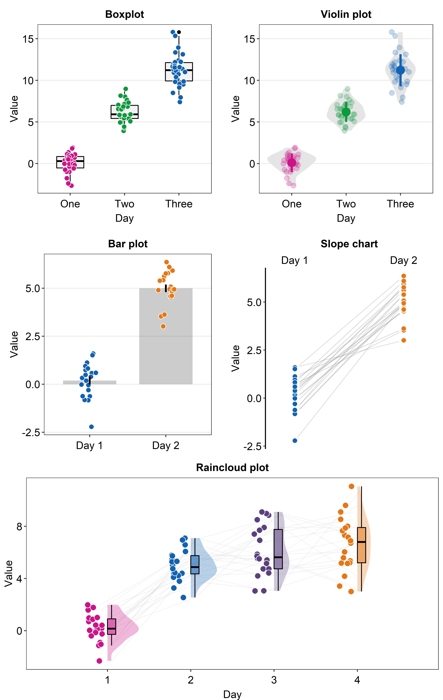

--- 
title: "Data Visualization in R Using smplot"
author: "Seung Hyun Min"
date: "`r Sys.Date()`"
site: bookdown::bookdown_site
documentclass: book
---

```{r include=FALSE,cache=FALSE,purl=FALSE}
# don't cache anything on this page
knitr::opts_chunk$set(cache = FALSE)
```

# Welcome! {-#index}



This book guides the reader to be familiar with R, a programming language, for data visualization. It also introduces the R package **smplot**, which aims to make the process of data visualization simple. This book was created entirely using RMarkdown for reproducibility. 

**Note:** If you are interested in recreating this figure, please read Chapter 5.

## For R and ggplot2 experts {-}

Please skip Chapters 1-3. 

## Issues and Contact {-}
If you spot any mistakes in this online book, please pull-request on [Github](https://github.com/smin95/dataviz) or email me seung.min@mail.mcgill.ca. If you find issues with the 'smplot' package, please pull-request on [Github](https://github.com/smin95/smplot).

## License {-}
smplot is under the MIT license. This tutorial is licensed under a [Creative Commons Attribution 4.0 International License](https://creativecommons.org/licenses/by/4.0/).


