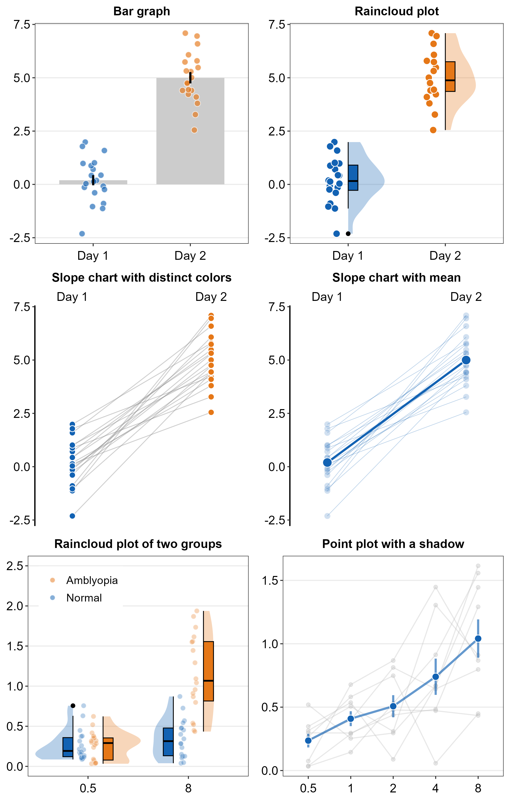

--- 
title: "Visualizing Data for Publications Using smplot2"
author: "Seung Hyun Min"
date: "Last Updated: `r Sys.Date()`"
site: bookdown::bookdown_site
documentclass: book
---

```{r include=FALSE,cache=FALSE,purl=FALSE}
# don't cache anything on this page
knitr::opts_chunk$set(cache = FALSE)
```

# Welcome! {-#index}

```{r, echo=FALSE, message=FALSE, warning=FALSE, fig.width = 7, fig.height= 10.95, fig.align = 'center', fig.cap="Standalone plots created with smplot2. Visit chapters 3-6 for more information."}
library(tidyverse)
library(cowplot)
library(smplot2)

# slope chart 
set.seed(2) # generate random data
day1 = rnorm(20,0,1)
day2 = rnorm(20,5,1)

Subject <- rep(paste0('S',seq(1:20)), 2)
Data <- data.frame(Value = matrix(c(day1,day2),ncol=1))
Day <- rep(c('Day 1', 'Day 2'), each = length(day1))
df <- cbind(Subject, Data, Day)
df2 <- df

ggplot(data=df, aes(x = Day, y = Value)) +
  sm_slope_mean(labels = c('Day 1', 'Day 2'), group = Subject, back_alpha = .3) +
  ggtitle('Slope chart with mean') -> slope_avg

df %>% ggplot(aes(x = Day, y = Value, fill = Day)) +
  sm_slope(labels = c('Day 1', 'Day 2'), group = Subject) +
  scale_fill_manual(values=  sm_color('blue','orange')) +
  ggtitle('Slope chart with distinct colors') -> slope


#### raincloud
df2 %>% ggplot(aes(x = Day, y = Value, color = Day, fill = Day)) +
  sm_bar(point.params = list(shape=21,size=2.5,color='white'),
         seed=10) +
  xlab('Day') +
  scale_fill_manual(values = sm_color('blue','orange')) +
  ggtitle('Bar graph') -> bar

df2 %>% ggplot(aes(x = Day, y = Value, color = Day, fill = Day)) +
  sm_raincloud(seed=10) +
  xlab('Day')  +
  scale_fill_manual(values = sm_color('blue','orange')) +
  ggtitle('Raincloud plot') -> raincloud


# raincloud two groups
df2 <- read_csv('https://www.smin95.com/amblyopia_random.csv')
df2a <- filter(df2, Condition == 'One')  
df2a <- filter(df2, SF %in% c(0.5,8))
df2a$SF <- as.factor(df2a$SF)

df2amb <-  filter(df2a, Group == 'Amblyopia')
df2norm <-  filter(df2a, Group == 'Normal')

ggplot(mapping = aes(x = SF, y = absBP, fill = Group)) +
  sm_raincloud(data = df2amb, position = position_nudge(x = +0.15),
               show.legend = FALSE,
               point.params = list(size = 2, shape = 21,
                                   color = 'transparent', 
                                   show.legend = TRUE,
                                   alpha = 0.3,
                                   position = sdamr::position_jitternudge(nudge.x = 0.06, seed = 10,
                                                                   jitter.width = 0.06))) +
  scale_fill_manual(values = sm_color('orange', 'blue')) +
  sm_raincloud(data = df2norm, which_side = 'left',
               show.legend = FALSE,
               position = position_nudge(x = -0.15),
               boxplot.params = list(linewidth = 0.4),
               point.params = list(size = 2, shape = 21,
                                   show.legend = TRUE,
                                   color = 'transparent', alpha = 0.3,
                                   position = sdamr::position_jitternudge(nudge.x = -0.06, seed = 10,
                                                                   jitter.width = 0.06))) +
  theme(legend.position = c(0.24,0.85),
        legend.title = element_blank(),
        legend.text = element_text(size = 11)) +
  ggtitle('Raincloud plot of two groups') +
  scale_y_continuous(limits = c(0,2.5)) -> raincloud2


# point plot (with shadow)
df <- read_csv('https://www.smin95.com/amblyopia_random.csv')
df1a <- df %>% filter(Condition == 'One') %>% filter(Group == 'Amblyopia')
df1a$SF <- as.factor(df1a$SF)

df1a %>%
  ggplot(aes(x = SF, y = absBP, color = Group, group = Group)) +
  sm_pointplot(show_shadow = T, group = Subject,
               avgPoint.params = list(size=3, fill = sm_color('blue'), shape = 21,
                                      color = 'white'),
               avgLine.params = list(size=1.3,alpha = 0.65),
               err.params = list(size=1.3, alpha = 0.65))  +
  scale_color_manual(values = sm_color('blue')) +
  ggtitle('Point plot with a shadow') -> shadow


all <- sm_put_together(list(bar, raincloud, slope, slope_avg, raincloud2, shadow),
                ncol = 2, nrow = 3, remove_ticks = 'none', tickRatio = 1, panel_scale = 0.95)

#ggsave("all.png", all, height = 10.95, width = 7, dpi = 300)
all
```
```{r,fig.align = 'center', echo=F, out.width = '90%',  fig.cap="Standalone plots created with smplot2. Visit chapters 3-6 for more information."}
#
```
```{r,fig.align = 'center', echo=F,  out.width = '85%', fig.cap="A composite plot generated with smplot2. For more details about creating and annotating a composite figure using programmatic constructs and smplot2, please check out Chapter 7."}

```

This guide (https://smin95.github.io/dataviz) aims to familiarize the reader with R, a programming language, for data visualization. It also introduces the R package **smplot2**, which aims to make the process of data visualization simple. This guide was created entirely using RMarkdown for reproducibility. The secondary link of the guide is: https://smin95.com/dataviz. 

The archived website on **smplot** can be accessed using this link (https://smin95.com/dataviz0).

## Citing the guide and my packages {-}

If you have used the guide and one of my packages, please cite the most appropriate paper from below.

For **smplot2**:

**Seung Hyun Min, Jiawei Zhou. smplot: An R Package for Easy and Elegant Data Visualization (2021). *Frontiers in Genetics*, 12:802894.** [**[pdf]**](https://www.smin95.com/pubs/smplot2021.pdf) [**[codes]**](https://www.smin95.com/dataviz0/recreating-figures-from-front.-genetics-2021.html)


For **smCSF** (Chapters 13-16):

**Seung Hyun Min, Alexandre Reynaud. Applying resampling and visualization methods in factor analysis to model human spatial vision (2024). *Investigative Ophthalmology and Visual Science*.** [**[pdf]**](https://www.smin95.com/pubs/min2024.pdf)

## Installation of smplot2 {-}
[](https://cran.r-project.org/package=smplot2)
[](https://cran.r-project.org/package=smplot2) [](https://github.com/smin95/smplot2) [](https://CRAN.R-project.org/package=smplot2) 

In April 2024, **smplot2** joined the **CRAN** repository. Please install using `install.packages()` for the most stable version.

```{r, eval = FALSE}
install.packages('smplot2')
```

If users wish to download the most updated version of **smplot2**, please use `install_github()`. This might be necessary if some codes from the documentation webpage do not work in RStudio as intended.

```{r, eval = FALSE}
install.packages('devtools)
devtools::install_github('smin95/smplot2',force = T)
```

## Issues and contact {-}
If you spot any mistakes in the guide, please pull-request on [Github](https://github.com/smin95/dataviz) or email me seung.min@mail.mcgill.ca. If you find issues with the **smplot2** package, please pull-request on [Github](https://github.com/smin95/smplot2).

## License {-}
This tutorial is under a [Creative Commons Attribution 4.0 International License](https://creativecommons.org/licenses/by/4.0/). I am the sole creator of **smplot2**.

## About the author {-}
I am Assistant Professor in Dept. Ophthalmology and Optometry at Wenzhou Medical University. On June 2021, I received my PhD at McGill University under the supervision of Dr. Robert F. Hess. My research is focused on amblyopia, neural plasticity and binocular vision. During spare time, I play the clarinet and develop R packages. More details, such as my publications, are on my website: https://www.smin95.com. 
