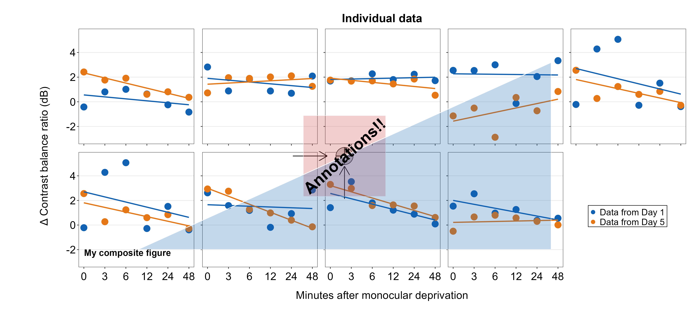

--- 
title: "Data Analysis and Visualization in R Using smplot2"
author: "Seung Hyun Min"
date: "Last Updated: `r Sys.Date()`"
site: bookdown::bookdown_site
documentclass: book
---

```{r include=FALSE,cache=FALSE,purl=FALSE}
# don't cache anything on this page
knitr::opts_chunk$set(cache = FALSE)
```

# Welcome! {-#index}

```{r, echo=FALSE, message=FALSE, warning=FALSE, fig.width = 7.4, fig.height= 18}
library(tidyverse)
library(cowplot)
library(smplot2)

# histogram
set.seed(2)
data=data.frame(value=rnorm(1000))
data2 = data.frame(value=rnorm(1000,5,1))
data$day <- 'day1'
data2$day <- 'day2'
rbind(data,data2) -> df
cbind(data,data2) -> dfc

df %>% ggplot(aes(x=value, fill=day, color = day)) +
  sm_hist(hist.params = list(binwidth = 1/4, alpha = 0.5, color='white'),
          density.params = list(fill='transparent', size = 0.8),
          rug.params = list(alpha = 0.8), legends = T) +
  scale_color_manual(values = sm_color('blue', 'orange')) +
  scale_fill_manual(values = sm_color('blue', 'orange')) +
  ggtitle('Histograms + rugs + kernel estimations of two groups') +
  theme(plot.title= element_text(size = rel(0.85))) +
   theme(legend.position = c(0.84,0.82),
        legend.title = element_blank(),
        legend.text = element_text(size = 11))-> histogram2 # ratio:2

# slope chart 
set.seed(2) # generate random data
day1 = rnorm(20,0,1)
day2 = rnorm(20,5,1)

Subject <- rep(paste0('S',seq(1:20)), 2)
Data <- data.frame(Value = matrix(c(day1,day2),ncol=1))
Day <- rep(c('Day 1', 'Day 2'), each = length(day1))
df <- cbind(Subject, Data, Day)
df2 <- df

ggplot(data = df, aes(x = Day, y = Value, fill = Day)) +
  sm_slope(labels = c('Day 1','Day 2'),group = Subject,
           point.params = list(alpha = 0.3, size = 2.5, color = 'white',
                               shape = 21, fill = sm_color('skyblue')),
           line.params = list(color = sm_color('skyblue'),
                              alpha = 0.3),
           avgPoint.params = list(color='transparent', shape = 21,
                                  size = 4, fill = sm_color('blue')),
           avgLine.params = list(color = sm_color('blue'), size = 1),
           show_mean = TRUE) +
  ggtitle('Slope chart with mean') -> slope_avg

df %>% ggplot(aes(x = Day, y = Value, fill = Day)) +
  sm_slope(labels = c('Day 1', 'Day 2'), group = Subject) +
  scale_fill_manual(values=  sm_color('blue','orange')) +
  ggtitle('Slope chart with distinct colors') -> slope


#### raincloud
df2 %>% ggplot(aes(x = Day, y = Value, color = Day, fill = Day)) +
  sm_bar(point.params = list(shape=21,size=2.5,color='white'),
         seed=10) +
  xlab('Day') +
  scale_fill_manual(values = sm_color('blue','orange')) +
  ggtitle('Bar graph') -> bar

df2 %>% ggplot(aes(x = Day, y = Value, color = Day, fill = Day)) +
  sm_raincloud(seed=10) +
  xlab('Day')  +
  scale_fill_manual(values = sm_color('blue','orange')) +
  ggtitle('Raincloud plot') -> raincloud

# forest plot
df <- read_csv('https://www.smin95.com/amblyopia_random.csv')
df$SF <- as.factor(df$SF)
df %>% filter(Condition == 'One') %>%
  ggplot(aes(x = absBP, y = SF, color = Group, alpha = SF, group =Group)) +
  sm_forest(sep_level = 3) +
  scale_color_manual(values = sm_color('darkred', 'viridian')) +
  scale_alpha_manual(values = c(0.3,0.5,0.7,0.85, 1)) +
  ggtitle('Forest plot of two groups') -> forest

# raincloud two groups
df2 <- read_csv('https://www.smin95.com/amblyopia_random.csv')
df2a <- filter(df2, Condition == 'One')  
df2a <- filter(df2, SF %in% c(0.5,8))
df2a$SF <- as.factor(df2a$SF)

df2amb <-  filter(df2a, Group == 'Amblyopia')
df2norm <-  filter(df2a, Group == 'Normal')

ggplot(mapping = aes(x = SF, y = absBP, fill = Group)) +
  sm_raincloud(data = df2amb, position = position_nudge(x = +0.15),
               show.legend = FALSE,
               boxplot.params = list(color = 'white'),
               point.params = list(size = 2, shape = 21,
                                   color = 'transparent', 
                                   show.legend = TRUE,
                                   alpha = 0.3,
                                   position = sdamr::position_jitternudge(nudge.x = 0.06, seed = 10,
                                                                   jitter.width = 0.06))) +
  scale_fill_manual(values = sm_color('darkred', 'viridian')) +
  sm_raincloud(data = df2norm, which_side = 'left',
               show.legend = FALSE,
               position = position_nudge(x = -0.15),
               boxplot.params = list(color = 'white'),
               point.params = list(size = 2, shape = 21,
                                   show.legend = TRUE,
                                   color = 'transparent', alpha = 0.3,
                                   position = sdamr::position_jitternudge(nudge.x = -0.06, seed = 10,
                                                                   jitter.width = 0.06))) +
  theme(legend.position = c(0.24,0.85),
        legend.title = element_blank(),
        legend.text = element_text(size = 11)) +
  ggtitle('Raincloud plot of two groups') +
  scale_y_continuous(limits = c(0,2.5)) -> raincloud2


# boxplot with two groups


ggplot(mapping = aes(x = SF, y = absBP, fill = Group)) +
  sm_boxplot(data = df2amb, position = position_nudge(x = +0.25),
             boxplot.params = list(size=0.5, color='black',width=0.3,fill = "gray95"),
               point.params = list(size = 3, shape = 21,
                                   color = 'transparent', alpha = 0.4,
                                   position = sdamr::position_jitternudge(nudge.x = 0.25, seed = 10,
                                                                          jitter.width = 0.08))) +
  scale_fill_manual(values = sm_color('darkred', 'viridian')) +
  sm_boxplot(data = df2norm, legends = TRUE,
               position = position_nudge(x = -0.25),
             boxplot.params = list(size=0.5, color='black',width=0.3,fill = "gray95"),
               point.params = list(size = 2.5, shape = 21,
                                   color = 'transparent', alpha = 0.4,
                                   position = sdamr::position_jitternudge(nudge.x = -0.25, seed = 10,
                                                                          jitter.width = 0.08))) +
  theme(legend.position = c(0.24,0.85),
        legend.title = element_blank()) +
  ggtitle('Boxplot of two groups') +
  scale_y_continuous(limits = c(0,2.5)) -> boxplot2

# point plot (with shadow)
df <- read_csv('https://www.smin95.com/amblyopia_random.csv')
df1a <- df %>% filter(Condition == 'One') %>% filter(Group == 'Amblyopia')
df1a$SF <- as.factor(df1a$SF)

df1a %>%
  ggplot(aes(x = SF, y = absBP, color = Group, group = Group)) +
  sm_pointplot(show_shadow = T, group = Subject,
               avgPoint.params = list(size=3, fill = 'darkred', shape = 21,
                                      color = 'white'),
               avgLine.params = list(size=1.3,alpha = 0.65),
               err.params = list(size=1.3, alpha = 0.65))  +
  scale_color_manual(values = sm_color('darkred')) +
  ggtitle('Point plot with a shadow') -> shadow

top_four <- plot_grid(bar, raincloud, slope, slope_avg,
                 ncol = 2,
                 nrow = 2,# rel_widths = c(1,1,1,1,1,1),
                 rel_heights = c(1,1,1,1),
                 scale = 0.95)

top_four_hist <- plot_grid(top_four, histogram2, ncol = 1, 
                 nrow = 2, rel_widths = c(1,1), 
                 rel_heights = c(2,0.8))

bottom_four <- plot_grid(forest, shadow, raincloud2, boxplot2,
                         ncol = 2, nrow = 2,
                         rel_heights = c(1,1,1,1), scale = 0.95)

all <- plot_grid(top_four, histogram2, bottom_four, ncol =1,
                 nrow=3, rel_widths = c(1,1,1),
                 rel_heights = c(2,0.8,2)) 


print(all)

```
```{r,fig.align = 'center', echo=F,  fig.cap="For more information about creating and annotating a composite figure, please visit Chapter 7."}

```

This book (https://smin95.github.io/dataviz) guides the reader to be familiar with R, a programming language, for data visualization. It also introduces the R package **smplot2**, which aims to make the process of data visualization simple. This book was created entirely using RMarkdown for reproducibility. The secondary link of the e-book is: https://smin95.com/dataviz. 

The old website (on **smplot**) can be accessed using this link (https://smin95.com/dataviz0).

## References {-}

Here is the only (and slightly outdated) reference for **smplot2**:

**Seung Hyun Min, Jiawei Zhou. smplot: An R Package for Easy and Elegant Data Visualization (2021). *Frontiers in Genetics*, 12:802894.** [**pdf**](https://www.smin95.com/pubs/smplot2021.pdf)

The codes of the figures in the report are [**here**](https://www.smin95.com/dataviz0/recreating-figures-from-front.-genetics-2021.html) but these depend on *smplot*, not *smplot2*. 

Here is the reference for the **smCSF** package (Chapters 13-16):

**Seung Hyun Min, Alexandre Reynaud. Applying resampling and visualization methods in factor analysis to model human spatial vision (2024). *Investigative Ophthalmology and Visual Science*.**

## Installation of smplot2 {-}

As of April 2024, *smplot2* is now part of the **CRAN** repository. Please install using `install.packages()` for the most stable version.

```{r, eval = FALSE}
install.packages('smplot2')
```

and `install_github()` for the most updated version. I suggest that you download the most updated version.

```{r, eval = FALSE}
install.packages('devtools)
devtools::install_github('smin95/smplot2',force = T)
```


## Issues and contact {-}
If you spot any mistakes in this online book, please pull-request on [Github](https://github.com/smin95/dataviz) or email me seung.min@mail.mcgill.ca. If you find issues with the *smplot2* package, please pull-request on [Github](https://github.com/smin95/smplot2).

## License {-}
This tutorial is under a [Creative Commons Attribution 4.0 International License](https://creativecommons.org/licenses/by/4.0/). I am the sole creator of **smplot2**.

## About the author {-}
I am Assistant Professor in Dept. Ophthalmology and Optometry at Wenzhou Medical University. On June 2021, I received my PhD at McGill University under the supervision of Dr. Robert F. Hess. My research is focused on amblyopia, neural plasticity and binocular vision. During spare time, I play the clarinet and develop R packages. More details, such as my publications, are on my website: https://www.smin95.com. 
