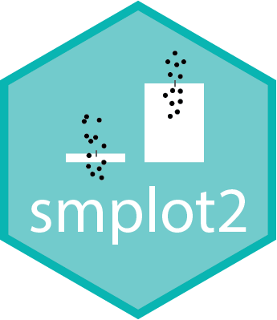

# Opening Remarks & News
```{r,fig.align = 'left', out.width='35%',echo=FALSE}

```

**smplot2**'s key contributions are shortcut functions that generate elegant plots, which are aesthetically appropriate for the format of scientific journals, and key functions that can create and annotate a composite figure (subplotting), the latter of which is described in Chapter 7 in detail. 

## Which sections to read

If you are a proficient R user, I suggest that you read Chapters 7 (sections 7.4-7.7), 11 and 12 because all other sections describe basics of R as well.

Chapters 8-10 describe some introductory topics of data analysis that I often use in my research, and they have been written for the students that I supervise. Although the chapters might be useful for those in psychology and medicine, these do not discuss about data visualization. 

If you are a **smplot** user, you can either use its tutorial website (https://www.smin95.com/dataviz0) and continue to use **smplot** or modify your codes so that it works with **smplot2**. If you decide to use **smplot2**, I suggest you that you delete **smplot**. Also, I suggest that you read Chapters 11 (especially the sub-section: How `...` parameter and `xxx.params` work) and 12 to understand the changes that have been made to the new package rather than to read the book from the beginning.

```{r, eval = FALSE}
remove.packages("smplot")
```

If you are a newcomer, then you can just start reading from the next chapter. 

## How to use this guide

With more than 300 examples, this documentation guide serves as a "gallery" of plots that can be generated with **smplot2**. 

**CTRL + F** is your friend! No need to linearly read this guide from cover-to-cover. You can save your time by searching for the key word or function's name of your interest, reading its description, finding some examples that you like, and then using them for your own data. This might be the best way to get familiarized with the functions of **smplot2**.

## News

```{r}
packageVersion("smplot2") # Current version to run the website
```

### 2024-06-24: Version 0.2.4 {-}

- `sm_pointplot()` now also has `forget` argument. So, examples in Chapter 5.3.4 have been modified (or fixed).


### 2024-05-29: Version 0.2.3 {-}

- Both $R$ and $R^2$ can be computed with `sm_statCorr()`.

- `wRatio`, `wRatio2`, `hRatio`, `hRatio2` and `tickRatio` of `sm_put_together()` are adjusted automatically unless users supply their own inputs.

-  Defaults of visualization functions are now kept even when users call upon `list()` for each argument unless users directly replace them with another input value. For example, to change the transparency of the bar and keep the defaults of `sm_bar()`, users can only re-specify the alpha value as shown below (`p2` plot).

- To forget the defaults for a plot component (ex. bar) when `list()` is called, set `forget = TRUE`, and the visualization functions **will work the same as before** the version update (`p3` plot).

```{r, echo=FALSE}
library(smplot2)
library(ggplot2)
set.seed(1) # generate random data
day1 <- rnorm(16, 2, 1)
day2 <- rnorm(16, 5, 1)
Subject <- rep(paste0("S", seq(1:16)), 2)
Data <- data.frame(Value = matrix(c(day1, day2), ncol = 1))
Day <- rep(c("Day 1", "Day 2"), each = length(day1))
df <- cbind(Subject, Data, Day)
```

```{r, fig.height =3.6, fig.width = 9.6}
ggplot(data = df, mapping = aes(x = Day, y = Value, color = Day)) +
  sm_bar() +
  scale_color_manual(values = sm_color("blue", "orange")) +
  ggtitle("Bar's default in smplot2") -> p1

# In the previous versions of smplot2, needed to write:
# bar.params = list(alpha = 0.5, width = 0.7, color = 'transparent', fill = 'gray80')
ggplot(data = df, mapping = aes(x = Day, y = Value, color = Day)) +
  sm_bar(bar.params = list(alpha = 0.3)) + # forget = FALSE (default)
  scale_color_manual(values = sm_color("blue", "orange")) +
  ggtitle("Bar's default with new alpha") -> p2

# When forget = TRUE, forgets defaults of a plotting feature (ex. bar) when list() is called as in the previous versions.
ggplot(data = df, mapping = aes(x = Day, y = Value, color = Day)) +
  sm_bar(bar.params = list(), forget = TRUE) +
  scale_color_manual(values = sm_color("blue", "orange")) +
  ggtitle("Bar's default forgotten") -> p3

sm_put_together(list(p1, p2, p3), ncol = 3, nrow = 1, tickRatio = 1)
```
